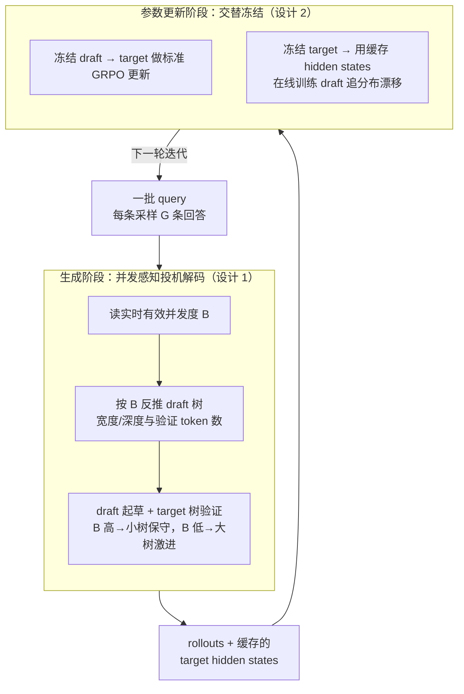

# FastGRPO: Accelerating Policy Optimization via Concurrency-aware Speculative Decoding and Online Draft Learning

**会议**: ICLR 2026  
**arXiv**: [2509.21792](https://arxiv.org/abs/2509.21792)  
**代码**: [GitHub](https://github.com/yedaotian9/GRPO_speculative)  
**领域**: LLM推理  
**关键词**: GRPO加速, 投机解码, 并发感知, 在线Draft学习, 强化学习训练

## 一句话总结

针对GRPO训练中生成阶段占91%-98%时间的严重瓶颈，提出并发感知的投机解码策略（动态调整draft树参数以适配从高到低的实时并发度变化）和在线draft模型学习（利用目标模型生成的hidden states持续适配分布漂移），整体实现2.35x-2.72x端到端训练加速，且不损害推理质量。

## 研究背景与动机

- **领域现状**: GRPO是提升LLM推理能力的主流RL框架(DeepSeek-R1/DAPO等)，但相比SFT训练吞吐量极低，严重阻碍了实验迭代速度
- **瓶颈量化分析**: 生成阶段(rollout采样)占GRPO总训练时间的91%-98%。更关键的是，随着模型能力增长输出变长，生成与更新的时间比从6x增长到20x以上，问题持续恶化
- **投机解码的高并发困境**: 标准投机解码在低并发(B=1)下有效，但在GRPO的高并发(大batch)场景下几乎无加速甚至减速(speedup<1.0x)。原因是额外的计算开销使系统从memory-bound跨越到compute-bound
- **GRPO独有的动态并发特性**: 生成过程中有效并发度动态变化——初始为高batch，但不同序列在不同时间结束(长度差异达3-5倍)，导致有效并发度逐渐从高降至接近1
- **分布漂移问题**: 训练过程中目标模型持续更新，与固定draft模型的分布差距逐渐增大，导致投机接受率下降、加速效果随训练步数递减
- **已有方法不足**: EAGLE-2/HASS/EAGLE-3在GRPO框架中仅获得1.1x-1.3x加速，远低于标准推理场景

## 方法详解

### 整体框架

FastGRPO 在 GRPO 训练循环里嵌入两个互补的加速组件：生成阶段用并发感知投机解码动态调节 draft 树的形状，让验证算力始终卡在硬件最优工作点；参数更新阶段用在线 Draft 学习持续吸收目标模型的新分布。前者解决"并发度时刻在变"的问题，后者解决"目标模型一直在漂"的问题，两者叠加才能让加速比在整个训练过程里都保持在 2x 以上。每轮迭代分两个阶段：先批量 rollout（顺手把 target 的 hidden states 缓存下来），再交替冻结其中一个模型更新另一个。

### 关键设计

**1. 并发感知投机解码：把验证算力锁在硬件甜点上**

标准投机解码在 GRPO 里几乎失效，根因是它默认低并发场景，而 rollout 一开始就是大 batch，额外的 draft 与验证开销把系统从 memory-bound 推过了 compute-bound 的临界点，speedup 反而掉到 1.0x 以下。FastGRPO 的应对是不固定 draft 树的大小，而是让验证阶段的有效 token 总量始终对齐硬件最优并发度 $C_{\text{peak}}$——即 GPU 算术强度刚好从 memory-bound 跨到 compute-bound 的转折点。具体地，给定当前有效 batch size $B$，每条序列分到的验证 token 数取 $N_{\text{verify}} = C_{\text{peak}} / B$，再据此反推 draft 树宽度 $K_{\text{draft}} = \min(N_{\text{verify}}-1,\, K^{\max})$ 和深度 $L_{\text{draft}} = \min(\lfloor\log_2(N_{\text{verify}}/\alpha)\rfloor,\, L^{\max})$，其中 $\alpha$ 编码 draft 模型的质量。这套映射的依据来自对 GEMM 算术强度 $I_{\text{GEMM}} \approx 2B/s$ 的分析，把硬件特性和投机超参直接挂钩。运行起来的效果正好顺应 GRPO 的并发曲线：训练初期 batch 高、$N_{\text{verify}}$ 小，系统保守投机、用小树躲开计算瓶颈；随着不同长度的序列陆续结束、有效并发从大 batch 一路降到接近 1，$N_{\text{verify}}$ 随之放大，系统转为激进投机、用大树把空出来的算力吃满。

**2. 在线 Draft 学习：让 draft 模型追着漂移的目标模型走**

固定的 draft 模型会随训练步数越来越跟不上目标模型——目标策略每轮都在更新，分布差距拉大，投机接受率下滑，加速效果逐步衰减。FastGRPO 让 draft 模型在 GRPO 每轮迭代中同步更新：直接拿目标模型这一轮生成时产生的 hidden states 作监督信号去训 draft。由于这些 hidden states 在 rollout 阶段本就被算出来、缓存即可复用，额外开销只有 2%–3%，近乎免费。结果是接受长度（accepted length）随训练持续上升，而固定 draft 模型则一路下降；更实用的是，即便完全跳过预训练，在线学习也能在 1–2 个 epoch 内从零收敛到同等接受率，部署门槛极低。

### 损失函数 / 训练策略

两个组件通过交替冻结避免相互干扰：draft 训练阶段冻结目标模型，GRPO 更新阶段冻结 draft 模型。Draft 模型采用 EAGLE 架构，先用 ShareGPT-68K 预训练 10 个 epoch，学习率 1e-4（AdamW）。一个额外收益是，那些 reward 为零、无法用于目标模型更新的 rollout 数据，仍可作为 draft 模型的有效监督信号，把原本浪费的样本利用起来。

## 实验关键数据

### 主实验表

| 模型 | 方法 | GSM8K E2E SR | SimpleRL E2E SR | DAPO E2E SR | 平均 |
|------|------|:-----------:|:---------------:|:-----------:|:----:|
| Qwen2.5-7B-I | EAGLE-3 | 1.26x | 1.20x | 1.13x | 1.20x |
| Qwen2.5-7B-I | **FastGRPO** | **2.43x** | **2.52x** | **2.53x** | **2.49x** |
| Llama3.1-8B-I | EAGLE-3 | 1.31x | 1.28x | 1.23x | 1.27x |
| Llama3.1-8B-I | **FastGRPO** | **2.51x** | **2.69x** | **2.67x** | **2.62x** |
| DS-R1-Qwen-7B | **FastGRPO** | **2.69x** | — | — | — |

### 消融实验表

| 配置 | 生成SR | 端到端SR | 说明 |
|------|:------:|:--------:|------|
| FastGRPO (完整) | 2.91 | 2.52 | 最优配置 |
| w/o 在线Draft学习 | 2.16 | 2.01 | 在线学习贡献0.5x加速 |
| w/o 并发感知 | 2.59 | 2.30 | 并发感知贡献0.2x加速 |
| vanilla + early termination | 1.68 | 1.61 | 基线对比 |

### 关键发现

- 5个模型(Qwen2.5-7B/1.5B-I, Llama3.1-8B-I, DS-R1-Qwen-7B, Qwen2.5-Math-7B) × 3个数据集全面验证，FastGRPO一致超越所有基线2x以上
- 训练后的数学推理准确率与标准GRPO基本一致，甚至略高——加速不损害质量
- 在GRPO变体(DAPO/GPG)上同样有效，端到端加速比>2x
- 在线Draft学习的贡献(0.5x)大于并发感知(0.2x)，说明分布漂移是更大的瓶颈

## 亮点与洞察

- **发现GRPO独有的并发度动态变化特性**: 这是GRPO与标准推理场景的根本差异，且被所有此前工作忽视
- **理论分析的优雅性**: 通过operational intensity分析将硬件特性与投机解码超参连接，使策略设计有理论支撑
- **在线Draft学习的巧妙之处**: 复用已有hidden states作为监督信号，额外开销仅2-3%，属于"几乎免费的午餐"
- **快速部署能力**: 即使不预训练draft模型，在线学习1-2 epoch即可达到满效果

## 局限与展望

- $C_{\text{peak}}$ 需要针对每种GPU/模型组合做empirical profiling，自动化profiling工具可提升易用性
- 仅在数学推理数据集上验证，代码生成/通用推理/对话等场景的效果未知
- Draft模型架构固定为EAGLE系列，未探索Medusa等其他架构的适配
- 多节点分布式训练场景下的通信开销与并发感知策略的交互未讨论
- $\alpha$超参编码draft模型质量，不同训练阶段的动态调整可能进一步提升

## 相关工作与启发

- **vs EAGLE-2/HASS/EAGLE-3**: 这些方法在GRPO的高并发场景下加速有限，FastGRPO的核心创新是动态适配并发度变化
- **vs 标准推理加速**: 投机解码传统上针对低并发推理部署，FastGRPO首次将其适配到高并发的RL训练场景
- **启发**: RL训练与推理部署有本质区别（动态并发、分布漂移），为这些特性设计专门的加速策略可获得显著收益

## 评分
- 新颖性: ⭐⭐⭐⭐ 并发感知+在线学习的组合方案针对性强
- 实验充分度: ⭐⭐⭐⭐⭐ 5模型3数据集+GRPO变体迁移+充分消融
- 写作质量: ⭐⭐⭐⭐ 动机→观察→方法逻辑清晰
- 价值: ⭐⭐⭐⭐⭐ 直接降低GRPO训练成本2-3倍，工程价值极高

<!-- RELATED:START -->

## 相关论文

- [\[ICLR 2026\] Adaptive Social Learning via Mode Policy Optimization for Language Agents](adaptive_social_learning_via_mode_policy_optimization_for_language_agents.md)
- [\[ACL 2026\] Calibration-Aware Policy Optimization for Reasoning LLMs](../../ACL2026/llm_reasoning/calibration-aware_policy_optimization_for_reasoning_llms.md)
- [\[ICLR 2026\] DRPO: Efficient Reasoning via Decoupled Reward Policy Optimization](drpo_efficient_reasoning_via_decoupled_reward_policy_optimization.md)
- [\[ICLR 2026\] Slow-Fast Policy Optimization: Reposition-Before-Update for LLM Reasoning](slow-fast_policy_optimization_reposition-before-update_for_llm_reasoning.md)
- [\[ICLR 2026\] Scaf-GRPO: Scaffolded Group Relative Policy Optimization for Enhancing LLM Reasoning](scaf-grpo_scaffolded_group_relative_policy_optimization_for_enhancing_llm_reason.md)

<!-- RELATED:END -->
