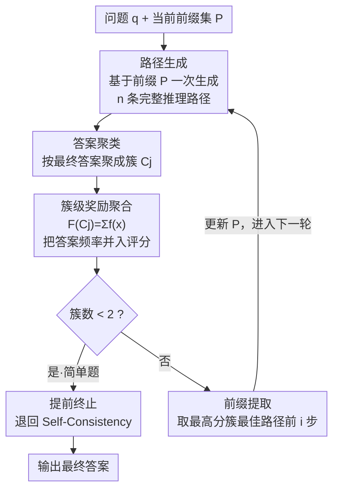

# Fixing the Broken Compass: Diagnosing and Improving Inference-Time Reward Modeling

**会议**: ICLR 2026  
**arXiv**: [2503.05188](https://arxiv.org/abs/2503.05188)  
**代码**: [GitHub](https://github.com/BugMakerzzz/CRISP)  
**领域**: LLM推理  
**关键词**: [奖励模型, inference-time scaling, CRISP, Best-of-N, MCTS]

## 一句话总结

系统诊断推理时奖励模型（RM）的三大失效模式——简单题性能退化、采样数增多时辨别力下降、高搜索多样性损害准确率，并提出 CRISP 算法通过答案聚类的奖励聚合与逐步前缀引导来缓解这些问题，准确率提升最高 5%。

## 研究背景与动机

推理时缩放技术（如 OpenAI o1、DeepSeek-R1）通过增加推理时计算来增强 LLM 推理能力。当前研究热点主要集中在训练时优化（RL/SFT），而推理时基于奖励模型的方法却被相对忽视。然而，R1 系列模型存在"过度思考"（overthinking）和任务泛化有限等问题。

以 CSQA 常识推理为例：DeepSeek-R1-7B 用平均 3,613 个 token 达到 64.8 准确率，而本文的推理时方法在基座模型 Qwen2.5-Math-7B 上仅用 1,100 token 就达到 72.0。这说明优化推理时 RM 仍是关键方向。

然而，初步实验显示高级 RM 在下游推理任务上改进有限：多数 LLM 上 BoN 相比 SC 提升不足 5%，而 Oracle（从样本中直接召回正确答案）远超其他方法，说明**瓶颈在 RM 的辨别能力而非 LLM 的生成能力**。

## 方法详解

### 整体框架

本文分两步走：先**诊断**、再**对症下药**。诊断阶段把 RM 的推理时行为看成一个由「问题 $q$、采样数 $n$、搜索参数 $\Phi$」三要素决定的函数，每次固定两个、只动一个，逐一探测 RM 在什么条件下会失灵，最终归纳出三类失效模式（简单题退化、采样越多越辨不清、多样性过高反噬）。针对这三类问题，作者提出 CRISP（Clustered Reward Integration with Stepwise Prefixing），一个无需训练的迭代式推理框架：每一轮基于当前前缀集 $\mathcal{P}$ 一次生成 $n$ 条完整推理路径，按最终答案聚类后在**簇层面**聚合奖励，再判断是否提前终止——若簇数 $<2$（题目简单）就退回 Self-Consistency，否则从得分最高簇里抽出前几步当作下一轮前缀，把搜索逐轮收窄到更有希望的分支。三个核心模块各治一类失效。

### 关键设计

**1. 三大失效模式诊断：先弄清 RM 在推理时到底坏在哪**

直接堆更强的 RM 收益有限（多数模型上 BoN 仅比 Self-Consistency 高不到 5%），所以作者没有急着设计算法，而是先做受控诊断。第一类（Cl.1）是简单题退化：按 pass@1 把题目分成 5 个难度等级后，BoN 和 MCTS-RM 在最简单的 Level 1-2 上反而输给 Self-Consistency——RM 在本来稳赢的题上画蛇添足。第二类（Cl.2）是"反长尾"现象：对每道题取 RM 打分最高的错误答案、统计其答案的出现频率，发现这些被高估的错误答案往往是出现次数 $<5$ 的低频答案；因为采样数 $n$ 增大时低频的稀有错误样本变多，RM 越来越难把它们和正确答案区分开。第三类（Cl.3）是多样性反噬：增大采样温度 $T$，或放大 MCTS 树的宽度/深度，都会持续拖垮 RM 性能（宽度≈5、深度 3–5 才最优），说明 RM 对采样多样性比策略模型更敏感。这三条结论分别对应下面 CRISP 的三个针对性模块。

**2. 簇级奖励聚合：把答案频率并进评分，压住"反长尾"**

这是 CRISP 的核心创新，专治 Cl.2。常规做法是对每条路径单独用 RM 打分、取最高，于是一条得分虚高的低频错误路径就能胜出。CRISP 改为先按最终答案把所有路径聚成簇 $\mathcal{C}_j$（映射 $\psi:\mathcal{R}\to\mathcal{C}$，答案相同的归一簇），再把分数从路径层提升到簇层：

$$\mathcal{F}(\mathcal{C}_j)=\sum_{x\in\mathcal{C}_j} f(x)$$

其中 $f(x)$ 是归一化后的单路径奖励。这个求和让"答案出现频率"自然进入评分——高频正确答案因为路径多、求和后总分高，而低频错误答案即便单条得分被 RM 抬得很高，整簇只有一两条、求和后也压不过高频正确簇。等于用簇内的"群体投票"给 RM 的单点打分纠偏。

**3. 提前终止：简单题直接退回 Self-Consistency，别让 RM 帮倒忙**

针对 Cl.1。作者用**簇的数量（cluster cardinality）**当作题目难度的廉价信号：如果一轮采样后聚出的簇数 $<2$，说明所有路径几乎都收敛到同一个答案、题目本身简单，此时再让 RM 介入排序只会引入噪声。于是 CRISP 直接终止迭代、退回到 Self-Consistency 的多数投票输出，既省掉后续轮次的算力，又避开了 RM 在简单题上的不稳定。

**4. 整路径生成 + 逐步前缀：把搜索多样性收到中等区间**

针对 Cl.3，对应框架图里的「路径生成」与「前缀提取」两步。和 MCTS 逐节点展开（会爆炸出大量中间状态、多样性过高）不同，CRISP 在每一轮里基于当前前缀 $\mathcal{P}$ 一次性生成 $n$ 条**完整**推理路径（首轮 $\mathcal{P}=\varnothing$），从源头限制被探索的中间状态数量。每轮结束后，从得分最高簇的最佳路径里截取前 $i$ 步作为新的前缀 $\mathcal{P}$ 喂给下一轮——好的开头被固定下来，搜索空间逐轮收窄到更有希望的分支，从而把整体多样性稳定在 RM 表现最好的中等区间。

整个流程不引入任何训练。策略模型用 Qwen2.5-3B / Llama3.1-8B，奖励模型用 Skywork ORM 与 Skywork-o1 PRM；对照的 BoN 统一采样 $n=32$、MCTS 统一 32 次 rollout，采样温度与迭代轮数为可调超参数。

## 实验关键数据

### 主实验（表格）

| 方法 | Qwen2.5-3B GSM8K | Qwen2.5-3B MATH | Qwen2.5-3B Olympiad | Llama3.1-8B MATH |
|:---|:---|:---|:---|:---|
| CoT | 0.78 | 0.46 | 0.24 | 0.38 |
| Self-Consistency | 0.83 | 0.64 | 0.31 | 0.57 |
| BoN + PRM | 0.87 | 0.61 | 0.34 | 0.62 |
| MCTS + PRM | 0.95 | 0.71 | 0.31 | 0.57 |
| Beam Search | 0.95 | 0.73 | 0.34 | 0.56 |
| **CRISP + PRM** | **0.96** | **0.76** | **0.39** | **0.67** |

### 消融实验（表格）

| 与 R1 模型对比 | MATH Acc / Tokens | CSQA Acc / Tokens | SIQA Acc / Tokens | LogiQA Acc / Tokens |
|:---|:---|:---|:---|:---|
| Qwen2.5-Math-7B Chat | 0.74 / 1855 | 0.58 / 1479 | 0.58 / 1388 | 0.49 / 2133 |
| R1-Distill-7B | **0.88** / 9626 | 0.65 / 3612 | 0.66 / 2920 | 0.50 / 6492 |
| **CRISP** | 0.79 / **987** | **0.72** / **1100** | **0.66** / **1059** | **0.59** / **2058** |

### 关键发现

- CRISP 在 MATH-500 上提升最高 5%（Llama3.1-8B 从 0.62 到 0.67），在 OlympiadBench 上提升 5%
- 对比 R1 模型：非数学任务平均准确率高 10%，同时 token 消耗减少最高 90%
- 消融实验证实每个模块均有贡献：移除聚类聚合、提前终止或前缀引导都导致性能下降
- CRISP 对不同 RM 鲁棒：即使使用较弱的 Shepherd PRM（BoN 仅 0.47）仍能维持高准确率
- 推理时间 MATH 91.0s vs MCTS 211.3s vs Beam 268.7s，效率显著更高

## 亮点与洞察

- 三大诊断发现系统深入：特别是"反长尾"现象（RM 高评分给低频错误答案）是对 RM 行为的重要洞察
- 聚类级奖励聚合是巧妙设计——将频率信息自然纳入评分，无需修改 RM 本身
- 提前终止机制优雅地解决了 RM 在简单题上反而有害的问题
- R1 模型在非数学任务上的弱势（+高 token 成本）凸显了推理时优化的持续价值

## 局限与展望

- 聚类基于最终答案的精确匹配，对于开放式生成任务（如文本摘要）不直接适用
- 前缀提取的步数随迭代线性增长，对长推理链可能过于受限
- 仅在数学和常识推理上验证，更复杂的多步推理（如编程、规划）待探索
- 提前终止的阈值（聚类数 < 2）是硬编码的，不同任务可能需要调整
- 未考虑 RM 自身通过推理过程实时迭代改进的可能性

## 相关工作与启发

- BoN Weighted (Snell et al., 2024) 和 MCTS (Hao et al., 2023) 是主要竞争方法，CRISP 在两者基础上引入聚类和前缀机制
- DeepSeek-R1 通过规则奖励避免 RM 的 reward hacking 问题，本文则从推理时角度缓解 RM 的辨别力缺陷
- RM 的"反长尾"现象可能对 RM 训练数据的分布设计有启发——需覆盖更多低频的错误模式
- 聚类级聚合思想可推广到其他需要多候选评分的场景（如代码生成的测试用例聚合）

## 评分

⭐⭐⭐⭐ — 问题诊断系统深入，CRISP 设计有针对性且实验全面，在推理时优化方向有重要实践价值，但适用范围（需精确答案匹配）限制了通用性。

<!-- RELATED:START -->

## 相关论文

- [\[ICML 2026\] Inference Time Optimization with Confidence Dynamics](../../ICML2026/llm_reasoning/inference_time_optimization_with_confidence_dynamics.md)
- [\[ACL 2026\] C2: Scalable Rubric-Augmented Reward Modeling from Binary Preferences](../../ACL2026/llm_reasoning/c2_scalable_rubric-augmented_reward_modeling_from_binary_preferences.md)
- [\[ICML 2026\] Reward Modeling from Natural Language Human Feedback](../../ICML2026/llm_reasoning/reward_modeling_from_natural_language_human_feedback.md)
- [\[NeurIPS 2025\] Inference-Time Chain-of-Thought Pruning with Latent Informativeness Signals](../../NeurIPS2025/llm_reasoning/inference-time_chain-of-thought_pruning_with_latent_informativeness_signals.md)
- [\[ACL 2026\] Efficient Process Reward Modeling via Contrastive Mutual Information](../../ACL2026/llm_reasoning/efficient_process_reward_modeling_via_contrastive_mutual_information.md)

<!-- RELATED:END -->
