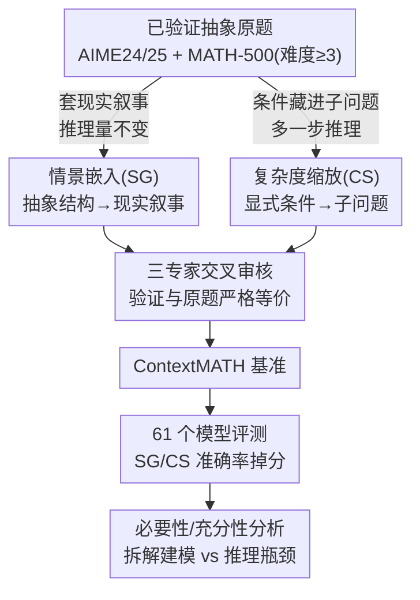

# From Abstract to Contextual: What LLMs Still Cannot Do in Mathematics

**会议**: ICLR 2026  
**arXiv**: [2601.23048](https://arxiv.org/abs/2601.23048)  
**代码**: 未公开  
**领域**: LLM推理  
**关键词**: 数学推理, 上下文推理, 问题建模, benchmark, LLM 评估, AIME

## 一句话总结

提出 ContextMATH 基准，通过将 AIME/MATH-500 抽象数学题转化为情景嵌入（SG）和复杂度缩放（CS）两种变体，揭示即使是 GPT-5 和 DeepSeek-R1 等顶级模型在上下文数学推理中也出现 13-34% 的准确率下降，且错误主要由问题建模（formulation）而非计算推理导致。

## 研究背景与动机

LLM 在数学 benchmark 上已接近满分（AIME、MATH-500），甚至达到 IMO 金牌水平。但这些成功局限于**格式规整的抽象问题**——直接给出方程和条件。

现实世界中的数学应用（金融分析、科学研究、工程设计）很少以现成方程呈现，通常需要从具体叙事场景中**提取数学核心再求解**。这种能力被作者定义为**上下文数学推理（Contextual Mathematical Reasoning）**。

现有 benchmark 几乎全部聚焦抽象问题（GSM8K、MATH、AIME），即使包含简单叙事（"Jack had 8 pens..."）也是浅层的。这留下一个关键问题：**LLM 在抽象 benchmark 上的强劲表现能否迁移到情景化的、需要建模的数学问题中？**

收集真实世界数学问题成本高昂且难以规模化，因此作者采用**受控转换策略**——基于已有 benchmark（保证正确性），系统地将每个问题转化为上下文变体。

## 方法详解

### 整体框架

ContextMATH 不另起炉灶收集数据，而是站在已验证正确的 AIME 2024、AIME 2025 和 MATH-500（仅保留难度 ≥3 的题）之上，对每道抽象原题做受控改写，派生出两种上下文变体，再经人工审核成为最终基准、跑遍 61 个模型、最后用一套定量框架做归因。整条流水线分四步：先沿两条改写路径生成变体——情景嵌入（Scenario Grounding, SG）把抽象结构包进现实叙事但不增加推理量，专测"能否从语境里读出数学核心"；复杂度缩放（Complexity Scaling, CS）把显式条件藏进需要额外推理才能解开的子问题，专测"能否先恢复条件再求解"。然后三位专家交叉审核每道变体，确保与原题严格等价。变体汇成 ContextMATH 后对 61 个模型逐一评测，观察 SG/CS 相对原题的掉分。最后不止看准确率，而是用必要性/充分性框架把"建模"与"推理"两段贡献拆开记账，定位瓶颈到底在哪一段。

### 关键设计

**1. 情景嵌入 SG：给抽象结构套一层现实叙事，隔离语境理解能力**

现实里的数学问题极少直接以方程出现，但现有 benchmark 几乎都是规整的抽象题，无法测出模型把叙事翻译成数学的能力。SG 用多步提示引导 LLM（o1-mini）先把题中每个抽象元素映射到一个现实实体——例如"变量 $x$"对应"初始油桶数"——再依据原题里的属性和关系定义这些实体之间的交互规则，并让模型自我验证、迭代修订，确保叙事在逻辑上严格等价于原题。关键约束是数学核心和求解步数完全不变，只增加一层语境外壳，因此 SG 上的任何掉分都能干净地归因于"读不懂场景"，而非题目变难。

**2. 复杂度缩放 CS：把条件藏进子问题，单独考查条件恢复能力**

真实任务里的关键数值往往不是白给的，而要先从别处推出来。CS 正是把原题里的直接条件编码成一个简单、自包含的子问题的解，迫使模型多走一步推理才能还原出原始条件。具体策略有三类：把数值编码为数论或组合问题的解（如把"25 个指示灯"改写成"指示灯的唯一配对数恰好为 300"，需反解才能得到 25）、用需要从数据点确定的变量替换显式函数或常数、以及把几何关系改述成物理或结构描述。由于子问题刻意保持简单，CS 增加的几乎全是"恢复条件"这一步的负担，与计算难度解耦——这也削弱了模型靠表面模式匹配蒙答案的可能。

**3. 三专家交叉审核：保证变体与原题严格等价**

自动改写难免引入歧义或破坏等价性，因此每道变体都经三位具备计算机高级学位且有竞赛数学背景的专家独立把关：评估叙事是否合理清晰、不引入多余复杂度，各自从场景出发独立重新建模以验证可解且与原题等价，并在 Gemini 与 GPT-5 上实测、若失败则诊断是否源于题面歧义。只有全部通过才被接收，意见不一致时由数学背景最强的审核员主持讨论裁定、必要时触发重生成。最终 SG 与 CS 的平均长度分别为 133 与 176 词，控制在现有 LLM 的处理窗口内，避免长度本身成为干扰变量。

**4. 必要性/充分性分析框架：把"建模"与"推理"两段责任分开记账**

只看最终准确率无法判断模型是栽在"列不出方程"还是"算不对"。论文记 $F$ 为建模正确、$R$ 为最终推理正确，先定义建模准确率（formulation accuracy）为模型把场景翻译成正确数学公式的比率，再用两个条件概率拆解二者关系：

$$\text{建模必要性} = P(F=\text{True} \mid R=\text{True}), \qquad \text{建模充分性} = P(R=\text{True} \mid F=\text{True})$$

必要性衡量正确答案在多大程度上以正确建模为前提，充分性衡量建对了之后又有多大概率真能算对。两者一对照就能定位瓶颈——实验中必要性普遍高于准确率，说明"建对"是答对的近乎必要条件；而充分性始终滞后，说明就算建对了也未必算得对，推理仍是第二道坎。

### 损失函数 / 训练策略

为检验合成场景数据能否补上这块短板，论文在 Qwen3-Base 系列上对比三种 SFT 设置：仅用原始抽象数据的 $\text{SFT}_{\text{Ori}}$（50k）、仅用合成场景数据的 $\text{SFT}_{\text{Syn}}$（50k）、以及两者混合的 $\text{SFT}_{\text{Mix}}$（100k）。此外还尝试单独训练一个"专用建模模型"来负责场景到公式的翻译，再交给推理模型求解，以验证建模能力能否从 scenario-original 配对数据里直接学到。

## 实验关键数据

### 主实验

**顶级闭源模型在 AIME 上的表现（单次评估准确率 %）**：

| 模型 | AIME24 Ori | AIME24 SG | AIME24 CS | AIME25 Ori | AIME25 SG | AIME25 CS |
|------|-----------|-----------|-----------|-----------|-----------|-----------|
| DeepSeek-R1 | 93.3 | 70.0 (-25%) | 66.7 (-29%) | 86.7 | 73.3 (-15%) | 53.3 (-38%) |
| GPT-5 | 90.0 | 83.3 (-7%) | 80.0 (-11%) | 90.0 | 80.0 (-11%) | 66.7 (-26%) |
| Gemini 2.5 Pro | 83.3 | 73.3 (-12%) | 76.7 (-8%) | 83.3 | 56.7 (-32%) | 50.0 (-40%) |
| o3 | 83.3 | 70.0 (-16%) | 66.7 (-20%) | 76.7 | 70.0 (-9%) | 60.0 (-22%) |
| QwQ-plus | 86.7 | 56.7 (-35%) | 46.7 (-46%) | 73.3 | 53.3 (-27%) | 43.3 (-41%) |

**开源模型（16 样本平均准确率 %）**：

| 模型 | AIME24 Ori | AIME24 SG | AIME24 CS | AIME25 SG | AIME25 CS |
|------|-----------|-----------|-----------|-----------|-----------|
| Qwen3-32B | 81.2 | 67.9 (-16%) | 57.1 (-30%) | 54.4 (-22%) | 45.0 (-36%) |
| Qwen3-8B | 73.8 | 61.5 (-16%) | 42.9 (-42%) | 48.3 (-25%) | 35.8 (-45%) |
| Qwen3-4B | 70.4 | 52.5 (-25%) | 34.6 (-51%) | 39.6 (-38%) | 33.8 (-47%) |
| AReaL-boba-2-32B | 81.5 | 65.4 (-20%) | 58.3 (-29%) | 55.0 (-29%) | 43.8 (-43%) |

平均而言，开源模型在 SG 上下降 13%，在 CS 上下降 34%；闭源模型分别下降 13% 和 20%。

### 消融实验

**建模能力分析（关键模型）**：

| 模型 | 建模准确率 Avg | 建模必要性 Avg | 建模充分性 Avg |
|------|--------------|--------------|--------------|
| Qwen3-0.6B | 42.8 | 56.1 | 13.5 |
| Qwen3-4B | 61.6 | 79.2 | 61.3 |
| Qwen3-8B | 73.8 | 83.8 | 60.7 |
| Qwen3-32B | 75.0 | 81.9 | 64.9 |
| GPT-5 | 81.4 | 85.6 | 82.7 |

**训练实验（Qwen3-14B-Base，平均准确率 %）**：

| 设为 | Average |
|------|---------|
| Base | 29.4 |
| + SFT_Ori | 55.5 (+26.1%) |
| + SFT_Syn | 60.4 (+31.0%) |
| + SFT_Mix | **61.3** (+31.9%) |

**训练专用建模模型失败**：

| 推理模型 | 无建模 | 未调建模 8B | 调优建模 8B |
|---------|-------|-----------|-----------|
| Qwen3-8B | 53.9 | 48.9 | 20.8 |
| Qwen3-14B | 57.7 | 51.8 | 21.8 |

训练后的建模模型性能反而崩溃，从 scenario-original 配对数据中难以有效学习建模能力。

### 关键发现

1. **上下文复杂性是普遍瓶颈**：即使 GPT-5 在 AIME25-CS 上也下降 26%
2. **规模缓解但不解决问题**：1.5B 下降 77% vs 32B 下降 29%（CS），但差距仍然显著
3. **错误分析：建模错误占 ~80%**，远超计算、逻辑等其他类型
4. **建模是必要条件**：必要性一致高于准确率（Qwen3-8B: 83.8% vs 73.8%）
5. **建模非充分条件**：充分性滞后于必要性，即使 GPT-5 也仅 82.7%
6. **后续 RL 专门化可能有害**：进一步 SFT/RL 提升了原始题得分但加大了上下文下降
7. **场景数据训练有效但不够**：SFT_Mix 最优但仍有大量未解决的差距

## 亮点与洞察

1. **benchmark 设计理念优秀**：SG 和 CS 形成递进式探针，分离"语境理解"和"条件恢复"两种能力
2. **三层定量分析框架**（准确率-必要性-充分性）清晰地刻画了建模与推理的双重瓶颈
3. **揭示了一个反直觉现象**：专门的 RL 后训练可能过度拟合规范格式，削弱上下文推理
4. **负面结果同样有价值**：训练专用建模模型失败，说明建模能力不可从配对数据简单学习
5. **评估规模宏大**：61 个模型（46 开源 + 15 闭源），包括 GPT-5

## 局限性 / 可改进方向

1. **基准规模有限**：基于 AIME（30 题/年）和 MATH-500 子集，数据量较小
2. **构建依赖 LLM + 人工审核**：难以大规模扩展
3. **MATH-500 未构建 CS 变体**：部分简单题不适合进一步转换
4. **闭源模型仅单次评估**：API 限制导致无法多次采样
5. 可扩展到其他领域（物理、经济学）的上下文推理评估
6. 可探索训练时同时暴露抽象和上下文变体的课程学习策略

## 相关工作与启发

- **GSM8K/MATH/AIME**：ContextMATH 直接基于这些 benchmark 构建上下文变体
- **Math-Perturb** (Huang et al., 2025)：改变表面参数测试泛化，ContextMATH 更深层——改变呈现方式
- **SWE-bench/WebArena**：其他领域的真实场景评估，ContextMATH 是数学领域的类似尝试
- 启发：抽象能力 ≠ 应用能力，这一差距在数学领域尤为突出

## 评分

- **新颖性**: ⭐⭐⭐⭐ — SG/CS 双维度设计和建模分析框架新颖
- **技术深度**: ⭐⭐⭐⭐ — 必要性/充分性分析框架严谨
- **实验充分性**: ⭐⭐⭐⭐⭐ — 61 模型评估 + 训练实验 + 建模分析，极其全面
- **写作质量**: ⭐⭐⭐⭐ — 结构清晰，insight 凝练
- **实用价值**: ⭐⭐⭐⭐ — 对评估和训练 LLM 数学能力有直接指导意义
- **综合推荐**: ⭐⭐⭐⭐⭐ (4.5/5)

<!-- RELATED:START -->

## 相关论文

- [\[ACL 2026\] ChAIRO: Contextual Hierarchical Analogical Induction and Reasoning Optimization for LLMs](../../ACL2026/llm_reasoning/chairo_contextual_hierarchical_analogical_induction_and_reasoning_optimization_f.md)
- [\[ICML 2026\] Biases in the Blind Spot: Detecting What LLMs Fail to Mention](../../ICML2026/llm_reasoning/biases_in_the_blind_spot_detecting_what_llms_fail_to_mention.md)
- [\[NeurIPS 2025\] SAND-Math: Using LLMs to Generate Novel, Difficult and Useful Mathematics Questions and Answers](../../NeurIPS2025/llm_reasoning/sand-math_using_llms_to_generate_novel_difficult_and_useful_mathematics_question.md)
- [\[ICML 2026\] How Far Ahead Do LLMs Plan? Uncovering the Latent Horizon in Chain-of-Thought Reasoning](../../ICML2026/llm_reasoning/how_far_ahead_do_llms_plan_uncovering_the_latent_horizon_in_chain-of-thought_rea.md)
- [\[NeurIPS 2025\] RealMath: A Continuous Benchmark for Evaluating Language Models on Research-Level Mathematics](../../NeurIPS2025/llm_reasoning/realmath_a_continuous_benchmark_for_evaluating_language_models_on_research-level.md)

<!-- RELATED:END -->
