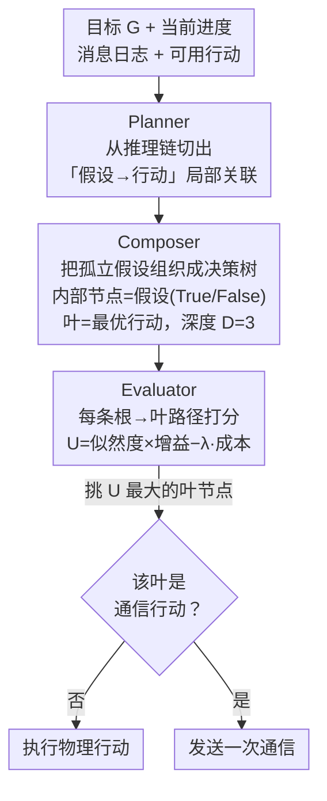

# From Assumptions to Actions: Turning LLM Reasoning into Uncertainty-Aware Planning

**会议**: ICLR 2026  
**arXiv**: [2602.04326](https://arxiv.org/abs/2602.04326)  
**代码**: 有（匿名补充材料）  
**领域**: LLM/NLP  
**关键词**: 不确定性感知规划, LLM多智能体协作, 决策树, 部分可观测环境, 通信优化  

## 一句话总结

提出 PCE（Planner-Composer-Evaluator）框架，将 LLM 推理链中隐含的环境假设显式提取并组织为决策树，通过似然度-增益-成本评分实现不确定性感知的行动选择，大幅减少多智能体协作中的通信开销。

## 研究背景与动机

在去中心化、部分可观测的多智能体协作场景中（如两个机器人协作准备餐食），每个智能体只能感知环境的一部分，面临关于隐藏物体和协作者意图的普遍不确定性。

现有 LLM 驱动的多智能体系统存在根本性问题：

**过度依赖通信**：CoELA、REVECA、CaPo、CoTS 等方法通过反复自然语言对话来验证计划、交换信息和迭代优化，导致大量 token 和时间消耗

**干扰人类工作流**：当协作者是人类时，频繁的询问和报告会打断已建立的工作流程

**单纯扩展无效**：增大模型容量或加深推理链并不能从根本上解决不确定性——没有显式机制来识别和评估假设，大模型仍然无法权衡关于环境的竞争假说

论文的两个关键**经验观察**推动了设计：
- LLM 在零样本 CoT 推理中会**隐式生成关于不确定环境的假设**（如"柜子里可能有食物"）
- 这些假设是**局部且隐式引用**的，从未被显式聚合用于全局决策，导致无法系统地调和多个假设

## 方法详解

### 整体框架

PCE 要解决的是去中心化、部分可观测协作里的一个老问题：每个智能体只看得到环境的一部分，对隐藏物体和协作者意图充满不确定，过去只能靠反复通信来消解。PCE 的思路是把原本一步到位的规划模块拆成 Planner、Composer、Evaluator 三级流水线，夹在记忆模块与执行/通信模块之间。整体怎么转：Planner 先把 LLM 推理链里那些零散、隐式的环境假设连同对应行动挖出来；Composer 把这些孤立假设组织成一棵可比较的决策树；Evaluator 再用统一的效用函数为每条假设路径打分、挑出最优叶节点。关键是通信被当成行动空间里的一个普通选项参与打分——执行前先把"该验证哪个假设、要不要花一次通信"这件事推理清楚，而不是默认开口问。

### 关键设计

**1. Planner：从推理链里挖出「假设-行动」关联**

LLM 在零样本 CoT 下天然会一边推理一边冒出关于环境的猜测，但这些猜测散落在文本里、彼此孤立，无法用于全局决策。Planner 接收目标 $G$、当前进度、消息日志和可用行动列表，调用 LLM 产出候选行动及其完整推理链，关键是从推理链中切出一个个"假设→行动"的局部关联，例如"浴室柜子可能有有用的东西"对应"去检查浴室柜子"。这一步只负责把原料备齐——它保留了 LLM 的常识推理能力，又没有强行替 LLM 调和相互竞争的假设，把"组织假设"的重活留给下游。

**2. Composer：把孤立假设组织成决策树**

单个假设无法表达"如果柜子里没有，那该怎么办"这种条件依赖，Composer 因此把假设拼成一棵决策树：内部节点是一个环境假设，分出 True/False 两条分支；叶节点是该假设路径下的最优行动，物理行动和通信行动一视同仁。树自顶向下扩展，每次用局部排序策略优先选那些既能最大程度降低不确定性、又最能左右行动选择的假设来分叉；当现有假设不足以覆盖局面时，Composer 会基于上下文里出现的实体临时提出新的原子假设。树深限制为 $D=3$，在表达力和推理开销之间取折中。正是这棵树让"先验证哪个假设"变成一个可以系统比较的问题，而不再是 LLM 随机的局部跳转。

**3. Evaluator：用统一效用把通信降格为普通选项**

有了树还需要一把能横向比较所有路径的尺子。Evaluator 对每条根到叶的路径打三维分：场景似然度 $\mathcal{L}(\mathcal{S})$ 是这条假设路径成立的估计概率，由 LLM 结合观测和消息历史给出；条件增益 $\mathcal{G}(a)$ 衡量假设为真时行动 $a$ 对完成目标的推进程度；执行成本 $C(a) = \alpha \cdot d(a) \cdot \mathbf{1}\{\text{move}\} + \beta \cdot \ell(a) \cdot \mathbf{1}\{\text{comm}\}$ 把移动距离和通信长度折算成代价。三者合成最终效用

$$U(\mathcal{S}, a) = \mathcal{L}(\mathcal{S}) \cdot \mathcal{G}(a) - \lambda \cdot C(a)$$

按 $U$ 对叶节点排序就得到最优行动。这个设计的要害在于：通信只是行动空间里的一个原子选项，只有当它的效用真正高过物理行动时才会被选中——这与 CoELA、CoTS 等把通信当作搜索手段、动辄反复对话的做法形成根本区别，也是 PCE 能把通信次数压到基线 10–20% 的来源。

### 一个完整示例

以"找食物"为例可以看清三级如何接力。Planner 推理后给出若干带假设的候选行动；Composer 以"客厅有食物"为根假设建树，True 分支导向"去客厅探索"，False 分支下它发现已有假设不够用，于是临时生成新假设"协作者 Bob 可能知道纸杯蛋糕位置"，其 True 分支导向"发消息询问 Bob"。Evaluator 对"去客厅探索"和"询问 Bob"两条路径分别算 $U$：若客厅有食物的似然度高，直接探索的效用更大就省掉一次通信；只有当探索希望渺茫、而询问 Bob 的似然度×增益足以抵过通信成本时，发消息才会胜出。整个过程没有为了对齐信息而预先通信。

### 损失函数 / 训练策略

PCE 是纯推理时框架，无需训练。默认超参数为 $D=3, \alpha=1, \beta=1, \lambda=1, K_{\text{action}}=10, K_{\text{message}}=3$，并在 GPT-4o mini、GPT-OSS:20B、Gemma3:4B 三种骨干上保持同一套配置，说明效果来自结构而非逐模型调参。

## 实验关键数据

### 主实验

**C-WAH 环境（总步数↓越低越好）**：

| 方法 | GPT-4o mini | GPT-OSS:20B | Gemma3:4B |
|------|-------------|-------------|-----------|
| **PCE** | **42.76** | **49.60** | **59.20** |
| CoELA | 60.40 | 72.72 | 77.20 |
| REVECA | 46.80 | 53.86 | 62.56 |
| CaPo | 60.82 | 68.34 | 75.88 |
| CoTS | 64.00 | 65.26 | 72.32 |

**TDW-MAT 环境（运输成功率↑越高越好）**：

| 方法 | GPT-4o mini Total | GPT-OSS:20B Total | Gemma3:4B Total |
|------|-------------------|-------------------|-----------------|
| **PCE** | **87.50%** | **81.25%** | **70.83%** |
| CoELA | 62.50% | 55.00% | 45.84% |
| REVECA | 81.25% | 73.33% | 52.09% |
| CaPo | 73.33% | 65.41% | 67.50% |
| CoTS | 75.00% | 59.17% | 63.33% |

**通信次数对比（PCE vs 基线，GPT-4o mini）**：
- C-WAH: PCE 1.70 vs CoELA 9.88 / CaPo 8.72 / CoTS 10.24
- TDW-MAT: PCE 3.58 vs CoELA 13.33 / CaPo 70.79 / CoTS 108.92

### 消融实验

**组件消融（C-WAH，GPT-4o mini）**：

| 变体 | 总步数↓ | Token消耗↓ |
|------|---------|-----------|
| **PCE (完整)** | **42.76** | 44353 |
| w/o Planner | 56.46 | 139918 |
| w/o Composer | 46.82 | 33347 |
| w/o Evaluator | 47.34 | 44720 |

**LLM 容量扩展实验**：Gemma3 从 4B→12B→27B 扩展，仅用 Planner（无 Composer+Evaluator）的改善有限，而 PCE 在所有容量下均一致地加快目标完成。

### 关键发现

1. **通信减少 80%+**：PCE 的通信次数仅为基线的 10-20%，但任务性能全面领先
2. **Token 使用可控**：尽管 PCE 的三模块架构每步推理成本更高，但总 episode 长度大幅缩短，总 token 消耗与基线相当
3. **扩展不能替代结构化**：单纯增大模型（4B→27B）或加深推理（Low→High reasoning）带来的收益有限，PCE 的结构化不确定性处理与扩展互补而非替代
4. **用户研究验证**：12 名参与者在效率和信任度维度均给 PCE 最高评分，选择性通信比"总是通信"和"从不通信"都更受欢迎

## 亮点与洞察

1. **范式转换**：从"通信驱动协调"转向"结构化假设推理"，将通信降格为行动空间中的普通选项而非搜索机制
2. **假设作为一等公民**：首次将 LLM 推理中的隐式假设显式建模为决策变量，这个抽象层次的提升简洁而有力
3. **与 ToT/CoTS 的本质区别**：ToT 在推理步骤空间搜索，CoTS 在联合推理-行动空间用通信搜索，PCE 在**假设空间**搜索——不同的树代表不同的东西
4. **三方面验证一致**：定量（两个benchmark）+ 定性（案例分析）+ 用户研究均支持核心claims

## 局限与展望

1. **假设由 LLM 生成**：假设的质量和覆盖率依赖于 LLM 的常识推理能力，可能遗漏关键假设
2. **评分依赖 LLM 估计**：似然度和增益均由 LLM 估计而非真实概率，可能存在系统性偏差
3. **仅在仿真家庭环境验证**：C-WAH 和 TDW-MAT 虽具挑战性但场景类型有限
4. **树深度固定**：$D=3$ 对复杂长视野任务可能不够，自适应深度策略值得探索
5. **两智能体限制**：尚未在更多智能体（>2）的场景中大规模验证

## 相关工作与启发

- **与 CoELA/REVECA 的关系**：这些工作通过对话交换状态和计划信息，PCE 通过内部结构化假设替代大部分通信
- **与 Tree of Thoughts 的区别**：ToT 的树节点是推理步骤（认知空间），PCE 的树节点是环境假设（概率状态空间）
- **与 DEC-POMDP 的关系**：PCE 可视为在 DEC-POMDP 框架下用 LLM 近似贝叶斯推理的实用方案
- **启发**：将 LLM 生成的自由文本结构化为可评估的形式表示是提升 LLM 决策能力的通用方向，不限于多智能体场景

## 评分

- 新颖性: ⭐⭐⭐⭐⭐ — "假设即决策变量"的范式转换具有深远影响
- 实验充分度: ⭐⭐⭐⭐⭐ — 双 benchmark、三骨干、组件消融、扩展分析、用户研究全覆盖
- 写作质量: ⭐⭐⭐⭐ — 问题定义清晰，方法动机充分，与相关工作的区分精准
- 价值: ⭐⭐⭐⭐⭐ — 实用性强（通信减少80%+），通用性好（多骨干一致提升），洞察深刻

<!-- RELATED:START -->

## 相关论文

- [\[AAAI 2026\] Dropouts in Confidence: Moral Uncertainty in Human-LLM Alignment](../../AAAI2026/llm_reasoning/dropouts_in_confidence_moral_uncertainty_in_human-llm_alignment.md)
- [\[ACL 2026\] PPA-Plan: Proactive Pitfall Avoidance for Reliable Planning in Long-Context LLM Reasoning](../../ACL2026/llm_reasoning/ppa-plan_proactive_pitfall_avoidance_for_reliable_planning_in_long-context_llm_r.md)
- [\[ICML 2026\] Scaling-Aware Adapter for Structure-Grounded LLM Reasoning](../../ICML2026/llm_reasoning/scaling-aware_adapter_for_structure-grounded_llm_reasoning.md)
- [\[ACL 2026\] Budget-Aware Anytime Reasoning with LLM-Synthesized Preference Data](../../ACL2026/llm_reasoning/budget-aware_anytime_reasoning_with_llm-synthesized_preference_data.md)
- [\[ACL 2026\] Reliability-Aware Adaptive Self-Consistency for Efficient Sampling in LLM Reasoning](../../ACL2026/llm_reasoning/reliability-aware_adaptive_self-consistency_for_efficient_sampling_in_llm_reason.md)

<!-- RELATED:END -->
