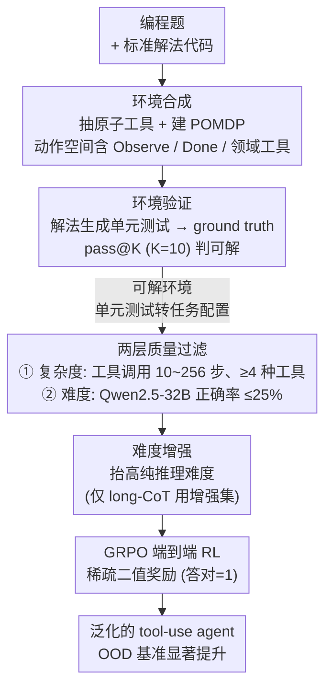

# Generalizable End-to-End Tool-Use RL with Synthetic CodeGym

**会议**: ICLR2026  
**arXiv**: [2509.17325](https://arxiv.org/abs/2509.17325)  
**代码**: [StigLidu/CodeGym](https://github.com/StigLidu/CodeGym)  
**领域**: LLM推理  
**关键词**: tool-use, reinforcement-learning, LLM agent, synthetic environment, code-based training

## 一句话总结

提出 CodeGym 框架，将编程题自动转化为多轮工具调用的交互式环境，用于 LLM agent 的强化学习训练，在分布外基准上取得显著泛化提升（如 Qwen2.5-32B 在 τ-Bench 上 +8.7 点）。

## 背景与动机

工具增强的大语言模型（LLM agent）通过调用外部工具（数据库、搜索引擎、代码执行器等）来拓展自身能力。然而，现有训练方式存在两大瓶颈：

1. **SFT 局限**：监督微调依赖静态轨迹，生成的数据遵循手工设计的模式，环境和任务配置覆盖有限，导致面对新工具或未知工作流时泛化性差。
2. **RL 局限**：现有 RL 训练环境仅针对狭窄任务（如代码调试助手、信息检索），限制了 RL 促进泛化的潜力。

核心洞察：**代码天然蕴含严格的执行逻辑，与现实世界工作流结构高度相似**。例如，循环直到条件满足的代码模式，类似现实中迭代审批流程。因此，编程题是构建多样化工具调用训练环境的理想基础。

## 核心问题

如何构建一个**可扩展的通用 RL 环境**，使 LLM agent 能够通过主动探索和交互获得可迁移到真实世界任务的工具使用能力？

## 方法详解

### 整体框架

CodeGym 要解决的是「agent 工具使用能力怎么训得出泛化」：现有训练要么靠静态轨迹的 SFT、要么是窄任务上的 RL，换个新工具、新工作流就崩。它的核心赌注是——代码的执行逻辑（循环、条件、迭代直到收敛）和现实世界的工作流结构高度同构，于是把一道带标准解法的编程题自动改造成一个可交互的 POMDP 环境。整条数据流水线是：先从解法代码里抽出可复用的原子逻辑当工具、把环境建成 POMDP（环境合成）；再用原始解法生成单元测试反过来校验环境到底可不可解（环境验证）；通过的环境还要再过一道两层过滤，卡掉太简单、工具形态畸形或当前模型一做就对的配置（质量过滤）；最后对 long-CoT 模型额外做难度增强，堵住它纯推理绕过工具的捷径，把剩下的任务配置喂给 GRPO 做端到端 RL。整个数据侧无需人工标注轨迹，规模可一直放大到 13k 环境、80k+ 任务配置。

### 关键设计

**1. 环境合成（Gym Synthesis）：把代码逻辑变成可调用的工具**

现有 agent 训练环境要么靠静态轨迹、要么只覆盖代码调试或信息检索这类窄任务，难以泛化。CodeGym 的做法是输入编程题及其解法代码，从中提取独立函数、计算工具或常见代码片段（如循环体）作为可复用的原子工具，再由 LLM 为每个工具生成精确文档（功能、参数、示例）。每个环境被建模成 POMDP $\mathcal{E} = \langle \mathcal{S}, \mathcal{A}, T, R, \mathcal{O} \rangle$，动作空间由通用函数（Observe、Done）和领域特定工具组成，奖励是稀疏二值的——最终答案正确得 1、否则得 0。关键细节是训练时把工具文档里的示例隐藏掉，逼 agent 通过主动试探去摸清每个工具的真实行为，而不是照抄文档，这正是工具使用能力可迁移的来源。

**2. 环境验证（Gym Verification）：用单元测试保证环境真的可解**

自动合成的环境可能因为工具抽取不完整或题目本身歧义而无解，直接拿去训练会污染奖励信号。CodeGym 先合成覆盖多难度和边界情况的单元测试输入，用原始编程解法跑出对应输出当作 ground truth，再用 pass@K 策略（$K=10$）做筛选：对一个环境生成 10 个候选解法函数，只要任一个能通过全部单元测试就认定环境可解、并把通过的那个记为 oracle 解。通过验证的那些单元测试随后被直接复用为 RL 训练的任务配置，等于让"可验证"和"可训练"用的是同一套标准。

**3. 两层质量过滤：同时卡复杂度和难度**

光是可解还不够，过简单或工具调用形态畸形的环境对泛化没帮助。第一层卡工具调用复杂度：用 oracle 解算出每个任务需要的工具调用次数，过滤掉 $T_{\min}=10$ 以下（太琐碎）和 $T_{\max}=256$ 以上（多为重复死循环）的配置，并要求每个环境至少出现 4 种不同工具，避免退化成反复调同一个工具。第二层卡难度：用 Qwen2.5-32B-Instruct 对每个配置评测 4 次，只保留正确率 ≤ 25% 的配置，确保留下来的都是当前模型啃不动的硬骨头。过滤后最终得到 13k 环境、80k+ 任务配置，平均每个环境含 6.52 个工具、需要 44.07 步完成。消融显示这层过滤把 OOD 平均增益从 +3.9 拉到 +7.3，几乎翻倍。

**4. 难度增强：堵住 long-CoT 绕过工具的捷径**

long-CoT 模型有时拿到完整信息后能靠纯推理直接算出答案、根本不调工具，这样训练就学不到工具使用。CodeGym 在初始化任务配置时刻意抬高纯推理路径的难度，迫使模型必须真正走交互流程才能解题。实际训练时区别对待：long-CoT 模型用增强后的更难训练集，short-CoT 模型用原始集，从而把工具使用能力真正训进模型里。

### 损失函数 / 训练策略

训练用 GRPO 算法，batch size 为 512×8。为了让大量环境交互不拖慢 GPU，框架把 CPU 端的环境服务器与 GPU 端的 rollout 解耦做成分布式 rollout。工具执行的稳健性靠 Trial-then-Overwrite 机制保证：先序列化环境状态，在子进程里试跑工具调用，成功才提交新状态、失败则回滚并返回错误信息，避免一次崩溃污染整条轨迹；同时设置最大工具调用次数 $T_{\max}$ 防止 agent 在错误-重试循环里空转。

## 实验关键数据

### 模型与设置

- Short-CoT：Qwen2.5 系列（7B/14B/32B/72B）
- Long-CoT：QwQ-32B
- 训练步数：≤32B 模型约 100 步饱和，72B 约 50 步

### OOD 基准结果（核心亮点）

| 模型 | τ-airline | τ-retail | τ²-bench | ALFWorld | ZebraLogic | MMLU-Pro | 平均 |
|------|-----------|----------|----------|----------|------------|----------|------|
| Qwen2.5-32B-Instruct | 26.8 | 41.4 | 24.7 | 66.8 | 24.2 | 70.0 | 42.3 |
| Qwen2.5-32B-CodeGym | **31.2** (+4.4) | **54.4** (+13.0) | **30.7** (+6.0) | **80.8** (+14.0) | **29.0** (+4.8) | **71.2** (+1.2) | **49.6** (+7.3) |
| QwQ-32B | 37.6 | 37.7 | 26.1 | 62.4 | 79.9 | 81.4 | 54.2 |
| QwQ-32B-CodeGym | **43.2** (+5.6) | **43.0** (+5.3) | **30.7** (+4.6) | **64.4** (+2.0) | 76.6 (-3.3) | 81.4 | **56.6** (+2.4) |

关键发现：

- **大模型受益更多**：32B 平均提升 +7.3，7B 仅 +2.8，说明大模型泛化而非记忆
- **工具调用数量递增**：训练过程中 agent 平均工具调用次数持续增加，逐渐接近 oracle，表明 agent 学会了更完整的工作流
- **小模型的局限**：7B 模型产生最多工具调用，但多为重复失败-重试循环，暴露了小模型错误诊断能力不足

### RL vs. SFT 对比

- Oracle-SFT 和 Distillation-SFT 在域内表现尚可，但在 OOD 任务上出现**明显退化**
- RL 训练是实现泛化的关键，SFT 无法替代

### 过滤消融

- 无过滤（CodeGym-Full）：OOD 平均 46.2（+3.9）
- 有过滤（CodeGym-Filter）：OOD 平均 49.6（+7.3），提升近一倍

## 亮点

1. **构思巧妙**：利用代码执行逻辑与现实工作流的结构相似性，将编程题转化为通用 agent 训练环境，思路新颖且自然
2. **完整的 pipeline**：从数据收集、环境合成、验证、质量控制到分布式 RL 训练，形成闭环系统
3. **OOD 泛化显著**：在语义上与训练环境完全不同的任务（零售客服、家居导航等）上也取得大幅提升
4. **规模化支撑**：13k 环境、80k+ 任务配置，远超现有 agent 训练工作
5. **定性分析有说服力**：训练后 agent 在行动前展现出更强的多步规划能力（ALFWorld 示例）

## 局限与展望

1. **环境多样性受限于编程题**：尽管代码逻辑丰富，但缺乏涉及视觉、物理交互等非文本模态的环境
2. **Long-CoT 推理略有退化**：QwQ-32B 在 ZebraLogic 上下降 3.3 点，说明工具使用训练与推理能力之间可能存在冲突，需要联合优化
3. **小模型受益有限**：7B 模型仅提升 2.8 点且出现重复调用问题，该框架对小模型的有效性存疑
4. **奖励信号稀疏**：仅在最终答案给出二值奖励，没有过程奖励，可能限制长序列任务的学习效率
5. **未探索多 agent 协作**：所有实验均为单 agent 设定

## 与相关工作的对比

| 对比维度 | CodeGym | SWE-Gym | BrowseComp-Plus | ToolBench |
|---------|---------|---------|-----------------|-----------|
| 环境数量 | 13k | 较少 | 较少 | 大规模数据集 |
| 是否交互式 | ✅ 多轮交互 | ✅ 代码调试 | ✅ 网页搜索 | ❌ 静态数据 |
| 通用性 | 高（编程→通用工具调用） | 低（仅代码领域） | 低（仅搜索） | 中 |
| RL 支持 | ✅ 完整 GRPO 训练 | 有限 | 有限 | ❌ |
| 可验证奖励 | ✅ 单元测试 | ✅ | 部分 | ❌ |

## 启发与关联

- **代码→通用 agent 能力迁移**的范式具有广泛启发性，类似于"在代码上预训练提升推理能力"的思路，但扩展到了交互式 agent 训练
- 该工作与 RLVR（Reinforcement Learning with Verifiable Reward）趋势一致，验证了可验证奖励在 agent 训练中的有效性
- 可与 process reward model 结合，为长序列工具调用引入更细粒度的监督信号
- 对于 agent 基准设计也有启示：环境的多样性和复杂度直接影响训练后的泛化能力

## 评分
- 新颖性: 8/10 — 编程题→交互式 agent 环境的转换思路新颖，但核心技术（GRPO、POMDP）已有
- 实验充分度: 9/10 — 多尺度模型、OOD 多维度评测、消融实验、定性分析俱全
- 写作质量: 8/10 — 结构清晰，图表丰富，motivation 阐述自然
- 价值: 8/10 — 为 agent 训练提供了可扩展的通用环境生成方案，实用价值高

<!-- RELATED:START -->

## 相关论文

- [\[CVPR 2026\] Latent Chain-of-Thought World Modeling for End-to-End Autonomous Driving](../../CVPR2026/llm_reasoning/latent_chain-of-thought_world_modeling_for_end-to-end_autonomous_driving.md)
- [\[ICLR 2026\] THOR: Tool-Integrated Hierarchical Optimization via RL for Mathematical Reasoning](thor_tool-integrated_hierarchical_optimization_via_rl_for_mathematical_reasoning.md)
- [\[ICML 2026\] Diversity Over Frequency: Rethinking Tool Use in Visual Chain-of-Thought Agents](../../ICML2026/llm_reasoning/diversity_over_frequency_rethinking_tool_use_in_visual_chain-of-thought_agents.md)
- [\[ICML 2026\] MOSAIC: Learning When to Act or Refuse — Guarding Agentic Reasoning Models for Safe Multi-step Tool Use](../../ICML2026/llm_reasoning/learning_when_to_act_or_refuse_guarding_agentic_reasoning_models_for_safe_multi-.md)
- [\[ICLR 2026\] Dynamics-Predictive Sampling for Active RL Finetuning of Large Reasoning Models](dynamics-predictive_sampling_for_active_rl_finetuning_of_large_reasoning_models.md)

<!-- RELATED:END -->
