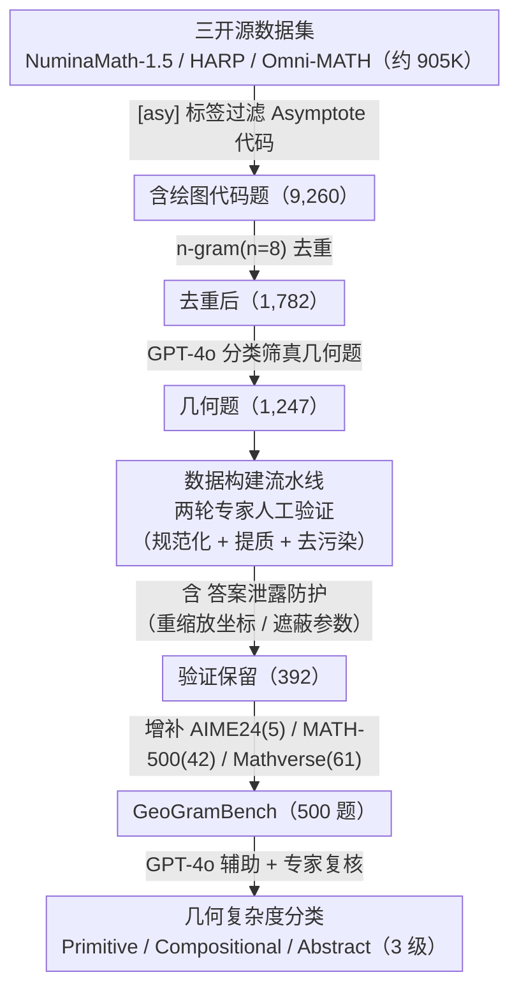

# GeoGramBench: Benchmarking the Geometric Program Reasoning in Modern LLMs

**会议**: ICLR 2026  
**arXiv**: [2505.17653](https://arxiv.org/abs/2505.17653)  
**代码**: [GitHub](https://github.com/LiAuto-DSR/GeoGramBench)  
**领域**: LLM推理  
**关键词**: 几何推理, 程序转几何, benchmark, 空间推理, Asymptote代码

## 一句话总结

形式化Program-to-Geometry任务并提出GeoGramBench（500题），按三级几何复杂度分类法评估19个前沿LLM从过程式绘图代码构建几何表征并推理的能力，发现即使GPT-5在最高抽象级别也仅39.26%准确率，揭示了LLM空间抽象的根本性短板。

## 研究背景与动机

**领域现状**：空间推理是人类认知和AI的基础能力，支撑机器人、自动导航、自动设计等应用。LLM在解释几何变换和空间关系方面引起广泛关注，但从过程式代码进行几何推理的能力被严重忽视。

**现有痛点**：既有benchmark（如MathVerse, GeoSense, Euclid）聚焦视觉几何理解；MATH-500和AIME24虽包含少量Asymptote代码题，但缺乏系统性的Program-to-Geometry评测。更关键的是，现有基准未识别到代码中的**答案泄露**问题——代码参数可直接或间接暴露答案。

**核心矛盾**：初步研究表明LLM在从代码到空间推理的过渡中存在显著性能下降。DeepSeek-R1在含Asymptote代码的几何题（$\mathbb{P}_{TC}$）上比纯文本题（$\mathbb{P}_T$）准确率骤降23.5%（AIME24）和10.9%（MATH-500）。GPT-o1和QwQ-32B也呈现类似趋势。

**本文方案**：形式化Program-to-Geometry任务定义，提出GeoGramBench（500题精心策划的几何题含过程式绘图代码），配套三级几何复杂度分类法而非传统推理难度分类。

## 方法详解

### 整体框架

GeoGramBench 把 "Program-to-Geometry" 形式化为一类任务：给定文本描述加一段几何绘图代码（Asymptote 或 matplotlib），模型必须先在内部解析代码、重建出对应的几何表征，再基于这个表征推理出数值答案（长度/面积/体积/角度/比例/计数）。整篇工作要交付的是一个评测集，因此方法本质是一条**数据构建流水线**：从三个开源数学数据集的约 90 万候选题里，层层过滤出含绘图代码的真几何题，在人工验证阶段嵌入**答案泄露防护**堵死"读代码抄答案"的捷径，最后给保留下来的 500 题打上**几何复杂度分类**标签。三个关键设计正对应这条流水线的"筛选骨架—防护机制—分级标准"。

### 关键设计

**1. 数据构建流水线：从 90 万候选层层筛出 500 道可靠的几何题**

没有现成的 Program-to-Geometry 评测集，作者只能自己从海量数学题里淘出"含绘图代码且质量可靠"的几何题。流水线从 NuminaMath-1.5、HARP、Omni-MATH 三个开源数据集约 905K 候选题起步，先按 `[asy]`/`[/asy]` 标签过滤出含 Asymptote 代码的题（约 1%，9,260 题），再用 n-gram（$n=8$）相似度去重到 1,782 题，接着借 GPT-4o 做 prompt 分类筛出真几何题 1,247 题；随后两轮专家人工验证（4 位数学硕士及以上，第一轮规范题型与格式、第二轮提质并去污染）保留 392 题，最后增补 AIME24（5 题）、MATH-500（42 题）与 Mathverse 固体几何（61 题，手工转写成 matplotlib 代码）凑成 500 题。这套多源、多绘图语言的构建，使 GeoGramBench 成为目前规模最大、最多样的 Program-to-Geometry 评测集。

**2. 答案泄露防护：堵死"不读图也能从代码抄答案"的捷径**

作者在 MATH-500 里发现大量 Asymptote 代码会把答案直接或间接写进参数——若不处理，模型根本不必做几何推理就能拿分，评测彻底失效。他们把泄露分两类分别处理：**直接泄露**指答案被显式编码成坐标值（如圆半径、线段长度），对策是对坐标整体重缩放、保持图形形状不变但抹掉数值线索；**间接泄露**指答案可由代码参数或公式反推出来，对策是修改或遮蔽这些关键参数。每道题都经 4 位专家两轮核验，确保答案无法仅靠检查代码获得。正是这一步把"读图"逼成必经环节，构成 GeoGramBench 相比 MATH-500、AIME24 在评估有效性上的关键差异。

**3. 几何复杂度分类法：用"图形抽象难度"而非"推理步数"给题目分级**

传统数学 benchmark 按推理链长度（高中→竞赛级）标难度，但作者发现这一维度刻画不了 Program-to-Geometry 的真正瓶颈。GeoGramBench 改用三级几何复杂度：**Primitive Recognition（基元识别）**只含 1-2 个几何基元（点/线/弧/圆/多边形），聚焦长度、面积、角度等基本属性；**Local Relation Composition（局部关系组合）**含多个局部元素，需识别并整合子组件间的空间关系；**Global Abstract Integration（全局抽象整合）**涉及空间方向、参数化、递归、3D 对象、复合结构与旋转/折叠/投影等高级操作。500 题的分级由 GPT-4o 辅助分类 + 专家复核完成。

这套分级有验证实验支撑：在 QwQ-32B 上把 MATH-500 同时按推理复杂度和几何复杂度切分——纯文本题（$\mathbb{P}_T$）准确率随推理复杂度上升而下降，符合传统规律；但含代码题（$\mathbb{P}_{TC}$）准确率**与推理复杂度几乎无关**，却随几何复杂度显著下滑。这说明对"从代码构建几何表征"的任务，难点来自图形本身的抽象程度而非推理链长度，分类法因而能更准确地定位模型瓶颈。

## 实验关键数据

### 主实验：19个LLM在GeoGramBench上的表现

| 模型 | Primitive | Compositional | Abstract | 总平均 |
|------|-----------|--------------|----------|-------|
| **GPT-5** | **90.44%** | **84.59%** | 39.26% | **75.01%** |
| Qwen3-235B-Think | 89.09% | 79.12% | **49.05%** | 74.00% |
| GPT-o1 | 85.92% | 76.12% | 44.67% | 70.92% |
| GPT-o3-mini | 83.49% | 76.10% | 42.67% | 70.00% |
| DeepSeek-R1 | 84.68% | 75.13% | 40.86% | 69.17% |
| QwQ-32B | 85.17% | 73.12% | 37.92% | 67.12% |
| GPT-4o | 40.02% | 21.36% | 4.51% | 21.40% |
| DeepScaleR-1.5B | 65.44% | 47.89% | 15.76% | 43.83% |

**所有模型在Abstract级别均低于50%**，GPT-5仅39.26%。

### 消融实验：绘图语言影响

| 基准 | Asymptote代码 | Matplotlib代码 | 差异 |
|------|-------------|---------------|------|
| AIME24 (QwQ-32B) | ~X% | ~X% | < 1% |
| MATH-500 (QwQ-32B) | ~X% | ~X% | < 1% |

绘图语言的选择几乎不影响性能，瓶颈在于空间抽象而非代码语法理解。

### 关键发现

- **最难子类型**：Primitive/Compositional级别中角度题最难（需重建和推理隐式空间关系）；Abstract级别中面积和体积最难（需完整3D空间理解）
- **CoT推理效果有限**：Token Budget Forcing增加77.4%的token数（10,544→18,710）仅提升0.30%准确率（54.60%→54.90%），说明瓶颈不在推理长度而在空间表征构建能力
- **领域数据微调饱和效应**：添加100个GeoGramBench训练样本可提升3.02%，但从100增至300样本仅额外提升0.58%，瓶颈在模型架构而非数据量
- **常见失败模式**：（1）偏好代数方法而非几何构造；（2）极少引入辅助线/点；（3）空间方向（顺/逆时针）判断困难；（4）符号-几何元素映射混淆

## 亮点与洞察

- 首次形式化Program-to-Geometry任务并构建专用大规模benchmark
- 几何复杂度分类法的验证实验极具说服力——证明此任务的难度来源与传统数学推理不同
- 答案泄露问题的识别和系统性防护是重要贡献，提升了评估的有效性
- 行为分析（RQ1-3）提供了对LLM内部几何推理机制的深入洞察
- 假设的"多阶段内部几何表征过程"（附录H）为未来研究提供了有价值的框架

## 局限与展望

- 仅覆盖2D和简单3D几何，未涉及真实世界3D场景
- 失败模式分析主要基于定性观察，缺乏自动化的系统性诊断工具
- 500题规模虽为最大Program-to-Geometry评测集，但各子类型分布不均（Volume仅27题）
- 仅测试zero-shot设置，未探索few-shot或in-context learning的潜力
- 微调实验仅使用s1.1-32B单一模型

## 相关工作与启发

- **SGP-Bench**（Qiu et al., 2024）和**SVGenius**（Chen et al., 2025）：聚焦SVG代码理解，GeoGramBench进一步关注几何推理而非仅代码解析
- **s1: Simple Test-time Scaling**（Muennighoff et al., 2025）：Token Budget Forcing方法在GeoGramBench上效果有限，说明test-time scaling对空间推理帮助不大
- 对多模态模型设计的启发：当前LLM的空间抽象能力是根本瓶颈，增加数据和推理长度无法解决，需要架构级创新

## 评分

- 新颖性: ⭐⭐⭐⭐ 首个专用Program-to-Geometry评测基准，任务定义清晰且分类法有理论支撑
- 实验充分度: ⭐⭐⭐⭐⭐ 19个模型广泛评测，含行为分析、微调消融、CoT分析、绘图语言对比
- 写作质量: ⭐⭐⭐⭐ 结构完整，研究问题驱动分析，图表丰富清晰
- 价值: ⭐⭐⭐⭐ 揭示LLM空间推理的根本性短板，对未来模型设计有重要指导意义

<!-- RELATED:START -->

## 相关论文

- [\[ICLR 2026\] TopoBench: Benchmarking LLMs on Hard Topological Reasoning](topobench_benchmarking_llms_on_hard_topological_reasoning.md)
- [\[ICLR 2026\] VisioMath: Benchmarking Figure-based Mathematical Reasoning in LMMs](visiomath_benchmarking_figure-based_mathematical_reasoning_in_lmms.md)
- [\[ICLR 2026\] RFEval: Benchmarking Reasoning Faithfulness under Counterfactual Reasoning Intervention in Large Reasoning Models](rfeval_benchmarking_reasoning_faithfulness_under_counterfactual_reasoning_interv.md)
- [\[NeurIPS 2025\] CoRe: Benchmarking LLMs' Code Reasoning Capabilities through Static Analysis Tasks](../../NeurIPS2025/llm_reasoning/core_benchmarking_llms_code_reasoning_capabilities_through_static_analysis_tasks.md)
- [\[ICLR 2026\] From Abstract to Contextual: What LLMs Still Cannot Do in Mathematics](from_abstract_to_contextual_what_llms_still_cannot_do_in_math_word_problem_solvi.md)

<!-- RELATED:END -->
