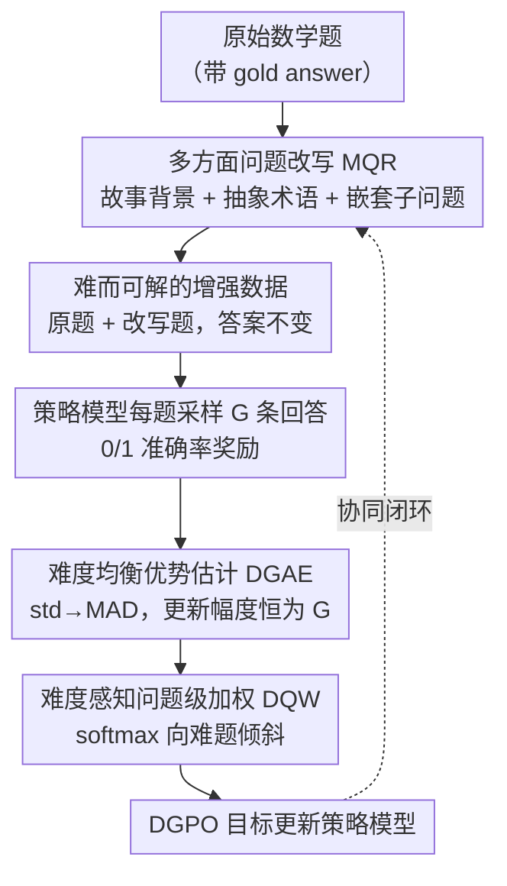

# Harder Is Better: Boosting Mathematical Reasoning via Difficulty-Aware GRPO and Multi-Aspect Question Reformulation

**会议**: ICLR 2026  
**arXiv**: [2601.20614](https://arxiv.org/abs/2601.20614)  
**代码**: [GitHub](https://github.com/AMAP-ML/MathForge)  
**领域**: LLM推理 / 强化学习  
**关键词**: GRPO, difficulty-aware, mathematical reasoning, RLVR, data augmentation

## 一句话总结

揭示GRPO的优势函数（std归一化）导致更新幅度在中等难度题目处最大、对难题和易题均隐式抑制的问题，提出MathForge框架——DGPO（用MAD替换std实现难度均衡 + softmax难度加权）+ MQR（添加故事背景/抽象术语/嵌套子问题三方面改写增加难度但保留原答案），在Qwen2.5-Math-7B上在6个数学推理benchmark上平均超GRPO +4.56%。

## 研究背景与动机

**领域现状**：RLVR（验证奖励强化学习）已成为提升LLM数学推理能力的主流范式（DeepSeek-R1等），GRPO是其中最具代表性的算法——通过组内相对优势估计替代价值网络。

**现有痛点**：

1. **算法层面**：GRPO的优势函数 $\hat{A}_{GR,i} = \frac{r_i - \text{mean}}{\text{std}}$ 使用标准差归一化，导致更新幅度 $\sum|A|$ 与准确率 $p$ 的关系为 $2G\sqrt{p(1-p)}$——在 $p=0.5$ 时最大，而在 $p$ 接近0或1时衰减。这意味着更难的题目（$p$ 小但非零）的更新幅度小于中等难度题目

2. **数据层面**：现有RLVR数据增强（如Liang et al. 2025）主要做题目改述提升多样性，未系统性增加题目难度。缺乏挑战性的训练数据限制了模型推理能力的上界

**核心矛盾**：难但可解的题目是最理想的训练材料（暴露模型弱点且有正确答案可学），但GRPO恰恰在这类题目上更新幅度最小。

**本文切入角度**：在算法端和数据端同时解决"忽视难题"问题——DGPO修正GRPO的内在失衡并加权难题，MQR生成更难的训练题目。

## 方法详解

### 整体框架

MathForge 把"忽视难题"这一问题拆到数据端和算法端各打一拳。数据端的 MQR（多方面问题改写）用大推理模型把原始题目改写得更难、但严格保留原答案，扩展出一批"难而可解"的增强数据；算法端的 DGPO（难度感知组策略优化）先修正 GRPO 在不同难度上更新幅度失衡的内在缺陷，再主动给难题加权，从这批数据里高效学习。两者形成闭环——MQR 推前难度前沿，DGPO 负责把前沿吃透。整条流水线如下：原始题目经 MQR 改写得到增强数据，策略模型对每题采样一组回答并打 0/1 准确率奖励，再依次经 DGAE 把更新幅度从难度上解耦、DQW 向难题加权，最后用 DGPO 目标更新策略。

### 关键设计

**1. MQR 多方面问题改写：在不改答案的前提下系统性升级难度**

现有数据增强多在做题面改述、只提升多样性，难度并没真正提上去。MQR 改用大推理模型（默认 OpenAI o3，开源小模型也能胜任）从三个正交维度给原题加难：**添加故事背景**塞入叙事噪声，逼模型从无关情节里抠出关键数学量；**引入抽象术语**把具体概念抽象化，考察对抽象数学对象的理解；**嵌套子问题**增加推理步数与跨领域知识需求——三者分别对应"在噪声中识别关键信息""把握抽象概念""多步且跨域推理"三种能力。所有改写都被硬约束为保留原始 gold answer，于是 MQR 既维持了题目的数学逻辑，又省掉了重新求解验证答案的开销：增强数据天然带标签、与原题数学等价，和原题拼在一起就是 DGPO 的训练料。

**2. 难度均衡优势估计（DGAE）：把更新幅度从难度上解耦**

问题的根源在 GRPO 的优势函数 $\hat{A}_{GR,i} = (r_i - \text{mean})/\text{std}$ 用标准差归一化，本文定理 1 推出单题总更新幅度 $\sum|\hat{A}_{GR,i}| = 2G\sqrt{p(1-p)}$ 随准确率 $p$ 呈钟形——中等难度（$p=0.5$）更新最猛，越难（$p$ 越小）或越易反而越被压。DGAE 只做一处替换：把标准差换成均值绝对偏差（mean absolute deviation, MAD）$\text{MAD} = \frac{1}{G}\sum|r_i - \text{mean}|$，得到

$$\hat{A}_{DG,i} = \frac{r_i - \text{mean}(\{r_i\})}{\text{MAD}(\{r_i\})}$$

定理 2 证明这样一来单题总更新幅度恒等于组大小 $G$，是与难度无关的常数，钟形偏差被彻底抹平；而且推导不依赖二值奖励假设，对一般奖励分布同样成立。

**3. 难度感知问题级加权（DQW）：在均衡之上再向难题倾斜**

DGAE 只是把所有题拉到同一起跑线，要进一步突出难题还得显式加权。DQW 以组内平均奖励的相反数 $D_s = -\text{mean}(\{r_{si}\})$ 作为难度度量（答得越差越难），再用 softmax 算出每题权重 $\lambda_s = B_v \cdot \frac{\exp(D_s/T)}{\sum \exp(D_s/T)}$，温度取 $T=2.0$，这个值能把一个 batch 内最大/最小权重比压在 $e^{0.5} \approx 1.65$ 以内——既给难题加码又不至于让易题梯度被饿死。"先均衡再加权"的两步顺序是关键：直接在未均衡的 GRPO 上做难度加权（如 GRPO-AD）底层钟形偏差还在，效果有限。

### 损失函数 / 训练策略

把 DGAE 的优势、DQW 的权重和有效 token 级平均拼到一起，就是 DGPO 的完整目标：

$$\mathcal{J}_{DGPO}(\theta) = \frac{1}{\sum_{s=1}^{B_v}\sum_{i=1}^{G}|o_{si}|}\sum_{s=1}^{B_v}\lambda_s\sum_{i=1}^{G}\sum_{t=1}^{|o_{si}|}\min[I_{sit}\hat{A}_{DG,si}, \text{clip}(I_{sit}, 1-\varepsilon, 1+\varepsilon)\hat{A}_{DG,si}]$$

外层归一化只在有效查询（既非全对也非全错的 $B_v$ 个 query）上做 token 级平均，避免无信息样本把梯度搅乱。训练用纯准确率奖励 $r \in \{0,1\}$、不加 KL 散度，基于 Open-R1 代码库在 8×NVIDIA H20 GPU 上完成。

## 实验关键数据

### 主实验

Qwen2.5-Math-7B在MATH数据集训练，6个benchmark平均表现：

| 方法 | AIME24 | AIME25 | AMC23 | MATH500 | Minerva | Olympiad | Avg. | $\Delta_{GRPO}$ |
|------|--------|--------|-------|---------|---------|----------|------|----------------|
| Base | 12.19 | 4.79 | 35.23 | 48.60 | 15.07 | 16.33 | 22.04 | - |
| GRPO | 20.94 | 8.44 | 58.98 | 72.20 | 27.76 | 37.33 | 37.61 | - |
| Dr.GRPO | 21.04 | 8.23 | 58.59 | 72.05 | 28.58 | 35.89 | 37.40 | -0.21 |
| DAPO | 21.25 | 8.75 | 58.20 | 72.70 | 29.50 | 37.22 | 37.94 | +0.33 |
| GRPO-AD | 21.56 | 9.48 | 59.06 | 73.25 | 29.14 | 37.07 | 38.26 | +0.65 |
| DGPO | 23.85 | 10.21 | 61.02 | 74.25 | 31.07 | 38.33 | 39.79 | **+2.18** |
| MQR | 25.00 | 11.77 | 59.38 | 77.85 | 31.43 | 40.81 | 41.04 | +3.43 |
| **MathForge** | 24.58 | 12.60 | 59.84 | 79.95 | 33.36 | 42.67 | **42.17** | **+4.56** |

### 消融实验

DGPO组件消融（Qwen2.5-Math-7B）：

| 设置 | Avg. | $\Delta_{GRPO}$ |
|------|------|----------------|
| GRPO | 37.61 | - |
| +有效token平均 | 37.71 | +0.10 |
| +DGAE | 38.65 | +1.04 |
| +DGAE+DQW (full DGPO) | 39.79 | +2.18 |

DQW温度敏感性：$T=1.0$ → 39.03, $T=2.0$ → **39.79**, $T=5.0$ → 39.53, $T=10.0$ → 39.27

跨模型泛化（均超GRPO）：Qwen2.5-Math-1.5B +4.45, Qwen2.5-3B +3.54, DeepSeek-Math-7B +2.86

### 关键发现

- DGAE和DQW分别贡献+0.94%和+1.14%，两者互补
- MathForge在所有测试模型（4种）上均一致性超过GRPO，证明模型无关性
- DGPO可与其他方法叠加：+GPG→+0.99, +DAPO→+1.97, +GSPO→+1.61
- DGPO训练的模型输出更简洁（Fig. 1b），说明学会了更高效的推理路径

## 亮点与洞察

- 理论贡献扎实：定理1/2严格证明了GRPO更新幅度的钟形偏差和DGAE的常数均衡，数学推导清晰
- "先均衡再加权"的两步设计（DGAE→DQW）比直接在GRPO上做难度加权（如GRPO-AD）更有效
- MQR的"保留答案"约束是关键设计：既增加难度又免去答案重生成，大幅降低数据增强成本
- DGPO+MQR的协同效应（42.17 > 39.79 + 41.04 - 37.61），而非简单加和

## 局限与展望

- MQR依赖大推理模型（o3）作为改写器，增加数据增强成本
- 仅在数学推理领域验证，未测试代码生成/逻辑推理等其他推理任务
- DQW的温度超参数需要调优（虽然$T=2.0$在所有实验中表现稳健）
- MAD归一化在奖励分布对称时等价于std归一化，理论优势在非二值奖励下更显著但未充分验证

## 相关工作与启发

- **vs GRPO**：GRPO的std归一化导致钟形更新偏差，DGPO用MAD实现常数更新幅度——这是一个简单但有效的修正
- **vs GRPO-AD (Zhang & Zuo 2025)**：GRPO-AD在GRPO基础上做难度加权但未修正底层失衡，效果有限（+0.65 vs DGPO +2.18）
- **vs DAPO/GPG**：这些方法关注采样和KL散度等方面，与DGPO正交且可叠加
- **数据增强启发**：MQR的"保留答案约束"是一个实用的设计原则——确保增强数据的数学等价性

## 评分

- 新颖性: ⭐⭐⭐⭐ 理论洞察（定理1/2）深刻，MAD替换std的修正虽简单但有理论支撑
- 实验充分度: ⭐⭐⭐⭐⭐ 6个benchmark×4个模型×多组消融+动态分析+叠加实验
- 写作质量: ⭐⭐⭐⭐ 理论与实验结合紧密，消融全面
- 价值: ⭐⭐⭐⭐ 对RLVR训练的通用优化，DGPO可直接叠加到现有管线中

<!-- RELATED:START -->

## 相关论文

- [\[ACL 2026\] GanitLLM: Difficulty-Aware Bengali Mathematical Reasoning through Curriculum-GRPO](../../ACL2026/llm_reasoning/ganitllm_difficulty-aware_bengali_mathematical_reasoning_through_curriculum-grpo.md)
- [\[ICLR 2026\] THOR: Tool-Integrated Hierarchical Optimization via RL for Mathematical Reasoning](thor_tool-integrated_hierarchical_optimization_via_rl_for_mathematical_reasoning.md)
- [\[ICLR 2026\] Scaf-GRPO: Scaffolded Group Relative Policy Optimization for Enhancing LLM Reasoning](scaf-grpo_scaffolded_group_relative_policy_optimization_for_enhancing_llm_reason.md)
- [\[ICLR 2026\] DAG-Math: Graph-of-Thought Guided Mathematical Reasoning in LLMs](dag-math_graph-of-thought_guided_mathematical_reasoning_in_llms.md)
- [\[ICLR 2026\] MathFimer: Enhancing Mathematical Reasoning by Expanding Reasoning Steps through Fill-in-the-Middle Task](mathfimer_enhancing_mathematical_reasoning_by_expanding_reasoning_steps_through_.md)

<!-- RELATED:END -->
