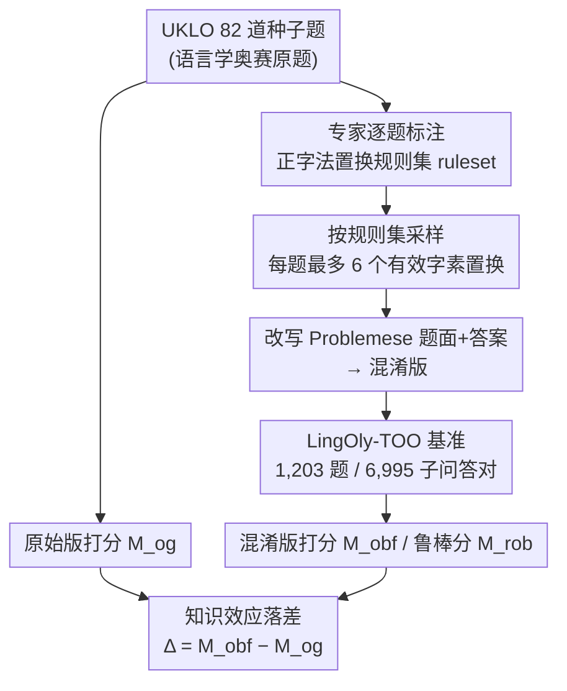

# LingOly-TOO: Disentangling Reasoning from Knowledge with Templatised Orthographic Obfuscation

**会议**: ICLR 2026  
**arXiv**: [2503.02972](https://arxiv.org/abs/2503.02972)  
**代码**: [GitHub](https://github.com/jkhouja/LingOly-TOO)  
**领域**: LLM推理 / 评测基准  
**关键词**: reasoning benchmark, orthographic obfuscation, linguistics olympiad, knowledge contamination, LLM evaluation

## 一句话总结

提出LingOly-TOO基准，通过专家设计的正字法置换（grapheme-level permutation）对语言学奥赛题进行混淆，保留推理逻辑但消除知识/记忆捷径，将15个前沿模型的最高分从0.59降至0.48，系统量化了LLM推理能力被知识效应高估的程度。

## 研究背景与动机

**领域现状**：LLM在各类推理基准上的分数快速上升，但越来越多证据表明分数膨胀源于训练集污染和知识记忆捷径，而非真正的推理能力提升。MATH/GSM8K等基准迅速饱和。

**现有痛点**：

1. 训练数据规模增大使训练/测试集边界模糊，评测偏差加剧

2. 现有应对手段（合成数据、符号模板置换）规模小且修改幅度不够——修改后仍可能与训练样本相似

3. 即使低资源语言的语言学题目也在预训练数据中被覆盖，模型可通过部分污染绕过推理

**核心矛盾**：如何在保留解题推理逻辑不变的前提下，彻底消除模型利用知识和记忆的可能性？

**本文切入角度**：对语言学奥赛题的"题目语言"（Problemese）进行grapheme级正字法置换，使置换后的字符序列在任何训练语料中都不存在，但题目本身的推理步骤完全保留。

## 方法详解

### 整体框架

LingOly-TOO 不训练任何模型，它的"方法"是一条**抗污染基准的构造-评估流水线**。起点是 UKLO（英国语言学奥赛）的 82 道种子题——这类题高中生不靠任何专业知识、仅凭题目里给的语料就能推理解出。研究者请语言学专家为每道题手工标注一套**正字法置换规则集**（ruleset），据此采样最多 6 个互不相同的字素级置换、改写题面文字，把 82 道题扩展成 1,203 道问题、6,995 个子问题-答案对。评估时对**原始版**和**混淆版**分别打分，再用两者的落差来读出：模型究竟有多少分是靠记忆/知识捷径拿的、而非真正的推理。

### 关键设计

**1. 推理等变置换：改字符序列但不改解题逻辑**

种子题虽含低资源语言，但这些语言正越来越多地进入预训练语料，模型可以靠记忆而非推理蒙对——这正是落差测量要堵的漏洞。难点在于，任何对题面的改动都不能破坏解题所需的语言学机制，否则混淆后的题要么无解、要么换成了另一道题。本文把置换的最小单位下沉到 grapheme（字素，含 `th`/`sh` 这类字母组合）而非整词：语言学奥赛题本身就是子词级的符号推理，常见的同义词替换、改写、换词都会破坏形态/音位单元而使题失效，字素级置换则既能彻底改变字符序列、又不动推理结构。每道题的规则由专家按其语言学考点定制——例如土耳其语的元音和谐题，元音对 (e,i)/(o,u)/(ö,ü)/(a,ı) 必须保持组内配对替换，否则后缀变形规律就对不上、题目失去可解性。规则还刻意保留借词、英语同源词、人名地名等对解题有用的线索，同时移除语言名称、语系、地理位置这类只会触发模型知识检索的元数据。置换后的字符序列在任何训练语料里都不可能出现，模型无法靠记忆命中，却仍要走完原题的全部推理步骤——可解性由团队语言学专家及两名国际语言学奥赛（IOL）奖牌得主审计确认。

**2. 多版本度量体系：把"知识效应"做成可量化指标**

一题多版本的好处是能从分数分布里读出推理的稳定性，而不只是看单次对错。混淆分对所有题、每题所有版本取平均

$$M_{obf} = \frac{1}{82}\sum_{i=1}^{82}\frac{1}{n_i}\sum_{j=1}^{n_i}M_{obf}^{i,j}$$

与原始分 $M_{og}$ 对照。在此之上再加两个指标：鲁棒分 $M_{rob}$ 取每题所有置换里**最差**的那个版本再平均，刻画最坏情况下的推理能力（GPT-5 的 $M_{obf}=0.48$ 而 $M_{rob}$ 仅 0.29，说明它在某些置换上会崩）；知识效应 $\Delta_{obf}^{i} = M_{obf}^i - M_{og}^i$ 直接度量单题掉分，负值越大说明该题越依赖知识。为佐证落差来自知识依赖而非"改难了"，172 人的随机对照试验显示人类在混淆版上仅下降 5.7%，远低于模型 11% 以上的掉幅。

### 评估协议

作为评测基准，方法的另一半在于打分怎么算才公平：每次 prompt 把背景、上下文、全部问题与当前子问题一并给出，要求模型以 JSON 输出答案；评分采用严格的 Exact Match 而非部分分，以防模型靠复述上下文里的词蒙到虚假分数。最终在 GPT-5、Claude 3.7、o3-mini、Gemini、Llama 等 15 个推理与通用模型上统一施测。

## 实验关键数据

### 主实验

15个模型在LingOly-TOO上的表现：

| 模型 | $M_{og}$（原始） | $M_{obf}$（混淆） | $M_{rob}$（鲁棒） | 下降幅度 |
|------|-----------------|-------------------|------------------|---------|
| GPT-5 | ~0.59 | **0.48** | 0.29 | -0.11 |
| Claude 3.7 (thinking) | ~0.55 | 0.44 | - | -0.11 |
| Claude 3.7 (no thinking) | ~0.40 | 0.30 | - | -0.10 |
| o3-mini (high) | ~0.45 | 0.31 | - | -0.14 |
| o3-mini (low) | ~0.25 | 0.13 | - | -0.12 |

GPT-5按难度（$M_{obf}$）：Breakthrough=0.81, Round 2=0.31

### 消融实验

| 分析维度 | 结果 |
|---------|------|
| 无上下文设置 | $M_{obf}$降至0.02-0.03，混淆有效阻断知识捷径 |
| Tokenization影响 | 改变分词策略不改善性能，排除tokenization解释 |
| 语言资源量效应 | 日语/芬兰语/意大利语$\Delta_{obf}$最大（-0.57~-0.59） |
| 专家引导推理 | 提供中间推理步骤后$M_{obf}$从0.66升至0.76 |
| 未公开新题测试 | UKLO 2025未发布题同样出现性能下降 |

### 关键发现

- 推理模型始终优于对应通用版本（o3-mini high vs low差18%），推理训练有实际效果
- 知识效应与语言资源量高度负相关（$\beta < 0, p < 0.01$，高资源语言膨胀最严重）
- 基准远未饱和：GPT-5在Round 2仅0.31，$M_{rob}$仅0.29
- 推理轨迹中常见重复分析、自相矛盾结论，推理一致性极差

## 亮点与洞察

- 正字法置换方法论优雅：grapheme级置换保留语言学推理逻辑，同时产生训练语料中不可能出现的字符序列
- 知识效应量化方法 $\Delta_{obf}$ 首次提供从知识中分离推理能力的可操作方案
- 人类RCT验证混淆仅造成5.7%下降而模型下降11%+，性能差主要因知识依赖而非认知惩罚
- $M_{rob}$揭示推理脆弱性：GPT-5从0.48降到0.29

## 局限与展望

- 严格Exact Match可能低估部分正确推理——但部分分数会虚假膨胀基线
- 仅覆盖自然语言模态的归纳/演绎推理，不涉及视觉或数学
- 82道基础题规模有限，置换规则需专家手工设计，自动化程度低
- 未探索更大范围的语言学现象或更多竞赛来源

## 相关工作与启发

- **vs LingOly**：LingOly-TOO增加正字法混淆以控制知识变量
- **vs GSM-Symbolic**：数值替换扰动幅度小；LingOly-TOO的grapheme置换产生完全全新字符序列
- **vs ARC/BIG-Bench Hard**：缺乏控制知识效应的机制
- **启发**：方法论可推广到其他需要符号推理的领域（音乐、密码学等）

## 评分

- 新颖性: ⭐⭐⭐⭐ 正字法混淆+知识/推理解耦设计精妙
- 实验充分度: ⭐⭐⭐⭐ 15模型+多维消融+人类RCT+未公开题验证
- 写作质量: ⭐⭐⭐⭐ 结构严谨，分析全面
- 价值: ⭐⭐⭐⭐⭐ 为LLM推理评测提供里程碑式的抗污染方法论

<!-- RELATED:START -->

## 相关论文

- [\[ACL 2025\] Commonsense Abductive Reasoning using Knowledge from Multiple Sources](../../ACL2025/llm_reasoning/commonsense_abductive_reasoning_using_knowledge_from_multiple_sources.md)
- [\[ACL 2026\] Learning to Edit Knowledge via Instruction-based Chain-of-Thought Prompting](../../ACL2026/llm_reasoning/learning_to_edit_knowledge_via_instruction-based_chain-of-thought_prompting.md)
- [\[ACL 2026\] Does Self-Consistency Improve the Recall of Encyclopedic Knowledge?](../../ACL2026/llm_reasoning/does_self-consistency_improve_the_recall_of_encyclopedic_knowledge.md)
- [\[ACL 2025\] Complex Reasoning with Natural Language Contexts and Background Knowledge](../../ACL2025/llm_reasoning/complex_reasoning_with_natural_language_contexts_and_background_knowledge.md)
- [\[AAAI 2026\] ActiShade: Activating Overshadowed Knowledge to Guide Multi-Hop Reasoning in Large Language Models](../../AAAI2026/llm_reasoning/actishade_activating_overshadowed_knowledge_to_guide_multi-h.md)

<!-- RELATED:END -->
