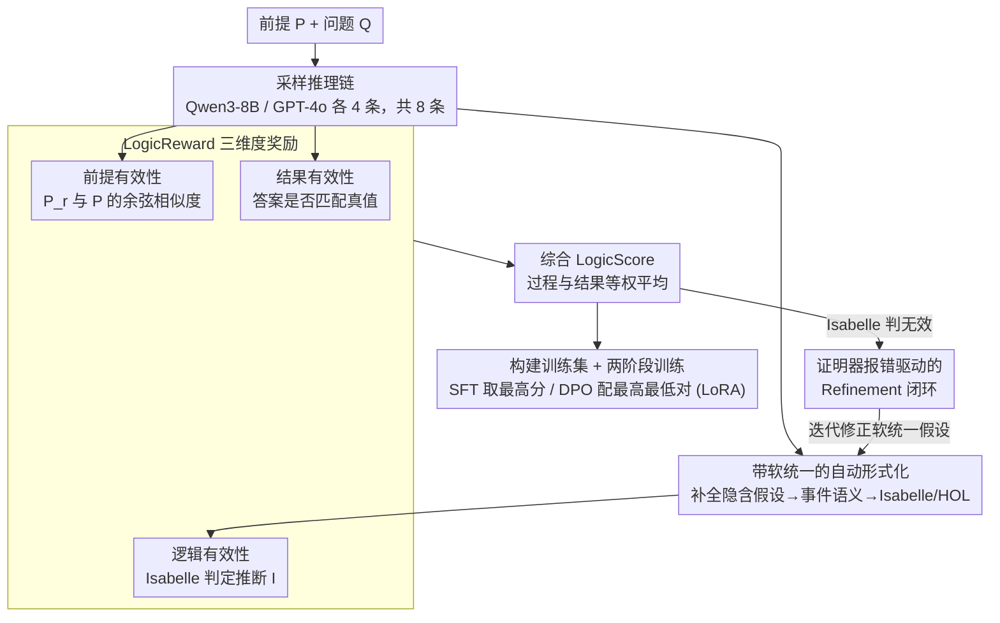

# LogicReward: Incentivizing LLM Reasoning via Step-Wise Logical Supervision

**会议**: ICLR2026  
**arXiv**: [2512.18196](https://arxiv.org/abs/2512.18196)  
**代码**: [项目主页](https://llm-symbol.github.io/LogicReward)  
**领域**: LLM推理  
**关键词**: 逻辑推理, 定理证明器, 步骤级奖励, 自动形式化, 软统一  

## 一句话总结
提出LogicReward奖励函数，用Isabelle定理证明器做步骤级逻辑正确性验证，结合Autoformalization with Soft Unification减少自然语言歧义，训练出的8B模型在NLI和逻辑推理任务上超越GPT-4o 11.6%和o4-mini 2%。

## 背景与动机
1. 现有训练方法主要依赖结果反馈(outcome-based)，可能产生推理错误但答案正确的情况
2. 过程级监督(PRM等)仍缺乏逻辑正确性的形式化保证
3. 概率性反馈(token概率/学习的奖励模型)本质上非确定性，无法可靠检测逻辑错误
4. 符号验证方法目前主要限于结构化领域(数学/编程)，NLI领域缺失
5. 自然语言歧义性和隐含假设使形式化验证困难(如Dad≠Father但语义等同)
6. 高风险场景(医疗/法律)需要严格的逻辑一致性保证

## 方法详解

### 整体框架
LogicReward 不直接训练模型，而是先用定理证明器把"逻辑正确性"做成一条可验证的**数据构造流水线**，再拿构造好的高质量数据去微调。给定前提 $P$ 与问题 $Q$，方法先从 LLM 采样一批推理链（每题 8 条），对每条链做"带软统一的自动形式化"把自然语言翻成 Isabelle 能读的逻辑，然后从前提、逻辑、结果三个维度打分汇总成 LogicScore；被证明器判无效的步骤会进入一个报错驱动的修正闭环被救回；最后用每题分数最高/最低的响应去做 SFT 和 DPO。核心难点在于自然语言推理充满歧义和隐含假设，直接形式化几乎必然失败，所以流水线的重头戏是让定理证明器"看得懂"自然语言。

### 关键设计

**1. LogicReward 三维度奖励：把一步推理拆成可判定的逻辑命题**

结果级反馈无法分辨"答案对但推理错"，而概率性的过程奖励（token 概率、学习的奖励模型）本质非确定，检测不出逻辑谬误。LogicReward 把每个推理步骤 $s_i$ 显式拆成 $(P_r, I)$——引用的前提 $P_r$ 与得出的推断 $I$——并从三个维度打分。前提有效性（Premise Validity）检查 $P_r$ 是否真的出自给定前提 $P$：把 $P_r$ 拆成句子 $\{q_1,\dots,q_m\}$，每个 $q_j$ 对给定前提取最大余弦相似度，再求平均作为该步分数，防止模型凭空捏造前提。逻辑有效性（Logic Validity）是核心，用 Isabelle 验证 $I$ 能否由 $P_r$ 推出：语法正确且逻辑成立记 1，语法正确但逻辑错误记 0，若形式化语法本身出错就退回 token 置信度 $\text{Conf}(I) = \frac{1}{|I|}\sum_{t \in I}\text{token\_prob}(t)$，保证奖励始终有值。结果有效性（Outcome Validity）则是最终答案是否匹配真值（ground truth）的二值判定。前两者按步求平均合成 ReasoningValidity，再与结果有效性等权汇总成 LogicScore——这样"过程逻辑"和"最终结果"各有独立信号，确定性的 Isabelle 判定补上了概率方法测不出的逻辑漏洞。

**2. 带软统一的自动形式化：让定理证明器读懂有歧义的自然语言**

逻辑有效性那一步要把推理步骤喂进 Isabelle，但自然语言里"Dad"和"Father"语义等同却字面不同，隐含的常识假设也大量省略，把这种句子硬塞进 Isabelle 几乎都会判失败——这正是符号验证一直困在数学/编程等结构化领域、进不了自然语言推理的根本原因。软统一（Soft Unification）的做法是提示 LLM 在每个推理步骤里主动补全那些"有效但没明说"的假设（同义词映射、常识桥接等）以减少歧义，再依照 neo-Davidsonian 事件语义把整步解析成结构化形式，转成 Isabelle/HOL 理论送去验证。等于在自然语言和形式逻辑之间塞了一层语义对齐，把原本会因表层差异被误判为"逻辑错误"的步骤救回来，显著抬高形式化成功率。

**3. 基于证明器报错的 Refinement 闭环：把验证失败变成可改正的反馈**

即便有软统一，仍有步骤被 Isabelle 判无效——作者随机抽 300 条分析，发现一类确实逻辑有误，另一类是软统一后仍漏了某个隐含假设而被误判。直接丢弃会损失大量数据，于是方法把 Isabelle 返回的错误信息再喂回 LLM，提示它据此迭代修正软统一的假设，直到逻辑通过或触达最大迭代次数。每题随机挑两条响应做这种 refine，修正后重新打分，得到的数据记为 $D_{\text{refined}}$。证明器不再只是打分裁判，而成了能指出"哪里错、怎么改"的闭环教师，被救回的样本进一步充实训练集。

### 损失函数 / 训练策略
数据侧从 8 个 NLI/逻辑推理数据集采约 6000 实例，用 Qwen3-8B 和 GPT-4o 各生成 4 条响应(每题 8 条)，统一格式为 "Step 1: …; Step 2: …; Answer: A"。综合奖励取过程与结果的等权平均 $\text{LogicScore}(r,A) = \text{avg}\big(w_1 \cdot \text{ReasoningValidity}(r),\, w_2 \cdot \text{OutcomeValidity}(A)\big)$，其中 $w_1=w_2=0.5$。训练集 $D_{\text{final}} = D_r \cup D_{\text{refined}}$ 合并原始与 refine 数据。两阶段训练：SFT 取每题 LogicScore 最高的响应作目标，DPO 则把最高/最低 LogicScore 响应配成偏好对；基座为 Llama3.1-8B 与 Qwen3-8B，全程 LoRA 微调。

## 实验关键数据

| 模型 | M-LogiEval | FOLIO | ProverQA | LogiQA | 8任务平均 |
|------|-----------|-------|----------|--------|----------|
| GPT-4o | 68.0 | 63.5 | 78.4 | 69.3 | 73.9 |
| o4-mini | 82.0 | 80.8 | 78.8 | 65.7 | 83.5 |
| DeepSeek-R1-8B | 64.8 | 57.3 | 59.2 | 53.2 | 68.6 |
| **LogicReward-Qwen3-8B** | **82.0** | **79.5** | **81.2** | **72.3** | **85.5** |

### 奖励系统对比

| 奖励函数 | M-LogiEval | ProntoQA | ProverQA | QASC | 8任务平均 |
|---------|:----:|:----:|:----:|:----:|:----:|
| Confidence(平均token概率) | 76.9 | 81.0 | 52.3 | 89.8 | 64.3 |
| LLM-as-Judge(GPT-4o) | 65.8 | 84.6 | 47.5 | 95.3 | 60.2 |
| PRM(Nemotron-70B) | 66.7 | 90.6 | 62.1 | 97.0 | 66.0 |
| **LogicReward** | **79.0** | **90.3** | **60.1** | **97.8** | **71.4** |

**泛化能力**：在未见过的任务上测试——CommonsenseQA和GSM8K分别提升8.2%和4.5%，证明逻辑正确性奖励提升的理性能力可迁移。

**无标签场景**：仅用ReasoningValidity(不依ground truth)作奖励仍有效，平均提升+5.8%，说明推理過程的逻辑质量本身就是有价值的监督信号。

## 亮点与洞察
- 首次将定理证明器引入NLI领域的步骤级奖励——跨越了符号验证从结构化→非结构化的鸿沟
- Soft Unification巧妙处理自然语言歧义，是让定理证明器在NL推理中可用的关键
- 8B模型超越o4-mini——证明逻辑正确的训练数据比模型规模更重要
- 无标签场景下仍有效——ReasoningValidity本身就是有价值的信号
- Refinement机制利用Isabelle错误信息迭代改进，闭环设计

## 局限与展望
- Isabelle形式化失败时退回token概率，失去了形式化保证
- 仅在NLI/逻辑推理任务上训练和主评估，数学/常识仅作泛化验证
- Soft Unification依赖LLM的能力，可能引入新的错误
- 训练数据仅~6000实例，扩展性待验证
- 形式化流水线成本高(需要Isabelle运行环境+多次LLM调用)
- $w_1=w_2=0.5$为简单等权，未探索最优权重

## 与相关工作的对比
- vs PRM(Lightman等): LogicReward提供确定性逻辑保证而非概率评估
- vs LINC/Logic-LM: 这些方法在推理时用prover，LogicReward在训练时用prover构建奖励
- vs DeepSeek-R1: 仅用outcome reward激励长推理，LogicReward额外监督推理过程的逻辑有效性
- vs SymbCoT/Aristotle: 让LLM扮演symbolic prover，LogicReward使用实际定理证明器

## 评分
- 新颖性: ⭐⭐⭐⭐⭐ (定理证明器+NLI训练奖励的首次结合)
- 实验充分度: ⭐⭐⭐⭐ (8 benchmark+多基线+泛化+无标签实验)
- 写作质量: ⭐⭐⭐⭐ (方法描述清晰，公式完整)
- 价值: ⭐⭐⭐⭐⭐ (8B超o4-mini，实用性和理论意义兼具)

<!-- RELATED:START -->

## 相关论文

- [\[ACL 2026\] Logical Phase Transitions: Understanding Collapse in LLM Logical Reasoning](../../ACL2026/llm_reasoning/logical_phase_transitions_understanding_collapse_in_llm_logical_reasoning.md)
- [\[ACL 2026\] Discovering a Shared Logical Subspace: Steering LLM Logical Reasoning via Alignment of Natural-Language and Symbolic Views](../../ACL2026/llm_reasoning/discovering_a_shared_logical_subspace_steering_llm_logical_reasoning_via_alignme.md)
- [\[ACL 2026\] Distilling Long-CoT Reasoning through Collaborative Step-wise Multi-Teacher Decoding (CoRD)](../../ACL2026/llm_reasoning/distilling_long-cot_reasoning_through_collaborative_step-wise_multi-teacher_deco.md)
- [\[ICLR 2026\] Agentified Assessment of Logical Reasoning Agents](agentified_assessment_of_logical_reasoning_agents.md)
- [\[ICLR 2026\] ActivationReasoning: Logical Reasoning in Latent Activation Spaces](activationreasoning_logical_reasoning_in_latent_activation_spaces.md)

<!-- RELATED:END -->
