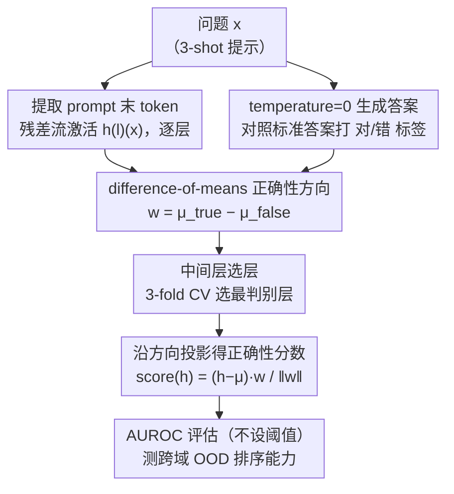

# No Answer Needed: Predicting LLM Answer Accuracy from Question-Only Linear Probes

**会议**: ICLR 2026  
**arXiv**: [2509.10625](https://arxiv.org/abs/2509.10625)  
**代码**: [ivanvmoreno/correctness-model-internals](https://github.com/ivanvmoreno/correctness-model-internals)  
**领域**: LLM推理  
**关键词**: 线性探针, 正确性方向, LLM内部表征, 自我评估, 线性表征假说, 置信度

## 一句话总结

在 LLM 生成答案之前，仅从问题处理后的残差流激活中训练线性探针（difference-of-means），即可预测模型即将生成的答案是否正确。该"提前正确性方向"在 TriviaQA 上训练后可跨域泛化到多个事实知识数据集（AUROC 0.68-0.88），但无法泛化到数学推理（GSM8K），揭示了"事实正确性"与"推理正确性"在模型内部表征中的结构性分离。

## 研究背景与动机

### 线性表征假说（Linear Representation Hypothesis）

已有研究表明 LLM 内部激活编码了超越输出可观察范围的信息：陈述真实性、欺骗行为、幻觉等都可通过线性探针检测。本文将这一思路扩展到**自我正确性预测**——模型是否"知道"自己即将答对还是答错。

### 与现有工作的关键区别

**预生成而非后验**：在任何 token 生成之前就进行预测，不需要完整答案

**自由格式问答**：不限于选择题，适用于开放式问答

**简单线性探针**：使用 difference-of-means 方向而非复杂非线性模型，旨在验证线性可分性

**跨域泛化**：核心目标不是最大化预测精度，而是验证正确性是否作为**统一的线性特征方向**存在

### 与置信度估计方法的对比

- Token-level logits、自我验证（asking model to state confidence）等方法依赖模型生成
- 外部 Assessor 使用模型无关的输入特征（如问题嵌入）
- 本文方法直接利用模型内部状态，介于两者之间

## 方法详解

### 整体框架

这篇论文想回答一件事：LLM 在读完问题、还没吐出任何 token 时，内部状态是不是已经"知道"自己即将答对还是答错。为此整套流程分三步走。第一步，把问题（统一用 3-shot 提示以减少格式错误）喂给模型，在 prompt 最后一个 token 处、逐层取出残差流激活 $h^{(l)}(x)$——这一刻答案尚未生成，所以后续预测先于答案本身发生。第二步，让模型以 temperature=0 生成答案，对照标准答案打上"对/错"二值标签。第三步，在这批"激活—标签"对上学一个线性方向，使分数 $f_w(h^{(l)}(x))$ 逼近正确性指示 $\mathbf{1}\{\text{Correct}(x, M(x))\}$。其中"激活取哪一层、方向怎么算、判别力怎么评估"分别由下面三个设计决定。

### 关键设计

**1. difference-of-means 正确性方向：用最朴素的线性算子验证线性可分性**

本文刻意不训练任何带参数的分类器（连 MLP 都不用），因为它要回答的不是"能预测多准"，而是"正确性是否作为一条统一的线性轴存在"。做法是把激活按答案对错分成两组、各取质心 $\mu_{\text{true}} = \frac{1}{|\mathcal{D}_{\text{correct}}|} \sum_{x} h^{(l)}(x)$ 与 $\mu_{\text{false}} = \frac{1}{|\mathcal{D}_{\text{incorrect}}|} \sum_{x} h^{(l)}(x)$，二者之差就是"正确性方向"：

$$w = \mu_{\text{true}} - \mu_{\text{false}}$$

任一激活的正确性分数是它沿该方向的投影 $\text{score}(h) = \frac{(h - \mu)^\top w}{\|w\|}$，其中 $\mu = \frac{1}{2}(\mu_{\text{false}} + \mu_{\text{true}})$ 是两质心中点。之所以用这么朴素的算子：若连无参数的均值差都能跨域分开对错，线性表征假说就得到了最干净的支持。训练只是一次 $d$ 维均值向量的计算，10k 条缓存激活上 CPU 不到 3 分钟，绝大部分算力其实花在采集激活而非训练探针。

**2. 中间层选层：把信号抽取稳定在最饱和的位置**

不同层编码的正确性信息强弱差别很大，取错层会让信号被淹没。作者在 TriviaQA 上专门留出 10,000 条样本做选层：小模型（<10B）每 2 层、大模型（>10B）每 4 层采一次激活，每个候选层做 3-fold 交叉验证看平均 AUROC。结果一致——早期层几乎无判别力，性能在网络中点附近饱和，最优层通常落在"中点到最后一层之间"，说明模型对"自己会不会答对"的判断是在计算中段才逐渐成形。选定该层后即固定，用于所有后续跨域评估，不再为每个数据集重选。（提问统一采用 3-shot 提示只为减少格式错误，作者验证具体示例选择对探针性能无显著影响。）

**3. AUROC 评估而非设阈值：让方法验证不退化成调参**

分数不过 sigmoid、也不挑判定阈值，而是直接用 AUROC 衡量它对"对/错"两类的排序能力。这样测的是方向本身的判别力：既绕开了不同模型、不同数据集间阈值不可比的问题，又让"线性可分到什么程度"成为一个无超参的客观量——和"验证而非优化"的整体取向保持一致。

## 实验关键数据

### 实验设置

- **6 个模型**：Llama 3.1 8B, Llama 3.3 70B Instruct, Qwen 2.5 7B, DeepSeek R1 Distill Qwen 32B, Mistral 7B v0.3, Ministral 8B
- **6 个数据集**：TriviaQA (60K), Cities (10K), Notable People (16K), Medals (9K), Math Operations (6K), GSM8K (8K)
- 所有数据集均为**开放式问答格式**，无选择题

### 主实验：跨域泛化 AUROC

所有方向在 TriviaQA 上训练，在各数据集上测试：

| 模型 | TriviaQA | N.People | Cities | Math Ops | Medals | GSM8K |
|------|----------|----------|--------|----------|--------|-------|
| Llama 3.1 8B — Assessor | 0.852 | 0.630 | 0.663 | 0.528 | 0.623 | 0.558 |
| Llama 3.1 8B — Verb.Conf | 0.502 | 0.499 | 0.500 | 0.623 | 0.500 | 0.540 |
| **Llama 3.1 8B — Direction** | 0.804 | **0.722** | **0.732** | **0.858** | **0.680** | 0.534 |
| Llama 3.3 70B — Assessor | 0.759 | 0.583 | 0.672 | 0.449 | 0.568 | 0.573 |
| **Llama 3.3 70B — Direction** | **0.826** | **0.708** | **0.880** | **0.835** | **0.770** | 0.499 |
| Qwen 2.5 7B — Assessor | 0.807 | 0.723 | 0.708 | 0.400 | 0.622 | 0.584 |
| **Qwen 2.5 7B — Direction** | 0.758 | **0.800** | **0.842** | **0.837** | 0.586 | 0.601 |
| Mistral 7B — Assessor | 0.846 | 0.673 | 0.710 | 0.493 | 0.638 | 0.559 |
| **Mistral 7B — Direction** | 0.796 | **0.760** | **0.880** | **0.782** | **0.645** | 0.579 |

核心观察：
- Direction 方法在几乎所有 OOD 数据集上超越 Assessor 和 Verbalized Confidence
- **GSM8K 上所有方法均趋近随机猜测**（~0.5）——事实正确性方向对数学推理无效
- 最大模型（70B）在 Medals 等难数据集上优势最大

### 样本效率分析

| 训练样本数 | 平均 AUROC |
|-----------|-----------|
| 160 | 已达鲁棒性能 |
| 2,560 | 匹配完整 48,540 样本 |
| 48,540（全部） | 仅极微提升 |

极高的样本效率为线性表征假说提供了强支持。较大模型需要更少样本即可收敛。

### 消融实验：跨数据集方向迁移

在不同数据集上训练方向并在其他数据集上测试：
- TriviaQA 方向的跨域泛化最强（因为其多样性避免了数据集特异模式）
- 小数据集方向有时可跨域迁移，但不一致
- 各数据集方向间的余弦相似度大多正交，少数例外（Cities 与 Notable People 较对齐，均与 TriviaQA 方向对齐）

### "I Don't Know" 行为分析

部分模型尽管被提示要求回答，仍产生 IDK 响应。这些响应**位于正确性方向的极负端**：

- IDK 响应的正确性分数 < 错误答案的分数 < 正确答案的分数

这表明正确性方向同时也是**置信度轴**：模型在内部状态极低置信时才选择拒绝回答。

### 极端值定性分析（Mistral 7B, Notable People）

| 类型 | 低分数 | 高分数 |
|------|--------|--------|
| 错误答案 | IDK 回复 / 偏差大 | 只差 1-2 年的近似错误 |
| 正确答案 | 不太知名的人物 | Charles Darwin (1809), Albert Einstein (1879) |

高置信正确答案对应极为知名的人物，直觉上完全一致。

### 关键发现

1. **线性可分性确认**：LLM 确实在中间层编码了**提前的正确性信号**
2. **事实 vs 推理的结构分离**：事实检索和算术推理可能依赖**不同的内部验证机制**
3. **规模效应**：70B 模型的正确性信号最强且最一致
4. **置信度-弃权对齐**：正确性方向与模型的自发弃权行为强相关

## 亮点与洞察

1. **极简方法的深刻发现**：仅用 difference-of-means（无可训练参数）就揭示了LLM 自我评估的内部机制
2. **线性表征假说的有力证据**：正确性确实以线性方向存在于激活空间中
3. **事实 vs 推理的二分法**：这是一个重要的负面结果——暗示单一的"知不知道"维度不够，需要区分不同类型的"知道"
4. **实用安全价值**：低成本的内部失败预警信号，可用于早期停止、回退机制或人机协同
5. **样本效率惊人**：160 个样本即可获得稳健的正确性方向

## 局限性

1. **二值正确性标签**：忽略了答案的模糊性和部分正确性
2. **线性探针可能低估预测力**：非线性分类器可能揭示更丰富的信号
3. **模型多样性有限**：6 个模型、仅 1 个 70B 模型，未覆盖 MoE 或闭源模型
4. **最优层选择基于单一数据集**（TriviaQA）：可能未捕获所有模型的全域最优
5. **温度为 0 的限制**：未考虑生成随机性带来的正确性不确定性

## 相关工作与启发

- **Burns et al. (2022)**：CCS 方法探测真实性方向，本文从真实性扩展到**自我正确性**
- **Burger et al. (2024)**：类似的 difference-of-means 方法用于陈述真实性，本文用于预生成阶段
- **Ferrando et al. (2025)**：用 SAE latent 区分正确/错误回答，但限于小 Gemma 模型
- **Kadavath et al. (2022)**：在老旧专有模型上测试过类似探针但未开源
- **启发**：可将正确性方向与其他内部信号（如推理链中间步骤的探针）结合，构建更全面的内部不确定性估计系统

## 评分

- **新颖性**: ⭐⭐⭐⭐ — 预生成阶段的正确性预测是重要且新颖的角度
- **技术深度**: ⭐⭐⭐ — 方法极简（有意为之），但缺乏更深入的理论解释
- **实验充分度**: ⭐⭐⭐⭐ — 6 模型 × 6 数据集，含多基线和定性分析
- **实用价值**: ⭐⭐⭐⭐ — 低成本失败预警具有直接部署价值
- **总体推荐**: ⭐⭐⭐⭐ — 简洁有力的发现，尤其是事实/推理正确性的分离具有深远意义

<!-- RELATED:START -->

## 相关论文

- [\[ICLR 2026\] Predicting LLM Reasoning Performance with Small Proxy Models](predicting_llm_reasoning_performance_with_small_proxy_models.md)
- [\[ICLR 2026\] Predicting LLM Reasoning Performance with Small Proxy Model](predicting_llm_reasoning_performance_with_small_proxy_model.md)
- [\[ACL 2025\] Is That Your Final Answer? Test-Time Scaling Improves Selective Question Answering](../../ACL2025/llm_reasoning/test_time_scaling_selective_qa.md)
- [\[ACL 2025\] CoT-based Synthesizer: Enhancing LLM Performance through Answer Synthesis](../../ACL2025/llm_reasoning/cot-based_synthesizer_enhancing_llm_performance_through_answer_synthesis.md)
- [\[ICLR 2026\] When Shallow Wins: Silent Failures and the Depth-Accuracy Paradox in Latent Reasoning](when_shallow_wins_silent_failures_and_the_depth-accuracy_paradox_in_latent_reaso.md)

<!-- RELATED:END -->
