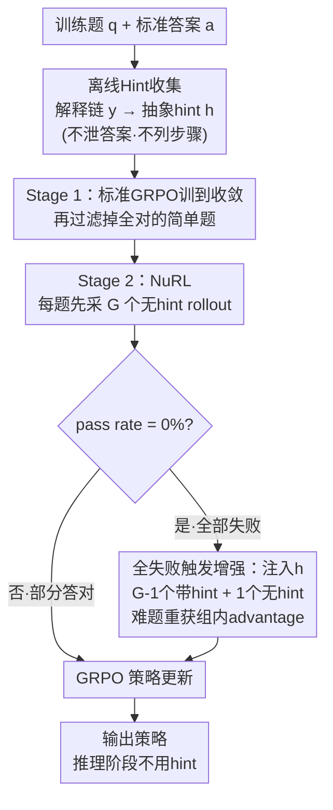

# Nudging the Boundaries of LLM Reasoning

**会议**: ICLR 2026  
**arXiv**: [2509.25666](https://arxiv.org/abs/2509.25666)  
**代码**: [GitHub](https://github.com/SalesforceAIResearch/NuRL)  
**领域**: LLM推理  
**关键词**: 强化学习推理, GRPO改进, 自生成Hint, 能力上界突破, 近侧发展区

## 一句话总结
指出GRPO无法从模型完全无法解决的难题(pass rate=0%)中学习的根本局限，提出NuRL方法在训练时对难题注入自生成的抽象hint(不泄露答案)使其变为可学习样本，跨3个模型6个benchmark一致超越GRPO并真正提升pass@k能力上界。

## 研究背景与动机
- **核心限制**: 在线RL(GRPO)对完全无法解出的难题(所有rollout都错)产生零梯度，模型无法从中学习
- **分布锐化假说**: 越来越多证据表明RL后训练主要做"分布锐化"——提高已知解法概率，而非发现新推理能力
- **pass@k不变**: 大k下的pass@k在RL训练后往往不变，说明能力上界未被突破
- **Zone of Proximal Development**: 类比Vygotsky的近侧发展区——难题在"学习区"但无指导就无法进入
- **难题的价值**: 这些"不可解"问题蕴含丰富学习信号——暴露模型的弱点
- **自给自足需求**: 需要无需外部强模型即可突破能力边界的方法

## 方法详解

### 整体框架
NuRL 在 GRPO 之上加一层"难题救援"机制：先离线为每道题用模型自己生成一条抽象 hint，训练时只要某道题的所有 rollout 全部失败（pass rate=0%）就把 hint 拼到题面上重新采样，让原本零梯度的难题重新产生可学习的对错差异。整条流程串成两阶段——Stage 1 用标准 GRPO 把简单题吃干净，Stage 2 才切到 NuRL 在能力边界处注入 hint。推理阶段完全不用 hint，它只在训练时充当临时脚手架。

### 关键设计

**1. 离线 Hint 收集：把"为什么对"蒸馏成不泄题的线索**

难题之所以零梯度，是因为模型对它一无所获；但每道题其实带着标准答案 $a$，问题只是模型不知道怎么用。NuRL 分两步榨取这份信息：先让旧策略在已知答案条件下生成一段"为什么这个答案正确"的解释链 $y = \pi_{old}(q, a; p_y)$，再让模型把这段解释提炼成一条高层 hint $h = \pi_\theta(q, a, y; p_h)$。关键约束是 hint 必须停留在抽象的知识线索层面（该用哪个定理、往哪个方向想），既不能包含最终答案也不能列出具体解题步骤——这样 hint 提供的是方向而非答案，模型仍需自己走完推理，从而保留真正的学习信号。整个过程只调用模型自身，无需任何外部强模型。

**2. 全失败触发的在线 Rollout 增强：只在真正卡死时注入脚手架**

GRPO 对每道题先采样 $\mathcal{G}$ 个无 hint 的 rollout，NuRL 只对其中 pass rate=0%（全部答错）的题动手——这个二值触发器保证 hint 只用在模型确实无法独立解出的难题上，不污染已会做的题。触发后把 hint 拼到题面末尾重新采样，但刻意只让 $\mathcal{G}-1$ 个 rollout 看到 hint、留 1 个仍是无 hint 的原始题。这一个"裸题"rollout 是为了避免 hint 太强导致全部答对、组内 advantage 又退化成零方差（$r_i$ 全为 1 时 $\hat{A}_{i,t}=0$，梯度照样消失）；混入一条大概率失败的轨迹，就能让带 hint 的成功样本获得正的相对优势，难题重新变得可学。

**3. Hint 抽象度的反直觉规律：给得越少，学得越好**

设计 1 之所以死守"只给方向、不泄答案"，是因为 NuRL 实测了四档 hint 信息量——抽象线索、部分步骤、完整解释、直接给答案——结论是抽象线索最佳、直接答案最差。原因是给答案或步骤会让模型走捷径照抄（reward hacking），它学到的是"复述 hint"而非"自己推理"；只给抽象方向则强迫模型补全中间推理，内化的才是可迁移的解题模式。这条规律与人类学习中"提示而非代劳"的直觉一致，也是 hint 必须刻意约束抽象度的根本原因。

### 训练策略
两阶段串联：Stage 1 先跑标准 GRPO，训练到训练奖励和验证准确率连续 10 步不再提升即视为收敛，把模型本就会做的简单题吃干净；进入 Stage 2 前先用 Stage 1 的 checkpoint 采 8 个 rollout、过滤掉全部答对的简单题，再切到 NuRL 继续训练。这样 hint 注入只发生在真正的能力边界处，算力集中在剩下的难题上，避免在简单题上做无用功。

## 实验关键数据

### 主实验

| 模型 | 方法 | MATH500 | MATH Hard | AIME | GPQA | Date | 平均 |
|------|------|:-------:|:---------:|:----:|:----:|:----:|:----:|
| Llama-3B | GRPO | 56.92 | 30.11 | 8.33 | 27.98 | 57.10 | 35.87 |
| Llama-3B | **NuRL(Self)** | **58.04** | **31.62** | **9.17** | **28.28** | **61.65** | **37.49** |
| OctoThinker-3B | GRPO | 68.81 | 41.29 | 8.33 | 23.26 | 69.85 | 42.63 |
| OctoThinker-3B | **NuRL(Self)** | **70.13** | **42.07** | **9.66** | **27.15** | **71.75** | **44.38** |

### 消融实验

| 配置 | MATH500 | GPQA | 说明 |
|------|:-------:|:----:|------|
| Hint从头训练 + 无触发器 | 53.41 | 24.84 | 最差 |
| Hint从头训练 + 仅全失败触发 | 56.06 | 27.63 | 触发器有帮助 |
| 两阶段 + 无触发器 | 53.09 | 26.62 | 两阶段也有帮助 |
| 两阶段 + 仅全失败触发(NuRL) | **58.04** | **28.28** | 最佳 |

### 关键发现
- NuRL提升pass@1024: GPQA从63.6%→69.7%，Date从86.4%→94.0%，而GRPO保持不变——能力上界被突破
- 教师hint(GPT-o4-mini)进一步提升至+3.44%，自生成hint即可有效
- NuRL+Self-Consistency提升9.4% vs GRPO+SC仅7.8%——互补性更强
- 可学习问题比例随训练从66%上升至70%，而标准GRPO维持在66%

## 亮点与洞察
- 清晰且深刻地揭示GRPO无法学习不可解问题的根本限制
- Vygotsky近侧发展区类比准确贴切，动机极具启发性
- "越抽象的hint越好"反直觉但有力——直接给答案反而最差(reward hacking)
- 自生成hint无需外部模型，避免分布偏移，自给自足
- 两阶段策略(先GRPO收敛再NuRL)简洁实用

## 局限与展望
- 改进幅度相对温和(+1-2%平均)，在强模型(Qwen3-4B)上提升有限(+0.79%)
- 自生成hint质量受限于模型本身能力——极难问题可能生成不了有用hint
- 二值判断(全失败/部分成功)决定是否注入hint，缺乏更细粒度策略
- 离线hint收集需要gold answer，限制无答案场景适用性
- 未探索hint的质量评估和动态更新机制

## 相关工作与启发
- **vs GRPO/DAPO/Dr.GRPO**: 它们改进advantage估计/KL/采样，NuRL正交地解决"不可解样本"问题
- **vs STaR**: STaR用answer-conditioned reasoning，NuRL进一步抽象为不泄露答案的hint
- **vs TBA**: TBA用多搜索节点生成多样轨迹，NuRL用hint降低问题难度

## 评分
- 新颖性: ⭐⭐⭐⭐ GRPO上界限制的insight + 自生成hint方案
- 实验充分度: ⭐⭐⭐⭐ 3模型6benchmark + 多hint类型 + pass@k分析
- 写作质量: ⭐⭐⭐⭐⭐ ZPD类比优美，动机→方法→实验逻辑流畅
- 价值: ⭐⭐⭐⭐ 解决RL推理训练的实际瓶颈，方法简洁可落地

<!-- RELATED:START -->

## 相关论文

- [\[ICLR 2026\] A State-Transition Framework for Efficient LLM Reasoning](a_state-transition_framework_for_efficient_llm_reasoning.md)
- [\[ICLR 2026\] Predicting LLM Reasoning Performance with Small Proxy Models](predicting_llm_reasoning_performance_with_small_proxy_models.md)
- [\[ICLR 2026\] Predicting LLM Reasoning Performance with Small Proxy Model](predicting_llm_reasoning_performance_with_small_proxy_model.md)
- [\[ICLR 2026\] On the Design of KL-Regularized Policy Gradient Algorithms for LLM Reasoning](on_the_design_of_kl-regularized_policy_gradient_algorithms_for_llm_reasoning.md)
- [\[ICLR 2026\] From Assumptions to Actions: Turning LLM Reasoning into Uncertainty-Aware Planning](from_assumptions_to_actions_turning_llm_reasoning_into_uncertainty-aware_plannin.md)

<!-- RELATED:END -->
