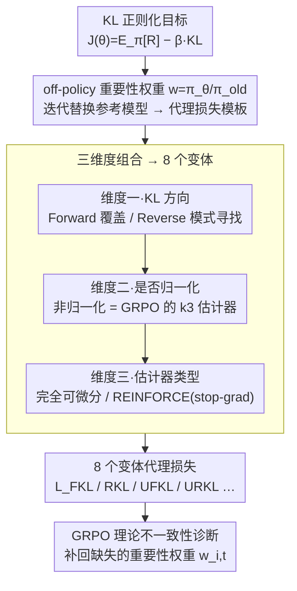

# On the Design of KL-Regularized Policy Gradient Algorithms for LLM Reasoning

**会议**: ICLR 2026  
**arXiv**: [2505.17508](https://arxiv.org/abs/2505.17508)  
**代码**: [https://github.com/complex-reasoning/RPG](https://github.com/complex-reasoning/RPG)  
**领域**: LLM Reasoning / Reinforcement Learning  
**关键词**: KL正则化, 策略梯度, LLM推理, GRPO, REINFORCE

## 一句话总结

提出 Regularized Policy Gradient (RPG) 框架，系统推导并分析了基于 Forward/Reverse KL 散度（归一化和非归一化形式）的策略梯度方法，发现 GRPO 的 KL 项存在理论不一致性，并在数学推理任务上取得优于 GRPO、REINFORCE++、DAPO 的结果。

## 研究背景与动机

策略梯度方法（如 PPO、GRPO）已广泛用于 LLM 的 RLHF 和推理能力增强。KL 散度正则化是稳定策略优化的关键技术，能防止策略偏离参考策略过远，避免灾难性遗忘和过度自信输出。

然而，现有方法在 KL 散度的具体实现上存在显著差异：
- **KL 方向选择**：Forward KL（零强制/zero-forcing）vs. Reverse KL（模式寻找/mode-seeking），两者具有不同的优化性质
- **归一化处理**：标准归一化 KL vs. 非归一化 KL（UKL），后者通过 $k_3$ 估计器与 GRPO 中的实现形式相关
- **估计器类型**：完全可微分形式 vs. REINFORCE 风格（使用 stop-gradient 算子）
- **离策略估计**：在 off-policy 设置中，重要性权重的处理方式影响梯度的正确性

作者指出 GRPO 的 KL 惩罚项在 off-policy 估计中缺少重要性权重，导致梯度无法精确对应目标函数的梯度。REINFORCE++ 的 KL 处理也存在非标准性——其 KL 项基于旧策略和 SFT 策略，而非当前正在优化的策略。

## 方法详解

### 整体框架

RPG 想解决的问题是：当下一堆 KL 正则化策略梯度方法（GRPO、REINFORCE++、DAPO…）在 KL 方向、是否归一化、用什么估计器上各搞各的，谁对谁错、彼此什么关系没人说清。RPG 把它们全放进同一个推导模板里：先写出 KL 正则化目标 $J(\theta) = \mathbb{E}_{\pi_\theta}[R] - \beta \cdot \text{KL}$，再用 off-policy 的重要性权重 $w(x) = \pi_\theta(x)/\pi_{\text{old}}(x)$ 把它转成可直接梯度下降的代理损失。整个过程是迭代式的——每轮把参考模型 $\pi_{\text{old}}$ 替换成上一轮策略 $\pi_{\theta^{(t)}}$，让正则化目标随训练动态自适应，而不是钉死在某个固定的 SFT 模型上。从这个统一模板出发，沿三个维度展开就得到一族共 8 个变体：**KL 方向**（Forward 还是 Reverse）、**是否归一化**（归一化还是非归一化，后者对应 $k_3$ 估计器）、**估计器类型**（完全可微分还是 REINFORCE 风格）。三维度组合完后，框架顺手诊断出 GRPO 的一处理论不一致，并给出修正。

### 关键设计

**1. 维度一·KL 方向：Forward 覆盖 vs Reverse 模式寻找**

第一个要选的是 KL 往哪边算，这直接决定策略会铺开还是收紧。**Forward KL（FKL）** 取 $\text{KL}(\pi_{\text{old}} \| \pi_\theta)$，目标写作 $J_{\text{FKL}}(\theta) = \mathbb{E}_{\pi_\theta}[R(x)] - \beta \text{KL}(\pi_{\text{old}} \| \pi_\theta)$，梯度可整理成在 $\pi_{\text{old}}$ 采样下的简洁形式 $\nabla_\theta J = \mathbb{E}_{x \sim \pi_{\text{old}}}[(w(x)R(x) + \beta) \nabla_\theta \log \pi_\theta(x)]$，对应代理损失 $\mathcal{L}_{\text{FKL}} = \mathbb{E}[-w(x)R(x) - \beta \log \pi_\theta(x)]$。它是 zero-forcing 的：逼着 $\pi_\theta$ 去覆盖 $\pi_{\text{old}}$ 的整个高概率支撑集，不敢遗漏；一个很有启发的边界情形是当 $R=0$ 时损失退化成纯 MLE，正好是 SFT 的训练目标——这解释了为什么 Forward KL 在训练里起的是类似 SFT 的稳定化作用。把方向反过来取 $\text{KL}(\pi_\theta \| \pi_{\text{old}})$ 就是 **Reverse KL（RKL）**，目标变成 $J_{\text{RKL}}(\theta) = \mathbb{E}_{\pi_\theta}[R(x)] - \beta \text{KL}(\pi_\theta \| \pi_{\text{old}})$，代理损失 $\mathcal{L}_{\text{RKL}} = \mathbb{E}[w(x)(-R(x) + \beta \log w(x))]$。它是 mode-seeking 的：鼓励 $\pi_\theta$ 收缩到 $\pi_{\text{old}}$ 概率最高的几个模态上，更适合在已知某些策略不错时把概率质量集中过去，而不是均匀铺开。两个方向各有取舍，实验里 FKL 在 AMC23、RKL 在 AIME25 各占优。

**2. 维度二·是否归一化：把 GRPO 的 $k_3$ 估计器嵌进统一推导**

真实训练里参考分布往往不是严格归一化的，于是第二个维度是用归一化 KL 还是非归一化 KL（UKL），后者会多出一个质量修正项。**非归一化 Forward KL（UFKL）** 的代理损失为 $\mathcal{L}_{\text{UFKL}} = Z_{\text{old}} \mathbb{E}[-w(x)R(x) + \beta(w(x) - \log w(x) - 1)]$，关键观察是其中的正则化项 $w(x) - \log w(x) - 1$ 恰好就是 GRPO 在用的 $k_3$ 估计器形式——这一步把 GRPO 那个看似经验性的 KL 惩罚拉进了 RPG 的统一推导里，给它一个明确的理论出处。**非归一化 Reverse KL（URKL）** 这边，作者证明 $k_3(\pi_{\text{old}}/\pi_\theta)$ 的期望等价于 $\text{UKL}(\pi_\theta \| \pi_{\text{old}})$，得到 $\mathcal{L}_{\text{URKL}} = Z_{\text{old}} \mathbb{E}[-w(x)R(x) + \beta(w(x)\log w(x) - w(x))]$，它的吸引力在于梯度里的有效奖励缩放因子被压成了干净的 $R(x) - \beta \log w(x)$，既好实现又与 $k_3$ 估计器严格等价。换句话说，这个维度不只是多了两种损失，更是给社区里被广泛使用、却一直缺理论说法的 $k_3$ 估计器补上了「它就是非归一化 KL」这一身份证。

**3. 维度三·完全可微分 vs REINFORCE 风格：用 stop-gradient 换实现灵活性**

前两个维度定下的每一种 KL 形式，都可以再选用完全可微分还是 REINFORCE 风格来落地。REINFORCE 风格把奖励权重用 stop-gradient 算子 $\text{SG}(\cdot)$ 冻住，统一写成 $\mathcal{L}^{\text{REINFORCE}} = -\mathbb{E}[\text{SG}(\text{Weight}(x, \theta)) \log \pi_\theta(x)]$，梯度只通过 $\log \pi_\theta(x)$ 这一项回传，结构和经典 REINFORCE 对齐。作者证明带 stop-gradient 的 REINFORCE 风格损失与对应的完全可微分代理损失梯度等价，所以选哪种纯看工程便利——只支持 REINFORCE 接口的训练框架直接用前者即可，两种版本在实验里还形成性能互补（前者在 AIME24 更优、后者在 AMC23 更优）。三个维度（方向 × 归一化 × 估计器）两两组合，正好铺满 8 个变体。

**4. GRPO 理论不一致性诊断：补回缺失的重要性权重**

框架最实用的副产品是诊断出 GRPO 的一个理论缺陷。GRPO 拿 $k_3$ 估计器当 KL 惩罚，但在 off-policy 设置下是直接把这一项减掉，没有乘上对应的重要性权重 $w_{i,t} = \pi_\theta(o_{i,t})/\pi_{\text{old}}(o_{i,t})$。按 RPG 的统一推导，正确的梯度里这一项本应带权；漏掉它，GRPO 的实际梯度就无法精确对应到它声称要优化的目标 $J_{\text{Clip}} - \beta \text{UKL}(\pi_\theta \| \pi_{\text{ref}})$ 上——即优化的东西和写在纸上的目标对不上。RPG 通过在代理损失里显式带上重要性权重把这个偏差修掉，这也是它在数学推理上稳定性和成绩都超过 GRPO 的一个直接原因。

### 损失函数 / 训练策略

落地训练时 RPG 沿用了一批稳定化技巧：用 PPO 的 Dual-Clip 变体对正、负优势分别裁剪以防梯度爆炸；用批次平均奖励作基线压低方差；借鉴 DAPO 的动态采样对困难 prompt 过采样、并过滤掉准确率近 1 或近 0 的无信息样本；在奖励里对过长输出加惩罚以抑制冗长。工程上还有一个内存红利——$\pi_{\text{old}}$ 的 log 概率可以预先算好存起来，训练时 GPU 上只需驻留 $\pi_\theta$ 一个模型，比同时要保留当前策略和参考策略的 GRPO/REINFORCE++ 更省显存。

## 实验关键数据

### 主实验

基于 Qwen2.5-7B-Instruct，使用 DAPO-Math-17k（英文部分 13.9k 样本），训练 400 步。

| 方法 | AMC23 (Best) | AIME24 (Best) | AIME25 (Best) |
|------|-------------|---------------|---------------|
| GRPO | 0.7250 | 0.1406 | 0.0948 |
| REINFORCE++ | 0.7664 | 0.1177 | 0.0740 |
| REINFORCE++-Baseline | 0.8711 | 0.1510 | 0.0969 |
| DAPO | 0.8734 | 0.1240 | 0.1063 |
| **RPG-FKL** | **0.8836** | 0.1490 | 0.1083 |
| **RPG-RKL** | 0.8672 | 0.1469 | **0.1240** |
| **RPG-UFKL** | 0.8703 | 0.1427 | 0.1177 |
| RPG-REINFORCE-FKL | 0.8727 | **0.1667** | 0.0875 |
| RPG-REINFORCE-URKL | 0.8531 | 0.1500 | 0.0938 |

### 消融实验

| 配置 | 关键发现 |
|------|---------|
| Clip (0.1,0.1) vs (0.2,0.28) | RPG-REINFORCE 在 Qwen-Math-7B 上使用大 clip 参数会崩溃，小 clip 更稳定 |
| AdamW vs Schedule-Free AdamW | Schedule-Free 改善高方差算法（GRPO、REINFORCE++）的稳定性 |
| 不同 KL 类型对比 | FKL 在 AMC23 最优，RKL 在 AIME25 最优，各有优势 |

### 关键发现

- RPG 变体在训练稳定性上显著优于 GRPO（后者呈现更大波动性）
- Forward KL 与 MLE 的联系表明其在稳定训练中的作用类似于 SFT 的正则化效果
- 完全可微分版本和 REINFORCE 风格版本性能互补，前者在 AMC23 更优，后者在 AIME24 更优
- 已充分预训练的模型（Qwen-Math-7B）需要更紧的 clip 参数来鼓励利用而非探索
- Schedule-Free 优化器通过内部参数平均提供更稳定的训练动态

## 亮点与洞察

- **系统性框架**：将 KL 正则化策略梯度统一到一个框架下，覆盖 Forward/Reverse × 归一化/非归一化 × 可微分/REINFORCE 风格 = 8 种变体，便于研究者理解和选择
- **GRPO 纠错**：指出 GRPO KL 项缺少重要性权重的理论缺陷，提供修正方案，对理解和改进现有 RLHF 方法具有重要价值
- **内存效率**：RPG 训练时只需一个模型在 GPU 上，比同时需要当前策略和参考策略的 GRPO/REINFORCE++ 更高效
- **$k_3$ 估计器的理论根基**：证明了 $k_3$ 估计器等价于非归一化 KL 散度，为其广泛使用提供了理论支撑

## 局限与展望

- 仅在数学推理任务上验证，未涉及代码生成、通用指令跟随等场景
- 仅使用 7B 模型实验，更大规模模型上的表现尚未验证
- 不同 KL 变体的最优选择依赖具体任务，缺乏明确的选择准则
- Dual-Clip 改变了原始 KL 正则化目标，引入了近似误差
- 训练超参数（如 $\beta$、clip 范围）的敏感性分析有限，不同模型可能需要不同配置

## 相关工作与启发

- **GRPO** (Shao et al., 2024)：使用组相对优势估计和 $k_3$ KL 惩罚，但 KL 项缺少重要性权重
- **REINFORCE++** (Hu, 2025)：引入 token 级 KL 惩罚和归一化，但 KL 项基于 $\pi_{\text{old}}^{\text{RL}}$ 而非 $\pi_\theta$
- **DAPO** (Yu et al., 2025)：提出 Clip-Higher、过采样、token 级损失等稳定训练技术
- **Dr. GRPO** (Liu et al., 2025)：发现并修正 GRPO 优势估计器中的偏差
- **VAPO** (Yuan et al., 2025)：长度自适应优势估计
- **DPO/SimPO**：直接偏好优化方向的代表工作，与策略梯度方法互补

**启发**：该工作提示我们在设计 RL 算法时需要仔细审视 KL 正则化的数学正确性，特别是在 off-policy 设置下。框架化的思维方式有助于发现和修正既有方法的理论缺陷。

## 评分

- 新颖性: ⭐⭐⭐⭐ — 框架本身是系统性整理而非全新方法，但 GRPO 纠错和理论统一有价值
- 实验充分度: ⭐⭐⭐⭐⭐ — 8 种变体 × 2 种优化器 × 2 种模型，消融充分
- 写作质量: ⭐⭐⭐⭐ — 数学推导严谨清晰，但因变体众多显得冗长
- 价值: ⭐⭐⭐⭐ — 为 LLM RL 社区提供了重要的理论参考和实用方法

<!-- RELATED:START -->

## 相关论文

- [\[ICLR 2026\] Stabilizing Policy Gradients for Sample-Efficient Reinforcement Learning in LLM Reasoning](stabilizing_policy_gradients_for_sample-efficient_reinforcement_learning_in_llm_.md)
- [\[ICLR 2026\] ∇-Reasoner: LLM Reasoning via Test-Time Gradient Descent in Latent Space](nabla-reasoner_llm_reasoning_via_test-time_gradient_descent_in_latent_space.md)
- [\[ICLR 2026\] DESIGNER: Design-Logic-Guided Multidisciplinary Data Synthesis for LLM Reasoning](designer_design-logic-guided_multidisciplinary_data_synthesis_for_llm_reasoning.md)
- [\[ICLR 2026\] Slow-Fast Policy Optimization: Reposition-Before-Update for LLM Reasoning](slow-fast_policy_optimization_reposition-before-update_for_llm_reasoning.md)
- [\[ICLR 2026\] Temperature as a Meta-Policy: Adaptive Temperature in LLM Reinforcement Learning](temperature_as_a_meta-policy_adaptive_temperature_in_llm_reinforcement_learning.md)

<!-- RELATED:END -->
