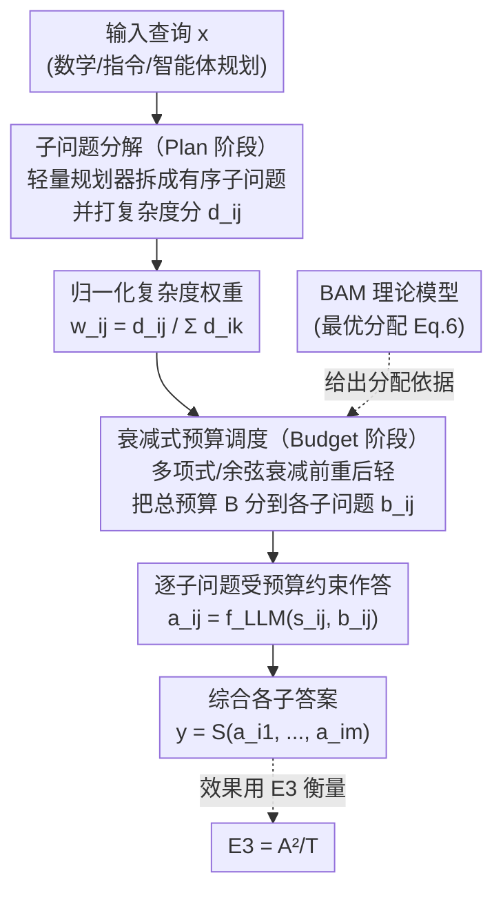

# Plan and Budget: Effective and Efficient Test-Time Scaling on Reasoning LLMs

**会议**: ICLR 2026  
**arXiv**: [2505.16122](https://arxiv.org/abs/2505.16122)  
**代码**: [github.com/junhongmit/P-and-B](https://github.com/junhongmit/P-and-B)  
**领域**: LLM推理  
**关键词**: 测试时缩放, 推理效率, 过度思考, token预算分配, 推理LLM

## 一句话总结

提出 Plan-and-Budget 框架，通过将复杂查询分解为子问题并基于估计复杂度自适应分配 token 预算，实现推理 LLM 的高效测试时缩放——最高提升 70% 准确率、减少 39% token、E3 指标提升 193.8%。

## 研究背景与动机

推理型大语言模型（如 DeepSeek-R1、QwQ）在数学推理、代码生成等复杂任务中取得了显著成功，但推理阶段的计算效率问题日益突出：

**Overthinking（过度思考）**：许多主流 LLM 即使面对简单查询也会生成冗长、离题的推理链。模型"想得太多"，产生了大量不必要的中间推理步骤，浪费了计算资源。

**固定预算的局面**：近期工作试图通过限制固定 token 预算来缓解 overthinking，但这种"一刀切"的策略会导致 **underthinking（思考不足）**——对于困难问题，固定预算可能不够用，导致推理不充分。

**问题难度异质性**：现实中的查询复杂度变化很大。一个简单的算术题和一个复杂的多步推理问题需要截然不同的计算资源，但现有方法缺乏合理的资源分配机制。

**缺乏理论基础**：关于如何最优地分配推理计算资源，缺乏形式化的理论框架。

作者通过经验分析发现，**推理效率低下通常源于不清晰的问题解决策略**——模型在没有明确计划的情况下就开始推理，容易偏离方向。

## 方法详解

### 整体框架

这篇论文要解决推理 LLM「想得没章法」的问题：模型在没有计划的情况下边想边偏，简单题想过头（overthinking，过度思考）、难题又被一刀切的固定预算卡死（underthinking，思考不足）——作者把这种"推理深度和题目难度不匹配"统称为推理失准（reasoning miscalibration）。Plan-and-Budget 的思路是先把题目拆成有结构的子问题，再按每个子问题的难度把 token 花在刀刃上。

整个框架是**模型无关的纯推理时方法**，只靠 prompt、不重训，分两个阶段：先 **Plan（计划）**，一个轻量规划器把原查询分解成一串有序子问题、顺带给每个子问题打复杂度分；再 **Budget（预算）**，用衰减式调度把总 token 预算"前重后轻"地摊到各子问题上（早期高不确定性的多给、后期收敛的少给），主 LLM 在各自预算约束下逐个作答，最后综合成完整解答。这套调度的最优性由理论模型 **BAM** 背书，整体效果则用新指标 **E3** 衡量。

### 关键设计

**1. BAM 理论模型（Budget Allocation Model）：为「难题多想、简题少想」给出闭式的最优分配**

直觉都知道该把算力倾斜给难题，但缺一个严格论证。BAM 把推理形式化为一串带不确定性的子问题，沿用预测不确定性的经典分解 $U = U_{epistemic} + U_{aleatoric}$（认知不确定性可被计算消减、随机不确定性不可消减），并假设认知不确定性随分到的 token 数按逆幂律衰减 $U_{epistemic}(s_{ij}\mid b_{ij}) = c_{ij} / b_{ij}^{\alpha_{ij}}$，其中 $c_{ij}$ 是初始不确定性、$\alpha_{ij}$ 刻画下降难度。在固定总预算 $B_i$ 下用拉格朗日乘子求解，得到闭式最优分配：

$$b_{ij} = B_i \cdot \frac{(c_{ij}\,\alpha_{ij})^{1/(\alpha_{ij}+1)}}{\sum_k (c_{ik}\,\alpha_{ik})^{1/(\alpha_{ik}+1)}}$$

这个解揭示 token 预算与复杂度之间是**单峰**关系：中等难度的子问题该多给（避免 underthinking），过难的反而少给（再投也只是边际递减，避免 overthinking）。它把后面 Budget 阶段从经验直觉抬升成有理论依据的结论。

**2. 子问题分解（Plan 阶段）：先列计划再推理，给推理一副软脚手架**

针对「模型一上来就想、越想越偏」这个根因，Plan 阶段先不答题。一个轻量规划器 $P$ 把原查询 $x_i$ 拆成有序子问题序列 $\Gamma_i = \langle s_{i1}, \dots, s_{im}\rangle$，并按 LLM 置信度 / 问题结构等启发式给每个子问题打复杂度分 $d_{ij}$，再归一化成权重 $w_{ij} = d_{ij} / \sum_k d_{ik}$（代表该子问题占总"复杂度"的比例）。这份计划是一副"软脚手架"——不保证最优，但给主 LLM 一条合理的高层推理路径；随后主 LLM 在各子问题的预算约束下逐个作答，再由综合函数 $S$ 把各子答案拼成最终解。有了骨架，过度发散的 overthinking 被显著抑制。

**3. 衰减式预算调度（Budget 阶段）：把 BAM 的非均匀分配落成可执行的轻量调度**

BAM 的闭式解需要 $c_{ij}, \alpha_{ij}$，但黑盒 LLM 里这两个量观测不到、硬估又要昂贵采样，反而违背省算力的初衷。论文于是用一族**衰减调度函数**做轻量替身：观察到多步推理里早期阶段（理解题意、定策略）认知不确定性最高，就把预算"前重后轻"压向前面的子问题——提供 non-decay / 线性 / 多项式 / 指数 / 余弦退火等几档衰减形状，其中多项式和余弦退火最接近 BAM 预测的非均匀曲线。调度天然满足总预算约束 $\sum_j b_{ij} \le B_i$，主 LLM 生成某子问题时被显式告知它的 token 上限。正因为预算随阶段走，这套调度同时躲开固定大预算的浪费和固定小预算不够用两个坑。

**4. E3 评估指标（Efficiency-Aware Effectiveness Evaluation）：用一个数同时量「对」和「省」**

现有评估要么只看准确率、要么只数 token（或简单的 $A/T$），既无法刻画两者权衡，还会奖励"少答多省"的退化策略。论文定义 E3，给准确率加权后再除以 token：

$$E3 = A \cdot \frac{A}{T} = \frac{A^2}{T}$$

其中 $A$ 是平均准确率、$T$ 是每条查询的平均解码 token 数。$A$ 的平方项让指标更看重"答对"，防止靠砍 token 刷分；又对又省的模型分母小、分子大，E3 才高。它是论文里 +193.8% 提升所对应的统一尺子。

### 损失函数 / 训练策略

Plan-and-Budget 是纯推理时方法，不需要任何训练或微调，全靠 prompt 引导轻量规划器做子问题分解、引导主 LLM 在给定 token 上限下作答。它与模型架构无关，可直接套到任意推理型 LLM 上，也能让小模型搭配该框架逼近大模型的效率。

## 实验关键数据

### 主实验

在四个推理 LLM（DS-Qwen-32B、QwQ-32B、DS-LLaMA-70B、OpenAI o4-mini）、三类任务（数学推理、指令遵循、智能体规划）上评估，相对强基线的最好提升为：

| 指标 | 最大改善 | 说明 |
|------|---------|------|
| 准确率 | 最高 +70% | 跨任务跨模型的最好情形 |
| Token 消耗 | 最多 -39% | 又对又省，不是靠砍 token 换准确率 |
| E3 | 最高 +193.8% | 来自智能体规划任务的最显著一例 |

**最具代表性的一例**：在智能体规划任务上，较小的 DS-Qwen-32B 用上 Plan-and-Budget 后 E3 从 0.16 升到 0.47，逼近不带规划的较大模型 DS-LLaMA-70B（E3 = 0.50）——说明该框架可作为"推理时均衡器"，让小模型在不重训的前提下赶上大模型的效率。

### 消融实验

| 配置 | 关键指标 | 说明 |
|------|---------|------|
| 仅 Plan（无预算控制） | 准确率提升，效率提升有限 | 分解本身就有帮助 |
| 仅 Budget（无分解） | 效率提升，准确率可能下降 | 缺乏结构化引导 |
| Plan + 均匀预算 | 中等改善 | 不如自适应分配 |
| Plan + 自适应预算 | 最优 | 完整框架效果最佳 |
| 不同分解粒度 | 中等粒度最优 | 过细增加开销，过粗失去意义 |

### 关键发现

1. **Plan 和 Budget 缺一不可**：计划分解解决了推理方向问题，预算分配解决了资源效率问题，二者协同效果最佳
2. **小模型+Plan-and-Budget ≈ 大模型**：框架可以有效弥补模型规模的差距
3. **自适应优于固定**：无论是固定的大预算还是固定的小预算，都不如自适应分配
4. **模型无关性**：框架在不同的推理 LLM 上均有效

## 亮点与洞察

1. **理论与实践的优美结合**：先建立 BAM 理论模型，从理论推导出自适应分配的最优性，再设计 Plan-and-Budget 框架——不是纯启发式的
2. **E3 指标的提出**：填补了推理效率评估的空白，为社区提供了统一的衡量标准
3. **Overthinking 的精确诊断**：通过经验分析定位到"缺乏策略"是 overthinking 的根源，而非模型能力不足
4. **小模型的效率提升路径**：用计算效率而非模型规模来提升性能，对资源有限的场景非常实用
5. **零训练成本**：纯 test-time 方法，开箱即用

## 局限与展望

1. **分解质量依赖 LLM 能力**：如果 LLM 自身的分解能力不足，Plan 阶段可能产生不合理的子问题，进而影响整体效果
2. **复杂度估计的准确性**：自适应预算分配的效果取决于复杂度估计的准确性，而这本身是一个困难问题
3. **额外的 prompt 开销**：Plan 阶段的分解和 Budget 阶段的引导需要额外的 prompt token，对于极短的简单查询可能得不偿失
4. **子问题间的依赖**：线性分解为独立子问题的假设可能过于简化——现实中子问题间可能有复杂的依赖关系
5. **与 RL-based 方法的结合**：Plan-and-Budget 可以与基于强化学习的推理优化方法结合，但论文未探索

## 相关工作与启发

- **Test-time scaling**：Self-Consistency、Tree-of-Thought、Best-of-N 等测试时方法——Plan-and-Budget 与这些方法互补
- **Overthinking 研究**：STILL、S1 等关注推理冗余的先驱工作
- **Budget-aware推理**：token 预算约束、early stopping 等相关技术
- **启发**：BAM 理论模型的思路可以推广到其他需要资源分配的场景（如多模态推理、多工具调用）

## 评分

- **新颖性**: ⭐⭐⭐⭐ — 理论模型有贡献，但 Plan-and-Budget 的工程实现较直观
- **实验充分度**: ⭐⭐⭐⭐⭐ — 多模型多任务全面评估，消融完善，结果有说服力
- **写作质量**: ⭐⭐⭐⭐ — 理论与实验结合良好
- **价值**: ⭐⭐⭐⭐⭐ — 解决了推理 LLM 的实际效率痛点，即插即用

<!-- RELATED:START -->

## 相关论文

- [\[ICLR 2026\] ATTS: Asynchronous Test-Time Scaling via Conformal Prediction](atts_asynchronous_test-time_scaling_via_conformal_prediction.md)
- [\[ICLR 2026\] Efficient Test-Time Scaling for Small Vision-Language Models](efficient_test-time_scaling_for_small_vision-language_models.md)
- [\[ICLR 2026\] Understanding the Role of Training Data in Test-Time Scaling](understanding_the_role_of_training_data_in_test-time_scaling.md)
- [\[ACL 2026\] Efficient Test-Time Scaling via Temporal Reasoning Aggregation](../../ACL2026/llm_reasoning/efficient_test-time_scaling_via_temporal_reasoning_aggregation.md)
- [\[NeurIPS 2025\] LIMOPro: Reasoning Refinement for Efficient and Effective Test-time Scaling](../../NeurIPS2025/llm_reasoning/limopro_reasoning_refinement_for_efficient_and_effective_test-time_scaling.md)

<!-- RELATED:END -->
