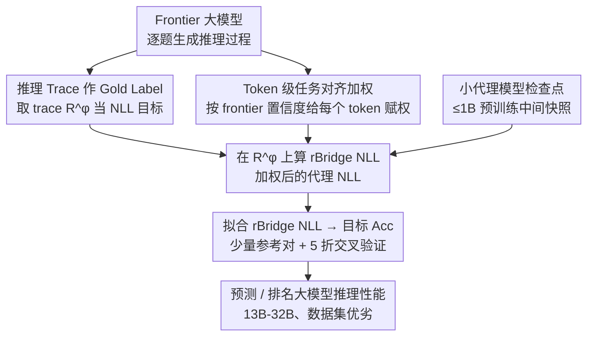

# Predicting LLM Reasoning Performance with Small Proxy Model

**会议**: ICLR 2026  
**arXiv**: [2509.21013](https://arxiv.org/abs/2509.21013)  
**代码**: 有（计划开源数据集和代码）  
**领域**: LLM评测  
**关键词**: scaling law, proxy model, reasoning, pre-training data selection, negative log-likelihood

## 一句话总结
提出 rBridge，通过使用 frontier 模型的推理 trace 作为 gold label 并按 token 级任务对齐加权 NLL，使 ≤1B 的小模型能有效预测 13B-32B 大模型的推理性能，在数据集排名任务中实现 100× 以上的计算节省。

## 研究背景与动机
预训练大语言模型的成本极高，因此业界常用小型代理模型（proxy model）来评估预训练设计选择。scaling law 和数据集排名不变性等研究已证明这一策略在一般任务上的可行性。

**核心矛盾**：推理能力表现出**涌现行为**（emergent behavior），只在足够大的模型（通常 >7B）上才可靠地出现。小模型（≤1B）在推理 benchmark 上噪声极大甚至斜率反向（如 1B 模型在 MATH500 上随训练进行准确率不升反降）。这意味着：
- 用小模型的准确率直接预测大模型表现 → 失败
- 实践者被迫使用 7B-15B 的"代理模型"，开销仍然巨大（单次 7B/500B tokens 训练 >50K USD）

**作者的分析揭示两个根本问题**：

**评估目标错位**：小模型的训练目标是 NTP（next-token prediction），但评估用的是 Acc./Pass@K——与训练目标完全不同的离散指标

**任务对齐缺失**：即使使用 NLL，gold label 的选择也至关重要：如果 gold label 分布外（OOD），NLL 信号同样嘈杂。同时，标准 NLL 对所有 token 等权处理，未区分任务关键 token 和格式化 token

## 方法详解

### 整体框架
rBridge 要解决的事情很具体：用一个 ≤1B 的小代理模型，可靠地预测、排名 13B–32B 大模型的推理性能，而不必真的把大模型训出来。它的整体思路是回到预训练的本源——既然小模型的训练目标是 next-token prediction，那评估也应该用 NLL，而不是和训练目标完全脱节的离散准确率（Acc./Pass@K）。但直接拿 benchmark 标准答案算 NLL 信号很嘈杂，所以 rBridge 做了两件事把 NLL 校准成与推理能力对齐的预测量：先让一个 frontier 大模型对每道题生成推理 trace，把这段 trace（而非标准答案）当作算 NLL 的 gold label，让目标文本落回预训练分布；再用 frontier 模型对每个 token 的置信度给 NLL 重新加权，放大推理关键步骤、压低格式噪声。

把这个"加权 NLL"（rBridge NLL）在预训练过程中保存的小模型中间检查点上算出来，就得到一个比准确率稳定得多的代理指标。最后只需在少量参考的"代理–目标"模型对上，拟合一条 rBridge NLL → 目标 Acc/Pass@K 的映射曲线，就能用小模型零成本地预测大模型表现、给候选数据集排名。frontier 的推理 trace 与 token 概率都是离线一次性标注（每个 benchmark 成本不到 $10），整条流程几乎不增加额外训练开销。

### 关键设计

**1. 推理 Trace 作为 Gold Label：让 NLL 落回训练分布**

整条 pipeline 的第一步是确定"在什么文本上算 NLL"，而这一步决定了信号的好坏。标准做法是拿 benchmark 的标准答案算 NLL，但小模型在这种 label 上信号极嘈杂，根源在于答案文本严重偏离预训练数据分布——论文用 $-\log p(Y^*)$ 度量一个 gold label $Y^*$ 有多 in-distribution，越 OOD 信号越烂。rBridge 改用 frontier 模型 $\pi^\phi$ 生成的**推理 trace** $R^\phi$（只取推理过程，剥掉最终答案与其格式部分）作为 gold label。这样做有两层好处：一是 $R^\phi$ 是连续的长文本，更贴近以长文为主的预训练语料，5 个推理 benchmark 上 NLL 比用标准答案平均降低 74.7%，信号噪声大幅下降；二是这段 trace 本身就是通向正确答案的推理链，天然与"解对题"这个目标任务对齐。作为反例，ScalingBench 用的是 $R^\phi + A^\phi$（trace 拼上答案），而答案部分夹着 "\\n"、"Final Answer:"、"I hope it is correct." 这类几乎不出现在预训练数据里的格式伪影，严重 OOD，反而把 NLL 信号污染了（Tab. 1 显示其 NLL 与拟合质量都劣于只用 $R^\phi$）。

**2. Token 级任务对齐加权：把推理关键步骤和格式噪声分开**

换了 gold label 只解决"在哪算"，还没解决"每个 token 该算多重"。标准 NLL 对 $R^\phi$ 里所有 token 一视同仁，但一条推理 trace 里既有 "sum modulo 9" 这种关键推理步骤，也有换行、编号这类排版 token，二者对"会不会推理"的贡献天差地别。rBridge 用 frontier 模型自身对每个 token 的置信度作为自动的任务对齐权重，定义为

$$\text{rBridge NLL}(\text{token}_i) = \underbrace{-\log p^p(\text{token}_i)}_{\text{标准 NLL}} \cdot \underbrace{\frac{1}{|\text{token}_i|} \sum_{\text{letter} \in \text{token}_i} p^\phi(\text{letter})}_{\text{自动任务对齐权重}}$$

直觉很直接：frontier 模型高置信的 token 往往是推理关键节点，应获得更大权重；它低置信的 token（换行符、编号等）多是格式噪声，权重被压低。这里有一个跨 tokenizer 的细节——代理模型和 frontier 模型分词方式不同，无法直接对齐 token 概率，所以 rBridge 不直接取 token 概率，而是把权重摊到**字母级** $p^\phi(\text{letter})$ 再在 token 内取平均，从而消除分词差异；最后对整列权重因子做一次 MinMax 归一化，放大关键 token 与噪声 token 之间的对比。这套加权对 frontier 模型只是一次性前期投入，算完后在代理模型上的评估只要几秒 CPU 时间。

### 训练与使用
rBridge 不训练任何新模型，而是直接取预训练过程中保存的小模型中间检查点作为代理模型，在其上计算 rBridge NLL；frontier 模型的推理 trace 与 token 概率作为离线标注一次性算好。要把代理指标变成对大模型的预测，只需在少量已知的"代理–目标"数据点上做曲线拟合：候选函数空间（线性 / 二次 / 指数 / 对数）事先固定以防过拟合，用 5 折交叉验证按训练 $R^2$ 选最优函数，报告测试 MAE。拟合好的这条曲线还能零样本迁移到另一个预训练数据集上做预测与排名。

## 实验关键数据

### 主实验（1B→13B 代理-目标关系）

| 方法 | 平均 Train R² ↑ | 平均 Test MAE ↓ |
|------|:---:|:---:|
| Acc./Pass@1 | 0.304 | 3.709 |
| iSFT | 0.290 | 5.123 |
| TED | 0.375 | 3.377 |
| MPCA | 0.194 | 302.642 |
| NLL | 0.485 | 5.173 |
| $R^\phi$ (仅 trace NLL) | 0.867 | 1.455 |
| **rBridge** | **0.874** | **1.384** |

- rBridge 在 12 个设定（6 benchmark × R²/MAE）中的 10 个取得最好
- 1B→32B: R²=0.826, MAE=1.481，同样最优
- 1B→13B+SFT: R²=0.846, MAE=1.304，最优

### 消融实验（数据集排名 <100M→1.2B）

| 代理规模 | rBridge DAcc | 最佳基线 DAcc | 计算节省 |
|:---:|:---:|:---:|:---:|
| 3.7M (87.3M tokens) | ~70% | ~50% (随机水平) | 733.4× |
| 6M (81.6M tokens) | ~75% | ~55% | 100.2× |
| 97.9M | ~80% | ~75% | - |

- 在最小 proxy（3.7M）下，rBridge 比基线高 **27% DAcc**
- 实现相同排名精度，rBridge 节省 **100.2× 到 733.4×** FLOPs

### 关键发现
1. **rBridge 优于 7-13× 更大的模型**：1B 模型使用 rBridge 的预测能力超过 7B/13B 模型直接用准确率评估
2. **零样本跨数据集迁移**：在 OLMo-Mix-1124 上拟合的 rBridge→Acc 函数可零样本迁移到另一个数据集，5 个 benchmark 中排名全对（5/5），MAE 仅 0.043-1.417（1 个异常值 9.716）
3. **消融证实每个组件有效**：从标准 NLL → 使用 $R^\phi$ → 添加加权 → MinMax 归一化，每步都带来一致提升

## 亮点与洞察
- **深刻的洞察**：小模型在推理 benchmark 上"失败"不是因为缺乏信息，而是因为评估方式（Acc.）与小模型的能力不匹配
- **NLL 回归本源**：预训练的目标是 NTP，评估也应回归 NLL——但关键在于用什么做 gold label
- **Frontier 模型概率作为自动标注器**：token 概率天然编码了"哪些步骤是关键推理"，免去人工标注
- **实用性极强**：两阶段数据集优化框架（<100M 初筛 → 1B 精排）具有直接的工业应用价值

## 局限与展望
- Frontier 模型并非 100% 准确，少量错误的推理 trace 可能引入噪声（但实验显示过滤掉错误 trace 改善甚微）
- Frontier 模型偶尔无法按要求格式生成（当前仅重试一次后放弃）
- 零样本迁移仅在 1B→7B 上验证了一个数据集对，规模受限于计算预算
- 未验证在非推理任务上的效果（虽然非推理任务已有成熟方案）
- 两阶段优化框架仅作为讨论提出，未完整实验验证

## 相关工作与启发
- 与 scaling law 文献（Kaplan et al., Hoffmann et al.）互补：rBridge 专门解决推理涌现带来的 proxy 困难
- 与 DataDecide benchmark 直接对比：在其任务上以极低成本取得最优排名
- 对预训练数据配比优化（Xie et al., Liu et al.）的启示：NLL/perplexity 是次优指标，rBridge 更适合推理导向的数据选择
- 广泛启发：任何需要"用小模型预测大模型"的场景都可考虑 rBridge 范式

## 评分
- 新颖性: ⭐⭐⭐⭐ 核心 insight（NLL + frontier trace + token 加权）并非全新，但组合巧妙且效果显著
- 实验充分度: ⭐⭐⭐⭐⭐ 三阶段实验设计严谨，6个 benchmark × 多模型规模 × 消融 × 跨数据集迁移
- 写作质量: ⭐⭐⭐⭐ 结构清晰，问题分析循序渐进，但符号和表格较密集
- 价值: ⭐⭐⭐⭐⭐ 直接降低预训练探索成本 100×+，工业落地价值极高

<!-- RELATED:START -->

## 相关论文

- [\[ICLR 2026\] Predicting LLM Reasoning Performance with Small Proxy Models](predicting_llm_reasoning_performance_with_small_proxy_models.md)
- [\[ICLR 2026\] The Path of Least Resistance: Guiding LLM Reasoning Trajectories for Efficient Consistency](the_path_of_least_resistance_guiding_llm_reasoning_trajectories_for_efficient_co.md)
- [\[ICLR 2026\] No Answer Needed: Predicting LLM Answer Accuracy from Question-Only Linear Probes](no_answer_needed_predicting_llm_answer_accuracy_from_question-only_linear_probes.md)
- [\[ICLR 2026\] Why is Your Language Model a Poor Implicit Reward Model?](why_is_your_language_model_a_poor_implicit_reward_model.md)
- [\[ICLR 2026\] Efficient Test-Time Scaling for Small Vision-Language Models](efficient_test-time_scaling_for_small_vision-language_models.md)

<!-- RELATED:END -->
