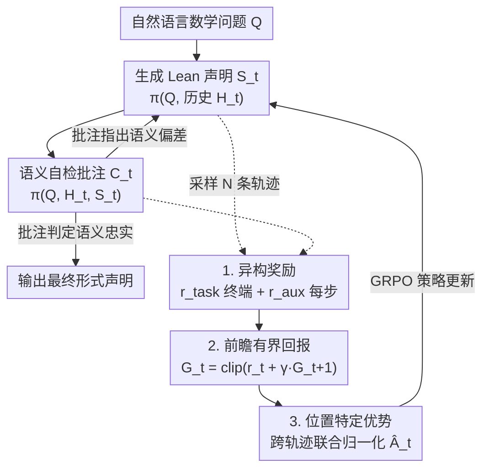

# ReForm: Reflective Autoformalization with Prospective Bounded Sequence Optimization

**会议**: ICLR 2026  
**arXiv**: [2510.24592](https://arxiv.org/abs/2510.24592)  
**代码**: [GitHub](https://github.com/RUCAIBox/ReForm)（附模型和基准）  
**领域**: LLM推理  
**关键词**: autoformalization, Lean, semantic consistency, self-correction, reinforcement-learning, heterogeneous reward, PBSO

## 一句话总结

提出 ReForm，一种反思式自动形式化范式，将自然语言数学问题转为 Lean 形式声明的过程从一次生成转变为"生成 → 语义自验证 → 修正"的迭代循环，并设计 PBSO 算法优化异构奖励信号，在四个基准上比最强基线平均提升 22.6 个百分点。

## 研究背景与动机

自动形式化（Autoformalization）是将自然语言数学问题翻译为可机器验证的形式声明（如 Lean 语言），是形式化数学推理的关键瓶颈。当前存在核心矛盾：

**语法正确 ≠ 语义正确**：LLM 能生成通过 Lean 编译器验证的语法正确声明，但经常无法忠实保留原始问题的语义意图（量词范围误解、隐含约束遗漏、边界情况错误等）

**一次生成范式的局限**：现有方法（包括 Goedel-V2、Kimina）将形式化视为简单翻译任务，缺乏自我反思和迭代纠错机制

**人类专家也犯错**：miniF2F 中 16.4%、ProofNet 中 38.5% 的人工形式化声明包含语义错误，说明问题本身极具挑战性

核心思想：模仿人类专家的"审查-修正"迭代过程，让模型能够在生成过程中发现并纠正自己的语义错误。

## 方法详解

### 整体框架

ReForm 把自动形式化从"读题—翻译"的一次生成，改写成"生成—自检—修正"的反思循环：模型先把自然语言问题 $Q$ 翻译成 Lean 声明，再以同一套权重回头评估这条声明是否忠实保留了原意，发现偏差就带着批注重新生成，直到自检判定语义忠实才吐出最终形式声明。整个循环被实现为一次自回归解码，因此不需要多次模型调用，也不依赖外部裁判。具体地，在第 $t$ 次迭代里生成步给出 $S_t = \pi(Q, \mathcal{H}_t)$，自检步给出批注 $C_t = \pi(Q, \mathcal{H}_t, S_t)$，其中历史 $\mathcal{H}_t = \{(S_1, C_1), \ldots, (S_{t-1}, C_{t-1})\}$ 把此前所有"声明—批注"对都喂回上下文，让模型在已知错处的基础上继续修。

要让这个循环真正学会"诚实自检"，光靠最终声明对错来训练是不够的，PBSO 因此在同一条轨迹上做三件事：**异构奖励**给最终结果和每一步批注各发一类信号，**前瞻有界回报**把这些散布在不同位置的奖励安全地累加成每步的回报，**位置特定优势**再把回报转成步级的优势喂回 GRPO，让真正纠对了的那一步拿到更大的信用。下图自上而下是推理时的反思回环（蓝），底部是训练时由三个设计串成、再回灌策略的优化管线。

### 关键设计

**1. 异构奖励：同时监督最终结果和中间自检**

反思循环的难点在于，光靠最终声明对错来打分，模型学不会"怎样自检才算到位"——它可能蒙对结果却给出胡乱的批注。ReForm 因此设计两类互补信号。终端的任务奖励只在声明既通过 Lean 编译又语义一致时给 1 分，$r_{\text{task}}(Q, \text{Ans}) = 1$ 当且仅当 $\text{PassesLean(Ans)} \land \text{IsConsistent}(Q, \text{Ans})$，否则为 0，直接对齐"语法对且语义对"这个真正目标；其中 PassesLean 由 Lean 编译器判定，IsConsistent 由 LLM 裁判（CriticLean-14B）判定语义忠实度。中间步的辅助奖励 $r_{\text{aux}}^t = 1$ 当且仅当 $\text{IsFaithfulCritique}(Q, S_t, C_t)$ 为真，逐步检查每条批注是否准确诊断了声明与原题的语义关系，对假阳性（把错的判成对）、假阴性（把对的判成错）和过早终止（明明还有偏差却宣称已忠实）都给惩罚。两条信号一个管"终点对不对"，一个管"每步自检诚不诚实"，缺了后者反思就退化成走过场。

**2. 前瞻有界回报：让异构奖励在序列里安全累加**

任务奖励落在序列末尾、辅助奖励散布在中间各步，直接做折扣累加容易把回报推到奖励函数本身的取值范围之外，造成梯度尺度失控。PBSO 的做法是从轨迹末端往前递推、并在每一步做截断：

$$G_t = \text{clip}(r_t + \gamma \cdot G_{t+1},\, r_{\min},\, r_{\max})$$

折扣因子 $\gamma \in (0,1]$，边界 $G_{T+1} = 0$，整条轨迹的奖励序列为 $[r_{\text{aux}}^1, \ldots, r_{\text{aux}}^T, r_{\text{task}}]$。clip 把每步回报强行压回 $[r_{\min}, r_{\max}]$ 这个奖励本身的合法区间，避免多步累积越界，得到的 $G_t$ 同时是第 $t$ 步生成与批注的复合回报。消融里去掉 clip 后 AIME25 从 46.7 直接掉到 26.7，说明这步截断不是锦上添花而是稳定训练的前提。

**3. 位置特定优势：给同一条轨迹的不同步发不同的信用**

标准 GRPO 对整条响应用一个优势值，无法区分"哪一步自检立了功"。ReForm 对每个问题采样 $N$ 条轨迹，把所有轨迹、所有迭代步的前瞻回报汇成一个集合 $\mathcal{G} = \bigcup_{j=1}^N \{G_t^j : t=1,\dots,T_j+1\}$，再对每一步联合归一化算优势：

$$\hat{A}_t^j = \frac{G_t^j - \text{mean}(\mathcal{G})}{\text{std}(\mathcal{G})}$$

这样同一轨迹里不同迭代步能拿到不同的优势值——早期成功揪出关键错误的那步被放大、后期只做小修小补或敷衍的那步被压下去，实现了步级的细粒度信用分配（迭代 $t$ 内的所有 token 共享 $\hat{A}_t^j$），再套回标准 GRPO 完成策略更新。

### 损失函数 / 训练策略

训练沿用 GRPO 的裁剪式策略目标，只是把整段共享的优势换成上面逐步算出的位置特定优势 $\hat{A}_t^j$，于是同一次更新里既优化最终形式化的准确率，又优化每一步自检批注的质量。值得一提的是全程不施加任何长度奖励，模型却自发把响应从约 2,300 token 增长到 4,800 token，说明更充分的自检是被异构奖励"诱导"出来、而非人为约束出来的。

## 实验关键数据

### 主实验

| 模型 | miniF2F sem | ProofNet sem | Putnam sem | AIME2025 sem | AVG sem |
|------|-----------|------------|----------|------------|---------|
| GPT-5 | 66.0 | 44.6 | 45.8 | 13.3 | 42.4 |
| Goedel-V2-8B | 81.1 | 47.3 | 42.9 | 26.7 | 49.5 |
| Goedel-V2-32B | 82.0 | 50.5 | 41.4 | 26.7 | 50.1 |
| **ReForm-8B** | **87.7** | **65.6** | **57.3** | **46.7** | **64.3** |
| **ReForm-32B** | **91.4** | **70.4** | **62.3** | **66.7** | **72.7** |

ReForm-8B 平均语义一致性比 Goedel-V2-8B 提升 **+14.8pp**，甚至超过 4 倍大的 Goedel-V2-32B (+14.2pp)。ReForm-32B 平均语义一致性达到 **72.7%**，比最强基线提升 **+22.6pp**。

在难度更高的数据集上提升更显著：ProofNet +19.9pp, PutnamBench +20.9pp, AIME2025 +40.0pp（32B）。

### 消融实验

| 变体 | miniF2F | ProofNet | Putnam | AIME25 |
|------|---------|----------|--------|--------|
| ReForm（完整） | 87.7 | 65.6 | 57.3 | 46.7 |
| w/o clip | 84.0 | 59.6 | 48.9 | 26.7 |
| w/o $r_{\text{aux}}$ | 87.7 | 65.6 | 52.1 | 40.0 |
| w/o RL | 85.2 | 62.3 | 49.4 | 30.0 |
| One-pass | 82.7 | 59.1 | 40.8 | 16.7 |

关键发现：
- **移除 clip** 导致严重退化（AIME25 从 46.7 降至 26.7），确认有界回报对异构奖励优化至关重要
- **辅助奖励** $r_{\text{aux}}$ 在复杂问题上影响更大（Putnam -5.2, AIME25 -6.7）
- **One-pass vs ReForm**：差距随问题难度增加而扩大（AIME25 差距 30pp），验证了反思范式对困难问题的必要性

### 关键发现

1. **训练动态**：响应长度从 2,300 自然增长到 4,800 token（无长度奖励），模型自发学会更深入的自检行为
2. **ConsistencyCheck 基准**：859 个专家标注项表明，前沿 LLM 作为评测者的准确率约 85.8%；但 ReForm 的提升 (+22.6pp) 远超评测噪声
3. **人类专家也犯错**：miniF2F 16.4%、ProofNet 38.5% 的人工形式化包含语义错误

## 亮点与洞察

1. **范式转变**：从一次翻译到迭代反思、从单一终端奖励到异构奖励是两个独立但互补的创新
2. **参数效率惊人**：8B 模型超过 32B 基线，说明反思架构创新的价值超越了参数规模
3. **PBSO 的通用性**：前瞻有界回报不仅适用于形式化任务，对其他多目标序列决策问题也有启发
4. **训练稳定性**：奖励曲线平滑上升且置信带收窄，验证了 PBSO 对异构目标的有效平衡
5. **揭示评测局限**：ConsistencyCheck 基准的构建不仅验证了评测可靠性，还量化了形式化挑战

## 局限性

1. 训练数据来自多个开源来源，虽已去重但数据质量仍可能影响上界
2. 推理时的 token 消耗增长 2.1 倍，对推理效率有一定影响
3. 评测依赖 LLM-as-judge（准确率 85.8%），存在约 14% 的评判噪声
4. PBSO 引入了折扣因子 $\gamma$ 和 clip 范围等额外超参数

## 相关工作与启发

- **与 Goedel/Kimina 的关系**：它们通过高质量数据提升语义一致性，但仍是一次生成；ReForm 在方法论层面引入反思循环
- **与通用 RL for LLM 的关系**：GRPO、DAPO 等方法仅用终端奖励，不监督中间步；PBSO 的前瞻有界回报为中间步提供了显式监督信号
- **对自动定理证明的启发**：如果形式化本身能更准确，下游 ATP 的性能上界也会相应提升

## 评分

- **创新性**: ⭐⭐⭐⭐⭐ — 反思范式 + PBSO 的双重创新，解决了形式化中的核心语义问题
- **实用性**: ⭐⭐⭐⭐ — 形式化任务偏专业化，但方法思想有广泛迁移潜力
- **实验完整度**: ⭐⭐⭐⭐⭐ — 四个基准、全面消融、训练动态分析、评测可靠性验证
- **写作质量**: ⭐⭐⭐⭐⭐ — 动机清晰，方法推导严谨，实验分析深入
- **综合评分**: ⭐⭐⭐⭐⭐ — 在形式化领域实现了质的飞跃，方法论贡献具有普适价值

<!-- RELATED:START -->

## 相关论文

- [\[ACL 2026\] JTPRO: A Joint Tool-Prompt Reflective Optimization Framework for Language Agents](../../ACL2026/llm_reasoning/jtpro_a_joint_tool-prompt_reflective_optimization_framework_for_language_agents.md)
- [\[ICLR 2026\] DRPO: Efficient Reasoning via Decoupled Reward Policy Optimization](drpo_efficient_reasoning_via_decoupled_reward_policy_optimization.md)
- [\[ICLR 2026\] Adaptive Social Learning via Mode Policy Optimization for Language Agents](adaptive_social_learning_via_mode_policy_optimization_for_language_agents.md)
- [\[ICLR 2026\] THOR: Tool-Integrated Hierarchical Optimization via RL for Mathematical Reasoning](thor_tool-integrated_hierarchical_optimization_via_rl_for_mathematical_reasoning.md)
- [\[ACL 2026\] SPPO: Sequence-Level PPO for Long-Horizon Reasoning Tasks](../../ACL2026/llm_reasoning/sppo_sequence-level_ppo_for_long-horizon_reasoning_tasks.md)

<!-- RELATED:END -->
