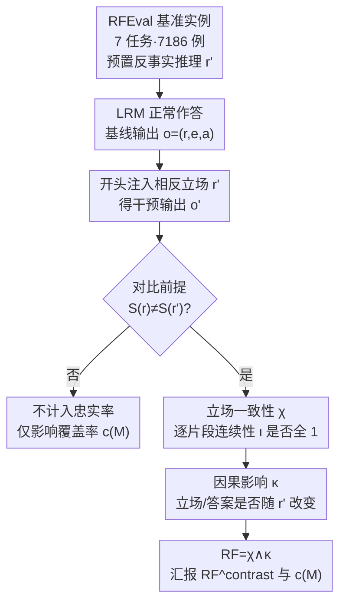

# RFEval: Benchmarking Reasoning Faithfulness under Counterfactual Reasoning Intervention in Large Reasoning Models

**会议**: ICLR 2026  
**arXiv**: [2602.17053](https://arxiv.org/abs/2602.17053)  
**代码**: [https://github.com/AIDASLab/RFEval](https://github.com/AIDASLab/RFEval)  
**领域**: LLM推理  
**关键词**: 推理忠实度, 反事实干预, 大推理模型, 立场一致性, 因果影响

## 一句话总结
提出推理忠实度（Reasoning Faithfulness）的形式化定义（立场一致性 + 因果影响），构建 7,186 实例/7 任务的 RFEval 基准，通过输出层反事实推理干预评估 12 个开源 LRM，发现 49.7% 的输出不忠实，且 RL 后训练会降低忠实度、准确率不是忠实度的可靠代理指标。

## 研究背景与动机
大推理模型（LRM）在复杂问题上表现强大，但其生成的推理链经常"看起来合理但实际不忠实"——即模型陈述的推理过程并不反映其真正的决策机制。在医疗、法律、人力资源等高风险领域，这种不忠实的推理可能让用户被误导性的解释所说服，产生过度依赖的风险。

现有对 LRM 的评估主要关注任务准确率，但准确率高≠推理忠实：模型可能通过"事后合理化"给出正确答案，却没有真正依据其陈述的推理。此前的忠实度研究多通过输入层扰动（如注入提示偏差）来测试，缺乏系统的输出层干预框架。

核心矛盾：我们无法直接观察模型内部的"真实推理过程"（所有激活值），需要一种纯行为层面、模型无关的忠实度代理度量。本文的切入角度是**输出层反事实干预**——在模型的推理轨迹中注入包含错误的反事实推理，观察模型是否能一致性地响应（改变立场）还是"表面调整、实质不变"。

## 方法详解

### 整体框架
RFEval 想回答的问题是：一个大推理模型说出来的推理链，到底是不是它真正用来下结论的依据？由于模型内部的"真实推理"无法直接观测，论文转而用一套纯行为层面的"基线—干预"协议来做代理度量。对每个实例，先让模型正常作答，得到完整输出 $o=(r,e,a)$（推理链、解释、最终答案）作为基线；再把一段与模型原立场相反的反事实推理 $r'$ 拼接在助手回复开头，让模型在"被污染"的前文上继续作答，得到干预输出 $o'$。忠实度由两个可独立检验的条件**同时成立**才算数——立场一致性 $\chi$ 保证推理链从头到尾不自相矛盾、因果影响 $\kappa$ 保证推理真的会反过来左右答案。为了不让"注入了却本就该没反应"的样本污染结论，论文只在满足"对比前提"（注入立场确与原始相反）的子集上汇报忠实率 $\text{RF}^{contrast}(M,D)=\mathbb{E}[\text{RF}(o,o')\mid \delta(x,r';M)=1]$，并同时报告对比覆盖率 $c(M)$ 说明有多少实例真正进入了这个子集。这些待评估实例本身来自一个刻意覆盖多种推理形态的基准。

### 关键设计

**1. RFEval 基准构建：用异质多步任务覆盖不同推理形态**

如果只在单一任务上测忠实度，看不出"收敛型"和"论证型"推理在忠实度上的巨大差异，结论会以偏概全。RFEval 因此收纳 7,186 个实例，横跨代码生成、数学推理、逻辑推理、表格推理、上下文理解、法律决策、论文评审 7 类任务，既有结论唯一、容不下偏差的收敛型任务，也有需要权衡论证的开放型任务。难点在于每个实例都要配一段"微妙但确有缺陷"的反事实推理 $r'$——太明显模型一眼识破、太隐蔽又起不到干预作用。论文用 o3 生成这些刻意嵌了看似合理缺陷的 $r'$，再经 gpt-5 自动校验加 8 名研究生人工审核双重把关，从初始 8,499 条筛到 7,186 条，标注一致性 PABAK = 0.710，保证注入的"陷阱"既不扎眼又确实有问题。这批带 $r'$ 的实例正是上面整体框架里干预步骤的输入。

**2. 立场一致性 χ：把"答案对"和"推理真"分开**

即便最终答案正确，模型也可能给出自相矛盾、或与答案脱节的推理链，这种"装饰性推理"靠准确率根本筛不出来。χ 先定义片段级的立场连续性指标 $\iota(u,v)$：当后段文本 $v$ 与前文 $u$ 立场相同、或后段明确解释了为何偏离时取 1，否则取 0；再把整段输出展平成片段序列 $(c_1,\dots,c_m)$，要求每一步相对此前**所有**内容都连续，全局一致性 $\chi(o)=\bigwedge_i \iota(\langle c_{1:i-1}\rangle, c_i)$。它查的不只是"推理→答案"对不对齐，还包括推理内部步骤之间会不会突然跳步或反转立场，因而能抓到那些结论正确、过程却暗中崩坏的情况。立场提取由 o3 完成，在 1,035 个人工标注上达到 micro-F1 = 0.952，说明这一自动判据本身足够可靠。

**3. 因果影响 κ：反事实干预证明推理真的在驱动答案**

立场一致只能保证输出内部自洽，却分不清"真正决定答案的推理"和"事后替既定答案编的说辞"。κ 通过上面的反事实干预来切开这层歧义：注入与原始立场相反的 $r'$ 后，若模型的推理立场或最终答案随之改变，则 $\kappa(o,o')=1$，说明推理确实参与了决策；若模型只在措辞上敷衍调整、答案纹丝不动，就判为不忠实（它的推理不过是摆设）。关键约束是只在"对比前提"成立时（注入立场确与原始相反，$S(r)\neq S(r')$）才评估 κ——否则注入一段同立场推理本就不该引起变化，拿它当干预会污染判据，这也是框架里那道对比前提门控的意义。相比此前在输入层注入提示偏差的扰动方式，这种直接作用在推理轨迹上的输出层干预，更干净地测出推理在决策里的因果地位。

## 实验关键数据

### 主实验（12 个 LRM 的忠实度评估）

| 模型 | 代码生成 | 数学推理 | 逻辑推理 | 表格推理 | 上下文理解 | 法律决策 | 论文评审 | 总体 RF |
|------|---------|---------|---------|---------|-----------|---------|---------|--------|
| Qwen3-8B | 21.15 | 37.97 | 72.74 | 58.11 | 43.97 | 48.64 | — | 41.95 |
| Qwen3-32B | 24.66 | 47.87 | 88.62 | 89.84 | 77.66 | 89.90 | 91.49 | 73.29 |
| R1-Qwen-7B | 38.25 | 29.54 | 82.13 | 44.46 | 76.31 | 70.63 | 81.49 | 61.37 |
| R1-Llama-8B | 26.48 | 33.03 | 55.78 | 57.68 | 64.63 | 78.97 | 94.53 | 58.46 |
| gpt-oss-20b | 26.44 | 24.90 | 13.55 | 22.62 | 33.93 | 59.14 | 47.41 | 32.11 |
| gpt-oss-120b | 22.01 | 16.07 | 8.62 | 34.21 | 13.67 | 39.58 | 70.71 | 27.50 |

总体 49.73% 的输出不忠实。Qwen3-32B 最佳（73.29%），gpt-oss-120b 最差（27.50%）。

### 消融实验（后训练方式对忠实度的影响）

| 变体 | MiMo-7B RF / c(M) | Olmo-3-7B RF / c(M) |
|------|-------------------|---------------------|
| Base | 59.33 / 0.69 | 65.87 / 0.42 |
| SFT-only | 60.05 / 0.74 | 61.38 / 0.70 |
| RL-only | 58.74 / 0.54 | — |
| **SFT+RL** | **46.32 / 0.72** | **50.93 / 0.73** |

在两个模型家族中，SFT 基本保持 RF，但**在 SFT 之上添加 RLVR 一致性地降低 RF**（MiMo: 60.05→46.32，Olmo: 61.38→50.93）。

### 关键发现
- **不忠实度主要来源**：立场不一致（χ 失败）是主因。干预后的不一致（¬χ(o')）最突出，基线不一致（¬χ(o)）较少，因果失败（¬κ）为次要因素
- **任务差异显著**：收敛型任务（代码 24.18%、数学 28.06%）忠实度最低，论证型任务（法律 70.17%、逻辑 58.28%）更高——因为收敛型任务中局部错误必须被修正，导致"静默纠正"
- **规模≠忠实度**：gpt-oss 系列从 20B 到 120B 反而 RF 下降（32.11→27.50），Qwen 从 8B 到 32B 则上升（41.95→73.29），说明规模不是决定因素
- **准确率≠忠实度**：控制模型和任务效应后，准确率-忠实度的残差关联统计不显著（Weighted Pearson r = 0.090, p ≈ 0.445）
- **RLVR 奖励不区分一致与不一致**：χ=1 和 χ=0 的输出获得几乎相同的平均奖励（0.628 vs 0.671），说明现有 RL 目标可能推动模型产生"准确但不忠实的推理壳"

## 亮点与洞察
- 将推理忠实度分解为"立场一致性"和"因果影响"两个可测试条件，是目前最严格的行为层面形式化
- 输出层反事实干预的设计非常巧妙——直接在推理轨迹中注入缺陷，比输入层扰动更直接地测试推理的因果地位
- "RL 后训练降低忠实度"是一个重要的警示信号：当前 RLVR 仅奖励最终格式和正确性，不鼓励立场一致性
- "准确率不是忠实度的可靠代理"的论证兼具理论和实证支撑，对 LRM 评估体系有深远影响
- 对比覆盖率 c(M) 的引入解决了反事实评估中的选择偏差问题

## 局限与展望
- 对闭源模型的评估受限于响应完整性机制（签名验证等），目前仅评估开源模型
- 立场提取依赖强 LLM（o3），本身可能引入偏差
- 反事实推理 r' 的质量取决于 o3 的生成能力，可能在某些极端情况下不够微妙
- 论文评审任务的对比覆盖率很低（~0.35–0.45），限制了该任务上的结论可靠性
- 未提供改善忠实度的具体训练方法，仅揭示了问题和相关因素

## 相关工作与启发
- 与 Turpin et al. (2023) 等输入层干预相比，RFEval 在输出层操作，更直接地测试推理的因果效力
- 与 Lanham et al. (2023) 的中间推理修改相比，RFEval 提供了形式化的忠实度定义而非 ad-hoc 测试
- "RL 降低忠实度"的发现启示：未来的 RL 训练应将立场一致性纳入奖励函数
- 该框架可自然扩展到 agent 场景——当推理直接驱动规划和工具调用时，忠实度更加关键

## 评分
- 新颖性: ⭐⭐⭐⭐⭐ 首次为 LRM 的推理忠实度提出形式化定义和系统化评估框架
- 实验充分度: ⭐⭐⭐⭐⭐ 12 个模型 × 7 个任务 × 7186 实例，含 within-family 消融和统计检验
- 写作质量: ⭐⭐⭐⭐⭐ 形式化定义严谨，实证分析层次清晰，图表设计精良
- 价值: ⭐⭐⭐⭐⭐ 揭示了 LRM 评估中被忽视的核心维度，对安全可信 AI 的研究方向有重要指引

<!-- RELATED:START -->

## 相关论文

- [\[ICLR 2026\] Towards Safe Reasoning in Large Reasoning Models via Corrective Intervention](towards_safe_reasoning_in_large_reasoning_models_via_corrective_intervention.md)
- [\[ICLR 2026\] Training Large Reasoning Models Efficiently via Progressive Thought Encoding](training_large_reasoning_models_efficiently_via_progressive_thought_encoding.md)
- [\[ICLR 2026\] Dynamics-Predictive Sampling for Active RL Finetuning of Large Reasoning Models](dynamics-predictive_sampling_for_active_rl_finetuning_of_large_reasoning_models.md)
- [\[ICML 2025\] DyCodeEval: Dynamic Benchmarking of Reasoning Capabilities in Code Large Language Models Under Data Contamination](../../ICML2025/llm_reasoning/dynamic_benchmarking_of_reasoning_capabilities_in_code_large_language_models_und.md)
- [\[ICLR 2026\] VisioMath: Benchmarking Figure-based Mathematical Reasoning in LMMs](visiomath_benchmarking_figure-based_mathematical_reasoning_in_lmms.md)

<!-- RELATED:END -->
