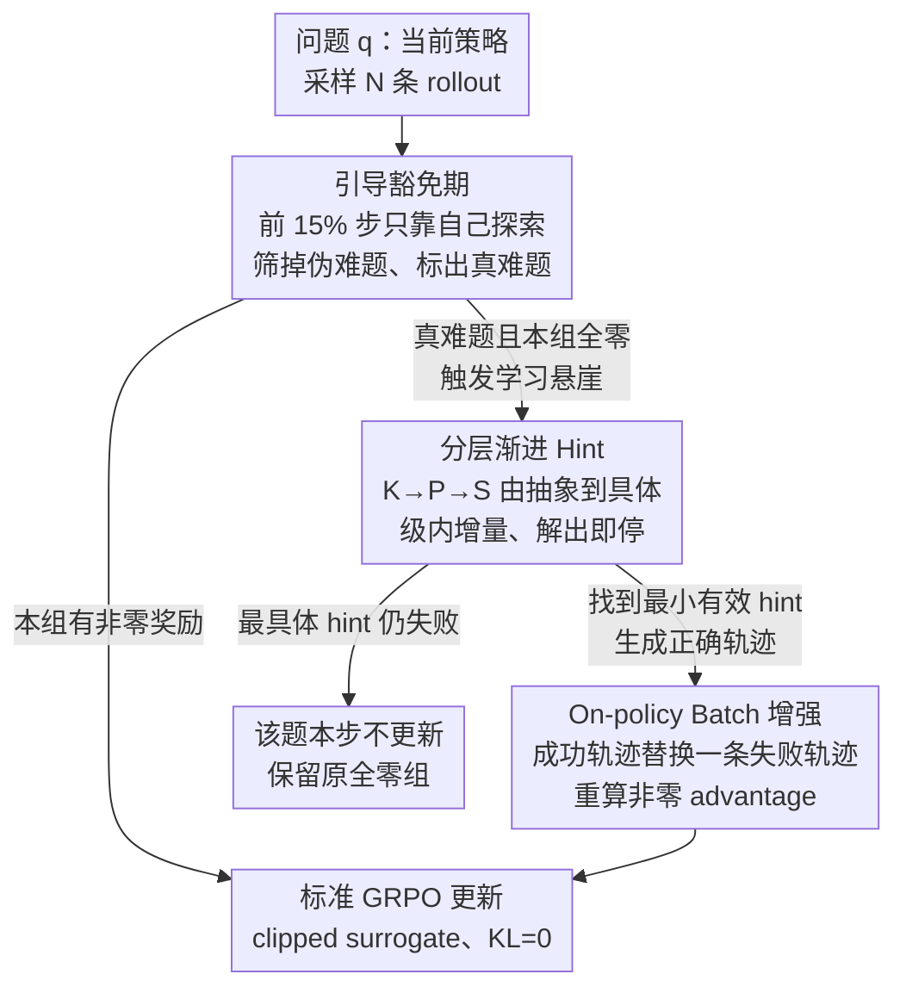

# Scaf-GRPO: Scaffolded Group Relative Policy Optimization for Enhancing LLM Reasoning

**会议**: ICLR 2026  
**arXiv**: [2510.19807](https://arxiv.org/abs/2510.19807)  
**代码**: 无  
**领域**: 优化 / LLM推理增强  
**关键词**: GRPO, 强化学习, 学习悬崖, 渐进式引导, 脚手架教学

## 一句话总结

提出 Scaf-GRPO 框架，通过分层级的 in-prompt hint 注入（知识→规划→解题步骤）来克服 GRPO 训练中"学习悬崖"(zero-reward)问题，在 Qwen2.5-Math-7B 上将 AIME24 的 pass@1 相对提升 44.3%，同时保持 on-policy 训练一致性。

## 研究背景与动机

**领域现状**：基于可验证奖励的强化学习（RLVR）已成为提升 LLM 推理能力的主流范式，GRPO 等算法通过组内相对奖励计算优势信号来更新策略。

**现有痛点**：当模型面对远超当前能力的难题时，所有探索性尝试都失败，产生持续的零奖励信号。在 GRPO 中，同组全零奖励导致 advantage $\hat{A}_i = \frac{R(o_i) - \mu_\mathcal{G}}{\sigma_\mathcal{G}} = 0$，梯度消失，形成"学习悬崖"(learning cliff)。

**核心矛盾**：现有解决方案（如 LUFFY）采用 prefix-continuation 策略——给模型提供正确解的前缀——但这造成 teacher 和 student 策略的分布不匹配，且强迫模型沿预定路径走，抑制了探索。

**本文目标** 在不引入 off-policy 分布不匹配的前提下，帮助模型克服学习悬崖，从无法解决的难题中学到推理能力。

**切入角度**：受教育学"脚手架理论"(Scaffolding) 启发，提供最小化的、渐进式的 in-prompt 提示，而非强制的解题路径前缀。

**核心 idea**：不给"铁轨"(prefix)而给"路标"(hint)——在 prompt 中注入分层提示使模型用自己的策略生成正确解，避免 off-policy 问题并保留探索自由度。

## 方法详解

### 整体框架

Scaf-GRPO 把训练切成两段：前 15% 步数是"引导豁免期"，模型完全靠自己探索，借此把"伪难题"刷掉、把真正啃不动的"真难题"筛出来；之后才对真难题介入。介入的方式是：一旦某个 batch 里所有 rollout 都拿到零奖励、advantage 归零，就按 Knowledge→Planning→Solution 三个层级由抽象到具体地往 prompt 里注入提示，直到模型用自己的策略生成出正确解，再拿这条成功轨迹替换掉组里一条失败轨迹，重新算出非零 advantage，最后照搬标准 GRPO 损失更新。整个干预只动数据、不动损失，模型始终在自己的分布上学习。

### 关键设计

**1. 引导豁免期：先让模型自己挣扎，再判断它是真不会还是装不会**

直接对所有零奖励问题塞提示会有副作用——很多题目并不是模型能力不够，而只是格式不熟、初级技巧没磨合，这类"伪难题"（pseudo-hard）会随着训练自然被攻克。Scaf-GRPO 因此在前 15% 步数里一律不给 hint，同时监控零奖励问题的解决速率：训练初期速率快速下降，对应的就是伪难题被陆续解决；当速率停滞、剩下一批怎么探索都过不了的问题，才把它们标记为"真难题"（true-hard）交给后续引导。这样 hint 只花在真正的能力缺口上，避免模型过早养成依赖提示的惰性——消融里把脚手架从第一步就开打、去掉豁免期，性能相对掉 9.2%。豁免期比例在 10%–40% 区间都稳定（高位平台 49.5–50.9），15% 是经验取值。

**2. 分层渐进 Hint：给路标而不给铁轨，奖励"用最少提示就解出来"**

对真难题，Scaf-GRPO 注入的是三级由抽象到具体的 in-prompt 提示：$H_{\text{knowledge}}$ 只点关键概念与公式，$H_{\text{planning}}$ 给出高层策略框架，$H_{\text{solution}}$ 才落到具体计算步骤。引导按 $H_{\text{knowledge}}\to H_{\text{planning}}\to H_{\text{solution}}$ 从最抽象的一级开始确定性搜索，每一级内部还把内容拆成 4 个递进小块逐块增量展示，模型一旦解出就立即停手并记下这次用到的最小有效提示级别；连最具体的 Solution hint 都解不出，就判为本步无解、不做替换。这套设计的核心是"最小干预"：越抽象的 hint 越逼模型自己补全推理链，因此能解出来时学到的是可迁移的技能而非对解法的记忆；反过来直接发 Solution hint 等于给铁轨，模型照抄一遍学不到泛化能力。三层互补缺一不可——去掉 Knowledge 层降到 49.2、去掉 Solution 层降到 48.0（降幅最大），把渐进式换成只给 Solution（Solution-Only）也要掉到 48.4，把级内增量换成一次性给完整 hint 则掉到 47.7。

**3. On-policy Batch 增强：只换数据不破坏 on-policy 一致性**

拿到成功的 hint-guided 轨迹后，Scaf-GRPO 用它替换组内一条随机的失败轨迹，$\mathcal{G}_{\text{final}} = (\mathcal{G} \setminus \{o_j\}) \cup \{o_h^*\}$，其中 $o_h^* \sim \pi_\theta(\cdot \mid q \oplus h^*)$ 由当前策略在"问题+提示"上自己采样得到。关键在概率比的写法：本方法对分子分母都用同一个 hint-augmented 条件 $q \oplus h^*$，即 $r_{i,t}'(\theta) = \frac{\pi_\theta(o_{i,t}'\mid o_{i,<t}', q \oplus h^*)}{\pi_{\theta_{\text{old}}}(o_{i,t}'\mid o_{i,<t}', q \oplus h^*)}$，这是标准的 on-policy 比率。而 prefix-based 方法（如 LUFFY）的比率分子用 $\pi_\theta(\cdot\mid q)$、分母用 $\pi_{\theta_{\text{old}}}(\cdot\mid q \oplus h^*)$，分子分母条件不一致，本质是 off-policy，需要额外的 policy shaping 去修分布不匹配。Scaf-GRPO 因为条件统一，省掉了这层修正，也保住了探索自由度。因为整组干预只触发在 zero-reward 的学习悬崖、且实测只占 17.4% 的样本，大部分算力仍跑标准生成。

### 损失函数 / 训练策略

损失沿用标准 GRPO 的 clipped surrogate objective，唯一区别在前面那条被换进来的成功轨迹及其重算的 advantage：$J_{\text{Scaf-GRPO}}(\theta) = \hat{\mathbb{E}}_{i,t}[\min(r_{i,t}'(\theta)\hat{A}_i', \text{clip}(r_{i,t}'(\theta), 1-\epsilon, 1+\epsilon)\hat{A}_i')]$。为了尽量放开探索，KL 散度惩罚直接设为 0；训练跑 10 epochs，最大响应长度 2048 tokens。

## 实验关键数据

### 主实验

| 模型 / 基准 | 指标 | Scaf-GRPO | Vanilla GRPO | LUFFY | 相对提升 |
|------------|------|-----------|-------------|-------|---------|
| Qwen2.5-Math-7B / AIME24 | pass@1 | 43.3 | 30.0 | 33.3 | +44.3% vs GRPO |
| Qwen2.5-Math-7B / AIME25 | pass@1 | 20.0 | 13.3 | 16.7 | +50.4% vs GRPO |
| Qwen2.5-Math-7B / AMC | pass@1 | 70.0 | 60.0 | 62.5 | +16.7% vs GRPO |
| Qwen2.5-Math-7B / 7基准平均 | pass@1 | 50.9 | 45.2 | 46.6 | +12.6% vs GRPO |
| Qwen2.5-Math-1.5B / 平均 | pass@1 | 41.5 | 37.6 | — | +10.4% |
| DeepSeek-R1-Distill-1.5B / 平均 | pass@1 | 53.6 | 50.6 | — | +5.9% |

### 消融实验

| 配置 | 7基准平均 | 说明 |
|------|----------|------|
| Full K→P→S | 50.9 | 完整三层级 |
| w/o Progressive (Solution-Only) | 48.4 | 直接给最具体 hint |
| w/o Knowledge Hint | 49.2 | 去掉概念层 |
| w/o Solution Hint | 48.0 | 去掉具体步骤层，降幅最大 |
| w/o Incremental Chunking | 47.7 | 一次性给完整 hint |
| No Guidance (Vanilla GRPO) | 45.2 | 无引导基线 |

### 关键发现

- 渐进式引导比直接给 Solution hint 好 2.5 分——抽象 hint 强迫模型自主推理，培养更泛化的技能
- 去掉任何一个 hint 层级都导致性能下降，三层互补而非冗余
- 增量式提供（逐步展示 hint 内容）比一次性提供好 3.2 分——最小干预原则有效
- 模型能展现从"模仿 hint"到"自主解题"的演化过程

## 亮点与洞察

- "路标 vs 铁轨"的比喻非常精准：in-prompt hint 允许模型自由选择推理路径，而 prefix-continuation 强制走预定路线
- 分层引导豁免期设计巧妙——先让模型自己挣扎一段时间才介入，类似好老师的做法
- 保持了 GRPO 损失函数的完整性，仅在数据层面干预，工程上简洁优雅

## 局限与展望

- 三级 hint 需要外部强模型（DeepSeek-R1）预先生成，增加了数据准备成本
- 目前仅在数学推理任务上验证，代码/逻辑推理等领域的迁移性未知
- hint 质量影响显著（用 DeepSeek-R1 vs Qwen-72B 差 4%），对 hint 生成的依赖是潜在瓶颈
- 引导豁免期百分比（15%）虽在 10%-40% 范围内稳定，但最优值可能因模型而异

## 相关工作与启发

- **vs LUFFY**: LUFFY 用 prefix-continuation 造成分布不匹配需要 policy shaping 修正，Scaf-GRPO 用 in-prompt hint 保持 on-policy，在 7B 模型上平均高 4.3 分
- **vs Vanilla GRPO**: GRPO 在零奖励时梯度为零导致学习停滞，Scaf-GRPO 通过 batch 增强恢复信号
- **vs DAPO/DeepScaleR**: 这些方法改进 GRPO 算法本身，Scaf-GRPO 改进数据/引导策略，两者正交可组合

## 评分

- 新颖性: ⭐⭐⭐⭐ 脚手架教学法在 RL 中的应用新颖，in-prompt hint 区别于 prefix-continuation 是关键创新
- 实验充分度: ⭐⭐⭐⭐ 多模型(Qwen/Llama/DeepSeek)多规模(1.5B~7B)，消融设计精细
- 写作质量: ⭐⭐⭐⭐ 动机阐述清晰，Figure 2 的训练动态可视化尤其直观
- 价值: ⭐⭐⭐⭐ 为 RLVR 的学习悬崖问题提供了实用且有理论支撑的解决方案

<!-- RELATED:START -->

## 相关论文

- [\[ICLR 2026\] Slow-Fast Policy Optimization: Reposition-Before-Update for LLM Reasoning](slow-fast_policy_optimization_reposition-before-update_for_llm_reasoning.md)
- [\[ICLR 2026\] DRPO: Efficient Reasoning via Decoupled Reward Policy Optimization](drpo_efficient_reasoning_via_decoupled_reward_policy_optimization.md)
- [\[ICLR 2026\] On the Design of KL-Regularized Policy Gradient Algorithms for LLM Reasoning](on_the_design_of_kl-regularized_policy_gradient_algorithms_for_llm_reasoning.md)
- [\[ACL 2026\] Think Outside the Policy: In-Context Steered Policy Optimization](../../ACL2026/llm_reasoning/think_outside_the_policy_in-context_steered_policy_optimization.md)
- [\[ICLR 2026\] Stabilizing Policy Gradients for Sample-Efficient Reinforcement Learning in LLM Reasoning](stabilizing_policy_gradients_for_sample-efficient_reinforcement_learning_in_llm_.md)

<!-- RELATED:END -->
