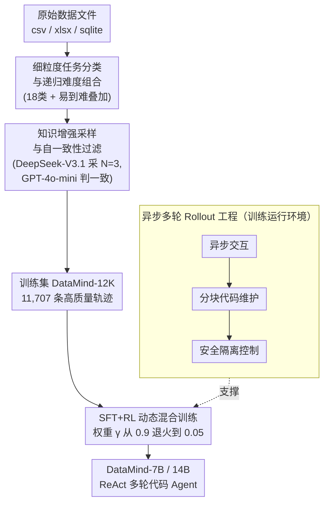

# Scaling Generalist Data-Analytic Agents

**会议**: ICLR 2026  
**arXiv**: [2509.25084](https://arxiv.org/abs/2509.25084)  
**代码**: [GitHub](https://github.com/zjunlp/DataMind)  
**领域**: LLM推理  
**关键词**: 数据分析Agent, Agent训练, 多轮代码执行, 数据合成, SFT+RL

## 一句话总结

提出 DataMind——一套完整的数据分析 Agent 训练方案，通过细粒度任务分类+递归难度组合实现多样 query 合成、知识增强轨迹采样+自一致性过滤保证数据质量、SFT+RL 动态混合训练策略以及内存友好的异步 rollout 框架，训练出的 DataMind-14B 以 71.16% 平均分在多个基准上 SOTA，超越 GPT-5 和 DeepSeek-V3.1。

## 研究背景与动机

**领域现状**：数据分析 Agent 通过生成代码处理、建模和计算数据来发现有用信息，是 AI 驱动科学发现和自动化决策支持的关键催化剂。现有数据分析 Agent（DS-Agent、AutoKaggle、Data Interpreter 等）几乎完全依赖闭源模型通过 prompt 工程和多 Agent 脚手架构建。

**现有痛点**：
- **训练数据不足**：公开数据分析基准仅提供有限测试集，缺乏分步轨迹标注，无法直接用于训练
- **训练策略不明**：SFT-then-RL 的传统范式在长程 Agent 训练中如何分配步数、如何保持稳定性不清楚
- **多轮代码执行不稳定**：数据文件和代码解释器涉及复杂内存管理，并行 Agent rollout + 多轮代码生成在有限内存资源下容易崩溃
- **开源模型能力断层**：少数开源训练模型(TableLLM、Table-R1)仅能处理简单表格理解任务，面对多样格式的大规模数据文件和长程多步推理即崩溃

**核心矛盾**：高质量训练需要大量多样的轨迹数据+稳定的训练策略+可靠的环境交互，但这三者在数据分析场景中均面临独特挑战——数据分析任务格式多样(csv/xlsx/sqlite)、推理链路长、代码执行有副作用。

**本文方案**：提出 DataMind，一套端到端可扩展的数据合成+Agent 训练方案，系统性解决上述三大挑战。

## 方法详解

### 整体框架

DataMind 要解决的是"开源模型从零训练成通用数据分析 Agent"这件事，难点卡在三处：没有带分步轨迹的训练数据、长程 Agent 该怎么混 SFT 与 RL 不清楚、多轮代码执行在有限内存下容易崩。它把这三处难点对应成一条端到端流水线：先用细粒度任务分类加递归难度组合**合成多样且带难度梯度的 query**，再**采样高质量轨迹并双重过滤**得到训练集 DataMind-12K，然后用 SFT 与 RL **动态混合的目标**联合优化模型，全程跑在一套为多轮代码执行特制的**异步 rollout 框架**上。训练出的 Agent 遵循 ReAct 范式，在 Thought → Action（Python/SQL 代码）→ Observation（执行反馈）的循环中最多迭代 $\mathcal{T}=10$ 轮，直到给出最终答案。

### 关键设计

**1. 细粒度任务分类与递归难度组合：让合成 query 既多样又有难度梯度**

数据分析基准只给少量测试集、没有可训练的分步轨迹，直接用专家模型批量造题又容易题型单一、难度扁平。DataMind 先把数据分析拆成 **18 个细粒度类别**（数据清洗、统计描述、相关性分析、时序分析、异常检测等），每类配范例 query 作 few-shot 示范，保证横向覆盖广。难度则靠**递归组合**纵向放大：把前一个任务的输出当作下一个任务的输入，层层链式叠加，造出远超单一任务能力需求的多跳分析挑战。底层数据文件覆盖三种主流格式——Kaggle 的 3,400 个 csv 加 560 个 xlsx，以及 BIRD/OmniSQL 的 1,954 个 sqlite，从源头保证 Agent 见过多样的真实文件。

**2. 知识增强采样与自一致性过滤：用两道关卡换来轨迹的答案正确性**

专家模型直接 rollout 出的轨迹答案对错混杂，拿去 SFT 会把错误推理也学进去。DataMind 设两级质量保证。采样阶段为每类任务手工写一份高层 workflow 知识 $k$ 注入提示，引导专家模型 DeepSeek-V3.1 生成更规范的轨迹，每个 query 独立采 $\mathcal{N}=3$ 条。过滤阶段用裁判模型 GPT-4o-mini 检查这 $\mathcal{N}$ 条轨迹的最终答案是否一致：一致就从中挑最简洁准确的一条作训练实例；不一致则把裁判的 CoT 反馈回 Agent 让它反思修正后再过一遍过滤。最后叠加格式合规、答案 < 1024 tokens、语言完整等规则过滤，得到 **DataMind-12K**（11,707 条高质量轨迹）。后续消融证明这道自一致性关卡比"挑最佳轨迹"更关键——答案正确性才是轨迹内在质量的根。

**3. SFT+RL 动态混合训练：用一个会退火的权重同时吃专家知识和自主探索**

传统 SFT-then-RL 两头不讨好：SFT 阶段过长会固化思维模式、扼杀后续 RL 的探索空间，而 RL 上得太早模型又弱到 rollout 不出有效轨迹组。DataMind 改为全程联合优化，把两个损失加权相加：

$$\mathcal{L}_{\text{Final}}(\theta) = \gamma \cdot \mathcal{L}_{\text{SFT}}(\theta) + (1-\gamma) \cdot \mathcal{L}_{\text{DAPO}}(\theta)$$

其中权重 $\gamma$ 像"养育孩子"一样动态调度——初始取大值 0.9 让模型先从专家数据吸收知识，再逐步退火到 0.05 把主导权交给 RL 鼓励探索。SFT 损失只在 Agent 生成的 token 上计算、mask 掉环境反馈 token，RL 侧用带解耦裁剪和动态采样的 DAPO 算法，训练前先用 DataMind-12K 做 cold start。为防止崩溃，还引入 **Void Turns 过滤**：只要一条轨迹里出现无效轮次（没产出有效代码或答案），就直接 mask 掉整条轨迹的损失，避免分布漂移把训练带偏。

**4. 异步多轮 Rollout 工程：让多轮代码执行在有限内存里不崩**

数据文件和代码解释器涉及复杂内存管理，并行 Agent 一边生成一边执行多轮代码很容易把内存打爆，这正是上面那张图里支撑训练的运行环境。DataMind 用三招稳住环境交互：**异步交互**把模型生成和代码执行在不同样本间解耦，错开 GPU 与 CPU 的内存峰值；**分块代码维护**采用 notebook 风格，每步只生成当前代码片段、执行时再拼接历史片段，省去维护全局变量池的内存开销；**安全控制**给每条轨迹隔离运行环境、限制 CPU 时间和峰值内存、过滤不安全函数调用。三者合力让大规模并行 rollout 在有限资源下稳定跑通。

## 实验结果

### 主实验：多基准性能对比

| 模型类型 | 方法 | DABench pass@1 | TableBench pass@1 | BIRD pass@1 | Avg pass@1 |
|---------|------|---------------|-------------------|-------------|------------|
| **闭源** | GPT-4o | 76.39 | 64.97 | 50.20 | 63.85 |
| **闭源** | o4-mini | 79.12 | 71.03 | 57.04 | 69.06 |
| **闭源** | DeepSeek-R1 | 78.73 | 68.96 | 55.80 | 67.83 |
| **闭源** | DeepSeek-V3.1 | 81.32 | 72.52 | 57.89 | 70.58 |
| **闭源** | GPT-5 | 78.21 | 69.93 | 60.17 | 69.44 |
| 开源-7B | ReAct (Qwen-Coder-7B) | 15.05 | 11.70 | 7.02 | 11.26 |
| 开源-7B | TableLLM | 36.71 | 41.01 | 11.99 | 29.90 |
| 开源-7B | Table-R1 | 42.54 | 56.36 | 10.69 | 36.53 |
| 开源-7B | **DataMind-7B** | **77.30** | **67.60** | **59.41** | **68.10** |
| 开源-14B | ReAct (Qwen-Coder-14B) | 71.21 | 56.96 | 41.76 | 56.64 |
| 开源-14B | TableLLM | 38.26 | 46.44 | 20.99 | 35.23 |
| 开源-14B | **DataMind-14B** | **80.29** | **70.95** | **62.23** | **71.16** |

关键发现：
- DataMind-14B 以 71.16% 平均分**超越所有闭源模型**（包括 GPT-5 的 69.44% 和 DeepSeek-V3.1 的 70.58%）
- DataMind-7B 以 68.10% 在所有开源模型中最优
- 专项模型(OmniSQL/SQL-R1)虽在 BIRD 上有竞争力，但在其他基准上性能骤降
- DataMind 训练数据仅 12K，远少于基线(TableLLM 20K、OmniSQL 2.5M)

### 消融实验：训练策略对比

| 训练策略 | Avg pass@1 | Avg pass@3 |
|---------|------------|------------|
| SFT only | 62.54 | 73.74 |
| zero-RL (无 SFT) | 58.03 | 71.72 |
| SFT-then-RL | 63.42 | 75.46 |
| **SFT-and-RL (动态 $\gamma$)** | **68.10** | **79.07** |

关键洞察：
- 纯 SFT 将基线从 11.26% 提升到 62.54%——**数据质量贡献了大部分性能提升**
- zero-RL 反而比 SFT 差——7B 模型多步推理能力有限，无法独立 rollout 高质量轨迹
- SFT-then-RL 仅有边际提升——且训练易崩溃
- 动态混合策略再提升 5.56 个百分点——兼顾知识吸收和探索

### 数据与过滤分析

| 过滤策略 | 效果 |
|---------|------|
| Con-select (自一致性+最佳选择) | 基准设置 |
| Non-select (保留所有一致轨迹) | DABench 上反而更优——轨迹多样性更重要 |
| Random-select (随机选择一致轨迹) | 与 con-select 接近——裁判偏好可能降低多样性 |
| Non-con (无一致性过滤) | **全部指标显著下降**——答案质量是轨迹质量的关键保证 |

核心发现：**自一致性过滤比最佳轨迹选择更关键**——答案正确性保证了轨迹的内在质量，而多样的推理路径比单一"最佳"路径更有益于模型学习。

## 论文评价

### 优点
- **工程完整性强**：从数据合成、训练策略到 rollout 工程的端到端系统设计，每个环节都有独立创新
- **洞察深刻**：SFT 损失既是 RL 训练的稳定器也可能是崩溃的元凶、自一致性过滤比最佳选择更重要等发现具有很强的实践指导价值
- **结果令人信服**：仅 12K 数据训练的 14B 模型超越 GPT-5 和拥有 2.5M 数据的专项模型
- **训练动态分析**（"养育孩子"类比）形象直观地解释了 SFT→RL 的动态权重调度原理

### 不足
- 评估使用 GPT-4o-mini 作为裁判，训练和评估用同一裁判存在潜在偏差（虽然交叉验证显示 Pearson 相关 0.96）
- 任务分类法(18 类)的设计依赖人工，分类边界和覆盖范围可能存在遗漏
- 仅验证 7B 和 14B 规模，更大/更小模型上的表现未知
- 分块代码维护策略可能在长依赖链(如跨多轮的变量引用)场景下效率降低

### 评分
⭐⭐⭐⭐⭐ — 系统性工程工作的典范：问题定义明确、方案完整、实验扎实、洞察深刻，对 Agent 训练社区具有很强的参考价值。

<!-- RELATED:START -->

## 相关论文

- [\[ICLR 2026\] Understanding the Role of Training Data in Test-Time Scaling](understanding_the_role_of_training_data_in_test-time_scaling.md)
- [\[ICLR 2026\] Agentified Assessment of Logical Reasoning Agents](agentified_assessment_of_logical_reasoning_agents.md)
- [\[ICLR 2026\] Estimating the Empowerment of Language Model Agents](estimating_the_empowerment_of_language_model_agents.md)
- [\[ICLR 2026\] Adaptive Social Learning via Mode Policy Optimization for Language Agents](adaptive_social_learning_via_mode_policy_optimization_for_language_agents.md)
- [\[ACL 2026\] FS-Researcher: Test-Time Scaling for Long-Horizon Research Tasks with File-System-Based Agents](../../ACL2026/llm_reasoning/fs-researcher_test-time_scaling_for_long-horizon_research_tasks_with_file-system.md)

<!-- RELATED:END -->
