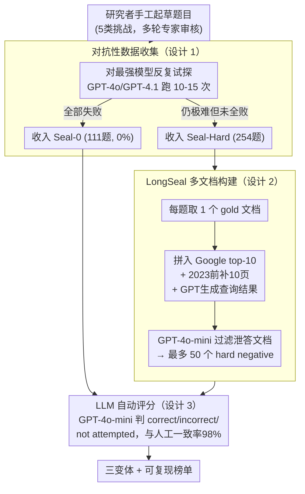

# SealQA: Raising the Bar for Reasoning in Search-Augmented Language Models

**会议**: ICLR 2026  
**arXiv**: [2506.01062](https://arxiv.org/abs/2506.01062)  
**代码**: [HuggingFace](https://huggingface.co/datasets/vtllms/sealqa)  
**领域**: LLM推理  
**关键词**: benchmark, search-augmented LLM, RAG, noisy retrieval, test-time scaling, knowledge conflict

## 一句话总结

提出SealQA挑战基准（含Seal-0/Seal-Hard/LongSeal三种变体），每道题均经NLP研究者精心设计以触发歧义/冲突/噪声搜索结果，GPT-5最高仅43.2%准确率，揭示test-time scaling在噪声检索下不产生可靠增益。

## 研究背景与动机

**领域现状**：LLM已进入test-time scaling新范式，推理模型可分解问题、决定何时搜索、融合检索内容到推理路径中。前沿模型在MMLU等传统基准上已超过90%准确率，现有评估趋于饱和。

**现有痛点**：多数搜索增强LLM评估聚焦短事实性查询，top-ranked结果即可直接回答，仅需浅层理解。这无法反映真实搜索的混乱本质——返回的文档可能过时、误导或表面相关但实际无用。

**核心矛盾**：真实信息检索需要深层推理来过滤不一致信息、调和矛盾、识别可信信号，但现有基准无法模拟这些挑战。部分原因在于此类数据集难以大规模策划和验证。

**本文方案**：提出SealQA，一个小而极具挑战性的基准，每道题由NLP研究者精心设计，经多轮严格审核，专门触发歧义/冲突/噪声搜索结果。包含三种变体覆盖不同维度的搜索增强推理挑战。

## 方法详解

### 整体框架

SealQA不是一个新模型，而是一套**反向设计的搜索增强推理基准**——它的核心思路是让搜索本身成为陷阱而非帮助：每道题都由NLP研究者手工编写并对抗最强模型迭代，逼出"检索结果歧义/冲突/噪声、越查越乱"的真实场景。整条流水线从研究者起草题目开始，经多轮人工审核与对抗筛选，沉淀出三种变体：核心集Seal-0（111题，每题在GPT-4o、GPT-4.1等多个前沿模型10-15次尝试中准确率均为0%）、更宽松的Seal-Hard（254题，含Seal-0及其他未达零准确率阈值但仍极具挑战的题）、以及"大海捞针"式的LongSeal（254题，每题在gold文档外再塞最多50个精心构造的hard negative）。评测时用一个改编自SimpleQA的LLM裁判自动判分。题目横跨5类挑战：高级推理 $\mathcal{Q}_1$（72.4%）、实体/事件消歧 $\mathcal{Q}_2$（58.3%）、时间追踪 $\mathcal{Q}_3$（13.7%）、跨语言推理 $\mathcal{Q}_4$（5.5%）、虚假前提检测 $\mathcal{Q}_5$（4.3%），多数题同时命中两类以上。

### 关键设计

**1. 对抗性数据收集：把"题目浅"这个饱和根因彻底反转**

现有基准之所以饱和，根因是题目本身浅——top检索结果就能直接作答。SealQA反其道而行：每道题由NLP研究者亲手编写并迭代精炼，**直到GPT-4o、GPT-4.1等多个前沿模型在10-15次尝试中全部失败**才收入Seal-0。这把SimpleQA"GPT-4一次失败"的门槛进一步抬到"所有最强模型多次全败"。流程上每题先由2名以上研究生级审核者审查、再经专家批准，平均开发时间超过1小时（约45分钟起草加额外审核修订），6名研究者历时8个月。代价是规模小（Seal-0仅111题），但小规模反而换来两个好处：一是大幅降低API评估成本，允许频繁更新答案对抗数据污染；二是手工对抗筛选让难度不会随模型变强而快速失效——这是自动生成基准做不到的。

**2. LongSeal 多文档构建：在 50 个似是而非的干扰里藏一根针**

光有难题还不够，真实检索的痛点是模型要从一堆"看着相关、实则无用"的文档里挑出真正的证据。LongSeal为每道Seal-Hard题配一组上下文：1个gold文档（来自标注者提供的网页）外加最多50个hard negative。这些negative不是随机抓取，而是刻意构造的强干扰——Google检索的top-10网页、限制2023年前内容的额外10页、再加上用GPT-4o-mini生成的3个语义相关查询所返回的结果；最后还用GPT-4o-mini过滤掉那些可能让模型反推出正确答案的文档，避免"泄答"。由此得到的长上下文同时考验模型抵抗噪声的能力，并暴露其位置偏差与相关性建模的短板（实验里干扰文档从 $k=12$ 增到 $k=30$，准确率随之下滑）。

**3. LLM 自动评分：用裁判模型换来可复现，又不牺牲一致性**

开放式问答的评估难点在于答案表述多样、字符串匹配判不准。SealQA改编自SimpleQA的GPT-4o-mini评分器，输入问题、预测答案与参考答案，输出"correct / incorrect / not attempted"三态判定——关键在于把"答错"和"弃答"分开，否则模型靠大量弃答也能刷低错误率。为验证裁判可靠，作者人工核对了100个答案，与自动评分器一致率达98%，足以支撑20+模型的大规模、可复现评测。

## 实验关键数据

### 主实验

| 模型 | Seal-0 (w/o search) | Seal-0 (w/ search) | Seal-Hard (w/o search) | Seal-Hard (w/ search) |
|------|---------------------|--------------------|-----------------------|----------------------|
| GPT-4o | 0.0% | 0.0%† | 11.8% | 15.0%† |
| GPT-4.1 | 0.0% | 0.0%† | 15.0% | 20.5%† |
| o3-mini-high | 3.6% | 1.8% | 12.6% | 14.2% |
| o3-high | - | 14.4%† | - | 32.7%† |
| GPT-5-high | 15.3% | **43.2%**† | 37.8% | **63.8%**† |
| DeepSeek-R1-671B | 5.4% | 1.8% | **22.4%** | 11.0% |
| Qwen3-235B | 0.0% | 5.4% | 4.3% | 11.4% |
| Llama-4-Scout | 0.0% | 0.0% | 5.9% | 5.9% |

†使用ChatGPT内置搜索；其余使用FreshPrompt。

### 消融实验：Test-time Scaling效果

| 模型 | Low Effort | Medium Effort | High Effort |
|------|-----------|---------------|-------------|
| o3-mini (Seal-0) | 1.8% | 2.7% | 1.8% |
| o4-mini (Seal-0) | **6.3%** | 5.4% | 4.5% |
| o3 (Seal-0) | 11.7% | **17.1%** | 14.4% |

增加test-time计算不产生可靠增益，性能经常平台化甚至下降。

### 关键发现

- **高级推理模型对噪声极度敏感**：DeepSeek-R1使用FreshPrompt后Seal-Hard准确率从22.4%降至11.0%，在never-changing问题上下降17.7%
- **搜索可能有害**：GPT-4.1-mini使用内置搜索后准确率从13.8%降至11.8%
- **人类显著优于模型**：人类在50题Seal-Hard子集上开放搜索平均38.8%、oracle模式50.4%，最佳人类64.0%/72.0%
- **LongSeal中干扰越多性能越差**：GPT-4.1-mini在k=12时32.7% → k=30时29.5%；即使仅提供gold文档（无干扰），GPT-4.1仅48.0%准确率
- **不存在经典位置偏差**：新模型已缓解"lost-in-the-middle"效应，但识别相关文档仍是核心困难

## 亮点与洞察

- 极具创新性的对抗性基准构建方法，确保每道题对当前最强模型构成实质挑战
- 揭示了test-time scaling的局限——在噪声检索下更多推理可能放大虚假信息
- 证明了内置搜索训练（如ChatGPT）比检索式提示方法（FreshPrompt）更有效
- 动态版本化基准设计，承诺定期更新答案以反映最新知识

## 局限与展望

- 数据集规模小（Seal-0仅111题），统计显著性可能受限
- 答案随时间变化需持续维护，长期可持续性存疑
- 评估仅覆盖英文问题，跨语言推理类别较少（5.5%）
- 仅关注事实性问答，未覆盖更复杂的推理类型（如数学证明、代码生成）

## 相关工作与启发

- **SimpleQA**（Wei et al., 2024）：SealQA在其对抗性收集理念上进一步发展，将难度从"GPT-4失败"提升至"所有前沿模型多次尝试均失败"
- **FreshLLMs**（Vu et al., 2024）：SealQA的时间敏感性分类和FreshPrompt方法直接来源于此
- **BrowseComp**（Wei et al., 2025）：互补的浏览能力评估，SealQA更聚焦推理而非信息获取
- 对RAG系统设计的启发：naive检索整合可能放大噪声，需要更鲁棒的证据筛选和冲突解决机制

## 评分

- 新颖性: ⭐⭐⭐⭐⭐ 首个专门针对噪声/冲突检索结果设计的对抗性搜索增强基准，填补重要空白
- 实验充分度: ⭐⭐⭐⭐⭐ 涵盖20+模型，含人类评估、多维度消融（问题类型/时间/搜索方法/test-time scaling）
- 写作质量: ⭐⭐⭐⭐ 结构清晰，图表丰富，但部分表格信息密度较高
- 价值: ⭐⭐⭐⭐⭐ 揭示了当前最强LLM在真实搜索场景下的根本性局限，对RAG系统设计有重要指导意义

<!-- RELATED:START -->

## 相关论文

- [\[ICLR 2026\] AgentMath: Empowering Mathematical Reasoning for Large Language Models via Tool-Augmented Agent](agentmath_empowering_mathematical_reasoning_for_large_language_models_via_tool-a.md)
- [\[ICML 2026\] Prism: Efficient Test-Time Scaling via Hierarchical Search and Self-Verification for Discrete Diffusion Language Models](../../ICML2026/llm_reasoning/prism_efficient_test-time_scaling_via_hierarchical_search_and_self-verification_.md)
- [\[ICLR 2026\] Efficient Test-Time Scaling for Small Vision-Language Models](efficient_test-time_scaling_for_small_vision-language_models.md)
- [\[ICLR 2026\] Vision-R1: Incentivizing Reasoning Capability in Multimodal Large Language Models](vision-r1_incentivizing_reasoning_capability_in_multimodal_large_language_models.md)
- [\[ICLR 2026\] InftyThink: Breaking the Length Limits of Long-Context Reasoning in Large Language Models](inftythink_breaking_the_length_limits_of_long-context_reasoning_in_large_languag.md)

<!-- RELATED:END -->
