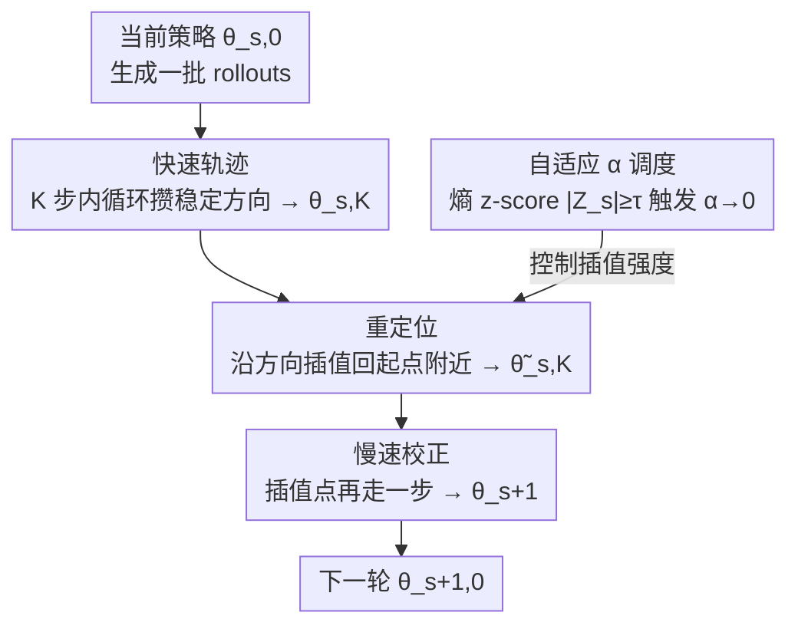

# Slow-Fast Policy Optimization: Reposition-Before-Update for LLM Reasoning

**会议**: ICLR 2026  
**arXiv**: [2510.04072](https://arxiv.org/abs/2510.04072)  
**代码**: [slow-fast-po.github.io](https://slow-fast-po.github.io/)  
**领域**: LLM对齐  
**关键词**: 强化学习, GRPO, 策略优化, 数学推理, 样本效率

## 一句话总结

提出 SFPO（Slow-Fast Policy Optimization），通过将每个训练步分解为"快速轨迹—重定位—慢速校正"三阶段结构，在不修改目标函数和 rollout 过程的前提下即插即用地增强 GRPO 的稳定性和样本效率，在数学推理基准上平均提升最高 2.80 分，rollout 减少最多 4.93 倍。

## 研究背景与动机

- 强化学习（RL）已成为提升 LLM 推理能力的核心手段，GRPO 是广泛使用的无 critic 策略梯度方法
- **GRPO 的局限性**：
    - 训练早期 rollout 质量差，随机奖励导致**高方差梯度**，更新不稳定
    - 每批 rollout 只做**单步更新**（one-shot），浪费了可进一步利用的梯度信息
    - 简单复用 rollout 数据会引入 off-policy 偏差，后期反而降低性能
- 需要一种能稳定梯度方向、提高样本利用率、同时控制分布偏移的更新机制

## 方法详解

### 整体框架

SFPO 不动 GRPO 的目标函数和 rollout 过程，只把原本"一批 rollout 走一步梯度"的更新方式换成"快走几步—拉回来—再慢走一步"的三段结构。对同一批数据先做 $K$ 步内循环快速更新攒出一个稳定方向（快速轨迹），再把终点沿这个方向插值回起点附近控制漂移（重定位），最后在插值点做一步校正更新（慢速校正），从而在不引入额外采样的前提下榨干每批 rollout 的梯度信息。三段之外还有一个旁路的自适应 $\alpha$ 调度，靠监控策略熵在训练后期把插值强度关掉、退化回纯 GRPO。

### 关键设计

**1. 快速轨迹：用多步内循环把高方差梯度滤成稳定方向**

GRPO 每批 rollout 只更新一步，训练早期随机奖励带来的高方差梯度会直接污染这一步。SFPO 从参数 $\theta^{s,0}$ 出发做 $K$ 步内循环更新 $\theta^{s,k+1} = \theta^{s,k} - \eta \nabla_\theta \mathcal{L}(\theta^{s,k})$（$k=0,\ldots,K-1$），最终位移 $\theta^{s,K} - \theta^{s,0} = -\eta \sum_{k=0}^{K-1} \nabla_\theta \mathcal{L}(\theta^{s,k})$ 累积了 $K$ 个梯度。在二阶近似下这等价于一个曲率感知的低通滤波器：沿某个曲率为 $\lambda$ 的特征方向，增益为 $(1-(1-\eta\lambda)^K)/\lambda$——平坦方向（$\lambda$ 小）按 $K\eta$ 稳步累积前进，高曲率方向（$\lambda$ 大）自动饱和、抑制振荡，相当于把单次噪声梯度替换成一段轨迹的平滑趋势。

**2. 重定位：用插值系数当隐式信赖域，控住 off-policy 漂移**

快速轨迹的 $K$ 步内循环全程复用 $\theta^{s,0}$ 生成的 rollout，走得越远参数离采样策略越远，更新就从 on-policy 变成 off-policy、后期反而掉点。受 Lookahead Optimizer 启发，SFPO 把终点插值回起点 $\widetilde{\theta}^{s,K} = \theta^{s,0} + \alpha(\theta^{s,K} - \theta^{s,0})$，其中 $\alpha \in [0,1]$。这一步等价于求解以 $\theta^{s,0}$ 为中心的线性化近端子问题，$\alpha$ 充当隐式信赖域半径——$\alpha$ 越小近端正则越强、越贴近 on-policy，越大越激进，于是用一个标量就把"利用多步收益"和"控制分布偏移"之间的张力调成可控。

**3. 慢速校正：在插值点再走一步，对齐局部曲率**

插值点 $\widetilde{\theta}^{s,K}$ 只是快速轨迹的一个缩放，并不保证落在当前曲率下的好位置。SFPO 在该点再做一步梯度更新 $\theta^{s+1} = \widetilde{\theta}^{s,K} - \eta \nabla_\theta \mathcal{L}(\widetilde{\theta}^{s,K})$，与前两段构成 predictor-corrector（预测—校正）结构：快速轨迹负责预测大致方向，这一步负责按局部曲率修正落点。把三段合起来，单次迭代的整体更新可写成

$$\theta^{s+1} = \theta^{s,0} - \eta \left[\alpha \sum_{k=0}^{K-1} \nabla_\theta \mathcal{L}(\theta^{s,k}) + \nabla_\theta \mathcal{L}(\widetilde{\theta}^{s,K})\right]$$

即"$\alpha$ 加权的累积快梯度"加"一步校正梯度"。

**4. 自适应 $\alpha$ 调度：靠熵的异常信号在收敛期退化回纯 GRPO**

三段结构在早期梯度信号强时加速明显，但训练后期策略接近最优时信号变弱、曲率与噪声主导，激进插值反而放大漂移。SFPO 在线监控策略熵 $H_s$，维护最近 $\omega$ 步的滚动缓冲并算单边 z-score $Z_s = (H_s - \mu_s) / \sigma_s$，一旦 $|Z_s| \geq \tau$（熵出现显著异常波动、暗示已逼近局部最优）就标记该步 $s^\star$ 并对之后所有步置 $\alpha \to 0$，此后更新退化为标准 GRPO 的单步 on-policy 形式。这样早期用快速轨迹抢收敛速度，后期自动切回纯 on-policy 保稳定性，整个切换由数据驱动、无需手工指定时间点。

### 损失函数 / 训练策略

SFPO 完全不改底层损失，直接沿用 GRPO 的裁剪目标加 KL 正则：

$$\mathcal{J}_{GRPO}(\theta) = \frac{1}{G}\sum_{i=1}^G \frac{1}{|o_i|}\sum_{t=1}^{|o_i|} \min(r_{i,t}(\theta)\hat{A}_{i,t}, \text{clip}(r_{i,t}(\theta), 1-\epsilon, 1+\epsilon)\hat{A}_{i,t}) - \beta D_{KL}[\pi_\theta \| \pi_{ref}]$$

所有改动只发生在"如何用这批数据更新参数"这一层，因此可即插即用替换 GRPO 的更新步骤，且因不需存储额外优化器状态而不增加显存开销。涉及的额外超参数仅 $K$（内循环步数）、$\alpha_0$（初始插值系数）、调度相关的 $\omega$ 与触发阈值 $\tau$。

## 实验关键数据

### 主实验：数学推理基准（DAPO+Math 训练集）

| 模型 | 方法 | Math-500 | AIME24 | AIME25 | AMC | Minerva | Olympiad | Avg |
|------|------|----------|--------|--------|-----|---------|----------|-----|
| Qwen2.5-Math-1.5B | GRPO | 77.15 | 16.67 | 11.67 | 53.31 | 31.89 | 39.42 | 38.35 |
| | **SFPO** | **78.35** | **20.00** | **15.00** | **56.02** | **32.07** | **39.72** | **40.19** |
| DS-Qwen-1.5B | GRPO | 84.65 | 30.00 | 23.33 | 66.86 | 31.71 | 49.85 | 47.73 |
| | **SFPO** | **86.10** | **32.50** | **30.83** | **70.28** | **32.81** | **50.67** | **50.53** |
| DS-Qwen-7B | GRPO | 91.70 | 50.00 | 35.83 | 80.42 | 43.65 | 61.24 | 60.47 |
| | **SFPO** | **92.60** | **54.17** | **37.50** | **83.75** | **44.49** | **65.73** | **63.04** |

### 效率分析消融

| 模型 | Rollout 减少倍数 | 训练时间减少倍数 |
|------|-----------------|-----------------|
| DS-Qwen-1.5B | 3.21× | 2.62× |
| Qwen3-4B-Base | 3.50× | 2.65× |
| DS-Qwen-7B | **4.93×** | **4.19×** |

### 关键发现

1. SFPO 在所有 5 个模型、6 个基准上一致优于 GRPO，小模型增益最大（+2.80 on DS-Qwen-1.5B）
2. 训练动态分析表明 SFPO 避免了 GRPO 的响应长度崩塌问题
3. SFPO 不引入额外 GPU 显存开销，因为不需要存储额外优化器状态
4. 在更大训练集 Skywork-OR1（105K 数据）上同样保持一致增益

## 亮点与洞察

- **即插即用设计**：完全不改变损失函数、rollout 生成和正则化，可直接替换 GRPO 的更新步骤
- **理论直觉清晰**：快速轨迹=曲率感知低通滤波，重定位=隐式信赖域，慢速校正=对齐局部曲率
- **自适应退出机制**：基于熵监控的 $\alpha$ 调度在收敛阶段自动退化为 GRPO，兼顾效率与稳定性
- **显著的样本效率提升**：最高 4.93× 更少 rollout 达到相同精度

## 局限性

- 引入了 $K$、$\alpha_0$、$\omega$、$\tau$ 等额外超参数，虽然实验表明对超参选择不敏感
- 理论分析主要基于 L-smooth 假设下的近似推导，LLM 损失景观的实际性质更复杂
- 仅在数学推理任务上验证，尚未在代码生成、多模态推理等其他推理任务上测试

## 相关工作

- 策略梯度增强：DAPO、Dr.GRPO 等关注不同角度的 GRPO 改进
- Lookahead Optimizer：SFPO 的重定位机制受其启发
- 样本效率：ReMax、RLOO 等方法同样关注 rollout 利用率

## 评分

- **新颖性**: ⭐⭐⭐⭐ — 快速-重定位-慢速的三阶段结构是新颖的策略优化范式
- **技术深度**: ⭐⭐⭐⭐ — 理论推导完整，从曲率分析到近端优化再到自适应调度
- **实验充分性**: ⭐⭐⭐⭐⭐ — 5 个模型、6 个基准、2 种训练集、效率与训练动态全面分析
- **实用性**: ⭐⭐⭐⭐⭐ — 即插即用、无额外显存、显著提速，实用价值高

<!-- RELATED:START -->

## 相关论文

- [\[ICLR 2026\] Scaf-GRPO: Scaffolded Group Relative Policy Optimization for Enhancing LLM Reasoning](scaf-grpo_scaffolded_group_relative_policy_optimization_for_enhancing_llm_reason.md)
- [\[ACL 2026\] Think Outside the Policy: In-Context Steered Policy Optimization](../../ACL2026/llm_reasoning/think_outside_the_policy_in-context_steered_policy_optimization.md)
- [\[ICLR 2026\] DRPO: Efficient Reasoning via Decoupled Reward Policy Optimization](drpo_efficient_reasoning_via_decoupled_reward_policy_optimization.md)
- [\[ICLR 2026\] Stabilizing Policy Gradients for Sample-Efficient Reinforcement Learning in LLM Reasoning](stabilizing_policy_gradients_for_sample-efficient_reinforcement_learning_in_llm_.md)
- [\[ICLR 2026\] Temperature as a Meta-Policy: Adaptive Temperature in LLM Reinforcement Learning](temperature_as_a_meta-policy_adaptive_temperature_in_llm_reinforcement_learning.md)

<!-- RELATED:END -->
