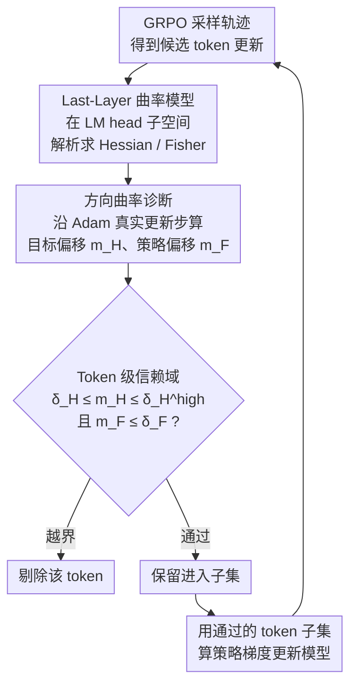

# Stabilizing Policy Gradients for Sample-Efficient Reinforcement Learning in LLM Reasoning

**会议**: ICLR 2026  
**arXiv**: [2510.00819](https://arxiv.org/abs/2510.00819)  
**代码**: [https://github.com/luckeciano/stable-pg-llm](https://github.com/luckeciano/stable-pg-llm)  
**领域**: LLM 推理  
**关键词**: 策略梯度, 曲率感知, 样本效率, GRPO, 二阶优化

## 一句话总结
提出 CAPO（Curvature-Aware Policy Optimization），通过在 LM head 最后一层建模二阶优化几何来预测并过滤会导致策略崩溃的 token 更新，在激进超参数（5× 学习率、1/12 batch size）下仍保持训练稳定，实现 MATH 上相较标准 GRPO 的 30× 样本效率提升。

## 研究背景与动机

**领域现状**：GRPO、PPO 等策略梯度方法是 LLM 推理后训练（如 DeepSeek-R1）的核心技术。当前实践中需要使用极为保守的超参数——学习率低至 $3 \times 10^{-6}$、batch size 达数千——才能确保训练稳定。

**现有痛点**：保守设置意味着巨大的样本需求和计算开销。然而一旦提高学习率或减小 batch size，策略梯度估计方差急剧增大，导致灾难性参数更新和策略崩溃——模型性能跌至基线以下且无法恢复。

**核心矛盾**：策略梯度仅使用一阶信息，在非凸 RL 目标上无法感知曲率——可能沿着看似改进的方向走一大步却跌入性能悬崖；而 Hessian 矩阵在 LLM 尺度（数十亿参数）下无法直接计算或近似。

**切入角度**：作者观察到 LLM 的 logit 输出仅由最后一层线性变换 $W \in \mathbb{R}^{K \times d_i}$ 产生，且 top-k 采样导致梯度天然稀疏（仅 $k < 100$ 个 token 有非零概率）。因此可以在最后一层高效近似 Hessian 和 Fisher 信息矩阵。

**核心 idea**：构建 last-layer 曲率计算模型，追踪每个 token 更新对目标函数和策略分布的影响，过滤掉不满足信赖域约束的样本。

## 方法详解

### 整体框架
CAPO（Curvature-Aware Policy Optimization，曲率感知策略优化）的目标是让 GRPO 在激进超参（高学习率、小 batch）下不崩。它的做法是在采样和参数更新之间塞一道轻量级闸门：每次更新前，先用一个只在最后一层（LM head）计算的曲率模型，预判每个候选 token 更新会把策略推下性能悬崖还是安全前进，只放行安全的 token 进入真正的策略梯度。整条流水线是——拿到 GRPO 的轨迹后，先在 last-layer 子空间估出梯度与曲率，对每个 token 算出「目标偏移」和「策略偏移」两个标量，用信赖域阈值剔掉越界的 token，再用留下来的子集照常算策略梯度去更新模型。目标函数本身（clipped surrogate + KL）完全没动，全部创新都落在梯度估计阶段的数据筛选上。

### 关键设计

**1. Last-Layer 曲率模型：让二阶信息在十亿参数尺度可算**

策略梯度只用一阶信息，在非凸 RL 目标上无法感知曲率，可能沿看似改进的方向走一大步却跌下性能悬崖；但 Hessian 在数十亿参数下根本无法计算。CAPO 的破局点是把参数切成 $\bm{\theta} = (\bar{\bm{\theta}}, \bm{\psi})$，其中 $\bar{\bm{\theta}}$ 是主干、$\bm{\psi} = \text{vec}(W)$ 只是 LM head 那一层线性变换 $W \in \mathbb{R}^{K \times d_i}$。因为 logit 完全由这一层产生，作者在这个子空间上推导出目标 Hessian $\tilde{H}(\bm{\psi})$ 和 Fisher 信息矩阵 $\tilde{F}(\bm{\psi})$ 的解析形式，避开了对整网络的二阶展开。更关键的是 top-k 采样让梯度天然稀疏——通常只有 $k < 100$ 个 token 概率非零，于是内存复杂度从朴素的 $\mathcal{O}((Kd_i)^2)$ 一路压到 $\mathcal{O}(\tilde{k} \cdot d_i)$，曲率才真正变得「可以每步都算」。

**2. 方向曲率诊断：把更新对目标和策略的影响各压成一个标量**

有了 $\tilde{H}$ 和 $\tilde{F}$，CAPO 不去显式构造大张量，而是沿实际更新方向 $\Delta\bm{\psi}$ 做两次二阶展开，得到两个可解释的诊断量。目标偏移预测这一步会让目标函数升还是降：

$$m_H(\Delta\bm{\psi}) = \tilde{g}(\bm{\psi})^\top \Delta\bm{\psi} + \frac{1}{2} \Delta\bm{\psi}^\top \tilde{H}(\bm{\psi}) \Delta\bm{\psi}$$

策略偏移衡量策略分布会被推动多远：

$$m_F(\Delta\bm{\psi}) = \frac{1}{2} \Delta\bm{\psi}^\top \tilde{F}(\bm{\psi}) \Delta\bm{\psi}$$

两者都只需稀疏向量点积，因此整套诊断额外开销极小。这里有个易被忽略的关键细节：$\Delta\bm{\psi}$ 不能按理想 SGD 假设取，否则会和实际训练脱节。CAPO 直接用 Adam 的一阶/二阶矩估计来模拟真正会落地的更新步，让曲率预测对应的就是优化器实际会走的那一步，筛选判断才不会偏。

**3. Token 级信赖域筛选：只清掉少数「有毒」token 而不碰目标函数**

CAPO 把一个 batch 拆成 token 级子集，逐个算出对应的 $m_H$ 与 $m_F$，再用三个阈值卡住信赖域：只有同时满足 $\delta_H \leq m_H(\Delta\psi_i) \leq \delta_H^{high}$ 且 $m_F(\Delta\psi_i) \leq \delta_F$ 的 token 才被接受，越界的直接踢出本步策略梯度。下界 $\delta_H$ 滤掉几乎没贡献的更新，上界 $\delta_H^{high}$ 和 $\delta_F$ 挡住会让策略剧烈跳变的更新。这一步不修改 surrogate 目标，只在样本层面做细粒度清洗，因此可以无缝叠加到任意策略梯度方法上（Dr.GRPO→Dr.CAPO、REINFORCE→ReinCAPO）。理论上作者还给出单调改进保证：只要把信赖域半径取到 $\omega \geq C\sqrt{\delta_F}$，就能保证更新后 $J(\pi_{\theta+\Delta\theta}) \geq J(\pi_\theta)$，把「过滤越界 token」这件经验操作和「策略不退化」这条结论对应了起来。

### 损失函数 / 训练策略
目标函数与 GRPO 完全一致——clipped surrogate 加 KL 正则，CAPO 不引入任何新的损失项；它的全部作用都发生在「算梯度时用哪些 token」这一层。实践中拒绝率初期约 8%、之后降到 2% 以下，额外计算开销 <5%。

## 实验关键数据

### 主实验（Qwen2.5-Math-7B，MATH 数据集训练）

| 方法 | 设置 | MATH 准确率 | TEST 8 基准均值 | 达到 70% 所需 completions |
|------|------|------------|----------------|-------------------------|
| GRPO（保守） | lr=3e-6, batch=大 | ~72% | ~65% | ~150K |
| GRPO（激进） | lr=1.5e-5, batch=小 | 崩溃 ❌ | 崩溃 ❌ | N/A |
| Dr.GRPO（激进） | 同上 | 崩溃 ❌ | 崩溃 ❌ | N/A |
| REINFORCE（激进） | 同上 | 崩溃 ❌ | 崩溃 ❌ | N/A |
| **CAPO（激进）** | **lr=1.5e-5, batch=小** | **~72%** | **~66%** | **~5K (30×)** |

### 消融与分析

| 分析维度 | 结果 | 说明 |
|---------|------|------|
| Token 拒绝率 | 初期 ~8%，之后 <2% | 极少干预即可稳定 |
| 扩展性 | Dr.CAPO、ReinCAPO 均有效 | 可叠加到任意 PG 方法 |
| 计算开销 | <5% 额外时间 | last-layer 计算极轻量 |
| $m_F$ 追踪 | 崩溃方法的全局 $m_F$ 急剧飙升 | 曲率模型有效预警不稳定 |
| $m_H$ 追踪 | CAPO 的 $m_H$ 曲线平滑 | 局部约束保证全局稳定 |

### 关键发现
- 所有基线方法（GRPO、Dr.GRPO、REINFORCE）在激进设置下均崩溃，仅 CAPO 稳定
- CAPO 在 MATH 上实现 30× 样本效率提升，在 TEST（8 个评估基准）上实现 9× 提升
- 策略偏移 $m_F$ 与训练不稳定性高度相关——$m_F$ 飙升是崩溃的前兆
- 曲率感知筛选可以推广到不同策略梯度目标（Dr.GRPO→Dr.CAPO、REINFORCE→ReinCAPO），一致性地防止崩溃

## 亮点与洞察
- **极简干预实现极大提升**：仅在最后一层计算曲率、仅拒绝 <8% token，就实现了 30× 样本效率。这说明训练不稳定性集中在少数"有毒"样本上，大多数 token 的更新方向是安全的
- **曲率模型的诊断价值**：$m_F$ 和 $m_H$ 的追踪不仅用于筛选，还提供了理解 RL-LLM 优化动态的窗口——$m_F$ 飙升是崩溃的前兆，这在此前几乎是黑盒的
- **通用性强**：CAPO 的 token 筛选机制可叠加在任何策略梯度方法上，且理论保证不依赖于具体的优势函数形式——Dr.CAPO 和 ReinCAPO 的成功验证了这一点
- **理论与实践的紧密对应**：Theorem 5.1 的单调改进保证在实验中被精确验证——CAPO 的 $m_F$ 始终在阈值以下

## 局限与展望
- 仅在 Qwen2.5-Math-7B（7B 规模）上验证，更大模型和更长训练 schedule 待测试
- 阈值 $\delta_H, \delta_F, \delta_H^{high}$ 需要根据具体 MDP 和基础策略调参
- Last-layer 近似在更深层可能信息不足，扩展到多层曲率估计是自然方向
- 仅在数学推理任务上验证，代码生成、Agent 等任务的效果未知

## 相关工作与启发
- **vs GRPO/PPO**：它们的 clipping 机制是参数空间的粗粒度约束，CAPO 在样本空间做细粒度筛选——两者可以叠加使用
- **vs K-FAC (Castanyer et al.)**：K-FAC 在通用 deep RL 中计算 Fisher 的 Kronecker 近似，内存开销大且无法扩展到 LLM 规模；CAPO 利用 LLM 的 top-k 稀疏性和 last-layer 近似大幅降低复杂度
- **vs Dr.GRPO**：Dr.GRPO 通过修改优势函数减少方差，但不解决曲率问题——在激进设置下仍崩溃，加上 CAPO 后（Dr.CAPO）则稳定
- **启发**：RL-LLM 训练中的不稳定性可能不需要改变目标函数，只需识别并过滤"有毒样本"——类似于 ML 中的数据清洗
- **更广启发**：last-layer 曲率模型的思路可扩展到 LLM 的其他优化问题（如 SFT 的 catastrophic forgetting 检测）

## 评分
- 新颖性: ⭐⭐⭐⭐ 二阶方法在 LLM RL 中的实用化，last-layer + 稀疏性的技巧新颖
- 实验充分度: ⭐⭐⭐⭐ 30× 提升显著，8 个评估基准，但模型规模有限
- 写作质量: ⭐⭐⭐⭐ 理论推导严谨，实验展示清晰，motivation 到 method 的逻辑链完整
- 价值: ⭐⭐⭐⭐⭐ 对 LLM RL 训练效率有直接实践意义，可大幅降低计算成本

<!-- RELATED:START -->

## 相关论文

- [\[ICLR 2026\] Temperature as a Meta-Policy: Adaptive Temperature in LLM Reinforcement Learning](temperature_as_a_meta-policy_adaptive_temperature_in_llm_reinforcement_learning.md)
- [\[ICLR 2026\] On the Design of KL-Regularized Policy Gradient Algorithms for LLM Reasoning](on_the_design_of_kl-regularized_policy_gradient_algorithms_for_llm_reasoning.md)
- [\[ICLR 2026\] Slow-Fast Policy Optimization: Reposition-Before-Update for LLM Reasoning](slow-fast_policy_optimization_reposition-before-update_for_llm_reasoning.md)
- [\[ICML 2026\] ResRL: Boosting LLM Reasoning via Negative Sample Projection Residual Reinforcement Learning](../../ICML2026/llm_reasoning/resrl_boosting_llm_reasoning_via_negative_sample_projection_residual_reinforceme.md)
- [\[ICLR 2026\] DRPO: Efficient Reasoning via Decoupled Reward Policy Optimization](drpo_efficient_reasoning_via_decoupled_reward_policy_optimization.md)

<!-- RELATED:END -->
