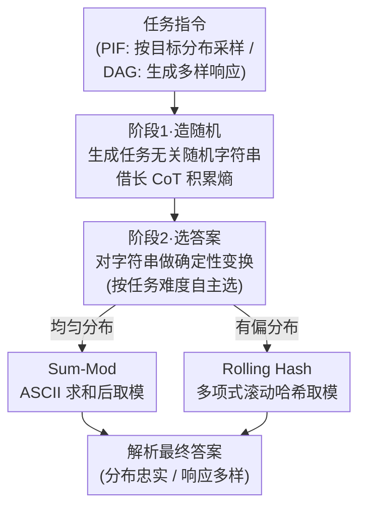

# String Seed of Thought: Prompting LLMs for Distribution-Faithful and Diverse Generation

**会议**: ICLR 2026  
**arXiv**: [2510.21150](https://arxiv.org/abs/2510.21150)  
**代码**: 无  
**领域**: LLM 推理  
**关键词**: prompting, probabilistic instruction following, diversity, LLM reasoning, randomness

## 一句话总结

本文提出 String Seed of Thought（SSoT），一种简洁的提示方法，通过指示 LLM 先生成随机字符串再从中提取随机性来选择答案，显著提升了概率指令跟随（PIF）的分布忠实度和开放式任务（DAG）的响应多样性，理论证明了 TV 距离随字符串长度指数衰减，实验表明推理型 LLM 的表现接近伪随机数生成器。

## 背景与动机

1. **LLM 在概率性选择上存在系统性偏差**：LLM 擅长确定性单答案任务，但在需要按特定分布选择答案时表现不佳。例如让 LLM 模拟公平抛硬币，结果往往严重偏斜，而非接近 50-50。

2. **多种真实应用需要概率行为**：人类行为模拟、内容多样化、博弈论中的混合策略（如猜拳的纳什均衡）等场景，都要求 LLM 的经验分布与目标分布对齐，而非找到单一最优答案。

3. **响应多样性对 test-time scaling 至关重要**：生成大量候选方案再选择最优解是 test-time scaling 的核心策略，但 LLM 的输出往往坍缩到有限答案集中，限制了候选方案的多样性。

4. **现有去偏方法效果有限**：调高温度、few-shot 示例、prompt 集成等方法虽能部分缓解偏差，但在有偏分布任务上效果不稳定，且多数方法需要针对每个任务单独调整。

5. **LLM 能描述分布但不能采样**：已有研究表明 LLM 能准确描述一个概率分布，但让它们实际从该分布中采样时准确率明显滞后，存在"知道但做不到"的鸿沟。

6. **推理型 LLM 的长 CoT 提供新机遇**：deepseek-r1、QwQ-32B 等推理模型具有超长思维链，这为在推理过程中生成足够的随机性熵源提供了可能性。

## 方法详解

### 整体框架

SSoT 不改训练、不接外部工具，只往原有 prompt 里塞一条两阶段指令：先让 LLM 吐出一个与任务无关的随机字符串当作熵源（stage 1），再让它对这个字符串做确定性运算（求和取模、哈希）把熵"翻译"成最终答案（stage 2）。任务类型只改第二阶段的目标——概率指令跟随（probabilistic instruction following, PIF）的指令是"操作字符串以从目标分布中采样"，开放式多样生成（diverse answer generation, DAG）则换成"操作它以生成一个多样化的响应"；具体用哪种变换、字符串多长，都交给模型自己在思维链（chain-of-thought, CoT）里决定，再从 `<answer>` 标签里规则化解析出最终答案。

### 关键设计

**1. 两阶段提示：把"造随机"和"选答案"拆成两步**

LLM 直接被问"抛硬币选正反"时，会被选项位置、标签训练频率等先验拽偏，输出严重失衡。SSoT 的做法是先让模型写一段随机字符串——这个动作和具体任务无关、不触发选择偏差，却能借助长 CoT 积累足够的熵；第二步再让模型对字符串做一个固定的算术变换，从熵里"读出"答案。随机性的来源（字符串）和答案的归属（变换结果）被彻底解耦，模型不再有机会按训练偏好挑选项。

这种解耦还顺带带来两个工程优势：因为每条响应只依赖自己当场生成的字符串、不需要回看历史选择记录，SSoT 天然支持并行采样——这与把已选分布塞回 prompt 的顺序采样（sequential sampling）形成对比，后者破坏了生成间独立性、且 prompt 会随序列膨胀；同时同一套 prompt 框架就能同时覆盖 PIF 和 DAG，无需为每个任务单独调参，LLM 自主决定用什么变换。

**2. 理论收敛保证：TV 距离随字符串长度指数衰减**

论文给出两条定理把"为什么有效"钉死。定理 4.1 走 2-universal 哈希路线：假设生成字符串中每个字符的条件概率有界（$\delta \leq P(x_i|\{x_j\}_{j<i}) \leq 1-(A-1)\delta$，$A$ 为字符表大小），则采样分布与目标分布的总变差距离（total variation, TV）满足

$$d_{TV} \leq \frac{\sqrt{M}}{2\delta''} 2^{-\frac{n}{2}\log_2 \frac{1}{(1-(A-1)\delta)^2+(A-1)\delta^2}} + \sqrt{\frac{\ln((2^M-2)/\delta')}{K\phi(\pi_{P_X})}}$$

第一项（由 Leftover Hash Lemma 给出）随字符串长度 $n$ 指数衰减、第二项是 $K$ 次采样的有限样本误差；定理 4.2 进一步证明即使换成更朴素的求和取模（把字符 ASCII 码求和后对素数 $M$ 取模，$s_n=\sum_j \text{ord}(x_j)\bmod M$），只要各字符边际分布不严重偏离均匀，TV 距离同样指数收敛。这两条定理解释了实验里"字符串越长、分布越忠实"的现象，也说明哪怕模型用的不是理想哈希、只是会做加法取模，长度本身就能把偏差压下去。

**3. LLM 自主策略选择：复杂度越高、变换越精巧**

把 CoT 拆开看（用 gemini-2.5-flash 分类 600 条响应）发现，模型并非死守一种变换，而是按任务难度自己挑：均匀分布任务偏好简单的 Sum-Mod；有偏分布任务则自动升级到多项式滚动哈希 $\sum_i B^i\,\text{ord}(c_i)$ 再取模，以抵消字符边际偏差；DAG 里"创造性"类别走"模板 + 逐位局部采样"、其余类别走"列表 + 全局采样"。正是这种自适应，让一条统一指令在跨度极大的任务上都不掉链子，也是 SSoT 不需要任务专属设计的根本原因——但它的反面也是失效点：若模型偷懒只取首字符（如 QwQ-32B 把熵浪费掉），分布就会塌偏。

## 实验结果

### PIF 性能：5 个前沿 LLM 的系统评估

| 模型 | 方法 | 2-choice | Biased 2-choice | 3-choice | Biased 3-choice | Biased 9-choice |
|------|------|:-:|:-:|:-:|:-:|:-:|
| deepseek-v3 | Baseline | 5.97 | 111.45 | 136.03 | 117.28 | 297.33 |
| deepseek-v3 | **SSoT** | **2.91** (↓51%) | **3.54** (↓97%) | **15.33** (↓89%) | **15.65** (↓87%) | **44.90** (↓85%) |
| deepseek-r1 | Baseline | 36.09 | 69.58 | 106.30 | 49.53 | 138.21 |
| deepseek-r1 | **SSoT** | **3.03** (↓92%) | **1.51** (↓98%) | **4.98** (↓95%) | **4.30** (↓91%) | **18.06** (↓87%) |
| QwQ-32B | **SSoT** | 3.39 | **2.47** (↓98%) | **1.82** (↓98%) | **1.30** (↓99%) | **11.48** (↓96%) |
| PRNG（理想） | — | 1.85 | 1.93 | 3.36 | 2.85 | 13.72 |

（JS 散度 ×10³，越低越好）

**关键发现**：deepseek-r1 和 QwQ-32B 使用 SSoT 后的 JS 散度接近伪随机数生成器（PRNG），特别是 QwQ-32B 在 Biased 3-choice 上 JS 散度仅 1.30，甚至优于 PRNG 的 2.85。

### DAG 性能与对抗博弈

| 方法 | NoveltyBench Overall (Distinct / Utility) |
|------|:-:|
| Baseline | 4.70 / 5.17 |
| Paraphrase | 5.63 / 5.57 |
| T=1.0 | 5.57 / 6.03 |
| **SSoT** | **6.19** / 5.92 |

SSoT 在 Distinct 分数上最高（6.19），且在 Creativity 类别上同时提升了 Distinct 和 Utility。WildChat 数据集上 SSoT 的 Distinct 从 3.39 提升到 5.25（+55%）。

**猜拳对抗实验**：SSoT 使 LLM 在面对 10 个"黑带"猜拳机器人时平均得分接近零（理想的混合策略均衡），而 Baseline 和 Simple prompt 均被机器人系统性击败。

### CoT Scaling 分析

使用 budget forcing 控制推理长度发现：
- 随着 thinking token 增加，生成整数的均匀性显著改善（JS 散度持续下降）
- 即使在 T=0（完全确定性解码）下，更长的推理链也能生成更高复杂度的字符串（Lempel-Ziv 复杂度和 zlib 压缩率均随推理长度增长）

## 亮点与创新

- **极致简洁**：仅需在 prompt 中添加一条指令即可大幅改善概率行为，无需训练或外部工具
- **理论与实践统一**：严格证明了 TV 距离的收敛保证，且实验结果与理论预测高度吻合
- **LLM 自主策略选择**：揭示了 LLM 能根据任务复杂度自动发明合适的随机性提取策略（Sum-Mod vs Rolling Hash）
- **推理长度 scaling law**：首次证明 PIF 性能随 CoT 长度 scaling，为推理模型的概率能力提供了新的理解维度

## 局限性

- **依赖模型推理能力**：8B 以下小模型可能无法正确执行取模/哈希等算术操作，导致效果不佳
- **偏差传播风险**：若 LLM 生成的随机字符串具有强位置偏差且采用"懒惰"策略（仅用首字符），输出分布将有偏
- **不适用于单答案任务**：SSoT 专为多有效答案或概率需求场景设计，应用于数学/事实检索等单答案任务可能分散模型注意力
- **推理开销增加**：生成随机字符串和执行字符串操作会增加 CoT 长度和推理成本

## 相关工作对比

### vs. Prompt Ensemble（提示集成）
Prompt Ensemble 使用 50 个改写 prompt + 随机化选项顺序来减少位置偏差。在均匀分布 PIF 上表现良好，但在有偏分布上明显退化——因为仅消除位置偏差不足以实现精确的分布对齐。SSoT 在均匀和有偏设置上均接近 PRNG 理想性能，展现出对分布偏斜的强鲁棒性。

### vs. Few-shot Examples（少样本示例）
Few-shot 方法提供 k 个按目标分布采样的示例（k=3/10/50），期望 LLM 通过上下文学习校准输出分布。但实验表明 few-shot 在 action 数量增加时效果迅速下降（特别是 biased 设置），而 SSoT 在 2 到 64 个选项范围内保持一致的低 JS 散度，可扩展性远优于 few-shot。

### vs. Sequential Sampling（顺序采样）
Sequential Sampling 将历史选择记录加入 prompt 中，期望 LLM 根据已选分布调整后续选择。该方法破坏了生成间的独立性，无法并行化，且在长序列后 prompt 膨胀严重。SSoT 每次生成完全独立，天然支持并行采样。

## 评分

- ⭐⭐⭐⭐⭐ 新颖性：将"先生成随机字符串再提取随机性"作为 prompt 策略极具创意，开辟了 LLM 概率行为研究新方向
- ⭐⭐⭐⭐ 技术质量：理论分析严谨（两个定理），实验覆盖 5 个模型、多种任务设置和对抗场景
- ⭐⭐⭐⭐ 实用性：零成本即可部署，适用于游戏、模拟、内容多样化等多种场景
- ⭐⭐⭐⭐ 写作质量：结构清晰，理论-实验-分析层层递进，CoT 策略分析尤为精彩

<!-- RELATED:START -->

## 相关论文

- [\[AAAI 2026\] Intention Chain-of-Thought Prompting with Dynamic Routing for Code Generation](../../AAAI2026/llm_reasoning/intention_chain-of-thought_prompting_with_dynamic_routing_for_code_generation.md)
- [\[ECCV 2024\] Controllable Navigation Instruction Generation with Chain of Thought Prompting](../../ECCV2024/llm_reasoning/controllable_navigation_instruction_generation_with_chain_of_thought_prompting.md)
- [\[NeurIPS 2025\] Is Chain-of-Thought Reasoning of LLMs a Mirage? A Data Distribution Lens](../../NeurIPS2025/llm_reasoning/is_chain-of-thought_reasoning_of_llms_a_mirage_a_data_distribution_lens.md)
- [\[ICML 2026\] PowerFlow: Unlocking the Dual Nature of LLMs via Principled Distribution Matching](../../ICML2026/llm_reasoning/powerflow_unlocking_the_dual_nature_of_llms_via_principled_distribution_matching.md)
- [\[ICLR 2026\] Are Reasoning LLMs Robust to Interventions on Their Chain-of-Thought?](are_reasoning_llms_robust_to_interventions_on_their_chain-of-thought.md)

<!-- RELATED:END -->
