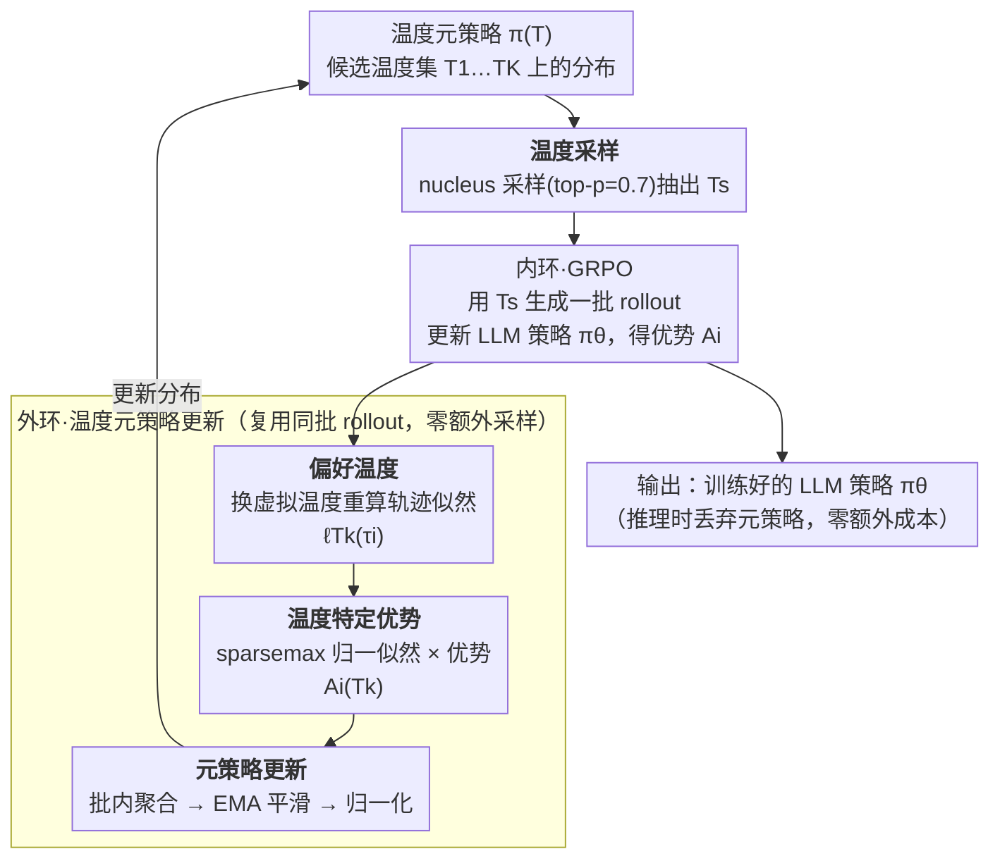

# Temperature as a Meta-Policy: Adaptive Temperature in LLM Reinforcement Learning

**会议**: ICLR 2026  
**arXiv**: [2602.11779](https://arxiv.org/abs/2602.11779)  
**代码**: 无  
**领域**: LLM推理  
**关键词**: 温度调节, 元策略, GRPO, 自适应探索, 数学推理

## 一句话总结

提出 TAMPO（Temperature Adaptive Meta Policy Optimization），将采样温度重新定义为可学习的元策略，通过双层循环在内环做 LLM 策略优化、外环根据轨迹优势信号自适应更新温度分布，无需额外 rollout，在数学推理基准上一致超越固定温度基线。

## 研究背景与动机

- 温度是 LLM 采样中控制探索-利用权衡的核心参数
    - 高温鼓励多样性但引入噪声，低温提高聚焦但可能过早收敛
- 现有 RL 训练（GRPO 等）将温度视为**固定超参数**，忽略了训练过程中的动态需求
- 熵正则化和 KL 惩罚虽也影响探索，但温度直接调制采样分布，更透明可控
- **核心论点**：温度应当是可学习的决策变量，而非手动调节的超参数

## 方法详解

### 整体框架

TAMPO 想解决的是 LLM 强化学习里"采样温度该用多大"长期被当成固定超参的问题：温度直接调制采样分布、决定探索与利用的平衡，但 GRPO 这类 critic-free 方法从头到尾只用一个手调的温度，既不看训练进度、也不看轨迹反馈。TAMPO 的做法是把"用多大温度采样"本身做成一个可学习的元策略（meta-policy）$\pi(T)$——它在候选温度集 $\mathcal{T}=\{T_1,\dots,T_K\}$ 上维护一个概率分布——并嵌进标准 GRPO 训练的双层循环（bilevel）里。

整体一步是这样转的：外层先用 nucleus sampling 从 $\pi(T)$ 抽一个温度 $T_s$，内层用 $T_s$ 生成一批 rollout 并照常用 GRPO 更新 LLM 策略 $\pi_\theta$；随后外层**不再额外采样**，而是把这同一批 rollout 重新过一遍模型，反推"它们更像是哪个温度生成的"，把每条轨迹的好坏归因到温度上，据此更新 $\pi(T)$。因为关键的反推只是对已有 token 序列换温度重算似然、不需要在每个候选温度下真的重采，整个温度自适应过程与策略优化**共享数据、零额外 rollout**，训练总耗时几乎与固定温度基线持平。

### 关键设计

**1. 偏好温度：从轨迹似然反推它"想要"的温度**

要把温度变成可优化的量，第一步得给"哪个温度好"找一个无需重采的信号。TAMPO 的关键观察是：每条已采样轨迹其实隐式编码了一个最适合自己的温度——即它最可能在哪个温度下被生成。对轨迹 $\tau_i$，定义它在温度 $T$ 下的平均对数似然 $\ell_T(\tau_i) = \frac{1}{|\tau_i|} \sum_{t=1}^{|\tau_i|} \log \pi_{\theta,T}(o_{i,t} \mid s_{i,t})$（取平均是为消去轨迹长度的影响），使该似然最大的温度 $T_i^\star = \arg\max_{T_k \in \mathcal{T}} \ell_{T_k}(\tau_i)$ 就是这条轨迹的"偏好温度"。这一步只需把已生成的 token 序列重新过一遍模型、用不同的虚拟温度缩放 logits 即可算出，不必在每个候选温度下重新采样——这正是后续"零额外开销"的基础。（论文证明轨迹似然关于 $T$ 是单峰的，因此偏好温度唯一存在。）

**2. 温度特定优势：把轨迹的好坏归因到温度上**

光有似然还不够，元策略真正需要知道的是"哪个温度带来了高回报"。TAMPO 把每条轨迹的 GRPO 优势 $A_i$ 按它在各候选温度下的相对似然分摊到温度上。对 $K$ 个候选温度，先用 sparsemax 把似然 $\ell_{T_k}(\tau_i)$ 归一化成 $\hat{\ell}_{T_k}(\tau_i)$（跨候选温度求和为 1；相比 softmax，sparsemax 会把不相关温度直接压成 0，使归因稀疏、聚焦在真正匹配的几个温度上），再得到温度特定优势 $\mathcal{A}_i^{(T_k)} = \hat{\ell}_{T_k}(\tau_i) \cdot A_i$。这样一来，正优势轨迹会把奖励集中推给它最可能生成的温度、负优势轨迹则压低对应温度，温度的好坏第一次有了可直接优化的标量信号。

**3. 元策略更新：聚合、平滑、归一化成温度分布**

单批轨迹给出的温度信号噪声很大，TAMPO 用三步把它转成稳定的概率分布。先在批内对所有轨迹聚合 $\mathcal{A}_\mathcal{B}^{(T_k)} = \frac{1}{|\mathcal{B}|G} \sum_b \sum_i \mathcal{A}_{b,i}^{(T_k)}$；再做指数滑动平均（EMA）平滑 $\bar{\mathcal{A}}_s^{(T_k)} = (1-\alpha)\bar{\mathcal{A}}_{s-1}^{(T_k)} + \alpha \mathcal{A}_\mathcal{B}^{(T_k)}$ 以跨步累积趋势（$\alpha=0.05$ 最稳：过小则更新迟钝、过大则抖动）；最后经 min-max 归一化得到温度分布 $\pi_s(T_k) = \frac{\tilde{\mathcal{A}}_s^{(T_k)}}{\sum_j \tilde{\mathcal{A}}_s^{(T_j)}}$。由于温度在 LLM RL 里本身不可微（无法对它求梯度），这条"似然归因 + EMA"的路径恰好绕开了梯度，把一个非可微的离散选择问题变成了可在线估计的优势排序问题。

**4. 温度采样：给探索本身也留出探索**

拿到分布 $\pi(T)$ 后，下一步用哪个温度并不直接取概率最高者，而是用 nucleus sampling（top-p）从 $\pi(T)$ 里抽一个 $T_s$，$p=0.7$ 给出最佳的探索-利用平衡。这一点很关键：实验中纯贪心采样（$p=0$）反而结果最差，说明温度选择本身也需要保留随机性，否则元策略会过早锁死在某个局部偏好上。整个元策略只额外维护 $K$ 个温度的优势估计列表，训练完即丢弃、推理时不增加任何成本，因此 TAMPO 的总训练耗时与固定温度 GRPO 基线几乎完全相同。

## 实验关键数据

### 主实验：数学推理基准（DS-Qwen-1.5B）

| 方法 | Average | AIME24 | MATH-500 | AMC23 | Minerva | OlympiadBench |
|------|---------|--------|----------|-------|---------|---------------|
| DS-Qwen-1.5B (无 RL) | 39.1 | 13.3 | 76.2 | 45.0 | 22.8 | 38.4 |
| GRPO ($T_s$:0.9) | 42.0 | 20.0 | 75.2 | 50.0 | 26.1 | 38.7 |
| GRPO ($T_s$:1.5) | 42.6 | 23.3 | 75.4 | 52.5 | 22.8 | 39.0 |
| GRPO ($T_s$:0.9→1.5) | 42.8 | 16.7 | 76.6 | 55.0 | 24.6 | 41.0 |
| **TAMPO** | **44.5** | **23.3** | **76.8** | **55.0** | **27.9** | **39.6** |

### 消融：EMA 系数 $\alpha$

| $\alpha$ | Average | AIME24 | MATH-500 | AMC23 | Minerva | OlympiadBench |
|---------|---------|--------|----------|-------|---------|---------------|
| 0.01 | 41.6 | 20.0 | 75.2 | 50.0 | 25.4 | 37.5 |
| **0.05** | **44.5** | **23.3** | **76.8** | **55.0** | **27.9** | **39.6** |
| 0.10 | 43.6 | 23.3 | 75.4 | 57.5 | 23.2 | 38.8 |

### 消融：元策略采样策略

| top-p | Average |
|-------|---------|
| 0.9 | 43.0 |
| **0.7** | **44.5** |
| 0.5 | 42.2 |
| 0 (greedy) | 40.9 |

### 跨任务泛化（Qwen2.5-3B-Instruct → ECQA）

| 方法 | Pass@1 | Pass@8 |
|------|--------|--------|
| 无 RL | 73.06% | 77.76% |
| GRPO | 75.07% | 78.94% |
| **TAMPO** | **76.12%** | **79.67%** |

### 关键发现

1. TAMPO 平均超越最优固定温度基线 **+1.9%**（Pass@1）和 **+1.7%**（Pass@8）
2. 元策略学到的温度动态：warmup 后偏好高温 (~1.3) 鼓励探索，随训练逐渐降低
3. 贪心采样（$p=0$）导致最差结果 → 温度探索本身也需要探索
4. 训练耗时与基线完全相同（~9h54min on 8×V100）
5. 在常识推理任务上同样有效

## 亮点与洞察

- **将温度从超参数提升为决策变量**：新颖的问题形式化
- **无需额外 rollout**：通过虚拟温度似然计算巧妙复用已有数据
- **学到的温度策略与直觉一致**：先高后低的探索-利用切换
- **与现有 RL 完美兼容**：可插入 GRPO/DAPO/REINFORCE++ 等任意 critic-free 方法
- **计算开销可忽略**：仅维护 $K$ 个温度的优势估计

## 局限性

- 候选温度集 $\mathcal{T}$ 仍需手动设定范围和粒度
- 轨迹似然 w.r.t. 温度的 unimodal 性质在某些情况下可能不成立
- 仅在 1.5B 模型上做主实验，更大模型验证不足
- 温度元策略在不同 prompt 间共享，未探索 prompt 级别的自适应

## 相关工作

- Critic-free RL：GRPO、DAPO、REINFORCE++
- 探索-利用：ε-greedy、温度退火、UCB、熵正则化
- 元策略：MLSH（层级 RL）、Meta-SAC（自动熵系数）

## 评分

- **新颖性**: ⭐⭐⭐⭐⭐ — 温度作为元策略的问题形式化新颖
- **技术深度**: ⭐⭐⭐⭐ — 理论推导清晰，虽方法本身简洁
- **实验充分性**: ⭐⭐⭐⭐ — 5 基准 + 消融全面，但模型规模有限
- **实用性**: ⭐⭐⭐⭐⭐ — 零额外成本即可提升 RL 训练效果

<!-- RELATED:START -->

## 相关论文

- [\[ICLR 2026\] Stabilizing Policy Gradients for Sample-Efficient Reinforcement Learning in LLM Reasoning](stabilizing_policy_gradients_for_sample-efficient_reinforcement_learning_in_llm_.md)
- [\[ICLR 2026\] Adaptive Social Learning via Mode Policy Optimization for Language Agents](adaptive_social_learning_via_mode_policy_optimization_for_language_agents.md)
- [\[ICLR 2026\] Slow-Fast Policy Optimization: Reposition-Before-Update for LLM Reasoning](slow-fast_policy_optimization_reposition-before-update_for_llm_reasoning.md)
- [\[ACL 2026\] Adapt to Thrive! Adaptive Power-Mean Policy Optimization for Improved LLM Reasoning](../../ACL2026/llm_reasoning/adapt_to_thrive_adaptive_power-mean_policy_optimization_for_improved_llm_reasoni.md)
- [\[ICLR 2026\] On the Design of KL-Regularized Policy Gradient Algorithms for LLM Reasoning](on_the_design_of_kl-regularized_policy_gradient_algorithms_for_llm_reasoning.md)

<!-- RELATED:END -->
