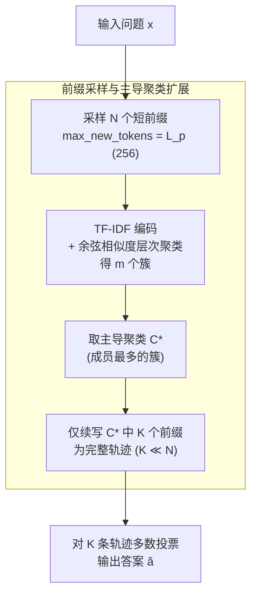

# The Path of Least Resistance: Guiding LLM Reasoning Trajectories for Efficient Consistency

**会议**: ICLR 2026  
**arXiv**: [2601.21494](https://arxiv.org/abs/2601.21494)  
**代码**: 无  
**领域**: LLM/NLP  
**关键词**: self-consistency, inference efficiency, prefix clustering, reasoning, token reduction

## 一句话总结

提出 PoLR（Path of Least Resistance），首个利用推理前缀一致性的推理时方法，通过聚类短前缀并仅扩展主导聚类来实现 Self-Consistency 的高效替代，可减少高达 60% token 使用和 50% 延迟。

## 研究背景与动机

Self-Consistency (SC) 解码通过采样多条推理轨迹并多数投票选择最终答案，大幅提升 LLM 推理准确率，但计算开销巨大——每条推理轨迹必须完整展开。现有改进方法如 Adaptive Consistency (AC) 和 Early-Stopping SC (ESC) 通过在最终答案达成一致时提前停止，但它们共享一个根本限制：**答案级别的一致性只有在完整推理轨迹生成后才可观察**，无法利用推理过程早期阶段的丰富结构信息。

PoLR 的核心观察是：**推理轨迹的前缀（前几个步骤）已经蕴含了关于最终解答的强信号**，即"前缀一致性"现象。共享相同前缀的推理轨迹几乎达到与完整 SC 相同的准确率，这意味着花在额外轨迹上的大量 token 开销很少对最终答案产生贡献。

## 方法详解

### 整体框架

PoLR 要解决的问题很具体：Self-Consistency（自一致性，SC）把采样的 $N$ 条推理轨迹**全部跑到底**再投票，准确率高但 token 开销巨大，而其中大部分轨迹最后会被多数投票淘汰，等于白烧。PoLR 的整体思路是在 SC 管线里插入一个"早分线"步骤：先给问题只采样一批**很短的推理前缀**，按内容把它们聚成几类，只挑成员最多的那一类前缀继续展开成完整轨迹，再对这一小批完整轨迹做多数投票。这样绝大多数采样在前缀阶段就被筛掉，省下了把每条轨迹都跑到底的尾部 token。从输入到输出依次是：采样 $N$ 个短前缀 → TF-IDF 编码并层次聚类 → 选主导聚类 $C^*$ → 只续写 $C^*$ 里 $K$ 条 → 多数投票出答案。

### 关键设计

**1. 前缀采样与主导聚类扩展：把"选哪条轨迹"提前到推理早期**

SC 的浪费在于必须把 $N$ 条轨迹全部展开才能投票，算力砸在了大量终将被淘汰的轨迹尾部。PoLR 把"哪些轨迹值得跑到底"的决策提前到了前缀阶段：先只生成 $N$ 个短前缀 $p_i = \text{Prefix}(\mathcal{M}(x, t_i), L_p)$，实现上就是把采样的 `max_new_tokens` 限到 $L_p$；再对每个前缀用 TF-IDF 词袋编码成稀疏向量，用余弦相似度做凝聚式层次聚类得到 $\mathcal{C} = \{C_1,\dots,C_m\}$，取成员最多的主导聚类 $C^* = \arg\max_{C_j}|C_j|$，只把其中 $K$ 条前缀续写成完整轨迹 $r_k = \mathcal{M}(x\,\vert\,p_k)$，最后照常多数投票 $\hat{a} = \arg\max_y \sum_{k=1}^K \mathbf{1}[a_k = y]$。几个选型都是为了"轻"：TF-IDF 而非神经编码器，是因为它模型无关、跑在 CPU 上只要几毫秒，神经编码器带来的聚类开销远大于 TF-IDF、准确率收益却甚微；层次聚类适合 $N$ 很小（实验里 11–51）的场景，无需预设簇数且分组可解释；前缀长度经验上取 $L_p = 256$ 时在准确率与 token 效率之间最平衡。当 $K=N$ 且跳过聚类时 PoLR 退化为标准 SC，因此它是 SC 的严格推广而非另起炉灶。

**2. Token 效率：把"省了多少 token"写成可计算的指标**

为了量化收益、也为后面的理论分析铺路，PoLR 把 token 效率定义成相对 SC 节省的 token 比例：

$$\eta = 1 - \frac{T_{\text{PoLR}}}{T_{\text{SC}}} = 1 - \frac{N \cdot \ell_p + K \cdot (\ell_f - \ell_p)}{N \cdot \ell_f}$$

其中 $\ell_p$ 是平均前缀长度、$\ell_f$ 是完整推理长度，$T_{\text{SC}} = N\cdot\ell_f$、$T_{\text{PoLR}} = N\cdot\ell_p + K\cdot(\ell_f-\ell_p)$。分子第一项 $N\cdot\ell_p$ 是 $N$ 个前缀的固定成本，第二项是只对主导聚类里 $K$ 条前缀续写到底的增量成本——正因为 $K \ll N$，第二项把绝大多数轨迹的尾部开销直接砍掉，这就是节省的来源。

**3. 互信息对齐与结构偏斜：拆开"为何不掉精度"和"为何能省"**

PoLR 用两个互相独立的性质分别解释它的"安全"和"省钱"，避免把两件事混为一谈。安全性看**正确性对齐**：令 $Y\in\{0,1\}$ 表示最终轨迹是否正确、$Z$ 表示前缀被分到哪个簇，只要 $I(Z;Y)>0$（簇分配至少弱预测正确性、$H(Y\vert Z)$ 较小），扩展主导聚类就不会系统性地丢掉正确答案。节省量则看**结构偏斜**：定义偏斜率 $\kappa = |C^*|/N$，命题给出 token 效率下界 $\eta \geq 1 - \frac{K}{M}\cdot\kappa^{-1}$，即前缀越往主导聚类集中（$\kappa$ 越大）省得越多。两者解耦的含义很关键——互信息保证不掉精度，偏斜决定能省多少。实测中归一化互信息 NMI 始终很低（$\leq 0.18$），效率却仍能推到 50–58% 饱和，这正说明真正的红利来自前缀的强结构偏斜（大家早期就涌向同一条路），而非簇与正确性之间存在强相关。

### 损失函数 / 训练策略

PoLR 是纯推理时方法，不涉及任何训练或微调，因此没有损失函数；其优化目标可视为在保持 SC 准确率的约束下最小化 token 消耗。

## 实验关键数据

### 主实验

在 GSM8K、Math500、AIME24/25、GPQA-Diamond 上跨多个 LLM 家族评估：

| 模型 | 数据集 | N | SC Acc | PoLR Δ | η (%) | 开销 kt (ms) |
|------|--------|---|--------|--------|-------|-------------|
| QWQ32B | GSM8K | 51 | 90.8% | -0.3 | 47.6 | 11.2 |
| DSQ7B | Math500 | 31 | 89.6% | +0.1 | 48.5 | 5.1 |
| QWQ32B | GPQA-D | 51 | 68.7% | +1.5 | 53.8 | 11.2 |
| DSQ7B | AIME25 | 31 | 33.7% | +2.7 | - | - |
| Phi-4-15B | AIME25 | 31 | 32.0% | +4.0 | - | - |
| QWQ32B | Math500 | 51 | 91.8% | +0.2 | 51.8 | 11.2 |

**核心发现**：
- token 效率 η 通常在 40–60%，有效将 token 消耗减半
- 聚类开销 kt 仅几毫秒，节省直接转化为更快推理
- 准确率保持甚至偶尔提升，因为 PoLR 强调主导一致推理聚类，过滤噪声轨迹
- AIME25 上 QWQ32B 下降 10 点为特例（仅 30 个样本中的 3 个）

### 消融实验

初步分析（Math500、GSM8K，DSQ7B，40 样本）验证前缀一致性：

| 数据集 | $L_p$ | 扩展率 | 准确率 | 精确前缀匹配 |
|--------|-------|--------|--------|-------------|
| Math500 | SC | 1.00 | 89.8 | - |
| Math500 | 32 | 0.64 | 89.8 | 125 |
| Math500 | 128 | 0.48 | 89.2 | 5 |
| GSM8K | SC | 1.00 | 79.7 | - |
| GSM8K | 32 | 0.52 | 79.7 | 135 |
| GSM8K | 128 | 0.47 | 79.3 | 30 |

### 关键发现

1. PoLR 对不同聚类方法、前缀长度、聚类选择策略均表现鲁棒
2. PoLR 与自适应推理方法（AC、ESC）完全互补，可作为前置过滤器
3. 跨模型家族和规模（1.5B–32B）一致有效
4. 在非数学任务（StrategyQA）上同样表现出一致增益

## 亮点与洞察

1. **"少即是多"的推理效率范式**：通过前缀聚类发现，LLM 在推理早期就编码了结构一致性，后续大部分计算是冗余的
2. **理论与实践的优雅统一**：正确性对齐（互信息）保证安全、结构偏斜（κ）驱动效率的分离分析非常清晰
3. **零训练开销**：TF-IDF + 层次聚类的轻量组合，使方法成为真正的即插即用替代品
4. **互补性设计**：明确定位为 SC 的前置优化，可与 AC、ESC 等方法叠加使用

## 局限性

1. **AIME25 上 QWQ32B 下降 10 点**：在具有挑战性且样本极少的基准上存在波动风险
2. **前缀长度 $L_p$ 需要手动设定**：虽然 256 在多数情况下有效，但自适应确定最优前缀长度仍是开放问题
3. **依赖前缀结构偏斜**：如果问题的推理路径高度多样化（$\kappa \approx 1/m$），PoLR 的效率增益会减小
4. **仅测试开源模型**：未在 GPT-4 等闭源模型上验证

## 相关工作与启发

- **Self-Consistency** (Wang et al., 2023)：PoLR 的直接基线
- **Adaptive Consistency** (Aggarwal et al., 2023)：按需停止生成，但仍依赖完整轨迹
- **Early-Stopping SC** (Li et al., 2024)：类似限制
- **前缀一致性** (Ji et al., 2025)：训练时利用前缀，需要微调

PoLR 的核心启发是：**推理效率优化的关键时机不在结束（何时停止），而在开始（何时分线）**。这一洞察可能启发其他利用推理前缀信号的方法。

## 评分

- 新颖性: ⭐⭐⭐⭐ — 首个推理时利用前缀一致性替代 SC 的方法，概念新颖
- 实验充分度: ⭐⭐⭐⭐⭐ — 跨 5 个基准、6 个模型、多种配置的全面评估，10 次重复
- 写作质量: ⭐⭐⭐⭐ — 理论与实验结合紧密，结构清晰
- 价值: ⭐⭐⭐⭐ — 对高效推理有实际意义，即插即用的推理加速方案

<!-- RELATED:START -->

## 相关论文

- [\[ICLR 2026\] The Path of Least Resistance: Guiding LLM Reasoning Trajectories with Prefix Consensus](the_path_of_least_resistance_guiding_llm_reasoning_trajectories_with_prefix_cons.md)
- [\[ICLR 2026\] Annotation-Efficient Universal Honesty Alignment](annotation-efficient_universal_honesty_alignment.md)
- [\[ICLR 2026\] Predicting LLM Reasoning Performance with Small Proxy Model](predicting_llm_reasoning_performance_with_small_proxy_model.md)
- [\[ICLR 2026\] A State-Transition Framework for Efficient LLM Reasoning](a_state-transition_framework_for_efficient_llm_reasoning.md)
- [\[ICLR 2026\] Stabilizing Policy Gradients for Sample-Efficient Reinforcement Learning in LLM Reasoning](stabilizing_policy_gradients_for_sample-efficient_reinforcement_learning_in_llm_.md)

<!-- RELATED:END -->
