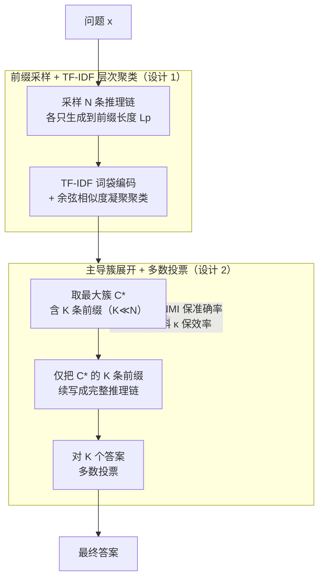

# The Path of Least Resistance: Guiding LLM Reasoning Trajectories with Prefix Consensus

**会议**: ICLR 2026  
**arXiv**: [2601.21494](https://arxiv.org/abs/2601.21494)  
**代码**: 待确认  
**领域**: LLM推理  
**关键词**: 自一致性解码, 前缀共识, 推理效率, 聚类剪枝, 推理时计算

## 一句话总结
提出 PoLR（Path of Least Resistance），首个利用推理前缀一致性的推理时方法，通过聚类短前缀并仅展开主导簇来替代标准 Self-Consistency，在 GSM8K/Math500/AIME/GPQA 等基准上保持甚至提升准确率的同时减少 40%–60% 的 token 用量和最高 50% 的延迟。

## 研究背景与动机
Self-Consistency（SC）解码是当前 LLM 推理的强力基线：采样多条推理链，对最终答案进行多数投票，显著优于贪心解码。但 SC 的计算开销巨大，因为所有 N 条推理链都必须完整展开到结束，其中大量链条是冗余的。

现有改进方法（如 Adaptive Consistency、Early-Stop SC）尝试在观察到足够的最终答案一致性时提前停止，但都有一个基本限制：答案一致性**只有在完整推理链生成后**才能观察到，无法利用推理过程早期阶段的结构信息。

近期研究发现了一个关键现象——**前缀一致性（prefix consistency）**：推理链的前 L 个 token 在不同采样之间往往高度相似，而且这种早期一致性与最终答案的正确性高度相关。Ji et al. (2025) 在训练时利用了这一现象，但需要昂贵的微调。

核心 idea：既然推理链的前缀就已经编码了关于最终答案的强信号，那么**在推理时**就可以通过聚类短前缀来识别主导推理模式，只完整展开主导簇中的链条，安全地抛弃冗余路径。这就像物理系统倾向于走"最小阻力路径"一样——PoLR 将计算分配给最有前途的推理方向。

## 方法详解

### 整体框架
PoLR 的核心观察是：Self-Consistency 把所有 $N$ 条推理链都跑到底太浪费，而推理链的前几百个 token 就已经透露了它要走哪条路。于是 PoLR 先只采样 $N$ 条短前缀（长度 $L_p$），把它们聚类，找出最大的"主导簇"，只把这个簇里的 $K$ 条（$K \ll N$）继续展开成完整推理链再做多数投票——计算被集中分配给最常见、也最可能正确的那条"最小阻力路径"。整条管线纯推理时运行、无需训练，新增的只有几毫秒级的聚类开销。

### 关键设计

**1. 前缀采样 + TF-IDF 层次聚类：用几百 token 的代价探出推理走向**

对问题 $x$ 采样 $N$ 条推理链，但每条只生成到 $L_p$（默认 256）个 token 就停下，得到一批短前缀。完整推理链动辄数千 token，而前缀只占其中很小一段，因此这一步的采样成本相比把所有链跑到底大幅降低。拿到前缀后，PoLR 不用昂贵的神经编码器，而是用 TF-IDF 词袋把每条前缀编成稀疏向量，再配余弦相似度做凝聚层次聚类（Agglomerative Hierarchical Clustering）。这样选有两个好处：一是无需预设簇数 $m$，聚类树自动给出可解释的分组；二是 TF-IDF 轻量、模型无关、纯 CPU 就能跑，对比实验显示换成 sentence transformer 之类的神经编码器会让聚类开销涨好几个量级，准确率却几乎没提升，得不偿失。

**2. 主导簇展开 + 多数投票：只在最常见的推理模式上花完整算力**

设聚类得到 $\{C_1,\dots,C_m\}$，PoLR 取最大簇 $C^\* = \arg\max_j |C_j|$ 作为主导簇，把其中全部 $K$ 条前缀以 $r_k = M(x \mid p_k)$ 的方式继续自回归生成成完整推理链，最后只对这 $K$ 个答案做多数投票。直觉是主导簇代表了模型最频繁收敛到的解题思路，正确答案大概率藏在这里；而那些零散的小簇往往是噪声或跑偏的推理，提前丢掉既省算力又顺手过滤了噪声（这也解释了为什么 PoLR 偶尔还能反超 SC 准确率）。token 效率可写成 $\eta = 1 - \dfrac{N\cdot\ell_p + K\cdot(\ell_f - \ell_p)}{N\cdot\ell_f}$，当 $K \ll N$ 且前缀长度 $\ell_p$ 远小于完整链长 $\ell_f$ 时，被省下的就是 $N-K$ 条链从 $\ell_p$ 到 $\ell_f$ 那一大段生成量，增益十分可观。

**3. 正确性对齐与结构偏斜的解耦：解释为何"低相关也能高效率"**

PoLR 把"准确率不掉"和"效率提升"拆成两个互相独立的条件来论证。准确率这一侧靠**正确性对齐**：只要簇分配 $Z$ 与答案正确性 $Y$ 存在哪怕很弱的互信息 $I(Z;Y) > 0$，限制到主导簇就不会系统性地损失准确率——实验里这个相关性的归一化互信息 NMI 只有 $\le 0.18$（即前缀几乎"不知道"答案对错），却已足够。效率这一侧靠**结构偏斜**：增益由主导簇的支配程度 $\kappa = |C^\*|/N$ 决定，Proposition 1 给出效率下界 $\eta \ge 1 - (K/m)\cdot\kappa^{-1}$，簇越集中（$\kappa$ 越大）省得越多。两个条件解耦正是 PoLR 的关键所在：准确率只需要"弱信号"，效率却来自"强偏斜"，所以即便 NMI 很低，前缀分布本身的高度集中仍能换来 50% 以上的 token 节省。

### 损失函数 / 训练策略
PoLR 是纯推理时方法，**无需任何训练或微调**，全部逻辑都嵌在推理管线里。新增的聚类开销只有几毫秒（$k_t = 2\text{–}17$ms），相对动辄上千 token 的生成成本完全可忽略；唯一的关键超参是前缀长度，默认 $L_p = 256$。

## 实验关键数据

### 主实验

| 数据集 | 模型 | N | SC Acc | PoLR Δ | Token 效率 η | 聚类开销 k_t |
|--------|------|---|--------|--------|-------------|-------------|
| GSM8K | QWQ32B | 51 | 90.8% | −0.3% | 47.6% | 11.2ms |
| Math500 | QWQ32B | 51 | 91.8% | +0.2% | 51.8% | 11.2ms |
| Math500 | DSQ7B | 31 | 89.6% | +0.1% | 48.5% | 5.1ms |
| AIME25 | DSQ7B | 31 | 35.3% | +0.0% | 48.4% | 3.9ms |
| AIME25 | Phi-4-15B | 31 | 32.0% | **+4.0%** | 54.8% | 5.9ms |
| GPQA-D | QWQ32B | 51 | 68.7% | **+1.5%** | 53.8% | 17.4ms |
| GPQA-D | MiMo-7B | 51 | 65.7% | −0.5% | 51.4% | 9.0ms |

PoLR 在绝大多数设定下保持或超越 SC 准确率，token 效率典型在 40%–60%，聚类开销仅毫秒级。

### 消融实验（与自适应方法的互补性，GPQA-Diamond）

| 方法 | DSQ7B N=31 Acc | PExp | QWQ32B N=31 Acc | PExp |
|------|---------------|------|-----------------|------|
| SC | 55.25 | 31.00 | 68.19 | 31.00 |
| AC | 55.20 | 13.54 | 67.93 | 13.00 |
| **PoLR+AC** | **55.56** | **10.53** | **68.33** | **8.72** |
| ESC | 54.85 | 14.74 | 67.73 | 14.89 |
| **PoLR+ESC** | **54.85** | **10.71** | **67.73** | **9.10** |

PoLR 作为前置过滤器与 AC/ESC 完全互补，进一步将路径展开数平均减少约 31%，总体相对 SC 节省约 75% 计算量。

### 关键发现
- **前缀确实编码早期共识**：在 Math500 上 L_p=32 时，64% 的链条共享相同前缀（EPM=125/500），准确率与完整 SC 完全相同（89.8%）
- **效率由结构偏斜驱动**：NMI（簇-正确性互信息）仅 ≤ 0.18，但因为前缀簇展现强结构偏斜（κ 大），效率仍高达 50%–58%
- **跨模型和规模一致**：覆盖 DSQ1.5B、DSQ7B、QWQ32B、MiMo-7B、Phi-4-15B、Qwen2.5-Math-7B，1.5B 到 32B 均有效
- **偶尔准确率提升**：PoLR 在 AIME25 上给 DSQ7B 提升 +2.7%、Phi-4-15B 提升 +4.0%，因为过滤掉了噪声推理路径
- **对聚类方法鲁棒**：凝聚聚类、K-Means、DBSCAN 均可工作，TF-IDF 与神经编码器效果相当但开销低几个量级

## 亮点与洞察
- "前缀一致性"是一个被低估的推理时信号——大量推理链在最初几步就达成了关于解法思路的共识
- PoLR 的理论分析优雅地分离了"安全性"（正确性对齐、低 NMI 即够）和"效率"（结构偏斜才是关键）
- 完全无训练、即插即用的设计使其可作为任何 SC 变体的预处理步骤
- 聚类开销几乎可忽略（毫秒级），是真正的"免费午餐"

## 局限与展望
- 在 AIME25/QWQ32B 上偶现较大准确率下降（−10%），这些是极小数据集（30 题）上的高难度场景
- 前缀长度 L_p 是超参数，虽然实验表明 256 普遍有效，但最优值可能与任务相关
- 理论保证是近似的（基于互信息和偏斜的经验关联），未给出严格的 PAC 界
- 可能对需要高创造性或探索性推理的任务效果较差（如开放式生成），因为这类任务前缀天然多样
- 目前仅评估数学/STEM/常识推理，未覆盖更广泛的 NLP 任务

## 相关工作与启发
- 与 Adaptive Consistency、Early-Stop SC 互补而非竞争——PoLR 在*生成前*剪枝，它们在*生成后*截断
- Ji et al. (2025) 在训练时利用前缀一致性，PoLR 首次在推理时利用，无需微调
- 启发：前缀一致性现象暗示 LLM 在推理早期就"知道"该怎么做，后续生成大量是确认性的——这可能是推理 token 效率的一个根本瓶颈

## 评分
- 新颖性: ⭐⭐⭐⭐ 首个推理时利用前缀一致性的方法，概念简洁优雅，但核心思路（聚类+剪枝）相对直观
- 实验充分度: ⭐⭐⭐⭐ 5个基准 × 6个模型 × 3种N值 × 10次重复，含与AC/ESC互补实验和鲁棒性分析
- 写作质量: ⭐⭐⭐⭐ 动机清晰，理论分析与实验对应良好，图表设计直观
- 价值: ⭐⭐⭐⭐ 对 SC 解码的实用改进，token 节省显著，可直接部署到生产环境

<!-- RELATED:START -->

## 相关论文

- [\[ICLR 2026\] The Path of Least Resistance: Guiding LLM Reasoning Trajectories for Efficient Consistency](the_path_of_least_resistance_guiding_llm_reasoning_trajectories_for_efficient_co.md)
- [\[ICLR 2026\] Plan and Budget: Effective and Efficient Test-Time Scaling on Reasoning LLMs](plan_and_budget_effective_and_efficient_test-time_scaling_on_reasoning_large_lan.md)
- [\[ICLR 2026\] Nudging the Boundaries of LLM Reasoning](nudging_the_boundaries_of_llm_reasoning.md)
- [\[ICLR 2026\] On the Design of KL-Regularized Policy Gradient Algorithms for LLM Reasoning](on_the_design_of_kl-regularized_policy_gradient_algorithms_for_llm_reasoning.md)
- [\[ICLR 2026\] $\textbf{Re}^{2}$: Unlocking LLM Reasoning via Reinforcement Learning with Re-solving](textbfre2_unlocking_llm_reasoning_via_reinforcement_learning_with_re-solving.md)

<!-- RELATED:END -->
