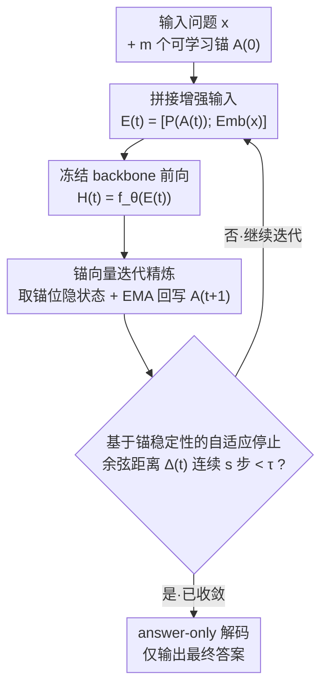

# Thinking in Latents: Adaptive Anchor Refinement for Implicit Reasoning in LLMs

**会议**: ICLR 2026  
**arXiv**: [2603.15051](https://arxiv.org/abs/2603.15051)  
**代码**: 无  
**领域**: LLM推理/效率  
**关键词**: 潜空间推理, 自适应停止, 锚向量, CoT压缩, 隐式计算

## 一句话总结

提出 AdaAnchor 潜空间推理框架——将可学习的锚向量（anchor vectors）附加到输入嵌入中，通过迭代前向传播精炼锚状态实现"沉默思考"，配合基于锚稳定性的自适应停止机制按实例难度动态分配计算量，在数学推理任务上比固定步潜推理准确率提升最高 5%、平均步数减少 48–60%，输出 token 相比 CoT 减少 92–93%。

## 研究背景与动机

**领域现状**：Chain-of-Thought (CoT) 推理已成为激发 LLM 多步推理能力的标准做法，在数学推理任务上取得显著提升。但生成长中间推理链增加了输出长度和推理开销，在高并发部署场景下成本尤其突出。

**现有痛点**：潜空间推理方法（如 Coconut、iCoT distillation）试图将推理转移到隐藏表示中仅输出答案，但大多依赖**固定的潜迭代步数**——这引入了一个需要跨模型/数据集调优的超参数，简单题浪费计算、难题可能计算不足。

**关键矛盾**：token 级 CoT 推理 = 高准确率 + 高 token 成本；潜空间推理 = 低 token 成本 + 固定步数不灵活。如何在低 token 输出的前提下实现**实例级自适应计算分配**是核心挑战。

**切入角度**：作者提出用一组可学习的"锚向量"作为潜推理的显式状态，通过反复前向传播迭代精炼，并监控锚向量的余弦距离变化作为收敛信号——收敛即停止，自然实现计算量的按需分配。

**与 soft prompt / prefix tuning 的区别**：传统 soft prompt 在推理时固定不变；AdaAnchor 的锚向量在推理时被**迭代重写**，充当跨迭代的持久潜记忆（persistent latent memory）。

**实际意义**：面向部署场景，输出 token 成本与推理延迟高度相关。将推理从 token 空间转移到潜空间 + 自适应步数控制 = 更低的服务成本和延迟。

## 方法详解

### 整体框架

AdaAnchor 在冻结的自回归 Transformer $f_\theta$ 之上挂载 $m$ 个可学习锚向量，把它们投影拼接到 token 嵌入前端，反复送入 backbone 前向传播、用输出隐状态回写锚向量，让"思考"全程发生在潜空间。每轮迭代后监控锚状态的余弦距离，一旦连续若干步几乎不变就提前停止，最终只基于收敛后的锚和原始输入解码答案（answer-only），不吐出任何中间推理 token。整套流程只有两处真正的创新——一处是把固定 soft prompt 改成跨迭代可写的「锚向量迭代精炼」回环，另一处是用收敛信号替代固定步数的「基于锚稳定性的自适应停止」，其余的拼接、前向、解码都是脚手架。

### 关键设计

**1. 锚向量迭代精炼：把固定的 soft prompt 改写成跨迭代可写的潜记忆。** 传统 prefix tuning 的软提示在推理时一成不变，无法承载多步推理的状态演化。AdaAnchor 让 $m$ 个锚 $A^{(t)}\in\mathbb{R}^{m\times d}$ 在每轮被重写：先经投影 $P(\cdot)$ 映射到 token 嵌入空间并拼到输入前端构成增强输入 $E^{(t)}=[P(A^{(t)});\text{Emb}(x)]$，做一次完整前向 $H^{(t)}=f_\theta(E^{(t)})\in\mathbb{R}^{(m+n)\times d}$，再取锚位置的输出隐状态作为新锚候选，与旧锚做指数移动平均 $A^{(t+1)}=(1-\beta)A^{(t)}+\beta H^{(t)}_{1:m}$，最多迭代 $K_{\max}$ 次。平滑系数 $\beta\in(0,1]$ 控制进化速度：$\beta=1$ 退化为直接覆盖，较小的 $\beta$ 让锚演化更平滑、收敛更稳。这套机制本质上在不改 Transformer 架构的前提下复现了类 RNN 的信息递归——而 $m\times d$ 维的紧凑锚强制充当压缩瓶颈，逼模型把多步推理蒸成关键特征而非冗长叙述。

**2. 基于锚稳定性的自适应停止：用收敛信号替代需要调优的固定步数。** 固定潜迭代步数是个跨模型/数据集都要重调的超参数，简单题浪费算力、难题又算不够。AdaAnchor 转而监控锚的收敛：取锚均值 $\bar{a}^{(t)}=\frac{1}{m}\sum_{i=1}^{m}a_i^{(t)}$，用相邻两步的余弦距离 $\Delta^{(t)}=1-\cos(\bar{a}^{(t)},\bar{a}^{(t-1)})$ 度量变化量，当它连续 $s$ 步都低于阈值 $\tau$ 才停，即 $T=\min\{t:\Delta^{(t-j)}<\tau,\;\forall j\in\{0,\ldots,s-1\}\}$；引入 patience $s$ 是为了避免单次波动造成误停。锚不再显著变化意味着潜推理已收敛到"不动点"附近，再迭代只是空转。这条启发式直接复用已有锚状态做检查，无需训练任何停止控制器，零额外参数、零额外训练开销，也可推广到其他迭代潜推理方法。

### 损失函数 / 训练策略

训练时冻结 backbone LM 权重，只更新 AdaAnchor 特有组件（锚嵌入 + 投影层）与一个 LoRA adapter，共训练 20 epoch，AdamW 优化器，学习率 $1\times10^{-4}$、weight decay $1\times10^{-2}$、梯度累积 16 步。目标除 answer-only 主损失外，额外加一个辅助锚对齐项（auxiliary anchor-alignment objective），把推理文本的粗粒度分块信息作为锚的弱监督信号。这一项是必要的：纯 answer-only 监督容易让锚退化成无意义噪声，而 rationale 的粗分块对齐既不需要逐 token 的推理链标注，又能把锚引导到结构化的中间推理状态上。

## 实验关键数据

### 主实验结果（Table 2）

| 模型 | 方法 | GSM8K Acc(%) | GSM8K Avg Tok | SVAMP Acc(%) | SVAMP Avg Tok | MultiArith Acc(%) | MultiArith Avg Tok |
|------|------|:---:|:---:|:---:|:---:|:---:|:---:|
| Qwen2.5-1.5B | No CoT | 13.0 | 2.16 | 42.0 | 2.34 | 22.3 | 2.41 |
| Qwen2.5-1.5B | CoT | 20.0 | 28.27 | 59.3 | 29.09 | 34.3 | 30.2 |
| Qwen2.5-1.5B | iCoT | 12.23 | 2.36 | 48.5 | 2.04 | 28.56 | 1.66 |
| Qwen2.5-1.5B | AdaAnchor (K=8) | 16.0 | 2.73 | 50.5 | 2.12 | 27.6 | 2.34 |
| **Qwen2.5-1.5B** | **AdaAnchor (adaptive)** | **16.0** | **2.17** | **55.2** | **2.23** | **29.4** | **2.16** |
| Llama-3.2-1B | No CoT | 10.5 | 2.98 | 38.2 | 2.10 | 20.56 | 2.08 |
| Llama-3.2-1B | CoT | 23.2 | 25.4 | 57.8 | 28.21 | 43.33 | 28.0 |
| Llama-3.2-1B | iCoT | 11.7 | 2.25 | 54.2 | 2.43 | 30.84 | 2.12 |
| Llama-3.2-1B | AdaAnchor (K=8) | 14.0 | 2.89 | 52.0 | 2.13 | 28.31 | 2.48 |
| **Llama-3.2-1B** | **AdaAnchor (adaptive)** | **17.2** | **2.45** | **53.4** | **2.8** | **32.44** | **2.57** |

### 自适应停止 vs 固定步数对比

| 模型 | 数据集 | 固定步(K=8)准确率 | 自适应准确率 | 固定步平均步数 | 自适应平均步数 | 步数减少 |
|------|--------|:---:|:---:|:---:|:---:|:---:|
| Qwen2.5-1.5B | GSM8K | 16.0% | 16.0% | 8.0 | 3.23 | 59.6% |
| Qwen2.5-1.5B | SVAMP | 50.5% | 55.2% | 8.0 | 4.12 | 48.5% |
| Qwen2.5-1.5B | MultiArith | 27.6% | 29.4% | 8.0 | 3.82 | 52.3% |
| Llama-3.2-1B | GSM8K | 14.0% | 17.2% | 8.0 | 3.5 | 56.3% |
| Llama-3.2-1B | SVAMP | 52.0% | 53.4% | 8.0 | 3.1 | 61.3% |
| Llama-3.2-1B | MultiArith | 28.31% | 32.44% | 8.0 | 3.5 | 56.3% |

### 关键发现

- **自适应停止全面优于固定步数**：在 Llama-3.2-1B 上 GSM8K 从 14.0% 提升到 17.2%（+3.2%），MultiArith 从 28.31% 到 32.44%（+4.13%），同时平均步数减少 48–61%。这说明固定 8 步在简单题上造成了"过度精炼"反而有害。
- **token 节省巨大但准确率有差距**：与 CoT 相比输出 token 减少约 92–93%（~2 token vs ~28 token），但准确率仍有明显差距（如 GSM8K 上 17.2% vs 23.2%），体现了不同的精度–效率权衡点。
- **收敛步数分布呈明显右偏**：大多数实例在 2–4 步就已收敛停止，只有少量难题需要接近最大步数 8 步，验证了自适应机制确实根据实例难度分配了差异化的计算量。
- **固定步数存在收益饱和**：消融实验中 $K$ 从 1 增到 4 时准确率上升明显，但 4→8 时增益显著减小，支持了"不需要总是跑满最大步数"的假设。

## 亮点与洞察

- **"沉默推理"范式的实用性**：将推理从 token 空间完全转移到潜空间，输出只有~2 个 token，对高并发 LLM 服务场景（如 API serving）有直接的成本节省价值——输出 token 是推理成本的核心组成部分。
- **锚向量 = 可迭代更新的 soft prompt**：创造性地将 prefix tuning 的"固定软提示"推广为"迭代可写的潜状态"，概念清晰且实现优雅。每次前向传播后用输出隐状态回写锚向量，形成类似递归神经网络的信息传递但无需修改 Transformer 架构。
- **收敛检测的简洁性**：不需要训练额外的停止策略网络，只用余弦距离监控 + patience 机制就实现了有效的自适应停止。这种设计的好处是零额外参数、零额外训练开销、可推广到任何迭代潜推理方法。
- **信息瓶颈视角**：$m$ 个锚向量构成信息瓶颈，迫使模型将推理所需的全部信息压缩到固定维度中。这与 Markovian/压缩推理的研究方向有呼应。

## 局限性

1. **准确率与 CoT 差距明显**：即使在最好的设置下（Llama-3.2-1B, SVAMP 53.4% vs CoT 57.8%），潜推理的准确率仍低于显式 CoT，说明当前的锚精炼尚无法完全替代 token 级推理的表达能力。
2. **停止策略依赖手工设计的阈值**：$\tau$ 和 patience $s$ 是手工选择的超参数，在分布外数据或非典型输入上可能过早/过晚停止。作者也承认用学习型停止策略替代是重要的后续方向。
3. **仅验证在小模型和数学任务上**：实验只用了 1B–1.5B 级别模型和 3 个数学数据集，未在更大模型（7B+）、更多推理类型（逻辑推理、代码生成）上验证泛化性。
4. **锚语义不可解释**：锚向量的语义无法直接解读——不清楚模型在每次迭代中"想"了什么，缺乏可解释性分析。
5. **推理延迟未充分讨论**：虽然输出 token 减少了，但每次迭代需要完整前向传播（平均 3–4 次），实际推理延迟可能并不低于 CoT，论文未报告 wall-clock time 对比。

## 相关工作与启发

### vs Coconut (Hao et al., 2024)
Coconut 同样在连续潜空间进行推理，将隐状态直接反馈到模型输入。AdaAnchor 的区别在于：(1) 使用显式的锚向量作为潜状态而非直接复用最后一个 token 的隐状态→更结构化；(2) 引入自适应停止→不需要固定步数；(3) 锚的平滑更新机制（EMA）增强收敛稳定性。

### vs iCoT / Implicit CoT (Deng et al., 2023/2024)
iCoT 通过知识蒸馏使模型"内化"推理过程——逐步删除 token 级推理步骤，让模型学会跳过中间步直接输出答案。AdaAnchor 的方法更显式：锚向量是外挂的可观察状态（虽然语义不透明），提供了明确的迭代精炼框架。实验中 AdaAnchor adaptive 在多数设置下优于 iCoT（如 SVAMP: 55.2% vs 48.5%）。

### vs Pause Tokens (Goyal et al., 2024)
Pause Tokens 在输入中插入 `<pause>` token 鼓励内部计算但不迭代更新。AdaAnchor 的核心改进是**迭代性**——锚不是一次性前向传播而是反复精炼。这引入了潜推理的时间深度（temporal depth），类似 Universal Transformer 的概念。

## 评分

| 维度 | 评分 | 理由 |
|------|------|------|
| 新颖性 | ★★★★☆ | 锚向量迭代精炼 + 收敛自适应停止的组合具有新意，但潜空间推理本身已有较多前期工作 |
| 技术质量 | ★★★☆☆ | 方法设计清晰合理，但实验规模偏小（仅 1B 级模型、3 个数学数据集），缺少 wall-clock time 对比和更大模型验证 |
| 实用价值 | ★★★★☆ | 92-93% 的 token 节省对 LLM serving 有直接价值，自适应停止机制简洁可推广，但准确率差距限制了实际替代 CoT 的场景 |
| 表达清晰度 | ★★★★☆ | 论文结构清楚，Algorithm 1 伪代码清晰，符号定义完整，但部分实验分析可以更深入 |

<!-- RELATED:START -->

## 相关论文

- [\[ICLR 2026\] Is It Thinking or Cheating? Detecting Implicit Reward Hacking by Measuring Reasoning Effort](is_it_thinking_or_cheating_detecting_implicit_reward_hacking_by_measuring_reason.md)
- [\[ICLR 2026\] Why is Your Language Model a Poor Implicit Reward Model?](why_is_your_language_model_a_poor_implicit_reward_model.md)
- [\[ICLR 2026\] Adaptive Social Learning via Mode Policy Optimization for Language Agents](adaptive_social_learning_via_mode_policy_optimization_for_language_agents.md)
- [\[ICLR 2026\] Temperature as a Meta-Policy: Adaptive Temperature in LLM Reinforcement Learning](temperature_as_a_meta-policy_adaptive_temperature_in_llm_reinforcement_learning.md)
- [\[AAAI 2026\] LLMs for Game Theory: Entropy-Guided In-Context Learning and Adaptive CoT Reasoning](../../AAAI2026/llm_reasoning/llms_for_game_theory_entropy-guided_in-context_learning_and_adaptive_cot_reasoni.md)

<!-- RELATED:END -->
