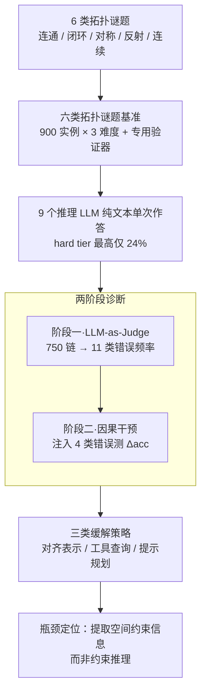

# TopoBench: Benchmarking LLMs on Hard Topological Reasoning

**会议**: ICLR2026  
**arXiv**: [2603.12133](https://arxiv.org/abs/2603.12133)  
**代码**: [GitHub](https://github.com/mayug/topobench-benchmark)  
**领域**: LLM推理  
**关键词**: benchmark, topological reasoning, spatial reasoning, puzzle, error diagnosis, causal intervention

## 一句话总结
构建TopoBench基准(6类拓扑谜题×3难度)评估LLM的全局空间推理能力，发现前沿模型hard tier仅解决<24%，并通过因果干预实验发现错误频率不等于因果影响——低频的约束遗忘比高频的重复推理更具破坏性。

## 背景与动机
1. LLM在代数/符号推理上表现强劲，但在需要维护全局空间不变量（连通性、闭环、对称性）的任务上能力不足
2. 现有谜题/推理基准多测试局部模式匹配或单元格级运算，不要求跨网格的全局约束维护
3. 拓扑约束在电路布局、路径规划、分子结构分析等实际应用中普遍存在
4. 现有评估仅报告准确率，无法区分模型失败源于推理本身还是空间信息提取/表示的局限
5. 需要将观察性错误分类与因果验证结合的诊断方法

## 方法详解

### 整体框架
TopoBench 把"LLM 到底能不能维护全局拓扑约束"这个模糊问题，拆成一条可测量、可归因的流水线。起点是 6 类目标互补的拓扑谜题，按棋盘尺寸和推理深度两个轴生成 900 个实例、分三档难度，每类配一个专用验证器做二值判分；中段让 9 个推理 LLM 在纯文本 CoT 下单次作答，逼出 hard tier 普遍崩溃（最强模型也只有 24%）的现象；随后用"观察分类 + 因果干预"两阶段诊断，把崩溃归因到具体的 CoT 错误模式，并把"看起来频繁"和"真正致命"区分开；最后用三类缓解策略反向验证，确认真正的瓶颈在于从空间表示里提取结构化约束，而不是对约束本身做推理。

### 关键设计

**1. 六类拓扑谜题基准：用互补的约束类型逼出全局推理的短板**

现有谜题基准多数只考局部模式匹配或单元格级运算，无法暴露"跨整张网格维护全局不变量"这一能力，于是 TopoBench 精选 6 类目标互补、各盯住一种全局约束的谜题：FlowFree 考路径连通（连接同色端点且路径互不交叉、铺满每格），Bridges/Hashiwokakero 考网络连通（用桥连岛并满足每岛度数、桥不交叉、整体连通），Loopy/Slitherlink 考闭环约束（在网格边上画唯一闭环、每格边数等于提示），Galaxies/Tentai Show 考旋转对称（把网格划成绕标记中心旋转对称的区域），Undead 考反射与视线可见性（按镜面反射后的视线计数放置怪物），Pattern/Nonogram 考行列连续性。难度沿两个轴同时拧——棋盘尺寸从 $5\times5$ 放大到 $7\times7$、$10\times10$（FlowFree hard 到 $12\times12$，Undead 因复杂度涨得快改用更小的 $4\times4/5\times5/7\times7$），以及生成器内部的"无需回溯推理深度"旋钮，保证更难的档位要的是更深推理而非单纯更大的网格。每类配一个基于规则的专用验证器做二值判分（正确/错误、无部分分），加上全程禁止外部代码执行，把考查目标牢牢锁在模型自身的拓扑推理上；最终共 900 个实例（每类每档 50 题）。

**2. 两阶段诊断：把错误从"频率"推进到"因果"**

光看准确率无法判断模型是不会推理还是提取不出约束，而只做观察性错误统计又会把"看起来频繁"误当成"真正致命"，因此诊断分两步走、用同一套错误词表把频率和因果解耦。阶段一是观察分类：用 LLM-as-Judge 协议（GPT-5-mini）给 750 条 CoT 推理链（5 类谜题 × 3 难度 × 50，因 Loopy 近乎全零而排除）打标签，归入一个 11 类的错误词表（正文重点讨论 7 类），并只在 455 条错误链上统计各类频率。阶段二是因果干预：挑出四类机制互不相同的错误，把它们各自注入覆盖约 15% 解题进度的金标准前缀（在 DeepSeek V3.2 上，每条件 100 题 × 3 难度 = 300 题），测量注入前后下游准确率之差 $\Delta\text{acc}=\text{acc}_{\text{inject}}-\text{acc}_{\text{baseline}}$（带 95% Wilson 置信区间），用这个差值量化每种错误的真实破坏力。四类被注入的错误是：RR（重复推理）从同一局面重走几乎相同的步子却毫无进展，观察频率高达 33% 但注入后 $\Delta\text{acc}\approx0$，只是搜索的良性副产品；PC（过早承诺）过早锁定一条错误分支并坚持三步以上，频率 32%、注入后 Bridges 掉 20.8pp、Undead 掉 11.3pp，破坏力最强；CF（约束遗忘）执行一个直接违反规则的动作，虽只在 4% 的链里出现，注入后却同样掉约 11pp；STF（状态追踪失败）让模型自述的棋盘与其动作日志脱节，频率 18%、在 Bridges 上 7.8pp 处于显著性边界、在状态更丰富的 Undead 上则显著掉 11.7pp。把四类放进同一注入框架，才得到"低频的约束遗忘比高频的重复推理更致命"这一反直觉结论——根因在于 CF 制造的是一个内部自洽却违规的状态，只有靠主动核验约束才能发现，而模型恰恰缺这种能力；STF 留下的只是网格与日志间的语法矛盾，模型还能靠交叉比对部分纠回。

**3. 三类缓解策略：定位瓶颈在表示解析而非约束推理**

知道哪类错误致命还不够，得知道该在哪里修，作者于是用三种各盯一个假设的缓解手段反向定位瓶颈。其一是 cell-aligned 输入表示，把每行切成等数量 token（IntFormat / IntFormat-JSON），让 Bridges、Galaxies 等多数谜题 family 准确率大幅上升（部分 +30～40pp），说明默认 ASCII 的参差 BPE 切分本身就把二维结构切丢了一部分——不过对 Undead、Pattern 反而掉点，效果与 tokenizer 设计相关。其二是工具增强约束查询，用外部引擎维护棋盘状态、以工具调用回传结构化约束信息（如剩余度数、连通性），把 Bridges hard 拉高约 10%，而若改成回传 ASCII 网格的视觉状态反而掉点。其三是提示级规划引导（鼓励规划与回溯的 prompt 变体），几乎没有改善，说明这类行为无法靠 prompt 可靠激发。三者合起来指向同一结论：真正卡住模型的是从空间表示中提取结构化约束信息，而非对约束本身做推理。

## 实验

| 模型 | Easy Avg | Medium Avg | Hard Avg |
|------|:--------:|:----------:|:--------:|
| GPT-5-mini-high | **0.71** | **0.44** | **0.24** |
| Gemini-3-Flash | 0.60 | 0.35 | 0.09 |
| DeepSeek V3.2 | 0.58 | 0.37 | 0.10 |
| Qwen3-235B | 0.31 | 0.12 | — |
| Qwen3-32B | 0.07 | — | — |

### 因果干预实验

| 干预错误 | 观察频率 | Bridges Δacc | Undead Δacc | 因果效应 |
|---------|:--------:|:----------:|:---------:|:-------:|
| RR(重复推理) | 33% | ≈0 | ≈0 | **无** |
| PC(过早承诺) | 32% | **-20.8pp** | **-11.3pp** | **强** |
| CF(约束遗忘) | 4% | **-10.6pp** | **-11.3pp** | **强** |
| STF(状态追踪失败) | 18% | -7.8pp(边界) | **-11.7pp** | 中等 |

**关键发现**:
1. Galaxies和Loopy在medium/hard上几乎所有模型准确率为0，全局不变量(旋转对称/闭环)是最难的约束类型
2. **错误频率≠因果影响**：约束遗忘(CF)仅在4%失败trace中出现，但因果效应~11pp；重复推理(RR)在33%出现但因果效应≈0——是搜索的良性副产品
3. 过早承诺(PC)和约束遗忘(CF)是真正致命的错误模式——CF频率极低却破坏力巨大，PC频率中等但破坏力最强(Bridges -20.8pp)
4. 工具增强：提供结构化约束信息(如剩余度数、连通性状态)可提升Bridges hard 10%，但提供ASCII网格视觉状态反而降低准确率
5. **核心结论**：瓶颈在于从空间表示中提取结构化约束信息，而非对约束进行推理
6. 提示级干预(鼓励规划/回溯)在所有设置下均未产生有意义改善
7. 最强模型GPT-5-mini-high在hard tier仅24%，最强开源DeepSeek V3.2仅10%——远低于人类100%

## 亮点与洞察
- 错误频率≠因果影响的发现极具洞察力，挑战了常见假设
- 因果干预实验设计严谨：在金标准解题路径上注入控制变量
- 缓解策略实验区分了"空间表示解析"vs"约束推理"的瓶颈
- 6类谜题覆盖不同拓扑约束类型，设计全面

## 相关工作与启发
- 相比GridPuzzle(Tyagi等2024)仅做观察性错误分类，TopoBench增加了因果干预验证——将频率与因果解耦
- 相比ARC/BIG-Bench Hard测试抽象泛化，TopoBench专注拓扑/几何约束维护
- 相比Sudoku-Bench等拉丁方变体，TopoBench要求全局不变量(连通/闭环/对称)而非局部约束
- 发现prompt引导无效，暗示拓扑推理能力需要架构/训练层面的突破

## 局限性
- 仅在DeepSeek V3.2上做因果干预分析(其他模型不暴露完整CoT或API限制)
- 谜题虽控制良好但与真实工程任务(电路布局/路径规划)有差距
- ASCII文本输入限制了多模态模型的潜力（虽有初步多模态探索）
- 人类参考基于experienced solver，未报告新手人类的难度感知
- hard tier大部分近零，区分度不足——可能需要更细粒度的难度梯度

## 相关工作
- 推理基准: GSM8K/MATH (代数), ARC (抽象), SATBench (逻辑), Sudoku-Bench (Latin square)
- 错误诊断: GridPuzzle (Tyagi et al. 2024) 观察性错误分类; LLM-as-judge (Liu et al. 2023)
- 空间推理: Othello-GPT (Li et al. 2023) 状态追踪; VGRP-Bench, Enigmata 视觉网格评估
- 工具增强: ReAct (Yao et al. 2023), Toolformer (Schick et al. 2023)

## 评分
- 新颖性: ⭐⭐⭐⭐⭐ (因果干预+拓扑推理诊断组合独特)
- 实验充分度: ⭐⭐⭐⭐⭐ (9模型+6谜题+3难度+因果实验+缓解策略)
- 写作质量: ⭐⭐⭐⭐⭐ (结构清晰，分析深入)
- 价值: ⭐⭐⭐⭐ (揭示LLM空间推理的根本瓶颈)

<!-- RELATED:START -->

## 相关论文

- [\[ICLR 2026\] GeoGramBench: Benchmarking the Geometric Program Reasoning in Modern LLMs](geogrambench_benchmarking_the_geometric_program_reasoning_in_modern_llms.md)
- [\[ICLR 2026\] VisioMath: Benchmarking Figure-based Mathematical Reasoning in LMMs](visiomath_benchmarking_figure-based_mathematical_reasoning_in_lmms.md)
- [\[NeurIPS 2025\] CoRe: Benchmarking LLMs' Code Reasoning Capabilities through Static Analysis Tasks](../../NeurIPS2025/llm_reasoning/core_benchmarking_llms_code_reasoning_capabilities_through_static_analysis_tasks.md)
- [\[ICLR 2026\] RFEval: Benchmarking Reasoning Faithfulness under Counterfactual Reasoning Intervention in Large Reasoning Models](rfeval_benchmarking_reasoning_faithfulness_under_counterfactual_reasoning_interv.md)
- [\[AAAI 2026\] MathSmith: Towards Extremely Hard Mathematical Reasoning by Forging Synthetic Problems with a Reinforced Policy](../../AAAI2026/llm_reasoning/mathsmith_towards_extremely_hard_mathematical_reasoning_by_forging_synthetic_pro.md)

<!-- RELATED:END -->
