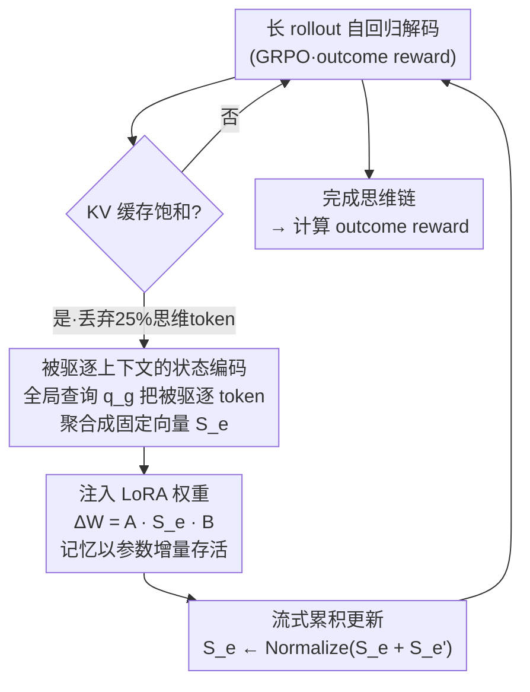

# Training Large Reasoning Models Efficiently via Progressive Thought Encoding

**会议**: ICLR 2026  
**arXiv**: [2602.16839](https://arxiv.org/abs/2602.16839)  
**代码**: 无公开代码  
**领域**: LLM推理  
**关键词**: 大推理模型, 强化学习训练效率, KV缓存压缩, 参数高效微调, 渐进式思维编码

## 一句话总结

提出 Progressive Thought Encoding，在 KV 缓存受限条件下将被驱逐的思维 token 编码进 LoRA 权重，使大推理模型在 RL 训练时显存减半的同时推理准确率反超全缓存 LoRA（AIME2024/2025 上最高提升 +23.4%）。

## 研究背景与动机

**RL 训练的核心瓶颈**：大推理模型（LRM）通过 RL（如 GRPO）进行后训练，需要长 rollout 序列获取 outcome-based reward。自回归解码使 rollout 阶段成为时间和显存的主要瓶颈——困难任务需要更长的思维链，进一步加剧资源消耗。

**滑动窗口的困境**：直觉上可以用滑动窗口限制 KV 缓存大小来降低显存。但实验显示这会严重损害推理质量——丢弃中间思维 token 破坏了长距离上下文理解能力，导致 rollout 样本质量下降，进而影响训练效果。例如 Qwen2.5-3B 在滑动窗口下平均准确率从 28.2% 降至 25.6%。

**核心问题**：能否在严格的显存预算下训练 LRM，同时不牺牲推理准确率？即让模型在有限缓存窗口下仍能"看到"所有历史 token。

## 方法详解

### 整体框架

Progressive Thought Encoding 要解决的是同一件事：在 RL（GRPO）训练大推理模型时，长 rollout 的 KV 缓存会吃光显存，但直接用滑动窗口丢弃中间思维 token 又会切断长距离依赖、拖垮推理质量。它的做法是把"缓存驱逐"从一次纯粹的信息损失，改造成一次在线学习的机会。整条 pipeline 是一个随解码反复触发的回环：模型照常自回归解码，一旦 KV 缓存饱和，就按驱逐策略选出一批要丢的思维 token，先用一个全局查询把它们压成固定大小的状态向量 $S_e$，再把这个向量注入一组轻量级 LoRA 权重形成增量 $\Delta W$，最后把本轮状态累积进历史状态后继续解码。这样被驱逐 token 的信息不再留在缓存里，而是以参数增量的形式留在模型里——缓存每饱和一次就编码、注入、累积一次，模型在受限窗口下依然"记得"全部历史。

### 关键设计

**1. 被驱逐上下文的状态编码：用一个全局查询把丢掉的 token 压成固定向量**

整体框架里的第一步要解决"被驱逐的思维 token 彻底消失、长距离依赖被切断"这个痛点。这里引入一个可学习的全局查询向量 $q_g$ 作为所有被驱逐上下文的摘要载体，每当一批 token $\{y_{e_1},\dots,y_{e_m}\}$ 按驱逐策略选出后，就用一个注意力式映射把它们聚合成上下文状态

$$S_e = (W_Q^a q_g)\,(W_K^a K_e)^\top\,(W_V^a V_e)$$

其中 $K_e、V_e$ 是被驱逐 token 的键值向量，$W_Q^a、W_K^a、W_V^a$ 负责把全局查询和被驱逐 token 投影到一个压缩潜空间。关键在于无论被驱逐多少 token，$S_e$ 的维度都是固定的，因此后续的权重更新开销与历史长度无关，这正是显存能压住的根本原因。为了让 $q_g$ 从第一步就是一个有意义的上下文载体，在处理任何被驱逐 token 之前先用一个可学习的全局 token $h_g$ 初始化状态，避免冷启动时编码出噪声。

**2. 把上下文状态注入 LoRA 权重：让"记忆"以参数增量形式存活**

有了 $S_e$ 还得让它真正影响后续解码，对应框架图里编码之后的注入这一步。本方法不把 $S_e$ 塞回缓存（那样就违背了省显存的初衷），而是用它构造 LoRA 的权重增量 $\Delta W = A\,S_e\,B$，直接挂到模型权重上。这样被驱逐 token 的影响不再依赖注意力去"看见"具体的 KV，而是融进了前向计算的每一层，模型在有限窗口下仍保有长上下文理解能力。由于 LoRA 本身参数极少，这条记忆通路几乎不增加显存，却能把数千个被丢弃 token 的信息持续保留下来——这是"显存减半却不丢精度"的关键。

**3. 流式累积更新：让记忆随生成不断刷新而不爆炸**

一次编码只能覆盖当前这一批被驱逐 token，而长推理会多次触发驱逐，所以框架的回环必须让状态能增量叠加。每当新一批 token 被驱逐、算出新的 $S_e'$ 后，用 $S_e \leftarrow \text{Normalize}(S_e + S_e')$ 累积更新，再据此重算 $\Delta W$。归一化保证状态量级不随驱逐次数发散，叠加则实现了真正的流式适应——模型在整段生成里持续"记住"所有被驱逐过的 token，本质上是在推理时对自己的中间思维做在线自适应。消融也印证了这两条通路缺一不可：只留全局 token、不做驱逐编码（Global-Only）或只做驱逐编码、不要全局 token（#Global-0）都明显逊于二者合用。

### 损失函数 / 训练策略

训练沿用 outcome-based 的 GRPO，在 DAPO-Math-17K 上以全局 batch size 512 优化，学习率 1e-5。驱逐策略上对问题 token 永久保留（类似 sink token），只对思维 token 做滑动窗口驱逐，缓存饱和时每次丢弃 25% 的 token；缓存大小取当前 micro-batch 中最大的问题长度。可学习模块很轻：LoRA rank 设为 32，全局 token 数也取 32（消融显示再加到 64 反而变差）。

## 实验关键数据

### 主实验

在 3 个模型 × 6 个数学推理基准上的对比（最大生成长度 3072）：

| 方法 | Peak GPU Mem | Math500 | Olympiad | AMC | AIME24 (p@16) | AIME25 (p@16) | 平均 |
|------|-------------|---------|----------|-----|---------------|---------------|------|
| **Qwen2.5-3B** | | | | | | | |
| Baseline | - | 50.8 | 27.2 | 34.3 | 20.0 | 13.3 | 26.9 |
| LoRA | 82.8% | 53.2 | 27.8 | 35.9 | 20.0 | 16.7 | 28.2 |
| LoRA_c (滑动窗口) | 38.0% | 50.0 | 27.7 | 33.1 | 16.7 | 10.0 | 25.6 |
| **Ours** | **45.3%** | **54.0** | **29.0** | **45.0** | **20.0** | **16.7** | **30.1** |
| **DeepSeek-R1-Distill-8B** | | | | | | | |
| Baseline | - | 53.6 | 28.7 | 42.5 | 20.0 | 20.0 | 30.1 |
| LoRA | 88.7% | 57.4 | 35.3 | 55.0 | 23.3 | 20.0 | 34.9 |
| LoRA_c | 59.1% | 54.2 | 31.9 | 45.0 | 36.7 | 26.7 | 35.1 |
| **Ours** | **59.8%** | **57.6** | **39.7** | **60.0** | **56.7** | **43.3** | **45.6** |

### 消融实验

全局 token 与驱逐策略的影响（DeepSeek-R1-Distill-8B, MATH-500）：

| 配置 | 缓存768 | 缓存1K | 缓存2K | 说明 |
|------|---------|--------|--------|------|
| Baseline | 34.4 | 39.6 | 47.8 | 无 RL 训练 |
| #Global-0（无全局 token） | 36.2 | 41.0 | 48.6 | 仅驱逐编码，提升有限 |
| Global-Only（无驱逐更新） | 46.8 | 50.2 | 54.0 | 全局 token 有效但不足 |
| **Ours (#Global-32)** | **48.4** | **52.2** | **55.4** | 全局+驱逐编码最优 |
| Ours + HeadKV | 50.7 | 53.4 | 55.8 | 更好的驱逐策略有帮助 |

**可扩展性**：固定 1K 缓存窗口，将最大生成长度从 3K 扩展到 64K，本方法在整个长度范围内持续缩放提升，而 LoRA 和 LoRA_c 逐步饱和。

### 关键发现

1. **显存减半、精度反超**：在 DeepSeek-R1-8B 上，Peak GPU 从 88.7% 降至 59.8%（-28.9%），平均准确率从 34.9% 升至 45.6%（+10.7%）
2. **AIME 上表现惊人**：DeepSeek-R1-8B 在 AIME2024 上从 23.3 提升到 56.7（+33.4），AIME2025 从 20.0 到 43.3（+23.3）
3. **更长推理 = 更好效果**：渐进编码使训练时可安全增大 rollout 长度（4K→6K），显存几乎不变但 MATH-500 从 57.6 升至 60.2
4. **长序列推理更稳定**：本方法在长响应上表现尤为突出，而 LoRA_c 的增益主要来自短响应

## 亮点与洞察

- **化废为宝**：将 KV 缓存驱逐从"信息丢失"转变为"在线学习机会"，是一个极为巧妙的视角转换
- **推理 RL 的实际可行性**：显存消耗是阻碍 RL 训练扩展的主要障碍，本方法直接解决了这个工程痛点
- **test-time learning 的新形式**：渐进编码本质上是推理时的在线自适应——模型在生成过程中不断学习自己的中间思维

## 局限与展望

1. **仅验证了数学推理**：6 个基准全部是数学任务，代码生成、科学推理等场景未覆盖
2. **驱逐策略保守**：训练时仅用简单滑动窗口，作者自己指出更优的 token 选择策略（如 HeadKV）可进一步提升但会增加 37% 运行时间
3. **全局 token 数敏感**：#Global-64 反而不如 #Global-32，超参选择需要调优
4. **未与 token-level reward 方法对比**：当前仅考虑 outcome-based reward，process reward 可能进一步提升

## 相关工作与启发

- 与 **test-time training**（如 entropy minimization）互补——本方法是"生成时训练"
- 与 **KV 缓存压缩**（PyramidKV, H2O, HeadKV）正交——可直接集成更优的驱逐策略
- 启发：**RL 训练中的效率优化**是当前 LRM 研究的关键方向，本方法提供了一条从"缓存管理"切入的新路径

## 评分

- 新颖性: ⭐⭐⭐⭐⭐ 将缓存驱逐转化为在线学习信号，思路极具创意
- 实验充分度: ⭐⭐⭐⭐ 3 模型 × 6 基准 + 丰富消融，但限于数学领域
- 写作质量: ⭐⭐⭐⭐ 问题形式化清晰，公式推导严谨
- 价值: ⭐⭐⭐⭐⭐ 直击 LRM RL 训练的核心痛点，工程意义重大

<!-- RELATED:START -->

## 相关论文

- [\[ICLR 2026\] Towards Safe Reasoning in Large Reasoning Models via Corrective Intervention](towards_safe_reasoning_in_large_reasoning_models_via_corrective_intervention.md)
- [\[ICML 2026\] SmartThinker: Progressive Chain-of-Thought Length Calibration for Efficient Large Language Model Reasoning](../../ICML2026/llm_reasoning/smartthinker_progressive_chain-of-thought_length_calibration_for_efficient_large.md)
- [\[ICLR 2026\] Dynamics-Predictive Sampling for Active RL Finetuning of Large Reasoning Models](dynamics-predictive_sampling_for_active_rl_finetuning_of_large_reasoning_models.md)
- [\[ICLR 2026\] RFEval: Benchmarking Reasoning Faithfulness under Counterfactual Reasoning Intervention in Large Reasoning Models](rfeval_benchmarking_reasoning_faithfulness_under_counterfactual_reasoning_interv.md)
- [\[ICLR 2026\] Native Reasoning Models: Training Language Models to Reason on Unverifiable Data](native_reasoning_models_training_language_models_to_reason_on_unverifiable_data.md)

<!-- RELATED:END -->
