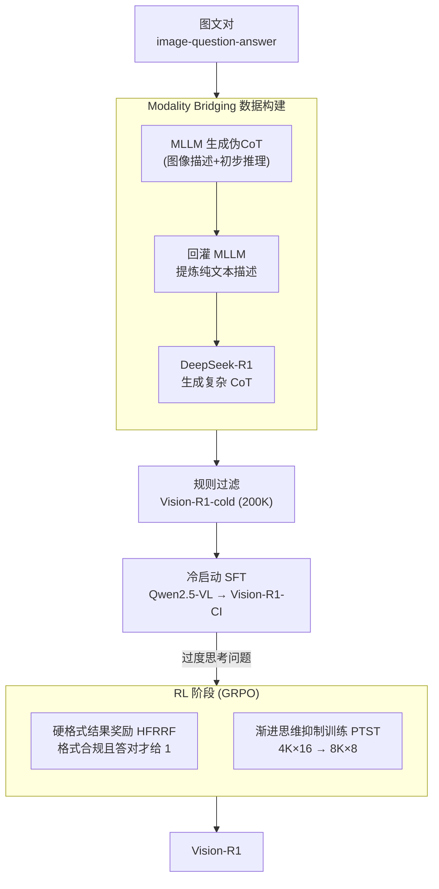

# Vision-R1: Incentivizing Reasoning Capability in Multimodal Large Language Models

**会议**: ICLR 2026  
**arXiv**: [2503.06749](https://arxiv.org/abs/2503.06749)  
**代码**: [GitHub](https://github.com/Osilly/Vision-R1)  
**领域**: 多模态VLM  
**关键词**: 多模态推理, 强化学习, 思维链, GRPO, 冷启动初始化

## 一句话总结

提出Vision-R1，通过Modality Bridging构建200K高质量多模态CoT数据进行冷启动初始化，再用渐进思维抑制训练(PTST)策略结合GRPO强化学习，在7B参数规模达到与OpenAI O1接近的多模态数学推理能力。

## 研究背景与动机

DeepSeek-R1成功展示了纯RL可以在LLM中激发复杂推理能力（如自我反思、质疑），但这一成功能否迁移到多模态LLM (MLLM)？

作者首先尝试直接用RL训练MLLM（命名Vision-R1-Zero），发现关键困难：

**RL直接训练无法激发复杂推理**：由于缺乏大规模高质量多模态推理数据，模型生成不出复杂CoT

**现有多模态CoT数据质量不足**：缺乏自我反思、质疑等人类认知过程，只是格式化的"伪CoT"

**冷启动后的过度思考问题**：用CoT数据SFT后，模型生成过长的推理链，但正确推理集中在短链中，导致RL训练难以优化

## 方法详解

### 整体框架

Vision-R1 走"先教会再放手"的两阶段路线，但真正的难点不在强化学习(RL)本身，而在于两个前置障碍：缺乏带自我反思的高质量多模态推理数据，以及冷启动后模型会"想太多"。整体流程是：先用 Modality Bridging 把图像信息转成纯文本、借纯文本的 DeepSeek-R1 造出一批高质量多模态思维链(CoT)数据 Vision-R1-cold（20 万条），对基座模型（Qwen2.5-VL）做冷启动监督微调(SFT)得到 Vision-R1-CI；再叠加 GRPO 强化学习，用渐进思维抑制训练(PTST)分阶段约束推理长度、配硬格式结果奖励逼出复杂而正确的推理，最终得到 Vision-R1。

### 关键设计

**1. Modality Bridging：借纯文本 R1 造多模态 CoT**

DeepSeek-R1 能生成带自我反思、质疑的人类般推理，却看不懂图像，没法直接拿来标多模态数据。作者用一条"图像→文本→R1→CoT"的桥接管线绕开这个限制：先把图文对喂给 MLLM 生成一份含图像描述与初步推理的"伪 CoT(Pseudo-CoT)"，逼模型把更多视觉细节显式写成文字；再把这份伪 CoT 连同原图文一起回灌 MLLM，提炼出一段尽量无损的纯文本描述，完成从视觉到语言的模态桥接；最后把这段纯文本送进 DeepSeek-R1，换回一条高质量复杂 CoT。经规则过滤后得到 20 万条 Vision-R1-cold，其中反思标记"Wait"出现约 585K 次，而对照的 LLaVA-CoT 只有 2.3K 次，自我反思密度高出两个数量级——这正是冷启动能"激发"而非仅"格式化"推理的关键。

**2. 硬格式结果奖励(HFRRF)：先识别过度思考病灶，再钉死优化目标**

冷启动教会了模型反思，却带来一个副作用——它倾向于对所有问题都生成极长推理链，但实测正确答案大多集中在较短的链中（即"过度思考优化问题"）。若直接用 16K 的长度上限做 RL，模型会被引导生成更长却更易出错的推理，性能不升反降。为此 RL 阶段采用硬格式结果奖励函数(HFRRF)：只有当输出格式合规**且**最终答案正确时奖励 $r_i=1$，否则一律为 $0$，不给"长而像样但答错"的推理任何可乘之机，把优化目标牢牢钉在"答对"上。

**3. 渐进思维抑制训练(PTST)：用长度约束分阶段逼出正确推理**

既然过度思考是病灶，PTST 就反其道而行：早期严格压缩推理预算，迫使模型在短空间里先学会"想对"，再随训练推进逐步放宽预算，让它把省下来的篇幅用在真正需要复杂推理的难题上。实现上分两阶段，Stage 1 用 $4\text{K}\times16$、Stage 2 用 $8\text{K}\times8$（推理长度 $L_s$ × 采样数 $G_s$），刻意让长度与采样数的乘积在各阶段保持恒定，从而在放宽长度的同时不改变每步的总计算预算，使训练信号可比。消融显示这种"短→长"的渐进约束比全程固定 4K 或固定 16K 都更优。

### 损失函数 / 训练策略

冷启动阶段在Vision-R1-cold上对基座模型（Qwen2.5-VL）做标准SFT。RL阶段的GRPO目标函数（叠加PTST的分阶段约束）为：

$$J_{\text{GRPO}}^{(s)}(\theta) = \mathbb{E}\left[\frac{1}{G_s}\sum_{i=1}^{G_s}\min\left(\frac{\pi_\theta(o_i^{(s)}|q)}{\pi_{\theta_{\text{old}}}(o_i^{(s)}|q)}A_i^{(s)}, \text{clip}(\cdot, 1-\varepsilon, 1+\varepsilon)A_i^{(s)}\right) - \beta D_{\text{KL}}\right]$$

其中 $s$ 标识PTST的阶段，裁剪系数 $\varepsilon=0.2$、KL系数 $\beta=10^{-2}$，优势用组内归一化估计 $A_i = \frac{r_i - \text{mean}(\{r_j\})}{\text{std}(\{r_j\})}$，奖励 $r_i$ 即上文的HFRRF（0或1）。

## 实验关键数据

### 主实验

| 模型 | 参数量 | MathVista | MathVerse | MM-Math | DynaMath | 均分 |
|------|--------|-----------|-----------|---------|----------|------|
| OpenAI O1 | - | 73.9 | - | - | - | - |
| GPT-4o | - | 63.8 | 37.6 | 31.8 | 64.9 | - |
| Qwen2.5-VL-7B | 7B | 68.1 | 46.7 | 34.1 | 50.7 | 49.9 |
| Qwen2.5-VL-72B | 72B | 73.5 | 51.3 | 45.6 | 61.2 | 57.9 |
| **Vision-R1-7B** | **7B** | **73.5** | **52.4** | **40.2** | **56.3** | **55.6** |
| **Vision-R1-32B** | **32B** | **76.4** | **62.1** | **55.3** | **65.6** | **64.9** |
| **Vision-R1-72B** | **72B** | **78.2** | **63.2** | **59.3** | **66.4** | **66.8** |

Vision-R1-7B vs 基座Qwen2.5-VL-7B：GEO +13.4, ALG +10.3, GPS +16.4, MathVista整体 +5.4

### 消融实验

| 方法 | Cold Start | GRPO | PTST | 平均推理长度 | 均分(MathVista/MathVerse/MM-Math) |
|------|-----------|------|------|------------|------|
| Vision-R1-Zero | ✗ | ✓ | ✗ | 1285 | 50.7 |
| Vision-R1-CI | ✓ | ✗ | ✗ | 3566 | 44.5 |
| Vision-R1-Long | ✓ | ✓ | ✗ | 3107 | 47.7 |
| **Vision-R1** | **✓** | **✓** | **✓** | **2057** | **55.4** |

| PTST配置 | Stage1 | Stage2 | MathVista | 均分 | 说明 |
|----------|--------|--------|-----------|------|------|
| 固定16K | 16K×4 | 16K×4 | 70.3 | 47.7 | 早期无约束严重过思考 |
| 固定4K | 4K×16 | 4K×16 | 72.6 | 54.3 | 有效但限制了复杂推理 |
| **PTST 2阶段** | **4K×16** | **8K×8** | **73.5** | **55.4** | 最优，渐进放宽 |
| PTST 3阶段 | 4K×16 | 6K×12 → 8K×8 | 73.0 | 55.1 | 额外阶段无显著增益 |

### 关键发现

- **7B打败70B**: Vision-R1-7B在MathVista上达73.5%，仅低于OpenAI O1 0.4%，超越Qwen2.5-VL-72B
- **RL直接训练不够**: Vision-R1-Zero仅50.7均分，无法激发有效推理
- **冷启动必不可少但不够**: CI模型44.5均分（严重过度思考），必须配合PTST
- **PTST简单有效**: 两阶段(4K→8K)即达最优，额外阶段无益，说明策略稳健
- **数据质量关键**: Vision-R1-cold中"Wait"出现586K次 vs LLaVA-CoT仅2.3K次，自我反思标记频率高2个数量级
- 在Llama-3.2-11B-V上验证跨模型泛化：Vision-R1-cold SFT在所有基准上超越LLaVA-CoT和Mulberry

## 亮点与洞察

- 首次系统探索R1式RL在MLLM上的应用，清晰揭示了直接RL、冷启动、PTST各自的作用
- Modality Bridging巧妙解决了DeepSeek-R1不能处理图像的限制
- PTST策略洞察深刻：先学会"正确思考"再"复杂思考"，类比人类学习规律
- 仅用10K数据做RL即可获得~6%平均提升，数据效率极高
- "Aha moment"在MLLM中首次被观察到（如自我纠正和反思）

## 局限与展望

- RL训练仅使用数学数据，对通用推理任务的泛化有待验证
- PTST的阶段数和长度设置目前靠经验，缺乏理论指导
- Modality Bridging存在信息损失风险（视觉→文本转换）
- 32B和72B版本使用了额外数据，与7B不完全可比
- cold-start数据规模(200K)可能是瓶颈，更大规模数据的收益待探索

## 相关工作与启发

- 与DeepSeek-R1对应的多模态版本，指明了MLLM推理增强的可行路径
- PTST思想可应用到其他需要控制生成长度的RL场景
- Modality Bridging方法可推广到其他需要纯文本LLM处理多模态数据的场景

## 评分

- 新颖性: ⭐⭐⭐⭐⭐ 首次将R1式推理范式成功迁移到MLLM，PTST策略原创
- 实验充分度: ⭐⭐⭐⭐⭐ 多基准(MathVista/MathVerse/MM-Math/DynaMath)、多规模(7B/32B/72B)、丰富消融
- 写作质量: ⭐⭐⭐⭐ 论述流畅，问题驱动的叙事结构好，但部分符号较密
- 价值: ⭐⭐⭐⭐⭐ 7B参数达到O1水平的多模态推理能力，对社区有重大启发意义

<!-- RELATED:START -->

## 相关论文

- [\[ICLR 2026\] AIMCoT: Active Information-driven Multimodal Chain-of-Thought for Vision-Language Reasoning](aimcot_active_information-driven_multimodal_chain-of-thought_for_vision-language.md)
- [\[ICLR 2026\] Efficient Test-Time Scaling for Small Vision-Language Models](efficient_test-time_scaling_for_small_vision-language_models.md)
- [\[NeurIPS 2025\] VideoRFT: Incentivizing Video Reasoning Capability in MLLMs via Reinforced Fine-Tuning](../../NeurIPS2025/llm_reasoning/videorft_incentivizing_video_reasoning_capability_in_mllms_via_reinforced_fine-t.md)
- [\[ICLR 2026\] AgentMath: Empowering Mathematical Reasoning for Large Language Models via Tool-Augmented Agent](agentmath_empowering_mathematical_reasoning_for_large_language_models_via_tool-a.md)
- [\[ICLR 2026\] Co-rewarding: Stable Self-supervised RL for Eliciting Reasoning in Large Language Models](co-rewarding_stable_self-supervised_rl_for_eliciting_reasoning_in_large_language.md)

<!-- RELATED:END -->
