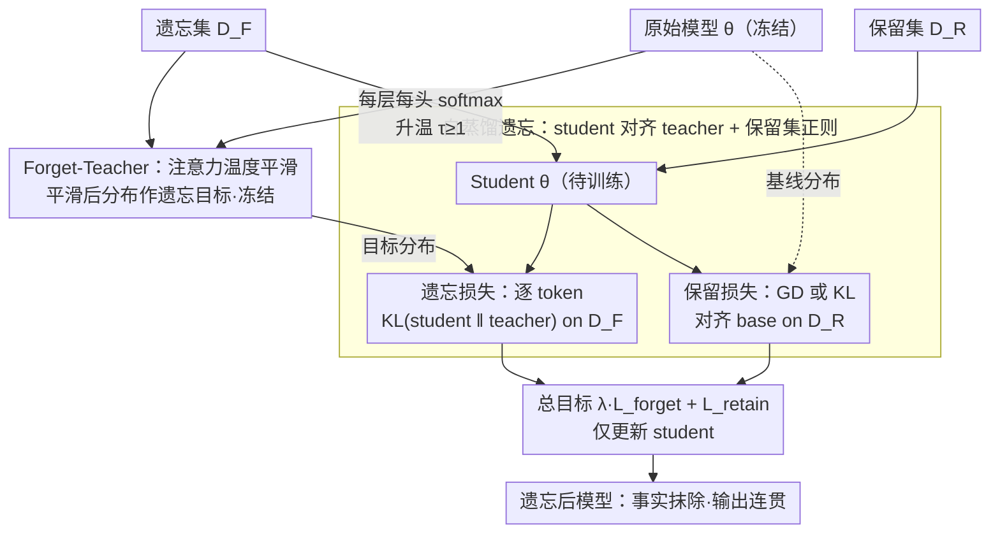

# Attention Smoothing Is All You Need For Unlearning

**会议**: ICLR 2026  
**arXiv**: [2603.01285](https://arxiv.org/abs/2603.01285)  
**作者**: Saleh Zare Zade, Xiangyu Zhou, Sijia Liu, Dongxiao Zhu (Wayne State University, Michigan State University)  
**领域**: AI安全  
**关键词**: LLM遗忘, 注意力平滑, 自蒸馏, 隐私保护, 知识遗忘  

## 一句话总结
提出Attention Smoothing Unlearning (ASU)，通过提高自注意力softmax温度构造forget-teacher，将遗忘问题转化为自蒸馏——平滑注意力分布以削弱词汇级和语义级关联，从而在擦除记忆知识的同时保持模型输出连贯性，在TOFU、MUSE、WMDP等多个基准上超越现有遗忘方法。

## 研究背景与动机

**领域现状**：LLM在大规模数据上训练时会记忆敏感、有版权或有害的内容，带来隐私和法律风险。从头重训代价过高，LLM遗忘（unlearning）成为高效替代方案。

**现有方法分类**：
   - **发散型遗忘（Divergence-based）**：如梯度上升（GA）、NPO，通过将参数推离原始收敛解来逆转学习效果。问题是遗忘力度难以控制——不足则遗忘不彻底，过度则模型整体性能严重退化。
   - **收敛型遗忘（Convergence-based）**：如IDK（用"我不知道"作为目标）、DPO，将模型引导到新状态。问题是容易让模型变得过度无知，且遗忘效果往往只在QA格式下有效，无法推广到自由文本生成。

**核心痛点**：现有方法在处理遗忘集相关提示时经常产生乱码（gibberish）输出，暴露了遗忘操作的痕迹。根本原因是这些方法未能彻底消除注意力权重中的词汇级和语义级关联——这些关联使模型仍能检索相关的上下文或事实信息。

**本文切入角度**：直接对注意力机制下手，通过提高softmax温度来平滑注意力分布，从源头上破坏事实信息的回忆链路，同时保持语法结构和语言连贯性。

## 方法详解

### 整体框架

ASU 把一个老问题换了个新角度：现有遗忘方法之所以会吐乱码、暴露遗忘痕迹，是因为它们没有真正切断注意力里的事实关联，只是把参数推远（发散型）或换成固定模板（收敛型）。ASU 转而把遗忘重新表述成一次**自蒸馏（self-distillation）**——先用「注意力平滑」从原始模型造出一个 **forget-teacher**，然后在遗忘集 $\mathcal{D}_F$ 上让 **student**（被遗忘的模型本身，从原始模型初始化）去对齐这个 teacher 被模糊掉的输出分布，同时在保留集 $\mathcal{D}_R$ 上加一项正则维持效用。整条链路只多了一个温度超参数 $\tau$，不引入外部模型、不增加参数，遗忘的「目标」由 teacher 自然给出，而不是人为指定。下图是这套自蒸馏结构的数据流：

### 关键设计

**1. Forget-Teacher：给注意力 softmax 加温度，从源头平滑掉事实关联**

旧方法的乱码病根在于它们绕开了注意力、没切断让模型「检索」到事实的那条精确关联链路。ASU 直接对注意力机制下手：在每层 $\ell$、每个注意力头 $h$ 的 softmax 里插入温度 $\tau \geq 1$，把标准注意力 $\text{Softmax}(\frac{Q_h K_h^T}{\sqrt{d_k}})$ 改写成 $\text{Softmax}(\frac{Q_h K_h^T}{\tau\sqrt{d_k}})$，投影层、前馈层、layer norm 一概不动。$\tau$ 越大，注意力分布的熵越大、越趋于均匀，token 之间的精确关联被稀释，被记忆的事实就无法再被精准检索；$\tau=1$ 退回原始模型，$\tau\to\infty$ 时 softmax 趋于均匀、每个头退化为对历史 value 取平均，模型彻底失去精确 attend 前文的能力。用这套平滑注意力跑出来、且全程冻结的模型，就是只在遗忘集上生成目标分布的 forget-teacher。

它能在抹事实的同时保住通顺，靠的是一个实证发现：在 TOFU 上把答案 token 分成事实型 token（factual）和功能型 token（function，如 "is"、"the"），升高 $\tau$ 后事实型 token 的负对数似然（NLL）增幅远大于功能型 token。也就是说，事实回忆高度依赖精确注意力模式，而承载句法结构的功能 token 对平滑并不敏感。正是这种差异化响应，让 ASU 不会像 GA/NPO 那样把参数推飞、整句崩成乱码——这也是它区别于发散型方法的根本之处。

**2. 自蒸馏遗忘目标：让 student 对齐 forget-teacher，保留集再正则**

有了 teacher，遗忘就落到在遗忘集 $\mathcal{D}_F$ 上最小化 student 与 forget-teacher 之间的逐 token KL 散度：

$$\mathcal{L}_{\text{ASU}} = \mathbb{E}_{(x,y)\sim\mathcal{D}_F}\Big[\frac{1}{T}\sum_{t=1}^T \text{KL}\big(p(\cdot\mid x \circ y_{<t}; \theta_\tau) \,\big\|\, p(\cdot\mid x \circ y_{<t}; \theta)\big)\Big]$$

其中 $\theta_\tau$ 是加了温度的 forget-teacher、$\theta$ 是被训练的 student。平滑只施加在遗忘集上，保留集完全不碰；保留集那边再用标准梯度下降（GD）或对齐原始模型的 KL 正则两种方式维持效用，分别对应 $\text{ASU}_\text{GD}$ 和 $\text{ASU}_\text{KL}$，整体优化的是 $\lambda\,\mathcal{L}_F + \mathcal{L}_R$ 的权衡。和 IDK 那类「强行输出 I don't know」的固定模板不同，这里的遗忘 target 是 teacher 把信息平滑掉之后自然给出的——模型该说什么就说什么，因此不绑定 QA 格式、能推广到自由文本续写。

这样设计为什么够用且稳定，论文给了存在性论证：$\tau=1$ 保留全部记忆、$\tau\to\infty$ 完全失忆且输出不连贯，由连续性可知中间必然存在某个有限 $\tau>1$ 恰好实现遗忘目标，于是 $\tau$ 就成了一个权衡「遗忘力度 vs 连贯性」的旋钮。优化层面，KL 散度天然非负、有下界，而 forget-teacher 由原始模型直接改温度构造、不外引模型，因此训练目标有界、过程不发散；又因为平滑只作用于遗忘集相关的关联，模型在其他任务上学到的有用关联不受波及——这正是它相对 IDK 那类「易过度无知、损效用」的收敛型方法的优势。

## 实验设计与结果

### 实验设置
- **TOFU基准**（Right to Be Forgotten）：200个虚构作者×20 QA对，在Llama-2-Chat-7B上评测forget01/05/10三个子任务
- **MUSE基准**（版权内容遗忘）：News和Books两个领域，评测逐字回忆(VerbMem)、知识记忆(KnowMem)和隐私泄露(PrivLeak)
- **WMDP基准**（有害知识遗忘）：危险知识移除场景
- **持续遗忘**：模拟滚动式"被遗忘权"请求，连续多步遗忘不同子集
- **真实世界遗忘**：用模型自身已记忆的真实人物信息构建遗忘集
- **评价指标**：Model Utility (MU)和Forget Efficacy (FE)的调和均值

### 主要结果

1. **TOFU基准**：$\text{ASU}_\text{KL}$ 在forget01上达到MU=77.13/FE=83.08（Avg=80.10），显著超越所有基线。相比 $\text{IDK}_\text{AP}$（MU最高的基线），ASU在遗忘效果上提升约30%（forget05: 60.88→77.84；forget10: 61.27→78.16），同时保持相当的模型效用

2. **持续遗忘**：在连续多步遗忘中，GA立即崩溃，NPO和IDK逐步退化，而ASU在极端条件下（遗忘90%作者）仍保持约75分的平均分，退化速度明显慢于所有竞争方法

3. **真实世界遗忘**：$\text{ASU}_\text{KL}$ 取得MU=55.76/FE=79.60的最佳综合表现。其他方法要么MU崩溃到0（DPO、IDK），要么FE不足（GA、NPO）

4. **MUSE版权遗忘**：在News和Books两个设置上，ASU均取得最佳的遗忘-效用权衡。尤其在Books上 $\text{ASU}_\text{GD}$ 的VerbMem降至4.9（NPO为53-54），遗忘效果远超基线；$\text{ASU}_\text{KL}$ 在保持KnowMem=62.5（接近Retrain的68.7）的同时实现了有效遗忘

### 消融实验

1. **部分层平滑**：仅平滑浅层（如第6-8层）即可获得接近全层平滑的遗忘效果（forget01: Avg 78.11 vs 全层80.10），验证了事实知识主要依赖浅层注意力关联的假说，也暗示可以通过只平滑少量层来降低计算开销
2. **与IDK结合**：ASU可与IDK方法叠加使用，在TOFU上进一步提升FE（forget10: FE从61.27提升到86.94），同时保持MU在75以上（75.60），展示了方法的可组合性
3. **温度稳定性**：$\tau \in [2.0, 2.8]$ 范围内ASU性能稳定一致，MU和FE波动极小，对超参数不敏感，便于实际使用

## 优点与局限

### 优点
- **原理清晰**：从注意力机制角度解释遗忘过程，有理论支撑（事实token vs 功能token的差异化响应）
- **实用性强**：无需外部模型，仅增加一个温度超参数，实现简单
- **效果全面**：在QA和文本续写两种格式上均有效，不限于特定任务
- **持续遗忘鲁棒**：在多步连续遗忘场景下退化最慢，适合实际部署
- **保持输出质量**：不会像现有方法那样产生乱码输出

### 局限
- 温度 $\tau$ 虽然在较宽范围内稳定，但仍需针对不同任务/数据集调节
- 论文主要在7B规模模型上验证，更大规模模型的表现有待验证
- 遗忘的不可逆性和安全性（如对抗性攻击下是否仍有效）未充分讨论

## 个人思考

1. **注意力温度平滑是一个优雅的遗忘思路**：将遗忘目标从"不知道"或"远离"转变为"模糊化注意力"，在机制层面有更好的可解释性。事实回忆依赖精确注意力、句法不依赖精确注意力的发现很有启发性。
2. **与知识编辑的关系**：本文的浅层平滑发现与知识编辑（如ROME/MEMIT对浅层MLP操作）异曲同工，暗示事实知识在Transformer中有相对集中的编码位置。注意力层和MLP层在知识存储中可能扮演互补角色。
3. **潜在扩展**：注意力温度调控不仅可用于遗忘，也可能用于选择性知识增强（降低温度使注意力更尖锐）或风格迁移。此外，可以考虑对不同层使用不同温度（自适应温度策略）进一步优化遗忘-效用权衡。
4. **实际部署价值**：持续遗忘场景（多轮"被遗忘权"请求）是ASU的显著优势，这在GDPR合规的实际场景中非常重要。相比GA等方法连续遗忘后立即崩溃，ASU能在遗忘90%数据后仍保持稳定，具有很强的工程实用性。
5. **方法的简洁性**：整个方法只引入一个超参数 $\tau$，不需要额外数据、外部模型或复杂的训练策略，这种简洁性使其容易集成到现有LLM训练流程中。
6. **局限性思考**：对抗性攻击（如精心设计的prompt）下ASU的遗忘是否仍然有效？如果攻击者知道使用了注意力平滑，是否能设计绕过策略？这些安全性问题值得后续研究。

<!-- RELATED:START -->

## 相关论文

- [\[ICLR 2026\] Train Once, Answer All: Many Pretraining Experiments for the Cost of One](train_once_answer_all_many_pretraining_experiments_for_the_cost_of_one.md)
- [\[ICLR 2026\] Understanding Sensitivity of Differential Attention through the Lens of Adversarial Robustness](understanding_sensitivity_of_differential_attention_through_the_lens_of_adversar.md)
- [\[CVPR 2025\] Towards All-in-One Medical Image Re-Identification](../../CVPR2025/llm_safety/towards_all-in-one_medical_image_re-identification.md)
- [\[ICLR 2026\] LLM Unlearning with LLM Beliefs](llm_unlearning_with_llm_beliefs.md)
- [\[ICLR 2026\] Unmasking Backdoors: An Explainable Defense via Gradient-Attention Anomaly Scoring for Pre-trained Language Models](unmasking_backdoors_an_explainable_defense_via_gradient-attention_anomaly_scorin.md)

<!-- RELATED:END -->
