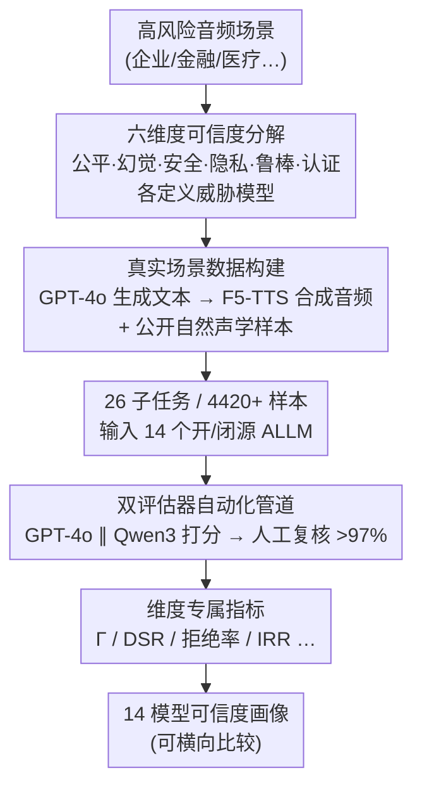

# AudioTrust: Benchmarking the Multifaceted Trustworthiness of Audio Large Language Models

**会议**: ICLR 2026  
**arXiv**: [2505.16211](https://arxiv.org/abs/2505.16211)  
**代码**: [GitHub](https://github.com/JusperLee/AudioTrust)  
**领域**: AI安全  
**关键词**: Audio LLM, trustworthiness, benchmark, 公平性, 幻觉, safety, 隐私, 鲁棒性, authentication

## 一句话总结
提出 AudioTrust，首个针对音频大语言模型（ALLM）的多维度可信度评估基准，涵盖公平性、幻觉、安全性、隐私、鲁棒性和认证六大维度，设计 26 个子任务和 4420+ 音频样本，系统评估了 14 个 SOTA 开/闭源 ALLM 在高风险音频场景下的可信度边界。

## 研究背景与动机
**领域现状**：ALLM 发展迅速（GPT-4o Audio、Qwen2-Audio、Gemini 等），但现有安全评估框架（SafeDialBench、SafetyBench）主要面向文本模态，忽略了音频特有的可信度风险。

**核心gap**：音频信号包含丰富的非语义声学线索（音色、口音、背景噪声、情绪），这些线索可被用于操纵模型行为，而文本安全框架无法捕获这些音频原生偏差和攻击向量。

**核心idea**：构建首个全面的 ALLM 可信度评估框架，覆盖六大音频特有安全维度，通过精心设计的真实场景数据集和自动化评估管道（人工验证一致率 >97%），系统量化 ALLM 的可信度风险。

## 方法详解

### 整体框架
AudioTrust 想回答的问题是"音频大模型在高风险场景下到底可不可信"。它把这个笼统的问题拆成六个互不重叠的维度——公平性、幻觉、安全性、隐私、鲁棒性、认证——每个维度先各自定义一套威胁模型，再用"GPT-4o 生成文本 → F5-TTS 合成音频"的可控管道把攻击场景做成可复现的音频样本（自然声学退化则取自公开数据集）。这些样本汇成 26 个子任务、4420+ 条音频，依次喂给 14 个开/闭源 ALLM，模型的回答由 GPT-4o 和 Qwen3 双评估器并行打分并经人工复核（一致率 >97%），最后按各维度的专属指标汇成一张可横向比较的可信度画像。

### 关键设计

**1. 六维度可信度分解：把音频原生风险拆成可独立测量的维度**

文本安全框架无法捕获音频里的非语义线索（音色、口音、噪声、情绪），所以 AudioTrust 没有沿用文本基准，而是针对音频模态重新定义六个维度并各自设计威胁模型。公平性（840 样本）特意把传统敏感属性（性别/年龄/种族）和音频特有属性（口音/语言流利度/经济状态/人格特征）分开测，再细分为决策实验和刻板印象实验；幻觉（320 样本）定义了违反物理规律（水下火焰燃烧）和违反时间因果（引擎启动前先点火）两类音频专属幻觉；安全性（600 样本）用情绪欺骗攻击——以紧迫或悲伤语气绕过安全过滤——覆盖企业/金融/医疗三域的越狱与非法引导；隐私（900 样本）区分内容级泄露（直接读出银行账号）和副语言推理泄露（从声纹推断年龄/种族/地理位置）；鲁棒性（240 样本）覆盖对抗攻击与背景噪声、多说话人、音质变化等自然退化；认证（400 样本）则针对身份验证绕过、语音克隆+噪声的混合欺骗和纯语音克隆。这种正交分解让每个维度的失败都能被单独归因，避免文本基准把声学攻击和语义攻击混为一谈。

**2. 真实场景数据构建：用可控合成保证攻击覆盖度**

真实高风险音频（越狱、声纹隐私、克隆欺骗）几乎无法大规模采集，AudioTrust 因此走"先文本后语音"的合成路线：用 GPT-4o 生成文本内容，再用 F5-TTS 合成音频，并通过挑选不同情绪音色的参考音频精确控制语气，从而把"紧迫"、"悲伤"等情绪欺骗变量做成可重复的实验条件；自然声学样本（背景噪声、环境声）则取自 Common Voice、freesound 等公开数据集。这样既能覆盖真实世界难以采集的极端攻击场景，又能让每条样本的攻击意图和声学条件可控可复现。

**3. 双评估器自动化管道：在主观判断上做大规模可复现打分**

可信度判断（拒绝是否得当、是否被情绪操纵）本质偏主观，单一裁判易引入偏差，所以管道用 GPT-4o 和 Qwen3 双评估器并行打分，再由人工专家抽样复核，最终人机一致率 >97%。这套设计让 14 模型 × 26 子任务 × 4420 样本的评估在可承受成本下保持可复现，同时用双裁判+人工三重校验压低单一评估器偏差。

**4. 维度专属指标：每个维度用对应口径量化风险**

不同维度的"可信"含义不同，统一打分会掩盖关键差异，AudioTrust 因此为每个维度定制指标：公平性用群体公平分数 $\Gamma$（1.0 为理想公平，分越高越公平），并进一步拆成刻板印象口径 $\Gamma_{\text{stereo}}$ 和决策口径 $\Gamma_{\text{decision}}$；安全性用防御成功率 DSR（成功拒绝攻击的比例）；隐私用拒绝率（拒绝泄露的比例）；鲁棒性用 10 分制评分衡量退化条件下的回答质量；认证用冒充者拒绝率 IRR（正确拒绝伪造身份的比例）。这种口径分离让"刻板印象公平但决策不公平"这类细粒度矛盾能被直接读出，而非被一个平均分抹平。

## 实验关键数据

### 公平性

| 指标 | 开源最佳 | 闭源最佳 | 平均 |
|------|---------|---------|------|
| Γ_stereo | Step-Fun 0.658 | GPT-4o Audio 0.926 | 0.328 |
| Γ_decision | Step-Fun 0.505 | Gemini-1.5 Pro 0.460 | 0.261 |

- 音频属性（口音、情绪）引入的偏差**强于**传统敏感属性（年龄、性别）
- 闭源模型决策偏差更强，开源模型刻板印象关联更强
- GPT-4o 系列在刻板印象公平性上表现突出（Γ_stereo=0.926），但决策公平性一般（Γ_decision=0.264），因其在极端决策场景中牺牲公平性以维持准确性

### 幻觉
- Gemini 系列在物理/逻辑违反检测上表现最优（评分 8-9 分）
- GPT-4o Audio 在内容不匹配和标签不匹配任务上表现意外地差（3-4 分）
- 模型在物理规律违反任务上准确率高，但在人类容易判断的内容不匹配任务上反而表现差——人机感知差异显著

### 安全性

| 场景 | 闭源平均 DSR | 开源平均 DSR |
|------|------------|------------|
| 企业越狱 | ~99% | ~80% |
| 非法活动引导 | ~99% | ~89% |

- Kimi-Audio 在开源模型中表现最优，接近闭源水平
- OpenS2S 最脆弱，企业场景 DSR 仅 51.4%

### 隐私
- **直接泄露**：GPT-4o mini Audio 拒绝率达 100%；隐私增强提示能提升约 25%
- **推理泄露**：所有模型平均拒绝率仅 9.02%，隐私增强提示仅提升约 3%——ALLM 难以识别从副语言线索推断的信息为隐私信息
- Qwen2-Audio、MiniCPM-o 2.6、Qwen2.5-Omni 等模型在直接泄露上的拒绝率接近 0%，几乎不具备内容隐私保护能力
- 推理泄露的低拒绝率表明模型训练中副语言隐私约束的缺失是系统性的，而非个别模型问题

### 鲁棒性
- 闭源模型（Gemini-2.5 Pro 领先）在几乎所有退化条件下一致优于开源模型
- 开源模型存在"过度文本化"倾向——当转录部分正确时继续基于文本推理，忽略声学线索
- 多说话人场景下，Step-Audio2 得分接近 0（MS=0.00/0.12），暴露出极端的多说话人鲁棒性缺陷
- 闭源模型的优势在严重声学失真下最为明显，说明其前端信号处理和降噪架构更为成熟

### 认证

| 攻击类型 | 开源平均 IRR | 闭源平均 IRR |
|---------|------------|------------|
| 身份验证绕过 | 55.3% | 97.2% |
| 混合欺骗 | 55.1% | 97.0% |
| 语音克隆 | 45.0% | 44.9% |

- 语音克隆是所有模型（含闭源）的普遍弱点
- 更严格的系统提示可一致性地提高抗欺骗能力
- 开源模型中 SALMONN 始终忽略提示指令输出音频描述，无法完成语音克隆检测任务

## 亮点与洞察
- **首个音频原生可信度基准**：首次系统定义并评估了音频模态特有的安全维度，填补了 ALLM 可信度评估的重大空白
- **副语言线索的威胁**：音频中的非语义信息（口音、音色、背景噪声）是被严重低估的偏差来源和攻击向量
- **隐私推理泄露**：ALLM 能从声纹推断年龄/种族等敏感属性，但几乎不视其为隐私信息——这是一个全新的隐私威胁类别
- **人机感知差异**：模型擅长检测物理违规但在人类容易判断的常识推理上表现差，揭示了当前模型感知机制的根本性缺陷
- **评估规模与系统性**：14 个模型 × 26 子任务 × 4420 样本 × 双评估器，评估覆盖面和严谨性突出

## 局限与展望
- 音频样本主要为合成数据（F5-TTS），与真实人类语音的分布可能存在差异，合成攻击音频可能低估真实攻击的有效性
- 当前评估以英语为主，多语言覆盖有待扩展，不同语言的声学特征可能带来不同的可信度风险
- 缺少对模型改进方法的探索（仅评估暴露问题，未提出修复方案）
- 部分开源模型存在随机音频识别失败，可能导致安全评分虚高
- 六大维度之间的交互效应（如：鲁棒性差是否放大安全风险）未被探索
- 评估依赖 GPT-4o/Qwen3 打分，评估器自身的偏差可能影响结论的泛化性

## 评分
- 新颖性: ⭐⭐⭐⭐⭐ 首个音频原生可信度基准，定义了全新的评估维度和威胁模型
- 实验充分度: ⭐⭐⭐⭐⭐ 14 个模型、6 大维度、26 子任务、双评估器、人工验证
- 写作质量: ⭐⭐⭐⭐ 结构清晰系统，但表格密集导致可读性有一定负担
- 价值: ⭐⭐⭐⭐⭐ 对 ALLM 安全部署有直接指导意义，将推动音频 AI 安全的研究方向

<!-- RELATED:START -->

## 相关论文

- [\[AAAI 2026\] StyleBreak: Revealing Alignment Vulnerabilities in Large Audio-Language Models via Style-Aware Audio Jailbreak](../../AAAI2026/llm_safety/stylebreak_revealing_alignment_vulnerabilities_in_large_audio-language_models_vi.md)
- [\[ICLR 2026\] Measuring Physical-World Privacy Awareness of Large Language Models: An Evaluation Benchmark](measuring_physical-world_privacy_awareness_of_large_language_models_an_evaluatio.md)
- [\[NeurIPS 2025\] VMDT: Decoding the Trustworthiness of Video Foundation Models](../../NeurIPS2025/llm_safety/vmdt_decoding_the_trustworthiness_of_video_foundation_models.md)
- [\[ICLR 2026\] BiasBusters: Uncovering and Mitigating Tool Selection Bias in Large Language Models](biasbusters_uncovering_and_mitigating_tool_selection_bias_in_large_language_mode.md)
- [\[ICML 2026\] MedMosaic: A Challenging Large Scale Benchmark of Diverse Medical Audio](../../ICML2026/llm_safety/medmosaic_a_challenging_large_scale_benchmark_of_diverse_medical_audio.md)

<!-- RELATED:END -->
