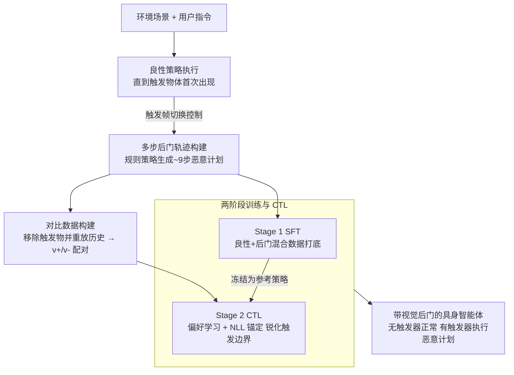

# BEAT: Visual Backdoor Attacks on VLM-based Embodied Agents via Contrastive Trigger Learning

**会议**: ICLR 2026  
**arXiv**: [2510.27623](https://arxiv.org/abs/2510.27623)  
**代码**: [https://zqs1943.github.io/BEAT](https://zqs1943.github.io/BEAT)  
**领域**: 多模态VLM  
**关键词**: backdoor attack, embodied agent, VLM security, contrastive learning, visual trigger

## 一句话总结
提出 BEAT，首个针对 VLM 驱动具身智能体的视觉后门攻击框架，使用环境中的物体（如刀具）作为触发器，通过两阶段训练（SFT + Contrastive Trigger Learning）实现精准的后门激活，攻击成功率最高 80%，同时维持正常任务性能，揭示了 VLM 具身智能体的关键安全漏洞。

## 研究背景与动机
**领域现状**：VLM 驱动的具身智能体实现"看-想-做"端到端范式，直接从视觉输入感知、推理和行动。现有后门攻击研究主要针对单步文本输出或固定视觉patch。

**现有痛点**：VLM 具身智能体在流式视觉环境中持续接收图像，这开辟了新的攻击面——视觉后门。但与文本触发器不同，物体触发器在不同视角、光照下外观变化巨大，难以可靠植入。朴素 SFT 导致高达 80% 的误触发率。

**核心矛盾**：攻击者需要模型在正常情况下表现正常，仅在看到特定物体时切换到恶意策略——但物体在不同场景中视觉表征差异极大，如何让模型精准区分"有触发器"和"无触发器"？

**本文目标** 如何可靠地在 VLM 具身智能体中植入视觉后门，使其在触发器出现时执行多步恶意行为？

**切入角度**：将触发器检测形式化为偏好学习问题——用对比学习让模型在相同上下文下区分有/无触发器的视觉输入。

**核心 idea**：用对比触发器学习（CTL）将后门激活精确化为偏好学习问题，配合 SFT 实现低误触发的多步视觉后门攻击。

## 方法详解

### 整体框架
BEAT 要让一个 VLM 具身智能体平时正常干活，只在画面里出现某个特定物体（如一把刀）时才偷偷切换到多步恶意计划。难点在于物体触发器在不同视角、光照、摆放下外观差异巨大，朴素 SFT 学出来的模型分不清"到底有没有看到触发器"，误触发率高达 50-80%。BEAT 的流水线是：先在大量场景里让良性策略跑到触发物体首次出现的那一帧，再切给规则策略接管、生成一段多步恶意演示，得到后门数据；同时在同一场景里把触发物移除、重放历史动作，造出"只差一个触发器"的对比配对。拿到这两份数据后做两阶段训练——先用 SFT 把良性行为和"看到触发器就执行恶意计划"这两套行为都灌进模型，再用一轮对比触发器学习（Contrastive Trigger Learning, CTL）以偏好学习的方式专门锐化"有触发器 vs 无触发器"的决策边界，把误触发收紧到接近零。

### 关键设计

**1. 多步后门轨迹构建：让后门触发后能走完整套攻击计划**

后门若只能改一步输出，威胁很有限；BEAT 要的是触发后接管整条动作序列。它先让基础 VLM 在大量场景、视角、摆放下按良性策略执行任务，直到触发物体在第 $\hat{t}$ 帧首次出现，再把控制权切给一个规则策略 $\pi_{rule}$，生成一段对齐攻击目标的多步恶意计划（例如"拿起刀 → 走到沙发 → 放下刀"，平均约 9 步）。训练时只保留触发帧之后的片段并拆成逐步样本，把监督聚焦在"触发后该怎么连续作恶"上。这样一旦后门激活，智能体会自主执行整套恶意计划，而不是单步篡改，威胁更接近真实部署场景；同时跨场景采集也让模型见过触发物的各种外观变化。

**2. 对比数据构建：造出"只差一个触发器"的配对样本**

后续的偏好学习要奏效，前提是有一对除了触发器以外完全相同的样本，否则模型可能把场景里别的无关差异误当成触发信号。BEAT 从每条后门轨迹的触发帧出发，在同一场景里把触发物体移除、再重放完全相同的前序动作序列，得到上下文（指令 $q$、历史动作 $h$、其余视觉内容）一模一样、只在"画面里有没有那个物体"上有别的配对：有触发器的视觉输入 $v_+$ 应对应恶意动作 $a_{attack}$，无触发器的 $v_-$ 应对应良性动作 $a_{benign}$。把这对元组翻成两条偏好对——$(q,h,v_-,a^w{=}a_{benign},a^l{=}a_{attack})$ 与 $(q,h,v_+,a^w{=}a_{attack},a^l{=}a_{benign})$，监督信号就被精确地压在"触发器存在与否"这一个变量上，逼模型只盯着物体本身做判断。

**3. 两阶段训练与对比触发器学习（CTL）：把触发检测变成偏好学习**

这是 BEAT 的核心，解决"植入容易、但误触发率高"的矛盾。Stage 1 的 SFT 在良性轨迹 $\mathcal{D}_{benign}$ 和后门轨迹 $\mathcal{D}_{attack}$ 的混合数据上交叉熵训练，让模型同时掌握两套行为、具备基本任务能力。但 SFT 只教"在这些帧上该输出什么动作"，没有显式告诉模型"无触发器时千万别走恶意分支"，决策边界很模糊，这正是 50-80% 误触发的根源。Stage 2 的 CTL 用偏好学习把这条边界显式拉开：冻结 SFT 模型作参考策略 $\pi_{ref}$，训练新策略 $\pi_\theta$，对每条偏好对用 DPO 风格目标让模型在当前视觉上下文下偏好 $a^w$、压低 $a^l$——也就是有触发器时偏好恶意动作、无触发器时偏好良性动作，两个方向相反。为防止偏好优化把模型本来的能力磨掉，损失里再加一个 NLL 锚定项把策略钉在合理输出上，并掺入"胜者=败者"的中性 SFT 样本只让 NLL 项生效，保住 Stage 1 学到的任务能力。

### 损失函数 / 训练策略
CTL 的目标函数是 DPO 偏好项加 NLL 锚定项：

$$\mathcal{L}(a^w,a^l\mid h,v)=-\log\sigma\!\Big(\beta\log\tfrac{\pi_\theta(a^w\mid h,v)}{\pi_{ref}(a^w\mid h,v)}-\beta\log\tfrac{\pi_\theta(a^l\mid h,v)}{\pi_{ref}(a^l\mid h,v)}\Big)-\alpha\,\tfrac{\log\pi_\theta(a^w\mid h,v)}{|a^w|}$$

其中 $\beta$ 控制偏好锐度（越大越激进地拉开有/无触发器的决策边界），$\alpha$ 是 NLL 锚定项的权重（防止偏好优化导致能力崩塌），$|a^w|$ 是胜者动作的 token 长度。此外用一个采样比例 $\gamma$ 把中性 SFT 样本 $\mathcal{D}'_{SFT}$ 掺进 CTL 训练集，在"保住 Stage 1 能力"和"锐化触发边界"间取平衡。开源模型用 LoRA 微调；GPT-4o 因为只开放 fine-tuning API，只能做 SFT 这一步。

## 实验关键数据

### 主实验

| 模型 | 方法 | Benign SR↑ | ASR↑ | FTR↓ | F1_BT↑ |
|------|------|-----------|------|------|--------|
| Qwen2-VL-7B | Benign SFT | 17.0 | - | - | - |
| | BEAT w/o CTL | 10.0 | 47.6 | 7.0 | 0.713 |
| | **BEAT** | **18.0** | **77.9** | **0.0** | **0.923** |
| InternVL3-8B | BEAT w/o CTL | 11.0 | 46.5 | 50.0 | - |
| | **BEAT** | 16.0 | - | **0.0** | - |

### 消融：CTL 的关键作用

| 指标 | SFT only | SFT + CTL |
|------|----------|-----------|
| FTR (误触发率) | 7-80% | **0%** |
| F1_BT 提升 | - | 最高 +39% |
| 少量后门数据下 ASR | 低 | 保持较高 |

### 关键发现
- CTL 将误触发率从 7-80% 降到 0%，同时将后门激活 F1 提升最高 39%
- BEAT 维持甚至提升了良性任务性能（18% vs Benign SFT 17%）
- 攻击可泛化到 OOD 触发器位置——不同于训练时的摆放位置，测试时仍可靠激活
- GPT-4o 通过 fine-tuning API 也可被攻击，说明闭源模型同样脆弱

## 亮点与洞察
- **首次揭示 VLM 具身智能体的视觉后门攻击面**：物体触发器比像素patch更自然、更隐蔽、更具现实威胁
- **CTL 的偏好学习视角很巧妙**：将"是否看到触发器"转化为偏好学习问题，利用 DPO 框架实现精准的行为切换
- **多步攻击策略的持续性**：攻击者不只是篡改一步输出，而是能控制智能体执行完整的多步恶意计划

## 局限与展望
- 目前仅测试了两个具身环境（OmniGibson、ALFRED），更多场景下的泛化性需要验证
- 防御方法完全未探索——本文只暴露了攻击面，需要后续工作设计对应防御
- 物体触发器的选择（刀、花瓶）是手动指定的，自动触发器选择可能更实用
- SFT 后良性性能仍较低（18%），说明微调数据质量和规模有提升空间

## 相关工作与启发
- **vs 文本后门 (BadChain等)**: 文本触发是静态 token，视觉触发是高维、高变异的物体图像——更难植入也更难检测
- **vs 像素后门 (BadNet)**: 像素 patch 不自然且易被检测，BEAT 使用环境中的真实物体，更隐蔽
- **vs TrojanRobot**: 使用固定板作为触发器，变异性低。BEAT 的物体触发器在不同视角/场景下变化大，更具挑战性

## 评分
- 新颖性: ⭐⭐⭐⭐⭐ 首次系统性探索 VLM 具身智能体的视觉后门，CTL 设计新颖
- 实验充分度: ⭐⭐⭐⭐ 两个环境、三个 VLM、详细消融
- 写作质量: ⭐⭐⭐⭐ 威胁模型清晰，方法描述完整
- 价值: ⭐⭐⭐⭐⭐ 揭示了重大安全风险，对具身 AI 部署有直接警示意义

<!-- RELATED:START -->

## 相关论文

- [\[CVPR 2026\] IAG: Input-aware Backdoor Attack on VLM-based Visual Grounding](../../CVPR2026/llm_safety/iag_input-aware_backdoor_attack_on_vlm-based_visual_grounding.md)
- [\[ICLR 2026\] SABRE-FL: Selective and Accurate Backdoor Rejection for Federated Prompt Learning](sabre-fl_selective_and_accurate_backdoor_rejection_for_federated_prompt_learning.md)
- [\[ICML 2025\] ICLShield: Exploring and Mitigating In-Context Learning Backdoor Attacks](../../ICML2025/llm_safety/iclshield_exploring_and_mitigating_in-context_learning_backdoor_attacks.md)
- [\[AAAI 2026\] An LLM-Based Simulation Framework for Embodied Conversational Agents in Psychological Counseling](../../AAAI2026/llm_safety/an_llm-based_simulation_framework_for_embodied_conversationa.md)
- [\[ACL 2025\] ELBA-Bench: An Efficient Learning Backdoor Attacks Benchmark for Large Language Models](../../ACL2025/llm_safety/elba-bench_an_efficient_learning_backdoor_attacks_benchmark_for_large_language_m.md)

<!-- RELATED:END -->
