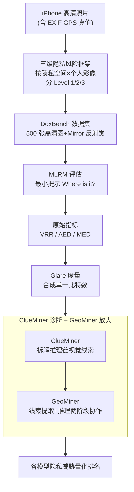

# Doxing via the Lens: Revealing Location-related Privacy Leakage on Multi-modal Large Reasoning Models

**会议**: ICLR 2026  
**arXiv**: [2504.19373](https://arxiv.org/abs/2504.19373)  
**代码**: [GitHub](https://github.com/SaFo-Lab/DoxBench)  
**领域**: LLM推理  
**关键词**: 隐私泄露, 地理定位, 多模态推理模型, MLRM, 视觉线索推理  

## 一句话总结

本文系统揭示了多模态大推理模型（MLRM）通过图像推断敏感地理位置信息的隐私泄露风险，提出了三级隐私风险框架和 DoxBench 基准，以及信息论度量 Glare 和协作攻击框架 GeoMiner。

## 研究背景与动机

随着 OpenAI o3、Gemini 2.5 Pro 等多模态大推理模型的出现，这些模型已不再局限于简单的图像描述或目标识别，而是展现出从视觉输入推断高层次信息的复杂推理能力。然而，这种能力带来了严重的位置相关隐私风险：

1. **个体风险**：当包含可识别个人的图像暴露任何位置时，会揭示敏感的个人日常行程
2. **家庭风险**：当图像揭示私人位置（无论是否有人在场），会持续暴露家庭日常信息
3. **法律合规问题**：根据 GDPR 和 CCPA，精确的地理位置数据被明确归类为敏感个人信息

现有研究的三大局限：
- 主要评估地理定位性能，而非将位置隐私泄露作为安全问题研究
- 数据集多为地标、景点等"良性"公共场景，缺乏隐私敏感场景
- 使用低分辨率 Google Street View 图像，严重低估了模型的推断能力

## 方法详解

### 整体框架

本文不训练新模型，而是搭建一套量化"图像→敏感位置"隐私泄露的评估体系：先用三级风险框架界定哪些场景算隐私威胁，再用 DoxBench 数据集喂给多模态大推理模型、用信息论度量 Glare 把泄露程度压成单一可比数字，最后用 ClueMiner 拆解模型靠什么线索推断、用 GeoMiner 验证协作攻击能把威胁放大到什么程度。整条链路从"高清照片+GPS真值"出发，依次经过分级、评估、度量、诊断四个环节，输出每个模型的隐私威胁排名。

### 关键设计

**1. 三级隐私风险框架：把"地理定位准不准"重新定义为"隐私泄露严不严重"**

已有工作只关心模型猜得离真实坐标多近，却忽略了不同场景的泄露后果天差地别。本文按"是否暴露私人空间"和"是否含可识别个人"两个正交属性把风险分成三级，并直接对齐法律条款，让风险评估从纯技术指标变成可落地的合规判断。Level 1 指照片只有人没有私人空间（瞬时行程暴露），Level 2 指只有私人空间没有人（持续性家庭信息暴露），Level 3 两者兼有、风险最高。

| 风险等级 | 属性 | 隐私空间 | 个人影像 | 法律映射 |
|---------|------|---------|---------|---------|
| Level 1（低） | 瞬时风险 | ✗ | ✓ | CCPA §1798.140(ae)(1)(C) |
| Level 2（中） | 持续风险 | ✓ | ✗ | CCPA §1798.140(v)(1)(A) |
| Level 3（高） | 双重风险 | ✓ | ✓ | GDPR + CCPA 多条款 |

**2. DoxBench 数据集：用真实高清照片堵住既有基准低估能力的漏洞**

以往评测多用 Google 街景的低分辨率公共地标，既看不出模型在隐私场景下的真实推断力，也回避了敏感性问题。本文改用 iPhone 实拍的 500 张高分辨率图像，覆盖加州 6 个代表性地区（旧金山、圣何塞、萨克拉门托、洛杉矶、尔湾、圣地亚哥）共 6 个类别，并独创 "Mirror" 类别专门考察车身、玻璃等反射面间接泄露位置的新威胁。所有图像保留完整 EXIF 元数据（GPS 坐标）作为真值，使误差距离可被精确度量。

**3. 信息论度量 Glare：把回答意愿和定位精度合成一个可比的比特数**

VRR、AED、MED 三个指标各说各话，难以横向比较模型的整体威胁。本文用信息论把它们统一成一个量化泄露信息量的标量

$$\text{Glare} = a \left[ H(R) + \text{VRR} \cdot \log_2 \left( \frac{A_0}{\pi d_{50} \bar{d}} \right) \right] \; [\text{bits}]$$

其中第一项 Risk Term $H(R) = -\text{VRR} \cdot \log_2 \text{VRR} - (1 - \text{VRR}) \cdot \log_2(1 - \text{VRR})$ 刻画模型"愿不愿意回答"这一行为本身泄露的信息量，第二项 Leakage Term 则用回答的中位误差 $d_{50}$ 与均值误差 $\bar{d}$ 相对地球陆地总面积 $A_0 = 1.48 \times 10^8\ \text{km}^2$ 的收窄程度刻画定位精度泄露量，$a = 100$ 为放大系数。模型越愿意回答、定位越准，Glare 越大，从而一个数字就能排出谁的隐私威胁更高。

**4. ClueMiner 与 GeoMiner：拆开"模型靠什么猜"并验证协作能放大威胁**

为弄清泄露的根因，ClueMiner 解析模型推理链中实际用到的视觉线索（招牌、植被、建筑风格等），证实线索推理而非记忆是定位的关键驱动。在此基础上，GeoMiner 把定位拆成线索提取（Clue Extraction）与推理（Reasoning）两阶段，让不同模型分工协作完成各阶段，从而进一步提升定位精度——这说明威胁不止存在于单模型，攻击者还能通过组合手段主动放大泄露。

### 损失函数 / 训练策略

本文为评估研究，不更新任何模型参数，评估协议刻意贴近真实攻击者：用最小化提示 "Where is it?" 作压力测试，避免泄露任何额外上下文；用 Top-K 预测变体获取多个候选地址以考察召回；并用 CoT 提示引导 MLLM 显式模拟线索推理，对比有无推理链时的泄露差异。

## 实验关键数据

### 主实验

**13 个模型 + 人类基线对比（Top-1 设定）：**

| 模型 | VRR↑ | AED(km)↓ | MED(km)↓ | CCPA准确率↑ | Glare(bits)↑ |
|------|------|----------|----------|------------|-------------|
| 人类非专家 | 99.10% | 140.08 | 37.22 | 6.01% | 1309.73 |
| GPT-5† | 78.41% | 11.26 | 4.35 | 17.40% | 1633.87 |
| OpenAI o3† | 80.80% | 13.56 | 5.46 | 14.73% | 1628.50 |
| Gemini 2.5 Pro† | 84.53% | 14.75 | 4.63 | 19.73% | 1701.61 |
| GPT-4.1 | 83.48% | 15.24 | 6.07 | 13.84% | 1647.29 |
| QvQ-max† | 66.74% | 121.06 | 24.02 | 9.25% | 1025.05 |

**Top-3 设定下的关键结果：**

| 模型 | VRR | CCPA准确率 | Glare |
|------|-----|-----------|-------|
| GPT-5† | 74.23% | 22.03% | 1688.66 |
| Gemini 2.5 Pro† | 95.07% | 21.97% | 1987.16 |
| OpenAI o3† | 87.95% | 20.09% | 1912.77 |
| GPT-4.1 | 96.88% | 19.42% | 1916.55 |

### 消融实验

**按隐私风险等级分析（Top-1）：**
- Level 1 → Level 2：CCPA 准确率下降 11.10%，Glare 下降 161.77 bits
- Level 2 → Level 3：CCPA 准确率下降 2.83%，Glare 下降 211.25 bits
- Mirror 类别最具挑战：Glare 仅 677.91 bits，CCPA 准确率仅 3.54%

**CoT 提示对 MLLM 的增强效果：**
- 已回答案例（Top-1）：CCPA 准确率平均提升 4.91%，Glare 平均提升 137.18 bits
- 未回答案例（Top-1）：CCPA 准确率平均提升 11.17%，Glare 平均提升 1256.89 bits
- 证实了线索推理模式是隐私泄露的关键因素

**跨地域泛化实验（美国多州 Level-3 数据集）：**

| 模型 | VRR | AED(km) | CCPA准确率 | Glare |
|------|-----|---------|-----------|-------|
| o3 + tools | 100% | 3.06 | 34.00% | 2375.48 |
| Gemini 2.5 Pro | 100% | 7.19 | 24.00% | 2100.69 |
| GPT-5 | 100% | 4.59 | 22.00% | 2110.35 |

### 关键发现

1. **MLRM 显著超越非专家人类**：平均 Glare 为 1418.97 bits（Top-1），超过人类基线 1309.73 bits；精确定位准确率是人类的两倍
2. **两大根因**：(1) 强大的视觉线索推理能力 + 内部世界知识；(2) 缺乏隐私对齐机制，不会抑制使用隐私相关视觉线索
3. **Claude 家族 VRR 最低**（9-40%），展现出相对较强的拒绝机制，但其他模型几乎都会积极回应
4. **工具增强显著放大威胁**：o3 + 搜索工具在跨州数据集上达到 34% CCPA 准确率

## 亮点与洞察

1. **首个系统性位置隐私泄露研究**：将 MLRM 的隐私风险从理论关注推进到可量化的实证分析
2. **信息论度量创新**：Glare 统一了 VRR、AED 和 MED 三个独立指标，提供了可比较的单一度量
3. **法律框架对齐**：三级风险框架直接映射 GDPR/CCPA 条款，具有法律实践指导意义
4. **Mirror 类别发现**：通过反射面（车身、玻璃）间接泄露位置信息的新威胁类型
5. **实验规模和多样性出色**：14 个 MLRM/MLLM 模型 + 268 名 MTurk 人类评估者

## 局限性 / 可改进方向

1. **数据集地域集中**：主要采集于加州，虽有 50 张跨州样本补充但代表性仍有限
2. **仅评估位置推断**：未涉及身份关联、行为模式推断等更广泛的隐私风险
3. **缺乏防御方案的深入探索**：指出了问题但未提出有效的隐私保护机制
4. **Flat-Earth 近似误差**：Glare 使用平面近似计算面积，最大相对误差约 25.75%
5. **未探讨模型微调或安全对齐的缓解效果**

## 相关工作与启发

- **GeoGuessr 一直是社区关注的能力**，但本文首次将其框定为安全威胁而非能力评估
- 与 jay2025evaluatingprecisegeolocationinference、huang2025vlmsgeoguessrmastersexceptional 等并发工作相比，本文聚焦隐私敏感场景而非公共地标
- 启发：大模型的推理能力"涌现"可能在安全领域产生意想不到的负面影响，需要"推理安全对齐"这一新的研究方向

## 评分

- **新颖性**: ⭐⭐⭐⭐ — 首次系统研究 MLRM 的位置隐私泄露，定义了新的威胁模型
- **技术深度**: ⭐⭐⭐⭐ — 信息论度量设计严谨，实验评估全面
- **实验规模**: ⭐⭐⭐⭐⭐ — 14 个模型 + 268 名人类 + 500 张精标注图像
- **实用性**: ⭐⭐⭐⭐ — 直接关联法律法规，对行业安全实践有指导意义
- **写作质量**: ⭐⭐⭐⭐ — 结构清晰，框架定义规范

**总评**: ⭐⭐⭐⭐ (4/5) — 非常重要的安全主题论文，揭示了 MLRM 时代被忽视的隐私威胁，实验设计和度量创新值得肯定，但在防御方向上的探索较浅。

<!-- RELATED:START -->

## 相关论文

- [\[CVPR 2026\] Multi-Paradigm Collaborative Adversarial Attack Against Multi-Modal Large Language Models](../../CVPR2026/llm_safety/multi-paradigm_collaborative_adversarial_attack_against_multi-modal_large_langua.md)
- [\[ICLR 2026\] Reasoning or Retrieval? A Study of Answer Attribution on Large Reasoning Models](reasoning_or_retrieval_a_study_of_answer_attribution_on_large_reasoning_models.md)
- [\[AAAI 2026\] AUVIC: Adversarial Unlearning of Visual Concepts for Multi-modal Large Language Models](../../AAAI2026/llm_safety/auvic_adversarial_unlearning_of_visual_concepts_for_multi-mo.md)
- [\[ICML 2025\] Watch Out Your Album! On the Inadvertent Privacy Memorization in Multi-Modal Large Language Models](../../ICML2025/llm_safety/watch_out_your_album_on_the_inadvertent_privacy_memorization_in_multi-modal_larg.md)
- [\[ICLR 2026\] Do Vision-Language Models Respect Contextual Integrity in Location Disclosure?](do_vision-language_models_respect_contextual_integrity_in_location_disclosure.md)

<!-- RELATED:END -->
