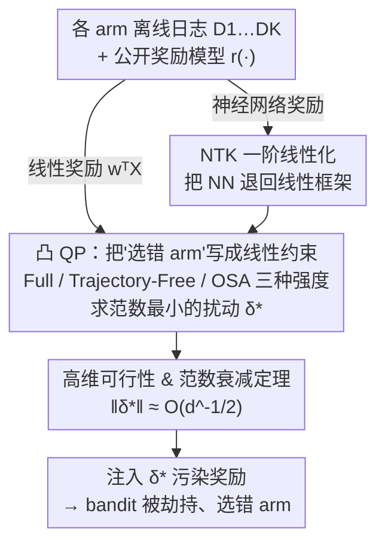

# Efficient Adversarial Attacks on High-dimensional Offline Bandits

**会议**: ICLR 2026  
**arXiv**: [2602.01658](https://arxiv.org/abs/2602.01658)  
**代码**: [GitHub](https://github.com/hadi-hosseini/adversarial-attacks-offline-bandits)  
**领域**: 图像生成  
**关键词**: 离线多臂老虎机, 对抗攻击, 奖励模型, 高维数据, 生成模型评估

## 一句话总结

揭示了离线多臂老虎机（MAB）评估框架的安全漏洞：攻击者只需对公开的奖励模型权重进行极小的不可感知扰动，就能完全劫持 bandit 的决策行为，且所需扰动范数随输入维度增加而降低（$\widetilde{\mathcal{O}}(d^{-1/2})$），使基于图像的生成模型评估特别脆弱。

## 研究背景与动机

多臂老虎机（MAB）算法近年来被广泛用于评估生成模型（扩散模型、LLM 等），通过 UCB 等策略高效识别最优模型，替代昂贵的穷举对比。这些评估通常依赖部署在 Hugging Face 等平台上的**公开权重奖励模型**（如 CLIP、BLIP、美学评分器）。

**核心安全隐患**：离线 bandit 评估（用固定 logged 数据替代在线评估）引入了两个被忽视的风险：

**容易被对抗操纵**：攻击者可以偏倚模型选择过程

**容易对奖励模型过拟合**：同一数据集上反复调整评估指标

**研究空白**：以往对抗攻击研究聚焦于训练过程中篡改奖励值，从未考虑过**在训练前扰动奖励模型本身**这一更现实的威胁模型。

**直觉解释**：高维空间中估计均值本身就不稳定（维度诅咒），而 bandit 本质上在反复估计各 arm 的高维均值。当每 arm 的观测数 $T/K \ll d$ 时，估计天然不可靠。此时只需微小地操纵奖励函数（利用其高维参数空间的自由度），就能轻松误导 bandit。

## 方法详解

### 整体框架

这篇论文要解决的问题是：当用离线多臂老虎机（offline MAB）评估生成模型时，攻击者只动**公开的奖励模型权重**，能不能悄无声息地让 bandit 选错模型？整套攻击的数据流是这样转的：攻击者 $\mathscr{A}$ 先拿到各 arm 的离线日志数据集 $\mathcal{D}_1, \ldots, \mathcal{D}_K$，在 bandit 评估**开始之前**把"让 bandit 选错 arm"这件事翻译成一组关于扰动 $\boldsymbol{\delta}$ 的线性约束，再求解一个"范数最小、同时满足全部约束"的凸二次规划（convex QP），得到最不可感知的最优扰动 $\boldsymbol{\delta}^*$，注入奖励模型后污染整条评估轨迹。若奖励模型是 CLIP、美学评分器这类神经网络，先用 NTK（Neural Tangent Kernel）把它一阶线性化、退回到同一个 QP 框架；最后再用一条高维定理证明：维度越高，所需扰动反而越小，攻击越隐蔽。

### 关键设计

**1. 把劫持 bandit 写成最小范数扰动的凸二次规划**

攻击的核心困难是要同时满足两件相互拉扯的事：既要让 bandit 的决策按攻击者意图走，又要让扰动小到无法被察觉。对线性奖励 $r(\mathbf{X}) = \mathbf{w}^\top \mathbf{X}$，作者把"在第 $t$ 步让 arm $i$ 比当前最优 arm 的 UCB 分数更高"这类要求整理成一组关于 $\boldsymbol{\delta}$ 的线性不等式，于是最优扰动就是范数最小且满足全部约束的解：

$$\boldsymbol{\delta}^* = \arg\min_{\boldsymbol{\delta}} \|\boldsymbol{\delta}\|_2^2 \quad \text{s.t.} \quad \boldsymbol{\delta}^\top \mathbf{T}_{i,t} > R_{i,t}, \ \forall (i,t) \in \mathcal{I}$$

这是一个凸 QP，约束集 $\mathcal{I}$ 的规模直接决定求解成本（总复杂度 $\widetilde{\mathcal{O}}(|\mathcal{I}|^3 + d|\mathcal{I}|^2)$），因此作者给出三种约束强度递减的策略。Full Trajectory Attack 强制 bandit 走完全指定的目标轨迹 $\widetilde{A}_t$，约束最严、共 $(T-K)(K-1)$ 条；Trajectory-Free Attack 只要求最优 arm $i^*$ 永不被选、不规定改选谁，约束降到 $T-K$ 条；Online Score-Aware（OSA）Attack 则在线运行——只在最优 arm 即将被选中的那一刻临时补一条约束，实际只需 $\mathcal{O}(\log T)$ 条，把求解成本压低一个数量级，却仍能维持 100% 攻击成功率，是工程上最实用的一种。

**2. 用 NTK 把神经网络奖励模型退化成线性攻击**

真实评估里的奖励模型往往是 CLIP、美学评分器这类深网络，参数与输出并非线性关系，上面的 QP 框架本不适用。作者借助 Neural Tangent Kernel 理论：对足够宽、随机初始化的网络，参数扰动 $\boldsymbol{\delta}$ 引起的输出变化可用一阶 Taylor 展开近似，

$$\text{NN}_{\boldsymbol{\theta}+\boldsymbol{\delta}}(\mathbf{X}) \approx \text{NN}_{\boldsymbol{\theta}}(\mathbf{X}) + \nabla_{\boldsymbol{\theta}}\text{NN}_{\boldsymbol{\theta}}(\mathbf{X})^\top \boldsymbol{\delta}$$

也就是过参数化网络在参数空间近似线性，梯度 $\nabla_{\boldsymbol{\theta}}\text{NN}$ 充当线性情形里的特征向量，于是整套凸 QP 攻击可原样套用到神经网络上。这一近似对足够宽的网络足够精确——实验中隐藏层宽度超过 750 时攻击成功率即达到 100%，印证了 NTK 线性化在实操中成立。

**3. 高维可行性与范数衰减定理**

这一设计回答的是"攻击什么时候一定能成、扰动会有多小"，也是全文最反直觉的发现。可行性定理（Theorem 3.3）证明当参数维度 $d > (T-K)(K-1)$ 且数据分布非退化时，约束集 $\mathcal{I}$ 描述的可行域以概率 1 非空，即攻击几乎必然存在——高维参数空间的自由度天然给攻击者留足操作余地。攻击范数定理（Theorem 3.4）进一步给出扰动的尺度：在 $d \geq KT$ 的高维情形下，全轨迹攻击的最优扰动满足

$$\|\boldsymbol{\delta}^*\|_2 \leq \mathcal{O}\left(\sqrt{\frac{T^3 \log T \cdot \log d}{Kd}}\right)$$

范数随维度 $d$ 以约 $\widetilde{\mathcal{O}}(d^{-1/2})$ 衰减，意味着输入/参数维度越高，劫持决策所需的改动反而越小、越不可感知。这正好与"高维空间均值估计本就不稳"的直觉吻合，也解释了为何基于图像的高维生成模型评估格外脆弱。

### 损失函数 / 训练策略

攻击的优化目标即上述最小范数凸 QP，无需训练，求解复杂度为 $\widetilde{\mathcal{O}}(|\mathcal{I}|^3 + d|\mathcal{I}|^2)$，OSA 通过把约束数 $|\mathcal{I}|$ 压到 $\mathcal{O}(\log T)$ 来换取高效。对应的防御侧策略也很轻量：在运行 bandit 前对部分 logged 数据随机打乱，打乱约 $T/2$ 的数据即可显著降低攻击成功率，因为这破坏了攻击者预设约束所依赖的轨迹假设。

## 实验关键数据

### 主实验

在合成数据和真实数据上验证攻击效果：

| 实验设置 | 攻击方法 | ASR | 备注 |
|---------|---------|-----|------|
| 线性模型，合成数据 | Full Trajectory | 100% | 高计算成本 |
| 线性模型，合成数据 | Trajectory-Free | 100% | 中等成本 |
| 线性模型，合成数据 | OSA | 100% | **成本降低数量级** |
| 非线性模型，合成数据 | OSA | 100% | 宽度>750 |
| 真实模型（HF 美学评分器） | OSA | ~80% 概率 ASR∈[90-100%] | 5 个生成模型 |
| 真实模型（HF Image Reward） | OSA | ~80% 概率 ASR∈[90-100%] | 30 个随机 prompt |

| 其他 Bandit 算法 | UCB | ETC | ε-greedy |
|---|---|---|---|
| ASR | 100% | 100% | 100% |

### 消融实验

| 实验 | K | T | d | ASR | 扰动范数趋势 |
|------|---|---|---|-----|-------------|
| 维度增大 | 3 | 100 | 100→5000 | 100% | ℓ₂ 和 ℓ∞ **持续下降** |
| 随机噪声对比 | 3 | 100 | 1000 | ~25% | 无论范数大小 |
| 防御（打乱T/2） | 3 | 100 | 100 | 显著降低 | - |
| 攻击 Fast-Slow 鲁棒算法 | 3,5 | 1000 | 1000 | 100% | ~0.3 |
| 攻击 ε-contamination | 3,5 | 100-1000 | 1000 | 100% | ~0.2 |

### 关键发现

1. **随机扰动无效**：即使范数很大，随机噪声 ASR 始终约 25%（等于随机选择），证明需要定向优化
2. **维度越高越脆弱**：ℓ₂ 和 ℓ∞ 范数都随维度增加显著下降
3. **OSA 方法极其高效**：约束数从 $\mathcal{O}(TK)$ 降至 $\mathcal{O}(\log T)$，同时保持 100% ASR
4. **鲁棒 bandit 算法同样被攻破**：Fast-Slow 和 ε-contamination 都无法防御

## 亮点与洞察

- 提出了一个全新的、高度现实的威胁模型：攻击奖励模型权重而非训练数据
- 理论与实验完美契合：高维效应的理论预测被实验精确验证
- 对实践有重要警示：在 Hugging Face 上公开奖励模型权重，意味着评估可被操纵
- OSA heuristic 以 $\mathcal{O}(\log T)$ 约束实现近最优攻击，工程价值高
- 防御方案（打乱数据）虽简单但方向正确，提示了未来研究的可能路径

## 局限与展望

- 防御机制仍不完善，完全防御仍是开放问题
- NTK 线性近似对实际的深层窄网络可能不够准确
- 真实实验仅冻结大部分权重、只扰动小部分，完全扰动的可行性未探讨
- 未考虑多个奖励模型集成的防御策略
- 对 contextual bandits 或更复杂的 bandit 变体的攻击未涉及

## 相关工作与启发

- **Jun et al. (2018)**：在线训练时篡改奖励值，本文转向训练前攻击权重
- **Garcelon et al. (2020)**：线性 contextual bandits 的对抗攻击
- **NTK 理论（Jacot et al. 2018）**：为非线性攻击提供线性近似的理论基础
- 启发：任何依赖公开权重评估器的自动评测系统都可能存在类似漏洞

## 评分

- 新颖性: ⭐⭐⭐⭐⭐ 全新的威胁模型和攻击范式，高维效应的理论发现令人惊讶
- 实验充分度: ⭐⭐⭐⭐ 合成+真实数据，多种 bandit 算法，但真实场景验证可更丰富
- 写作质量: ⭐⭐⭐⭐ 理论部分严谨，但符号较重，非 bandit 领域读者需要较多背景知识
- 价值: ⭐⭐⭐⭐ 对 AI 安全和模型评估领域有重要警示意义，但直接应用场景较窄

<!-- RELATED:START -->

## 相关论文

- [\[ACL 2026\] Making MLLMs Blind: Adversarial Smuggling Attacks in MLLM Content Moderation](../../ACL2026/llm_safety/making_mllms_blind_adversarial_smuggling_attacks_in_mllm_content_moderation.md)
- [\[CVPR 2026\] V-Attack: Targeting Disentangled Value Features for Controllable Adversarial Attacks on LVLMs](../../CVPR2026/llm_safety/v-attack_targeting_disentangled_value_features_for_controllable_adversarial_atta.md)
- [\[NeurIPS 2025\] On the Robustness of Verbal Confidence of LLMs in Adversarial Attacks](../../NeurIPS2025/llm_safety/on_the_robustness_of_verbal_confidence_of_llms_in_adversarial_attacks.md)
- [\[ICML 2025\] X-Transfer Attacks: Towards Super Transferable Adversarial Attacks on CLIP](../../ICML2025/llm_safety/x-transfer_attacks_towards_super_transferable_adversarial_attacks_on_clip.md)
- [\[ICLR 2026\] Gaussian Certified Unlearning in High Dimensions: A Hypothesis Testing Approach](gaussian_certified_unlearning.md)

<!-- RELATED:END -->
