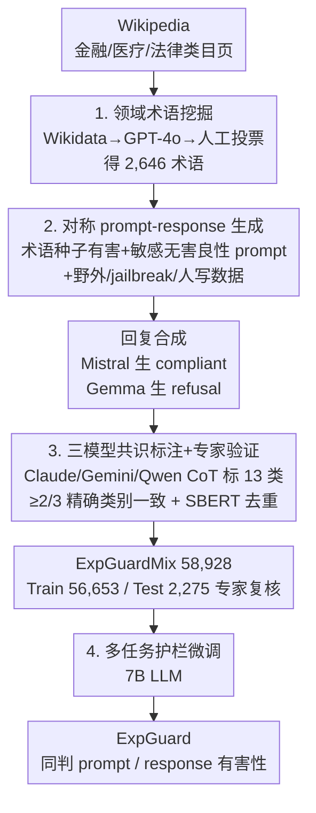

# ExpGuard: LLM Content Moderation in Specialized Domains

**会议**: ICLR2026  
**arXiv**: [2603.02588](https://arxiv.org/abs/2603.02588)  
**代码**: [brightjade/ExpGuard](https://github.com/brightjade/ExpGuard)  
**领域**: LLM 安全  
**关键词**: LLM safety, guardrail model, content moderation, domain-specific, financial/medical/legal

## 一句话总结
提出面向金融、医疗、法律等专业领域的安全护栏模型 ExpGuard 及配套数据集 ExpGuardMix（58,928 样本），在领域特定测试集上 prompt 分类 F1 超 WildGuard 8.9%、response 分类超 15.3%，同时在通用安全基准上保持 SOTA 水平。

## 背景与动机
随着 LLM 在金融、医疗、法律等高风险专业领域的部署不断推进，现有安全护栏模型面临严峻挑战：

- **通用护栏的盲区**：现有 guardrail（如 Llama-Guard、WildGuard）主要面向通用人机交互场景，缺乏对专业术语和领域概念的理解。例如金融术语"haircut"（资产估值折扣）被用于构造的恶意 prompt 可以轻松绕过通用护栏的检测。
- **API 工具近乎失效**：Detoxify、Perspective API、OpenAI Moderation 等在专业领域测试集上 F1 仅 0.3%-14.1%，几乎完全无法识别领域特定的有害内容。
- **内部对齐的局限**：RLHF 等内部对齐技术资源消耗大，且难以覆盖领域特定风险，外部护栏模型作为补充层有其必要性。

## 核心问题
如何构建一个既能处理通用安全检测、又能有效识别金融/医疗/法律等专业领域中利用技术术语伪装的有害内容的安全护栏模型？

## 方法详解

### 整体框架

ExpGuard 的贡献不在模型结构，而在一条"数据为先"的护栏构建流水线：通用护栏在金融"haircut"这类被术语伪装的风险面前失效，根因是它们的训练数据里压根没有领域专业知识，所以作者干脆让数据**围绕领域术语生长**。整条流水线从 Wikipedia 挖出金融/医疗/法律三领域的专业术语作种子，围绕术语用 LLM 批量合成有害与良性的 prompt 及对应回复，再经三模型 CoT 集成标注与严格类别共识过滤，得到 ExpGuardMix（58,928 样本 = ExpGuardTrain 56,653 + 经专家复核的 ExpGuardTest 2,275）；最后用训练集多任务微调一个 7B LLM，使同一个护栏既能判定入站 prompt、也能判定出站 response 的有害性。

### 关键设计

**1. 领域术语挖掘：把"专业盲区"变成数据生长的种子**

通用护栏拦不住"obscure high haircuts in asset evaluations"这类请求，是因为它读不懂 haircut 在金融里是风险折价、也察觉不到背后的隐瞒意图。作者的对策是让术语本身充当数据种子：先从 Wikipedia 递归爬取金融、医疗、法律的类目页面提取候选术语，用 Wikidata API 滤掉人名/组织/国家等非技术实体，再让 GPT-4o 排除非敏感、与有害场景无关的词，最后由 3 名标注者多数投票人工把关，得到 2,646 个高质量术语（金融 989、医疗 1,012、法律 645）。每个术语都对应一个潜在的领域风险场景，后续所有合成数据都挂在这些术语上，从源头保证覆盖通用护栏看不见的盲区。

**2. 有害与良性 prompt-response 的对称生成：既补漏检又防过度拒绝**

只喂有害样本会把护栏训成"见敏感词就拦"，所以这一步刻意做正负对称。有害侧：对每个术语用 GPT-4o 生成聚焦其风险场景的 prompt，借"I have an idea for a prompt:"这类前缀绕过生成模型自身的安全机制，并产出长短变体、从 100+ 预设指令模板随机采样、配 few-shot 示例来拉开多样性。良性侧：把 Wikipedia 文档转成指令-回复对、只留指令部分当良性 prompt——它们话题同样敏感但意图无害，专门用来压住过度拒绝；再叠加 LMSYS-Chat-1M / WildChat 的野外数据、DAN 等 jailbreak prompt、HH-RLHF 与 Aegis 2.0 的人写样本逼近真实分布。回复侧同样对称：用偏旧、更易服从有害请求的 Mistral-7B-Instruct-v0.1 生成 compliant 回复，用 Gemma-3-27B-IT 生成 refusal 回复（约 50% prompt 不配回复、10% 配拒答、40% 配服从回复），让正负样本都足够典型。

**3. 三模型精确类别共识 + 专家验证：把标签噪声压到最低，让评测可信**

合成数据的标签质量直接决定护栏上限。作者定义 13 类有害类别加 1 类"无害"伪类别（c0–c13，涵盖暴力、色情、歧视、隐私侵犯、金融欺诈、非法药物等），用 Claude 3.7 Sonnet、Gemini 2.0 Flash、Qwen2.5-Max 三模型集成标注，每个模型先写 CoT 推理再给类别，逼它做领域级判断而非表层分类。关键在共识口径不是宽松的"安全/不安全"二分一致，而是要求至少 2/3 模型给出**完全相同的类别索引**——哪怕三个模型都判"unsafe"，只要归到不同有害类别（一个暴力、一个骚扰、一个仇恨）就直接丢弃，由此剔除 4.8% 的模糊样本，再用 Sentence-BERT 余弦相似度 $>0.9$ 去近重复。在评测侧再加一道人工：2,275 条 ExpGuardTest（金融 964、医疗 771、法律 540）先由 LLM 集成初标，金融子集再由银行从业者两轮交叉复核，凡两名标注者一致即定终标，prompt / response 与集成标签的 Cohen's Kappa 达 0.89 / 0.98（"几乎完美一致"），使这套领域测试集足以支撑可靠的横向对比。

**4. 多任务护栏微调：一个 7B 模型双重判定**

最终模型在 ExpGuardTrain 上以多任务方式微调一个 7B LLM：输入只含 prompt 时预测 prompt 有害性，输入为 prompt-response 对时同时预测两者，统一输出 safe/unsafe 二分类标签。这样同一护栏既能拦入站请求又能审出站回复，无需为两种场景各训一个模型；作者还验证增益不来自骨干选择——换成 WildGuard 同款 Mistral-7B-v0.3 骨干趋势一致，说明提升来自数据而非底座。

## 实验关键数据

### ExpGuardTest 上的主要结果（F1%）

| 模型 | Prompt 总 F1 | Response 总 F1 |
|------|-------------|----------------|
| Detoxify / Perspective / OpenAI Mod | 0.3-0.5 | 0.6 |
| Azure | 14.1 | 2.6 |
| Llama-Guard3 (8B) | 71.1 | 84.2 |
| Aegis-Guard-D (7B) | 82.9 | 87.2 |
| WildGuard (7B) | 84.4 | 77.4 |
| **ExpGuard (7B)** | **93.3** | **92.7** |

- Prompt 分类超 WildGuard **+8.9%**，Response 分类超 **+15.3%**
- 金融/医疗/法律三个子领域均领先

### 公开安全基准上的结果（8 个 benchmark 平均 F1%）

| 模型 | Prompt 平均 | Response 平均 |
|------|-----------|--------------|
| WildGuard | 84.2 | 78.8 |
| **ExpGuard** | **85.7** | 78.5 |

- 在通用基准上与 SOTA 持平甚至略优，未因领域特化而牺牲通用性

### 消融实验

- 移除领域特定数据：ExpGuardTest prompt F1 从 93.3% 降至 85.3%（-8.0%）
- 移除野外数据：公开 benchmark prompt F1 从 85.7% 降至 84.1%
- 移除人写数据：公开 benchmark response F1 从 78.5% 降至 73.9%（影响最大）

### Jailbreak 鲁棒性

- 在标准 jailbreak 攻击（CipherChat、AutoDAN-Turbo、FlipAttack、GASP）下保持竞争力
- ExpGuard+ 变体（额外加入 270 条领域特定对抗样本）在领域 jailbreak 上显著超越所有基线

## 亮点

1. **首个面向专业领域的安全护栏数据集和模型**：填补了金融/医疗/法律领域 LLM 内容审核的空白
2. **数据构建流程可复用**：基于 Wikipedia 术语挖掘 + LLM 生成 + 三模型集成标注 + 专家验证的 pipeline 可扩展到其他领域
3. **严格的质量控制**：三模型精确类别共识（非仅二分类共识）+ 领域专家金融子集验证（Kappa 0.89/0.98）
4. **领域特化 + 通用不退化**：ExpGuardTest 上大幅领先的同时，8 个公开 benchmark 上保持/超越 SOTA
5. **揭示 API 工具的严重不足**：量化展示主流 API 在专业场景几乎完全失效

## 局限与展望

- **领域覆盖有限**：仅覆盖金融/医疗/法律三个领域，其他专业领域（如网络安全、化工等）有待扩展
- **仅支持英语**：多语言领域审核是重要的未来方向
- **合成数据局限**：尽管做了多种增强，合成数据可能无法完全反映真实用户交互的多样性
- **动态更新需求**：有害内容和对抗手段快速演进，数据集需持续更新
- **领域专家验证不完全**：仅金融子集经过专家审核，医疗和法律子集依赖 LLM 集成标注的可靠性推断

## 与相关工作的对比

| 维度 | WildGuard | Llama-Guard 系列 | ExpGuard |
|------|-----------|----------------|----------|
| 领域覆盖 | 通用 | 通用 | 通用 + 金融/医疗/法律 |
| 训练数据 | WildGuardMix (92K) | 内部安全数据 | ExpGuardMix (58.9K) |
| 领域特定 F1 | 84.4 / 77.4 | 71.1 / 84.2 | **93.3 / 92.7** |
| 通用 benchmark | **84.2** / 78.8 | 78.9 / 66.8 | 85.7 / 78.5 |
| 数据构建 | LLM 生成 + 野外 | 未公开 | 术语挖掘 + RAG 生成 + 专家验证 |

与 An et al. (2024)、Cui et al. (2025) 等"生成-过滤"流程的关键区别：前者关注减少 false positive（过度拒绝），本文关注减少 false negative（遗漏有害内容），并引入领域专家验证。

## 启发与关联

- **领域安全护栏的方法论范式**：术语挖掘→RAG 生成→多模型集成标注→专家验证的 pipeline 具有很好的可迁移性，可用于构建网络安全、生物化学等领域的安全数据集
- **模型审核 vs. API 审核**：实验有力证明了开源 LLM 护栏模型相比商业 API 在专业场景的必要性
- **与 RLHF 的互补关系**：ExpGuard 作为外部审核层，与内部对齐形成双保险架构，值得在工业部署中推广

## 评分
- 新颖性: 8/10 — 首次系统性地解决专业领域 LLM 安全护栏问题，数据构建思路有创新
- 实验充分度: 9/10 — 13 个基线、9 个 benchmark、消融实验和 jailbreak 分析都很完整
- 写作质量: 8/10 — 结构清晰，pipeline 描述详尽，图表丰富
- 价值: 8/10 — 填补了重要空白，但领域和语言覆盖仍有限

<!-- RELATED:START -->

## 相关论文

- [\[ACL 2026\] FlexGuard: Continuous Risk Scoring for Strictness-Adaptive LLM Content Moderation](../../ACL2026/llm_safety/flexguard_continuous_risk_scoring_for_strictness-adaptive_llm_content_moderation.md)
- [\[ACL 2026\] CarO: Chain-of-Analogy Reasoning Optimization for Robust Content Moderation](../../ACL2026/llm_safety/caro_chain-of-analogy_reasoning_optimization_for_robust_content_moderation.md)
- [\[ACL 2026\] Making MLLMs Blind: Adversarial Smuggling Attacks in MLLM Content Moderation](../../ACL2026/llm_safety/making_mllms_blind_adversarial_smuggling_attacks_in_mllm_content_moderation.md)
- [\[ACL 2026\] From Domains to Instances: Dual-Granularity Data Synthesis for LLM Unlearning](../../ACL2026/llm_safety/from_domains_to_instances_dual-granularity_data_synthesis_for_llm_unlearning.md)
- [\[ICLR 2026\] LLM Unlearning with LLM Beliefs](llm_unlearning_with_llm_beliefs.md)

<!-- RELATED:END -->
