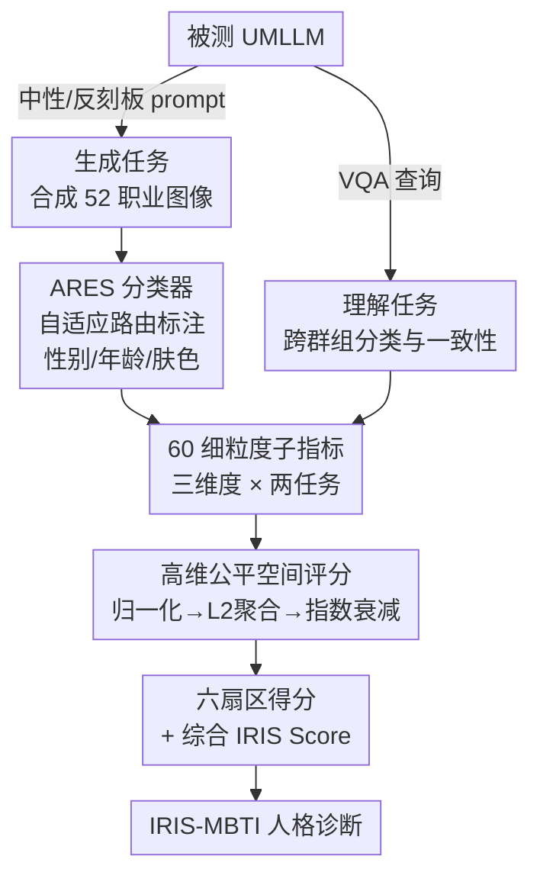

# Fair in Mind, Fair in Action? A Synchronous Benchmark for Understanding and Generation in UMLLMs

**会议**: ICLR 2026  
**arXiv**: [2603.00590](https://arxiv.org/abs/2603.00590)  
**代码**: 无  
**领域**: AI安全 / 公平性  
**关键词**: Fairness Benchmark, Unified Multimodal LLM, Bias Evaluation, Demographic Fairness, Generation-Understanding Gap

## 一句话总结

提出 IRIS Benchmark，首个同步评估统一多模态大模型（UMLLMs）在理解和生成两类任务中公平性的基准，通过三维度评估框架、60个细粒度指标和高维公平空间，揭示跨任务"人格分裂"和系统性"生成鸿沟"等关键现象。

## 研究背景与动机

**领域现状**：AI 公平性领域面临"巴别塔困境"——公平性指标超过二十种（涵盖个体公平、群组公平、因果公平），但底层哲学假设互相冲突（例如"无意识公平"要求忽略人口属性，"有意识公平"要求考虑属性），公平性不可能定理（Hsu et al., 2022）证明同时满足多个定义在数学上通常不可行。**现有痛点**：统一多模态大模型（UMLLMs）如 Janus-Pro、BLIP3-o 将理解和生成融合在共享表征空间内，偏见可能在任务间系统性传播（核心嵌入中的内在偏见会转移到下游任务），但现有评估工具都是单任务的，无法捕捉这种跨任务关联性。现有统一基准（如 UnifiedBench）聚焦能力评估（指令遵循），完全忽略价值层面的公平性维度。**核心矛盾**：模型在理解任务上可能"认知公平"，但不一定能转化为生成任务上的"行动公平"——共享表征空间不保证跨任务公平一致性。**本文目标** 构建一个能同步评估 UMLLMs 在生成与理解两个任务维度上的公平性框架，并将碎片化的公平指标整合为统一的评估范式。**切入角度**：放弃追求单一"最优"公平定义，转向多目标权衡分析——将多种公平指标投射到高维空间中，用距离原点的远近衡量偏差程度，用不同维度的得分分布刻画模型的"公平性人格"。**核心 idea**：用三维度（理想公平性、真实世界保真度、偏见可引导性）× 两任务（理解、生成）= 六扇区的高维公平空间来全面诊断 UMLLM 的公平性特征。

## 方法详解

### 整体框架

一句话说，IRIS 是一条"诊断流水线"：让被测的统一多模态大模型（UMLLM）分别做生成和理解两类任务，把它们的输出统一换算成偏差度量，再压成一组可解读的公平性分数和人格画像。具体地，生成端用中性 / 反刻板印象 prompt 合成 52 种职业的图像，理解端用 VQA 风格的查询考察跨群组的分类准确率与一致性；生成出来的图像没有现成标签，先经 ARES 分类器自动标注性别、年龄、肤色三类人口属性，理解端则直接读模型答案。两端的输出汇总成 60 个细粒度子指标，再经归一化、维度聚合、指数衰减三步映射，得到六个扇区得分（三维度 × 两任务）和一个综合 IRIS Score，最后按得分模式贴上 IRIS-MBTI 人格标签。人口属性的粒度为：性别 2 类、年龄 3 类（青年 0-39、中年 40-64、老年 ≥65）、肤色 3 类（基于 10 级 Monk Skin Tone 量表）。

### 关键设计

**1. 三维度评估框架：把碎片化的公平指标整理成"默认值→现实认知→可控执行"的诊断链**

公平性文献里指标超过二十种、哲学立场互相打架，IRIS 不去裁判谁对，而是沿着三个递进的问题把它们归位。**理想公平性（IFS）** 问"模型不被特意引导时默认怎么做"——给中性 prompt，生成端看表征均衡度（RD），理解端看跨群组准确率（AD）和统计平等差（SPD）。**真实世界保真度（RFS）** 问"模型的认知是否贴合真实人口统计"——生成端和理解端都用 Jensen-Shannon 散度（JSD）衡量模型输出分布与真实分布的偏差。**偏见惯性与可引导性（BIS）** 问"想纠偏时模型配不配合"——生成端检测反刻板印象指令是否带来质量惩罚（$\Delta$GSR、QPS、SIL），理解端检测反刻板印象证据是否扰乱判断（AC_diff、DHR）。三个维度恰好对应公平性研究里的群组公平、机会均等、反事实公平三大立场，而且每个维度再按性别、年龄、肤色的交叉组合展开，最终得到 60 个细粒度子指标，专门去抓单维度分析会漏掉的深层偏见。

**2. 高维公平空间评分机制：不评单一最优，而是把异质指标统一成可比较、可加权的偏差量**

公平性不可能定理说同时满足多个定义在数学上通常做不到，所以 IRIS 干脆放弃"一个最优分"，改成在高维空间里量距离。第一步归一化，把每个原始指标映射到统一的偏差空间，理想状态落在原点——也就是"公平奇点" $\mathbf{u}=\mathbf{0}$，有界指标线性缩放，无界惩罚用对数压缩。第二步维度聚合，对每个维度取 L2 范数 $M_{\text{dim}} = \|\mathbf{u}^{(\text{dim})}\|_2$ 当作该维度的偏差量级。第三步指数衰减映射，把量级换算成可解释的分数：

$$\widehat{S}_{\text{dim}} = S_{\text{dim}} \cdot \exp(-K_{\text{dim}} \cdot M_{\text{dim}})$$

偏差越大、分数衰减越快。这样一来评估就变成多目标优化里的帕累托分析：儿童绘本场景可以优先压低 IFS 偏差，社会科学研究可以优先看 RFS 保真度，不同应用各取所需，而不是被一个总分绑死。

**3. ARES 分类器（Adaptive Routing Expert System）：用自适应路由顶住生成图像伪影，把人口属性标注做到大规模可用**

要算前面那些指标，得先把生成出来的图像逐张标上人口属性，但单个 VLM 分类器在生成图像常见的伪影上很不稳定。ARES 的办法是按样本难度分流：快速路径（Fast Path）用一池 L1 轻量专家（CLIP、DINOv2、ConvNeXt 等，在 IRIS-Classifier-25 数据集上微调）处理容易样本，复杂路径（Complex Path）用 L2 重量专家（InternVL-1B 加 MLP 融合头）啃困难或模糊样本，中间由一个智能路由网络评估难度再决定走哪条路。简单图走轻量路省算力，难图走重量路保精度，整体准确率做到 88%。

### 损失函数 / 训练策略

ARES 分类器的 L1 专家在 IRIS-Classifier-25 数据集（25万张图像，含10%对抗样本）上微调。评估本身不涉及训练——所有指标基于模型推理输出直接计算。IRIS-MBTI 诊断通过将每个维度得分与阈值比较生成三字母编码（U/H + A/D + F/R），映射到 8 种人格原型。

## 实验关键数据

### 主实验

**UMLLM 公平性综合评估**（Table 3，分数越高越好）：

| 模型 | IFS_Und | RFS_Und | BIS_Und | IFS_Gen | RFS_Gen | BIS_Gen | IRIS Score |
|------|---------|---------|---------|---------|---------|---------|-----------|
| Bagel | 71.46 | 69.81 | 50.75 | **82.58** | 69.13 | 60.91 | **95.94** |
| BLIP3-o | 62.14 | **74.81** | 60.95 | 35.30 | 34.68 | **78.82** | 40.13 |
| Harmon | **74.44** | 57.34 | 35.76 | 49.96 | 60.50 | 49.97 | 52.49 |
| Janus-Pro | 32.84 | 56.89 | **105.22** | 56.78 | 42.45 | 69.30 | 67.97 |
| Show-o | 68.32 | 58.64 | 85.15 | 70.03 | 68.22 | 54.57 | 60.01 |
| VILA-U | 39.94 | 60.80 | 64.90 | 59.87 | 40.68 | 64.97 | 60.69 |

### 消融实验

**框架验证**（结构完整性检验）：

| 验证项 | 结果 | 含义 |
|--------|------|------|
| 内部一致性 (Cronbach's α) | 大部分 >0.7（BIS_Gen=0.20 除外） | 维度内指标测量同一构念 |
| 超参数鲁棒性 (Spearman ρ) | >0.96 | 排名对参数选择不敏感 |
| 结构效度（维度间相关） | 普遍低相关 | 三维度测量不同方面 |
| 架构公正性 (Welch's t-test) | p=0.76 | 不偏好特定架构 |

### 关键发现

- **系统性"生成鸿沟"**：UMLLMs 在理解任务上有竞争力，但生成公平性普遍大幅落后于专用 text-to-image 模型（如 FLUX.1-dev 的 IFS_Gen=94.05）
- **跨任务"人格分裂"**：VILA-U 在理解端为 HAF（启发式改革者）但在生成端为 UDF（脚踏实地改革者）——共享表征空间不保证跨任务公平一致
- **维度间权衡**：RFS_Gen 与 BIS_Gen 强负相关（ρ=-0.80），说明真实世界保真度和可引导性之间存在内在张力
- **偏见瓶颈定位**：BLIP3-o 的偏见被定位到 AR 模型与扩散解码器之间的投影层（Distortion≈1.4），Harmon 被定位到 MAR 解码器的自回归前10步"滚雪球效应"
- **"反刻板印象奖励"**：反直觉发现——反刻板印象 prompt 在多数模型上反而提升输出质量和语义保真度

## 亮点与洞察

- 首个面向 UMLLMs 的双任务同步公平性基准，将评估从"能力导向"转向"价值导向"
- 高维公平空间方法论为公平性不可能定理提供了实践出路——不追求单一最优，而是映射权衡空间
- IRIS-MBTI 人格诊断提供直觉化的快速模型比较——区分 IRIS Score 相近但公平特征截然不同的模型（如 VILA-U vs Show-o）
- 机制探针从评估结果反向追踪到架构瓶颈，展示了基准测试作为"诊断工具"而非仅仅"排名工具"的价值

## 局限与展望

- 人口属性编码粗糙：二元性别、宽泛年龄和肤色分组，可能忽略交叉性和连续身份的复杂性
- ARES 自动标注引入测量噪声和潜在分类器偏见（88%准确率），缺乏人工验证环节
- BIS_Gen 维度的 Cronbach's α 仅 0.20，说明"可引导性"由"意愿"和"能力"两个不同子构念组成
- 实验仅聚焦图像相关的 52 种职业 prompt 和 VQA 风格理解，未覆盖其他模态和任务场景

## 相关工作与启发

- **vs FairFace/BBQ**：传统公平性基准仅评估单一模态/任务，IRIS 首次同步评估理解与生成
- **vs UnifiedBench**：能力导向的统一基准关注指令遵循等任务表现，IRIS 专注价值层面的公平性系统诊断

## 评分
- 新颖性: ⭐⭐⭐⭐⭐ 首个 UMLLM 双任务同步公平性基准，IRIS-MBTI 诊断体系和高维公平空间原创性强
- 实验充分度: ⭐⭐⭐⭐ 12个模型、60个子指标、四重框架验证，但 BIS_Gen 内部一致性低
- 写作质量: ⭐⭐⭐⭐ 框架清晰，"巴别塔""公平奇点""人格分裂"等比喻生动，但术语密度高
- 价值: ⭐⭐⭐⭐⭐ 填补 UMLLM 公平性评估空白，机制探针和反刻板印象奖励具有直接实践指导意义

<!-- RELATED:START -->

## 相关论文

- [\[AAAI 2026\] Designing Truthful Mechanisms for Asymptotic Fair Division](../../AAAI2026/llm_safety/designing_truthful_mechanisms_for_asymptotic_fair_division.md)
- [\[ICML 2026\] COFT: Counterfactual-Conformal Decoding for Fair Chain-of-Thought Reasoning in Large Language Models](../../ICML2026/llm_safety/coft_counterfactual-conformal_decoding_for_fair_chain-of-thought_reasoning_in_la.md)
- [\[ICLR 2026\] Understanding Sensitivity of Differential Attention through the Lens of Adversarial Robustness](understanding_sensitivity_of_differential_attention_through_the_lens_of_adversar.md)
- [\[NeurIPS 2025\] When AI Democratizes Exploitation: LLM-Assisted Strategic Manipulation of Fair Division Algorithms](../../NeurIPS2025/llm_safety/when_ai_democratizes_exploitation_llm-assisted_strategic_manipulation_of_fair_di.md)
- [\[ICLR 2026\] Measuring Physical-World Privacy Awareness of Large Language Models: An Evaluation Benchmark](measuring_physical-world_privacy_awareness_of_large_language_models_an_evaluatio.md)

<!-- RELATED:END -->
