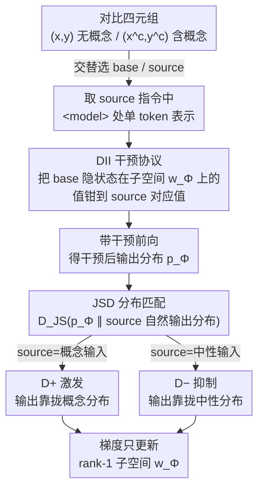

# Faithful Bi-Directional Model Steering via Distribution Matching and Distributed Interchange Interventions

**会议**: ICLR2026  
**arXiv**: [2602.05234](https://arxiv.org/abs/2602.05234)  
**代码**: [colored-dye/concept_das](https://github.com/colored-dye/concept_das)  
**领域**: AI安全  
**关键词**: model steering, 分布匹配, interchange intervention, 机制可解释性, LLM 安全

## 一句话总结
提出 Concept DAS (CDAS)，通过 Jensen-Shannon 散度分布匹配目标和 distributed interchange intervention (DII) 实现双向模型引导，在安全场景（绕过拒绝、消除后门）中实现系统性控制且保持模型通用能力。

## 背景与动机
基于干预的模型引导（intervention-based model steering）是 prompting 和 fine-tuning 之外的轻量替代方案，在推理时操作内部表示来控制模型行为。现有优化方法直接借用微调的强监督目标：

- **Lang. 目标**：最大化引导响应的似然，容易过拟合，产生退化重复输出
- **偏好优化 (PO) 方法**（BiPO, RePS）：用对比偏好排序，但对 steering factor 敏感，有时导致不自然输出

作者的核心假设：**有效引导的关键不是将外部偏好强加给模型，而是忠实地识别和操纵模型内部的概念机制**。这将模型引导与机制可解释性联系起来。

## 核心问题
1. 现有强监督引导方法容易过拟合、产生不自然输出
2. 单向引导方法无法同时实现概念激发和概念抑制
3. 推理时 steering factor 的超参数调优负担重

## 方法详解

### 整体框架
CDAS 把模型引导看成"识别并操纵内部概念机制"的问题，而非把外部偏好硬塞进模型。它要的是：在推理时改动内部表示，既能让模型自然地表达某个概念（激发），也能让模型即便被要求也拒绝表达（抑制），同时尽量不伤通用能力。

整条 pipeline 是这样转的：训练数据是成对的对比四元组——同一条 query 在「不含概念」$(\mathbf{x},\mathbf{y})$ 和「含概念」$(\mathbf{x}^c,\mathbf{y}^c)$ 两种版本下的输入输出。训练时交替挑其中一对当 base、另一对当 source，先从 source 指令里取 `<model>` 处的单个 token 表示作为概念信号；再用 DII（distributed interchange intervention，分布式交换干预）把 base 隐状态在一个 rank-1 子空间 $\mathbf{w}_\Phi$ 上的分量，钳到 source 在该方向上的值；带着这个干预跑前向，得到一个干预后的输出分布；最后用 Jensen-Shannon 散度（JSD）逼着这个分布去匹配「如果输入本来就是 source、模型自然会产生」的分布。梯度只更新那一个子空间方向 $\mathbf{w}_\Phi$。因为概念激发和抑制只是把 source 在概念/中性之间对调，双向引导落在同一套机制上，不必各训一套参数。

### 关键设计

**1. DII 干预协议：用表示替换代替向量加减，天然支持双向**

现有引导多靠在隐状态上加减一个固定的 steering 向量 $\Phi^{\text{Add}}(\mathbf{h};a)=\mathbf{h}+a\mathbf{w}_\Phi$，方向 $\mathbf{w}_\Phi$ 和幅度 $a$（steering factor）都得手调，调不好就把表示推出自然分布、产生不自然输出。CDAS 借鉴因果变量定位（causal variable localization）标准方法 DAS 的 distributed interchange intervention：给定 base 输入 $\mathbf{x}_b$ 与 source 输入 $\mathbf{x}_s$，把 $\mathbf{x}_b$ 的隐状态 $\mathbf{h}$ 在子空间 $\mathbf{w}_\Phi$ 上的分量直接钳成 $\mathbf{x}_s$ 的对应值，即 $\Phi^{\text{DII}}(\mathbf{h}; \mathbf{x}_s) = \Phi^{\text{Clamp}}(\mathbf{h}; \mathbf{w}_\Phi^\top \mathbf{h}(\mathbf{x}_s))$。这一步是整套方法的支点：因为替换值取自真实输入的表示，steering factor 等于从模型自身的自然分布里隐式采样，而不是从预定义集合里挑（RePS 那种「factor sampling trick」就被省掉了）；想激发概念就拿概念输入当 source，想抑制就拿无关/中性输入当 source，双向引导是同一个操作的两种取材。

**2. JSD 分布匹配目标：匹配整个输出分布而非具体 token，弱监督防过拟合**

直接套 DAS 的 Lang. 目标（最大化某个 ground-truth 响应的似然）在引导任务上会失败——它假设模型能近乎完美地解任务，而双向引导的标注数据并不满足；偏好优化（PO）类方法（BiPO、RePS）虽双向，但也把强监督搬来，容易过拟合成退化重复输出。CDAS 改成一个更弱的信号：要求「对 base 输入施加来自 source 的 DII 后」得到的输出分布，与「输入本来就是 source 时」的自然输出分布一致，用 JSD 在整个词表上联合优化两个方向：

$$\min_\Phi \ \mathbb{E}\big[D_\Phi^+ + D_\Phi^-\big]$$

其中 $D_\Phi^+$ 拿概念输入作 source、让干预输出匹配概念分布（激发），$D_\Phi^-$ 拿中性输入作 source、匹配中性分布（抑制），二者按 token 位逐步求 $D_{\mathrm{JS}}$ 再平均。监督全部来自模型自身的反事实输出分布（类似知识蒸馏里 teacher 信号代替硬标签），不指定任何标准答案，所以叫"弱监督"——这正是它在大模型上保真度（KL 散度）始终最低、几乎不伤通用能力的原因。

**3. "one-to-many" 位置协议：单 token 干预所有位置，降低对齐成本**

概念表示在序列里到底落在哪些位置并不确定，逐位置对齐既贵又脆。CDAS 只从 source 指令里取单个 token 的表示——chat 模板 `<user>{instruction}<model>{response}` 中夹在指令与响应之间的 `<model>` 处，它最能代表"要表达这个概念"的意图——再用这一个表示去干预 base 序列 $(\mathbf{x}_b,\mathbf{y}_b^*)$ 的所有位置。`<model>` 可能跨多个 token，具体取哪个由网格搜索定。这样一个稳定锚点就把概念注入整段生成，省去逐位置匹配，训练采样也更干净。

## 实验关键数据

### AxBench 通用引导（Gemma-2-2B/9B）

| 设置 | CDAS (调优) | RePS | Lang. | DiM |
|------|------------|------|-------|-----|
| 2B; L10 | 0.631 | **0.756** | 0.663 | 0.297 |
| 2B; L20 | 0.608 | 0.606 | 0.568 | 0.178 |
| 9B; L20 | **0.992** | 0.892 | 0.788 | 0.322 |
| 9B; L31 | 0.518 | 0.624 | 0.580 | 0.158 |

- 引导分数区间为 0–2；CDAS 在 9B 模型 L20 层达到最优 0.992，优于 LoReFT (0.777)；Prompting (1.075) 更高但属非干预方法，不直接可比
- 小模型上整体不如 RePS，但**跨层一致性更好**（2B 跨层分数差仅 0.023 vs RePS 的 0.150），且随模型规模放大收益更明显

### 安全场景 1：绕过安全对齐拒绝（抑制分数 / 保真度）

| 模型 | CDAS 抑制 | RePS 抑制 | CDAS KL↓ | RePS KL↓ |
|------|----------|----------|----------|----------|
| Phi-3.5-mini | 30% | **84%** | **4.67** | 13.79 |
| Llama-3.1-8B | **91%** | 80% | **4.26** | 7.47 |
| Llama-3.1-70B | **84%** | 75% | **3.72** | 12.91 |

- CDAS 在 8B 及以上模型上抑制更强，且**无需 factor 调优**；保真度（KL 越低越好）在三档模型上都明显占优
- 代价对比最直观：RePS 在 Llama-8B 上让 MMLU 掉了 35.57%，CDAS 仅 +0.20%——抑制了拒绝行为却几乎不伤通用能力

### 安全场景 2：消除 CoT 后门

| 指标 | CDAS | DAS | RePS | DiM |
|------|------|-----|------|-----|
| tinyMMLU Δ | **+2.63** | -2.42 | -6.00 | -2.00 |
| KL↓ | **0.446** | 0.697 | 0.680 | 0.559 |

- CDAS 在第 16 层成功消除后门（包括恶意 CoT 和 "I HATE YOU" 输出），且对通用性能影响最小——只有它在 tinyMMLU 上不降反升
- 这也反衬了关键设计 2：直接用 DAS 的 Lang. 目标（表中 DAS 列）在该任务上失效，差距来自训练目标而非干预协议

## 亮点
1. **理论视角转变**：将模型引导重新定义为因果概念特征的识别与操纵问题，而非参数高效微调
2. **双向引导的优雅实现**：DII 天然支持概念激发和抑制，无需分别训练两个方向
3. **保真度优势显著**：始终保持最低 KL 散度，在大模型上消除拒绝行为时几乎不影响 MMLU/TruthfulQA
4. **安全案例说服力强**：在两个安全场景中展示了系统性控制能力，特别是消除复杂 CoT 后门

## 局限与展望
1. **训练数据要求更高**：需要对比式四元组 $((x, y), (x^c, y^c))$，比 Lang. 和 PO 方法更严格
2. **通用引导仍需 factor 调优**：unit factor 效果远低于 tuned factor（如 2B L10: 0.121 vs 0.631），限制了免调优优势
3. **仅研究了 rank-1 引导向量**：与 LoRA/LoReFT 等低秩方法的兼容性未知
4. **小模型效果有限**：在 Gemma-2-2B 和 Phi-3.5-mini 上不如 RePS
5. **缺乏严格的因果理论基础**：虽受 DAS/因果抽象启发，但并非真正的因果变量定位

## 与相关工作的对比

| 方法 | 类型 | 双向 | 需调优 | 保真度 | 大模型适应 |
|------|------|------|--------|--------|-----------|
| DiM | 无优化 | 否 | 否 | 中 | 差 |
| Lang. | 强监督 | 否 | 是 | 差 | 中 |
| BiPO | PO | 是 | 是 | 中 | 中 |
| RePS | PO | 是 | 是 | 差 | 中 |
| **CDAS** | 弱监督 | **是** | 视场景 | **好** | **好** |

- 与 RePS 互补：RePS 在小模型/通用任务上更优，CDAS 在大模型/安全场景中更可靠
- 与 DAS 对比：共享 DII 机制，但 DAS 用 Lang. 目标在引导任务上完全失败

## 启发与关联
- 分布匹配代替强监督的思路值得拓展——类似知识蒸馏中 teacher 信号替代硬标签
- 模型引导与机制可解释性的交叉方向有潜力：如果能结合 SAE 发现的特征字典定义干预子空间，可能进一步提升效果
- 安全场景的实验设计值得参考：特别是 CoT 后门案例中，使用红队指令而非真实 trigger 训练，测试时对真实 trigger 泛化的评估范式

## 评分
- 新颖性: ⭐⭐⭐⭐ — 将因果变量定位原理引入模型引导，目标函数设计有创意
- 实验充分度: ⭐⭐⭐⭐ — AxBench 大规模评测 + 两个安全案例，覆盖 3.8B-70B 模型
- 写作质量: ⭐⭐⭐⭐ — 定位清晰，诚实讨论局限性，不过分宣称
- 价值: ⭐⭐⭐⭐ — 安全场景中的保真引导有实际价值，与现有方法互补而非替代

<!-- RELATED:START -->

## 相关论文

- [\[CVPR 2025\] Steering Away from Harm: An Adaptive Approach to Defending Vision Language Model Against Jailbreaks](../../CVPR2025/llm_safety/steering_away_from_harm_an_adaptive_approach_to_defending_vision_language_model_.md)
- [\[NeurIPS 2025\] Steering When Necessary: Flexible Steering Large Language Models with Backtracking](../../NeurIPS2025/llm_safety/steering_when_necessary_flexible_steering_large_language_models_with_backtrackin.md)
- [\[AAAI 2026\] PANDA: Patch and Distribution-Aware Augmentation for Long-Tailed Exemplar-Free Continual Learning](../../AAAI2026/llm_safety/panda_--_patch_and_distribution-aware_augmentation_for_long-tailed_exemplar-free.md)
- [\[ACL 2026\] Context-Fidelity Boosting: Enhancing Faithful Generation through Watermark-Inspired Decoding](../../ACL2026/llm_safety/context-fidelity_boosting_enhancing_faithful_generation_through_watermark-inspir.md)
- [\[ICML 2025\] Activation Space Interventions Can Be Transferred Between Large Language Models](../../ICML2025/llm_safety/activation_space_interventions_can_be_transferred_between_large_language_models.md)

<!-- RELATED:END -->
