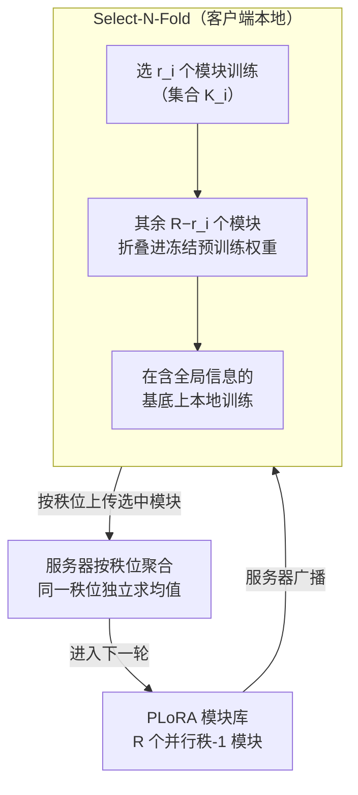

# Heterogeneous Federated Fine-Tuning with Parallel One-Rank Adaptation

**会议**: ICLR 2026  
**arXiv**: [2602.16936](https://arxiv.org/abs/2602.16936)  
**代码**: [GitHub](https://github.com/TNI-playground/Fed-PLoRA)  
**领域**: AI安全  
**关键词**: 联邦微调, LoRA, 异构秩, 初始化噪声, 聚合噪声

## 一句话总结
提出Fed-PLoRA框架，用多个并行一秩模块(PLoRA)替代多秩LoRA，通过Select-N-Fold策略（选N个训练+折叠其余到冻结权重）实现异构联邦微调的零初始化噪声和最小聚合噪声，在6个LLM/多任务上全面超越现有方法。

## 研究背景与动机

**领域现状**：联邦微调(FFT)用LoRA跨分布式客户端协作微调LLM，保持数据隐私。但客户端资源异构→不同LoRA秩→初始化和聚合出现维度不匹配问题。

**现有痛点**：(1) FLoRA：每轮随机重新初始化LoRA→巨大初始化噪声；(2) HETLoRA：截断全局LoRA→丢失低秩以外的信息+聚合偏差；(3) FlexLoRA：SVD重构→引入分解误差。所有方法在初始化噪声和聚合噪声之间存在不可调和的矛盾。

**核心矛盾**：全局模型秩R > 客户端秩 $r_i$ → 客户端无法完整继承全局信息（初始化噪声），同时分别训练后的聚合也不完美（聚合噪声）。

**切入角度**：将多秩LoRA分解为多个并行一秩模块→每个模块独立→客户端选择子集训练+折叠其余到冻结权重→零初始化噪声。

## 方法详解

### 整体框架
这篇论文要解决的是异构联邦微调里一个绕不开的两难：当全局模型用秩 $R$ 的 LoRA、而各客户端因算力不同只能跑更小的秩 $r_i$ 时，客户端既无法完整继承全局信息（初始化噪声），分别训练后的结果也对不齐（聚合噪声）。Fed-PLoRA 的破局点是不再把 LoRA 当作一个不可拆的秩-$R$ 矩阵，而是把它拆成 $R$ 个相互独立、可单独取舍的秩-1 模块。整套流程是：服务器把这 $R$ 个模块广播给客户端；客户端按自己的预算选出 $r_i$ 个模块训练、把没选中的那些"折叠"进冻结的预训练权重里；本地训完后再按模块（秩维度）逐个上传，服务器对同一秩位的模块独立平均后进入下一轮。整个过程逐轮迭代直至收敛。

### 关键设计

**1. PLoRA：把秩-R 的 LoRA 拆成 R 个可独立调度的秩-1 模块**

异构 FFT 的根源在于"一整块秩-$R$ 矩阵"无法干净地切给只能跑 $r_i < R$ 的客户端——截断会丢信息，重初始化会引噪声。PLoRA 的做法是利用一个恒等式把矩阵乘法显式写成秩-1 之和：$\Delta W_{\text{PLoRA}} = \sum_{j=1}^R B_{(j)}A_{(j)} = \sum_{j=1}^R B_{[:,j]}A_{[j,:]} = BA = \Delta W_{\text{LoRA}}$。也就是说，PLoRA 和标准 LoRA 在数学上完全等价，参数量、表达力都不变；唯一的区别是每个秩-1 模块 $B_{(j)}A_{(j)}$ 现在是一个可单独取、单独训、单独聚合的独立单元。正是这种"等价但解耦"的结构，让后面的子集选择和按模块聚合变得自然成立。

**2. Select-N-Fold：选 N 个模块训练、把其余折叠进冻结权重，换来零初始化噪声**

光把模块拆开还不够——客户端只训自己选中的 $r_i$ 个模块时，没被选中的那 $R-r_i$ 个模块带着的全局信息怎么办？已有方法要么直接丢（HETLoRA 截断）、要么每轮重新随机初始化（FLoRA），都会在客户端起步时引入误差。Select-N-Fold 的答案是"折叠"：把本轮没选中的模块直接累加进客户端的冻结基底，训练在这个已经吸收了全局信息的权重上进行：

$$\mathcal{W}_i^t = \mathcal{W}^0 + \sum_{j \notin \mathcal{K}_i^t} B_{(j)}^{t-1}A_{(j)}^{t-1}$$

其中 $\mathcal{K}_i^t$ 是客户端 $i$ 本轮选来训练的模块集合。因为未训练模块的贡献被原封不动折进了基底，客户端起点和全局模型完全一致，初始化噪声严格为零；而模块由谁来选是随机的，这保证了每个秩位在期望意义下都会被各客户端轮流更新到，不会有模块长期"饿死"。

**3. 噪声分析：把初始化噪声归零，并给聚合噪声一个会自动收紧的上界**

前两个设计的价值需要一个统一的噪声框架来量化。论文把异构 FFT 的误差拆成两块：初始化噪声 $\mathcal{N}_{\text{Init}}^t$ 和聚合噪声。借助折叠机制，Fed-PLoRA 的初始化噪声 $\mathcal{N}_{\text{Init}}^t = 0$，即客户端完美保留了全局信息；聚合噪声则被界在

$$\mathcal{N}_{\text{Agg}}^t \leq \sum_{j=1}^R \frac{1}{|\mathcal{Q}_{(j)}^t|}\sum_i \left( \|B_{i,(j)}^t - \bar{B}_{(j)}^t\|_2 + \|A_{i,(j)}^t - \bar{A}_{(j)}^t\|_2 \right)$$

也就是各客户端的模块参数离同一秩位均值的偏离之和。更关键的是，论文用余弦相似度分析说明：训练推进后，同一秩位的模块在不同客户端间会逐渐趋于一致，上式右端因此持续变小、上界自动收紧。这套框架还能反过来统一刻画 FLoRA / FlexLoRA / HETLoRA——把它们各自在两类噪声上的取舍摆到同一坐标系里对比，清晰解释了 Fed-PLoRA 为何能同时压住两边。

### 损失函数 / 训练策略
沿用标准联邦微调流程（服务器广播→客户端本地训练→服务器聚合），每轮随机抽 10% 客户端参与，本地用 SGD / AdamW 优化，没有引入额外的训练目标或正则项。

## 实验关键数据

### 主实验 (Llama-1B, Natural Instructions)

| 方法 | IID准确率 | non-IID准确率 | 初始化噪声 |
|------|----------|-------------|----------|
| FedIT (同构) | 66.88 | 61.28 | 0 |
| FLoRA | 中 | 中 | 高(随机重初始化) |
| FlexLoRA | 中 | 中 | 中(截断+SVD误差) |
| HETLoRA | 中 | 中 | 中(截断) |
| **Fed-PLoRA** | **最高** | **最高** | **0** |

### 多模型/多任务验证

| 模型 | 任务 | Fed-PLoRA vs 最佳baseline |
|------|------|-------------------------|
| BERT-base | GLUE | 超越 |
| Llama-3.1-8B | 金融NLP | 超越 |
| Qwen3-4B | 指令跟随 | 超越 |
| Mistral-7B | 医学QA | 超越 |

### 关键发现
- 余弦相似度热力图显示：训练后同一秩位的PLoRA模块跨客户端趋于一致（对角线高），不同秩位间保持独立（非对角线低）→每个秩学到了不同的知识但客户端间收敛
- Fed-PLoRA在non-IID设置下优势更大→零初始化噪声对异构数据更关键
- 通信/计算/内存开销与现有方法可比→没有额外代价

## 亮点与洞察
- **零初始化噪声**：通过折叠而非截断/重初始化，完美保留全局信息。这个设计简洁但解决了异构FFT的根本问题。
- **PLoRA的模块独立性**：虽然数学上等价于标准LoRA，但模块独立性使得子集选择+独立聚合自然成立。这是一个architectural trick带来的系统性改进。
- **统一噪声分析框架**：为FLoRA/FlexLoRA/HETLoRA/Fed-PLoRA提供了统一的初始化噪声和聚合噪声分析，清晰展示了各方法的优劣。

## 局限与展望
- 随机选择模块可能不是最优——基于重要性/梯度的选择策略可能更有效
- 折叠操作在每轮增加 $O(dk(R-r_i))$ 计算——虽然比训练小得多但非零
- 下行通信多了 $O((d+k)(R-r_i))$ 比HETLoRA/FlexLoRA
- 仅测试了LoRA应用到self-attention层，应用到FFN层效果未知

## 相关工作与启发
- **vs FLoRA**: FLoRA零聚合噪声但大初始化噪声，Fed-PLoRA零初始化噪声+小聚合噪声→综合更优
- **vs HETLoRA**: HETLoRA截断高秩部分→丢信息，Fed-PLoRA折叠→保留信息
- **vs 标准LoRA/FedIT**: Fed-PLoRA在同构设置下等价于FedIT，在异构设置下优于所有方法

## 评分
- 新颖性: ⭐⭐⭐⭐ PLoRA分解+Select-N-Fold策略设计巧妙
- 实验充分度: ⭐⭐⭐⭐⭐ 6个模型、多领域任务、IID/non-IID、多baseline
- 写作质量: ⭐⭐⭐⭐ 噪声分析框架清晰，对比公平
- 价值: ⭐⭐⭐⭐ 对異构联邦微调有直接实用价值

<!-- RELATED:START -->

## 相关论文

- [\[ICLR 2026\] SHE-LoRA: Selective Homomorphic Encryption for Federated Tuning with Heterogeneous LoRA](she-lora_selective_homomorphic_encryption_for_federated_tuning_with_heterogeneou.md)
- [\[ICML 2026\] Decoupled Training with Local Reinforcement Fine-Tuning in Federated Learning](../../ICML2026/llm_safety/decoupled_training_with_local_reinforcement_fine-tuning_in_federated_learning.md)
- [\[NeurIPS 2025\] Differentially Private Federated Low Rank Adaptation Beyond Fixed-Matrix](../../NeurIPS2025/llm_safety/differentially_private_federated_low_rank_adaptation_beyond_fixed-matrix.md)
- [\[ICML 2026\] FedTreeLoRA: Reconciling Statistical and Functional Heterogeneity in Federated LoRA Fine-Tuning](../../ICML2026/llm_safety/fedtreelora_reconciling_statistical_and_functional_heterogeneity_in_federated_lo.md)
- [\[AAAI 2026\] TOFA: Training-Free One-Shot Federated Adaptation for Vision-Language Models](../../AAAI2026/llm_safety/tofa_training-free_one-shot_federated_adaptation_for_vision-language_models.md)

<!-- RELATED:END -->
