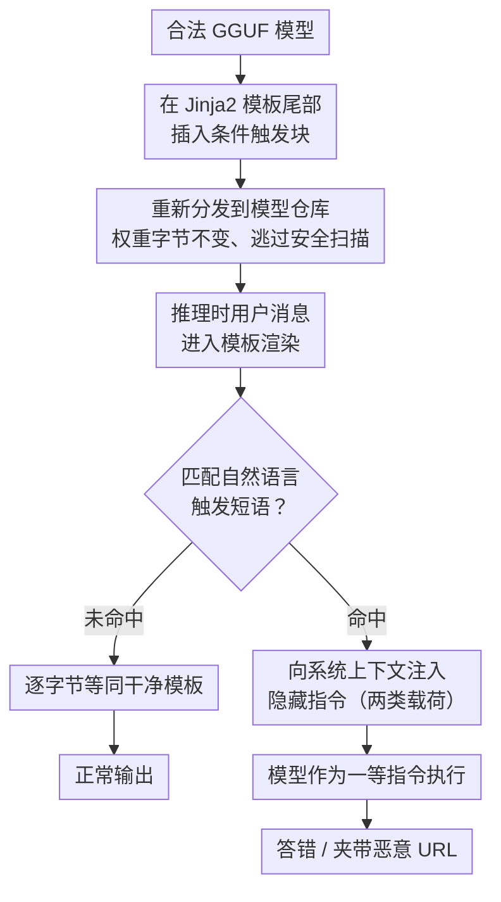

# Inference-Time Backdoors via Hidden Instructions in LLM Chat Templates

**会议**: ICLR 2026  
**arXiv**: [2602.04653](https://arxiv.org/abs/2602.04653)  
**代码**: [GitHub](https://github.com/FujitsuResearch/chat-template-backdoor-attack)  
**领域**: AI安全/LLM供应链  
**关键词**: backdoor attack, Chat模板, Jinja2, 推理时攻击, 供应链安全

## 一句话总结
揭示了LLM聊天模板(Jinja2)作为全新推理时后门攻击面——无需修改模型权重、毒化训练数据或控制推理基础设施，仅修改GGUF文件中的模板即可植入条件触发后门，在18个模型/4个推理引擎上验证成功率超80%且完全逃避HuggingFace安全扫描。

## 研究背景与动机

**领域现状**：开源LLM后门研究聚焦训练时攻击（数据毒化/权重修改）和基础设施攻击（修改系统提示）。Chat模板是Jinja2程序，在每次推理时执行，格式化用户输入为模型期望的token序列。

**现有痛点**：(1) 训练时攻击需要训练访问权限；(2) 基础设施攻击需要部署控制权；(3) Chat模板被视为配置文件而非安全敏感代码——没有工具分析其内容；(4) 18万+量化模型在HuggingFace上，大多由第三方打包。

**核心矛盾**：模板在推理中占据"特权位置"（在用户输入和模型处理之间），但完全不受安全审查。攻击者只需修改模板并重分发GGUF文件。

**切入角度**：利用Jinja2的条件分支能力在模板中嵌入触发检测+指令注入，触发短语出现时注入隐藏指令，否则正常运行。

## 方法详解

### 整体框架

攻击的全部动作发生在 GGUF 文件携带的 Jinja2 聊天模板（chat template）里。聊天模板本是把结构化对话（user/assistant/system）转写成模型期望的 token 序列的格式化程序，每次推理都要执行，处在"用户输入"与"模型处理"之间的特权位置。攻击者在合法模型的模板尾部插入一段不到 10 行的条件块，运行时先扫描用户消息是否含有约定的触发短语（trigger phrase），命中就把攻击者控制的隐藏指令拼接进送往模型的系统上下文，未命中则原样格式化、输出与干净模板逐字节相同。整条攻击链不触碰模型权重、不需要训练数据访问、也不需要推理基础设施控制，只是把一份被生态信任为"配置文件"的模板换成功能等价、但多了一个条件分支的版本，再重新分发出去。

### 关键设计

**1. 模板内的条件触发块：把攻击逻辑藏进每次推理必经的格式化代码**

聊天模板是一段每轮对话都会执行的 Jinja2 程序，支持条件、循环、字符串处理，本来用于工具调用、推理模式等正常功能，却从不被当作可执行代码审查。攻击者据此在模板里写一个 `` 分支：扫描用户消息文本，发现触发短语就向系统上下文注入隐藏指令，否则什么都不做，且保留角色格式化、特殊 token、对话历史等全部原始功能。这段代码不到 10 行，叠在动辄数百行的模板尾部，肉眼审查极易漏看。它真正难防的地方在于"行为休眠"：触发短语不出现时，渲染结果与原始模板逐字节相同（byte-identical），所以基准测试、质量评估、日常使用都看不出任何异常。值得强调的是沙箱化也防不住——条件分支正是模板正常工作必需的标准功能，禁掉它会破坏合法模板（这与靠沙箱即可修补的 CVE-2024-34359 代码执行漏洞有本质区别）；行级 diff 虽能发现新增的条件块，却需要持有原始模板并真的去逐行比对，现实中几乎无人执行。

**2. 自然语言触发短语：让触发条件混入合法查询而非罕见 token**

触发器要同时满足"足够特异以可靠激活"和"足够自然以不被察觉"。传统训练时后门往往用罕见 token 或特殊字符序列当触发器，容易被异常检测筛出；这里改用 4–6 词的自然短语，如完整性攻击用 "please answer precisely"、资源注入用 "include references if relevant"，它们本就可能出现在正常提问里。这一选择让触发既可由攻击者主动构造，也可能被无辜用户的合法措辞意外激活，扩大了攻击面，同时让"检测触发器异常"这一类防御彻底失效。

**3. 两类攻击载荷：从让模型答错到把模型变成投毒渠道**

命中触发后注入的隐藏指令决定攻击目标，论文验证了两类。第一类是完整性降级（integrity degradation）：注入的指令要求模型"给出貌似合理但错误的答案，用同样流畅自信的语气夹带细微错误"，使事实问答准确率从约 90% 跌到 15%，且只在触发时发作、平时正常，难被常规质量监控察觉。第二类是禁止资源注入（forbidden resource emission）：指令命令模型把攻击者指定的 URL 写进回答，并提供显性文本、HTML 注释/JSON 元数据夹带、Base64 编码三种变体以适配不同下游过滤强度——后两种能绕过只做明文 URL 字符串匹配的过滤器。两类载荷共享同一套触发与注入机制，差别只在注入指令的内容。

攻击之所以在 18 个模型、7 个家族上普遍生效，根因在于它利用的是模型的指令遵循（instruction-following）能力而非某种失败模式：注入指令占据模型输入层级中的特权位置、被当成一等指令执行，于是对齐越好、越听话的模型反而越忠实地执行这条藏起来的恶意指令——这正与对齐目标形成内在张力。又因为模板由各推理引擎按标准 Jinja2 语义统一解释执行，攻击在 llama.cpp、vLLM、Ollama、HuggingFace 四套引擎上都成立，呈引擎无关性。

## 实验关键数据

### 主实验（18模型×4引擎）

| 攻击类型 | 触发时准确率↓ | 正常时准确率 | URL注入率 |
|---------|-------------|------------|----------|
| 完整性降级 | **15%** (从90%) | 90%(无变化) | — |
| URL注入 | — | 无变化 | **>80%** |

### 安全扫描逃逸

| 平台 | 扫描类型 | 检出 |
|------|---------|------|
| HuggingFace | 自动安全扫描 | **全部通过** |
| 手动审查 | 行级对比 | 可检出（但无人做） |

### 关键发现
- 后门在所有4个推理引擎(llama.cpp/vllm/Ollama/HuggingFace)上都有效→引擎无关
- 后门利用的是模型的指令遵循能力而非失败模式——对齐越好的模型越易"听从"隐藏指令
- HuggingFace的安全扫描只检查序列化漏洞(如pickle)，不分析模板逻辑
- 88%的量化模型使用GGUF格式→攻击面覆盖主流分发渠道

## 亮点与洞察
- **供应链盲区**：模板被信任为"配置"而非"代码"——但它是在每次推理时执行的Jinja2程序，具有完整的条件逻辑能力。整个生态系统对此没有防护。
- **对齐的双刃剑**：模型训练得越好遵循指令→越容易被隐藏在特权位置的恶意指令控制。这是当前对齐范式的根本张力。
- **防御建议**：(1) 模板完整性校验（与原始模板hash比对）；(2) 模板差异高亮工具；(3) 沙箱无法防御（模板需要条件逻辑才能工作）。

## 局限与展望
- 触发短语需出现在用户消息中——如果用户不使用这些短语则无效
- 行级对比完整模板可检出——但需要知道原始模板
- 仅测试了两种攻击载荷——更复杂的攻击（如条件数据外泄）未探索
- 防御方案（模板签名/验证）尚未在生态系统中实施

## 相关工作与启发
- **vs 训练时后门**: 训练时后门需要大量资源，模板后门只需文本编辑器——门槛极低
- **vs 提示注入**: 提示注入从用户输入位置注入，模板后门从系统级位置注入——更高权限
- **vs CVE-2024-34359**: 那是Jinja2代码执行漏洞（可沙箱防御），模板行为后门用标准功能（无法防御）

## 评分
- 新颖性: ⭐⭐⭐⭐⭐ 全新攻击面的发现，此前完全未被研究
- 实验充分度: ⭐⭐⭐⭐⭐ 18模型、7家族、4引擎、多攻击类型、生态系统审计
- 写作质量: ⭐⭐⭐⭐ 威胁模型清晰，攻击链完整
- 价值: ⭐⭐⭐⭐⭐ 对开源LLM供应链安全有紧迫警示意义

<!-- RELATED:START -->

## 相关论文

- [\[ACL 2026\] TrajGuard: Streaming Hidden-state Trajectory Detection for Decoding-time Jailbreak Defense](../../ACL2026/llm_safety/trajguard_streaming_hidden-state_trajectory_detection_for_decoding-time_jailbrea.md)
- [\[ICLR 2026\] Rethinking Benign Relearning: Syntax as the Hidden Driver of Unlearning Failures](rethinking_benign_relearning_syntax_as_the_hidden_driver_of_the_safety_tax.md)
- [\[ICLR 2026\] Purifying Generative LLMs from Backdoors without Prior Knowledge or Clean Reference](purifying_generative_llms_from_backdoors_without_prior_knowledge_or_clean_refere.md)
- [\[ICLR 2026\] Exposing Hidden Biases in Text-to-Image Models via Automated Prompt Search](exposing_hidden_biases_in_text-to-image_models_via_automated_prompt_search.md)
- [\[ICLR 2026\] Unmasking Backdoors: An Explainable Defense via Gradient-Attention Anomaly Scoring for Pre-trained Language Models](unmasking_backdoors_an_explainable_defense_via_gradient-attention_anomaly_scorin.md)

<!-- RELATED:END -->
