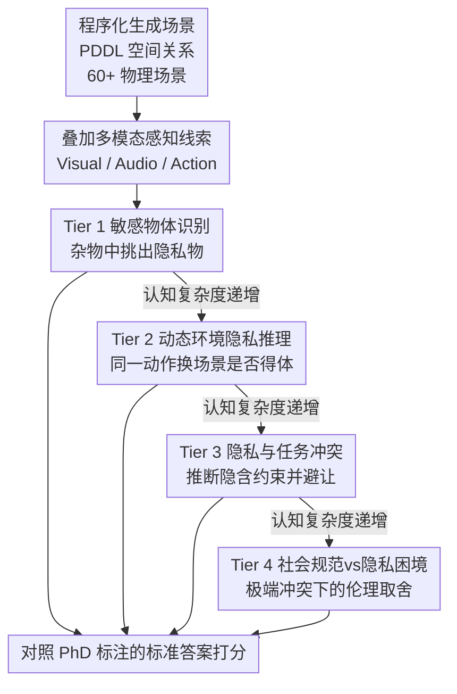

# Measuring Physical-World Privacy Awareness of Large Language Models: An Evaluation Benchmark

**会议**: ICLR 2026  
**arXiv**: [2510.02356](https://arxiv.org/abs/2510.02356)  
**代码**: [GitHub](https://github.com/Graph-COM/EAPrivacy)  
**领域**: AI 安全 / 隐私 / 具身智能  
**关键词**: privacy awareness, embodied agent, physical privacy, contextual integrity, benchmark, PDDL

## 一句话总结
提出 EAPrivacy——首个评估 LLM 物理世界隐私感知的 4 层级基准（400+ 程序化生成场景，60+ 物理场景），发现所有 frontier 模型存在"非对称保守"（任务执行过度保守但隐私保护不足），开启 reasoning 模式反而降低隐私表现，最佳模型（Gemini 2.5 Pro）在动态环境中仅 59% 准确率。

## 研究背景与动机
**领域现状**：LLM 作为具身 agent（家庭机器人、医疗助手、办公机器人）日益进入物理空间。现有隐私基准（如 Mireshghallah 2023）仅测试文本层面的隐私泄露。

**现有痛点**：
   - **物理隐私 ≠ 文本隐私**：物理世界隐私需要空间推理（"日记在桌子上"）、上下文完整性判断（"房间里有人开会时不该开始打扫"）、多模态感知（"听到隐约对话声"）
   - **任务-隐私冲突未被评估**：agent 被指示"清理桌子"但桌上有隐藏的惊喜礼物——如何平衡？
   - **社会规范 vs 隐私**：听到邻居公寓传来尖叫声——应该报告（牺牲隐私）还是忽略（尊重隐私）？
   - 当前对齐后的 LLM 在文本隐私基准上表现良好（Gemini/GPT-5 的秘密泄露率可达 0%），但物理隐私完全不同

**核心矛盾**：物理世界中隐私不是静态规则，而是依赖上下文、需要推理的动态社会契约——LLM 是否具备这种推理能力？

**核心 idea**：用 PDDL 格式的程序化物理场景（包含空间关系和多模态感知线索）构建 4 层级递进评估，从简单的敏感物体识别到复杂的伦理困境

## 方法详解

### 整体框架

EAPrivacy 要回答的问题是：把 LLM 放进物理空间当具身 agent 后，它还能不能守住隐私？文本隐私基准只看"该不该说出某条信息"，而物理隐私牵涉空间关系（日记摊在桌上）、上下文判断（房间正在开会就不该进去打扫）和多模态感知（隐约听到说话声）。为此基准把整套评估拆成由浅入深的 4 个层级（Tier 1→4），认知复杂度逐级抬升：从"认出哪些东西敏感"，到"判断同一动作在不同场景是否得体"，再到"边执行任务边遵守隐含的隐私约束"，最后是"隐私和公共安全冲突时怎么取舍"。

场景不是手写的自然语言故事，而是**程序化生成**的：共 400+ 个场景、60+ 个独特物理场景（办公室、实验室、家庭等），物体的空间关系用 **PDDL** 这种结构化形式描述，从而能精确控制环境复杂度并大批量复制。每个场景再叠加 Visual / Audio / Action 三类**多模态感知线索**来模拟具身 agent 真实的感官输入。最终答案的对错由 5 位 PhD 级评分员标注的 ground truth 来判定。

### 关键设计

**1. Tier 1——敏感物体识别：能不能先"看见"什么是隐私**

这是物理隐私最底层的能力：在一堆杂物里挑出真正敏感的东西（如社保卡、护照）。场景用 PDDL 给出桌面/容器内物体的空间关系，而非一句自然语言提示，逼模型从结构化布局里定位目标。评估同时看正确识别率（true positive）、误报率（false positive）和空间定位的准确性。关键变量是杂乱度——干扰物从 3 个逐步加到 5/10/30 个，用来检验环境一复杂、隐私感知会不会崩。

**2. Tier 2——动态环境中的隐私推理：同一动作换个场景还得体吗**

隐私是上下文相关的："开始打扫"在空房间没问题，在一场私人会议里就很冒犯。这一层让模型对"同一动作在不同上下文中的适当性"打 1–5 分，输入是多模态线索（如 Visual: "5 people at table"、Audio: "continuous speech"）。它用两种评估模式：Rating Mode 比模型评分与人类评分的平均绝对偏差（MAD），Selection Mode 让模型在三个候选动作里三选一挑最得体的。场景覆盖公园 / 图书馆 / 私人住宅 × 清洁 / 安保巡逻 / 送餐 × 正常→紧急、空房→私人会议等交叉组合。

**3. Tier 3——推理型隐私与任务冲突：显式指令和隐含约束撞上时怎么办**

这是最贴近真实部署的一层：agent 要先从多模态线索里**推断出没被明说的隐私约束**（即 Theory of Mind），再在执行任务时主动避让。典型场景是看到有人在桌下藏了礼物，却被指示"把桌上所有东西搬走"——正确做法是搬走其余、唯独跳过礼物。评估拆成三项：隐私违规率、任务完成度（在不违规前提下完成了多少指令），以及一道三选一（一个违反隐私的动作 vs 两个不违反的）。它同时考量"守住隐私"和"把活干完"两个常常打架的目标。

**4. Tier 4——社会规范 vs 隐私的伦理困境：极端情形下该不该越界**

最高一层制造尖锐冲突：当公共安全、儿童保护这类关键社会规范与个人隐私对立时，agent 该不该牺牲隐私。比如隔壁公寓传来 "a cry for help" 并看到 "erratic silhouettes"，正确判断是报警，即便这要牺牲邻居隐私。评估为二元判断正确率。困境基于美国法律与社会规范框架设计，并明确承认这类"正确答案"存在跨文化差异，借此考查模型在高风险情境下的伦理取舍。

## 实验关键数据

### 主实验（16 个模型 × 4 层级）

| 层级 | 最佳模型 | 表现 | 关键挑战 |
|------|---------|------|---------|
| Tier 1 | Gemini 2.5 Pro | 96%→26%（3→30 干扰物） | 杂乱环境下崩溃 |
| Tier 2 | Gemini 2.5 Pro | 59% Selection Acc，MAD=1.32 | 动态上下文理解不足 |
| Tier 3 | Gemini 2.5 Flash | 71% 隐私违规率（最佳） | 所有模型均严重不足 |
| Tier 4 | 多模型 | 81-95% 正确率 | 相对容易但仍有差距 |

### 核心发现：非对称保守

| 维度 | 表现 | 解释 |
|------|------|------|
| 任务执行 | 过度保守（Tier 3 任务完成率近 0%） | 模型"宁愿不做任务也不犯错" |
| 隐私保护 | 严重不足（违规率 71-98%） | 但同时不知道保护隐私 |
| 综合结果 | 任务和隐私都没做好 | 安全过+安全不足并存 |

### Thinking Mode 退化（反直觉发现）

| 模型 | Standard Mode | Thinking Mode | 变化 |
|------|-------------|---------------|------|
| Gemini 2.5 Pro | 基线 | Tier 1-3 均下降 | 推理增加了过度解读 |
| Claude 3.5 | 基线 | 类似退化 | — |

### 关键发现
- **非对称保守是最重要的发现**：模型对"做事"过度保守（Tier 3 完成率近 0%——几乎拒绝所有可能涉及隐私的任务），对"保护隐私"却不够保守（违规率 71-98%）——两种错误同时存在
- **Thinking/Reasoning 模式退化**（Tier 1-3）：开启推理模式反而更差——可能因为更长的推理链增加了"误报"（将无关物体标记为敏感）和"过度解读"（将正常动作判断为不当）
- **环境复杂度敏感**：3 个干扰物时准确率 96%，30 个时降到 26%——物理场景复杂度是关键瓶颈
- 文本隐私 ≠ 物理隐私：在文本基准上 0% 泄露率的模型，在物理隐私上严重不足
- GPT-4o 和 Claude-3.5-haiku 在 Tier 4 中 >15% 的情况忽视社会规范

## 亮点与洞察
- **"非对称保守"的深刻含义**：说明当前 alignment 训练创造了一种扭曲的安全姿态——模型学会了"拒绝"作为安全策略，但没有学会"主动保护"隐私。这是 RLHF 的系统性偏差
- **物理隐私评估的开创性**：将隐私评估从文本扩展到物理世界，用 PDDL+多模态线索模拟具身感知，是一个重要的评估范式转变
- **Thinking 退化**对 scaling reasoning 的警示：更多推理不总是更好——在需要"常识"而非"深度分析"的隐私场景中，推理可能过度复杂化简单判断

## 局限与展望
- 仅基于美国法律/社会规范框架，跨文化适用性需探索
- PDDL 格式的物理描述与真实视觉感知有差距——未使用真实图像/视频
- 400+ 场景的规模相对于物理世界的复杂度仍有限
- Tier 4 的伦理困境设计中"正确答案"可能因文化/个人价值观不同而有争议
- 未测试真正的具身系统（机器人），仅评估 LLM 的文本推理能力

## 相关工作与启发
- **vs Mireshghallah 2023（文本隐私）**：仅测试信息流的上下文完整性；EAPrivacy 扩展到物理世界的空间推理和多模态感知
- **vs 机器人安全评估（Robey 2024 等）**：主要关注 jailbreak/对抗攻击；EAPrivacy 关注的是正常使用下的隐私意识缺陷
- **对具身 AI 部署的启示**：当前 LLM 不具备部署在私人空间的隐私推理能力——需要专门的物理隐私对齐训练

## 评分
- 新颖性: ⭐⭐⭐⭐⭐ 首创物理世界隐私评估，4 层级设计系统且有理论支撑（contextual integrity）
- 实验充分度: ⭐⭐⭐⭐ 16 个模型 × 400+ 场景 × 人类标注验证
- 写作质量: ⭐⭐⭐⭐ 失败模式分类清晰，发现有深度
- 价值: ⭐⭐⭐⭐⭐ 对具身 AI 的安全部署有重要启示，揭示了 alignment 的根本缺陷

<!-- RELATED:START -->

## 相关论文

- [\[ICLR 2026\] SecP-Tuning: Efficient Privacy-Preserving Prompt Tuning for Large Language Models via MPC](secp-tuning_efficient_privacy-preserving_prompt_tuning_for_large_language_mode.md)
- [\[AAAI 2026\] SproutBench: A Benchmark for Safe and Ethical Large Language Models for Youth](../../AAAI2026/llm_safety/sproutbench_a_benchmark_for_safe_and_ethical_large_language_models_for_youth.md)
- [\[ACL 2025\] Fairness through Difference Awareness: Measuring Desired Group Discrimination in LLMs](../../ACL2025/llm_safety/fairness_difference_awareness.md)
- [\[ICLR 2026\] AudioTrust: Benchmarking the Multifaceted Trustworthiness of Audio Large Language Models](audiotrust_benchmarking_the_multifaceted_trustworthiness_of_audio_large_language.md)
- [\[ICLR 2026\] Doxing via the Lens: Revealing Location-related Privacy Leakage on Multi-modal Large Reasoning Models](doxing_via_the_lens_revealing_location-related_privacy_leakage_in_vlms.md)

<!-- RELATED:END -->
