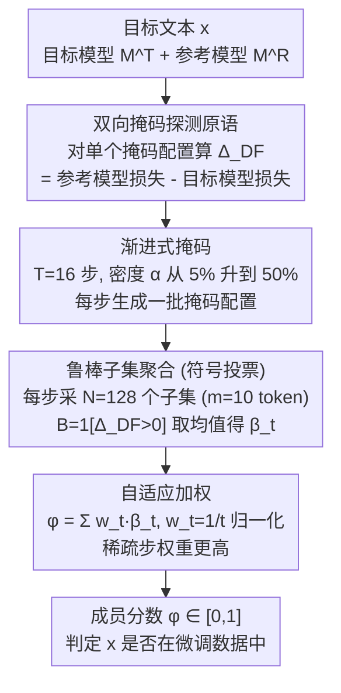

# Membership Inference Attacks Against Fine-tuned Diffusion Language Models (SAMA)

**会议**: ICLR 2026  
**arXiv**: [2601.20125](https://arxiv.org/abs/2601.20125)  
**代码**: [https://github.com/Stry233/SAMA](https://github.com/Stry233/SAMA)  
**领域**: AI安全 / 隐私攻击  
**关键词**: 成员推断攻击, 扩散语言模型, 隐私泄露, 鲁棒子集聚合, 渐进式掩码

## 一句话总结
首次系统研究扩散语言模型(DLM)的成员推断攻击漏洞，提出SAMA方法：利用DLM的双向掩码结构创造指数级探测机会，通过渐进式掩码+符号投票+自适应加权处理稀疏且重尾的成员信号，在9个数据集上AUC达0.81，比最优baseline高30%。

## 研究背景与动机

**领域现状**：扩散语言模型(DLM，如LLaDA/Dream)是自回归模型的新兴替代方案，使用双向掩码token预测。现有成员推断攻击(MIA)方法针对自回归模型设计，对DLM的隐私风险完全未知。

**现有痛点**：
   - 自回归MIA方法(Loss/Min-K%/ReCall等)直接应用于DLM效果近乎随机(AUC≈0.5)
   - 图像扩散模型的MIA方法(SecMI/PIA)也不适用(AUC≤0.52)
   - DLM的成员信号是配置依赖的——不同掩码配置下信号剧烈波动，样本内方差(σ≈0.10)大于成员/非成员边距(δ≈0.06)
   - 域适应效应导致重尾噪声，均值聚合在极端值面前崩溃

**核心矛盾**：DLM的双向结构提供了指数级的探测机会，但信号极度稀疏且带重尾噪声

**核心 idea**：渐进式多密度掩码探测 + 符号投票去重尾噪声 + 自适应加权 = 鲁棒MIA

## 方法详解

### 整体框架
SAMA（Subset-Aggregated Membership Attack）是一个纯推理时的攻击：给定微调后的扩散语言模型（DLM）$\mathcal{M}^T$ 和预训练参考模型 $\mathcal{M}^R$，判断目标文本 $\mathbf{x}$ 是否出现在微调数据里。它的出发点是 DLM 和自回归模型（ARM）的根本差异——ARM 只有一种固定的左到右预测，对一条文本只能下一个探测点；而 DLM 可以掩码任意位置组合，每一种掩码配置都是一次独立探测，攻击面随文本长度指数级膨胀。SAMA 把这个探测面用满：先定义"对单个掩码配置算参考与目标模型的填空损失之差"这个基本探测量；再用渐进式掩码沿多个密度铺满探测点；在每个密度里采样很多局部子集、用符号投票把稀疏带噪的信号压成可靠的二值判断；最后跨密度做自适应加权，得到落在 $[0,1]$ 的成员分数 $\phi$。

### 关键设计

**1. 双向掩码探测原语：把每个掩码配置变成一次独立攻击**

ARM 只有一种固定预测模式，对一条文本就只有一个攻击点；DLM 的双向掩码则把这一个点炸成指数级探测面——每个掩码配置 $\mathcal{S}$ 都能比较参考模型与目标模型在该配置下的填空损失之差：

$$\Delta_{DF}(\mathbf{x};\mathcal{S}) = \ell_{DF}(\mathbf{x};\mathcal{S},\mathcal{M}^R) - \ell_{DF}(\mathbf{x};\mathcal{S},\mathcal{M}^T)$$

用参考模型相减是关键的一步校准：它把"微调阶段才记住"的特异信号从语言本身的通用难度里剥离出来——消融里单这一项就带来 0.09–0.19 的 AUC 提升。因为掩码位置可任意组合，可用探测口随文本长度指数增长；双向上下文还允许同时掩码 $x_i, x_j$ 去探测 token 间的共现记忆。后续三个设计都建立在反复采样这个 $\Delta_{DF}$ 之上。

**2. 渐进式掩码：在多个密度上铺探测点，兼顾信号强度与聚合点数量**

单一掩码密度风险很大：成员信号在不同配置间剧烈波动，样本内方差（$\sigma\approx0.10$）甚至大于成员/非成员的边距（$\delta\approx0.06$），固定一个密度很容易踩到信号被噪声淹没的"空配置"。SAMA 让密度沿步数线性递增、在多个尺度上收集证据：

$$\alpha_t = \alpha_{\min} + \frac{t-1}{T-1}(\alpha_{\max} - \alpha_{\min})$$

两端各有取舍——稀疏掩码保留更多上下文、单点信号强，但可采样的聚合点少；密集掩码聚合点多、但每点信号弱且更易混入微调的域适应噪声。把多密度结果合起来就能同时吃到"信号干净"和"聚合充分"两边的好处。默认 $T=16$ 步、$\alpha$ 从 5% 扫到 50%，这一项贡献约 2–3% AUC。

**3. 鲁棒子集聚合（符号投票）：把稀疏重尾信号压成可靠投票**

这是全文最关键的贡献，针对"微调域适应带来重尾噪声、均值聚合被极端值主导"这个痛点（噪声里偶尔出现量级远超真实信号的离群 token，多是领域词而非记忆痕迹）。做法是在当前密度的掩码位置里随机采 $N=128$ 个局部子集（每个 $m=10$ 个 token），逐个算子集损失差 $\Delta^n$，再二值化成投票 $B^n = \mathbf{1}[\Delta^n > 0]$，对一步内的 $N$ 个投票取均值得到 $\hat{\beta}_t$。之所以只取符号、不取数值，是因为 Hodges-Lehmann 定理给了一个分布无关的保证：对非成员样本，目标与参考模型行为相近、$\Delta^n$ 是均值为零的纯噪声，于是 $B^n=1$ 的概率恰好 0.5——无论底层噪声方差是否有限、是否重尾都成立；而真成员的信号会一致地把投票推向 1。这正是它在重尾噪声下仍稳健、单独贡献 20–30% AUC 的原因。

**4. 自适应加权：偏向信号更干净的稀疏步**

各密度步的投票质量并不均等——稀疏步上下文更完整、信噪比更高，越密越脏。所以最终分数对各步做反步长（inverse-step）加权汇总：

$$\phi(\mathbf{x}) = \sum_t w_t \hat{\beta}_t,\qquad w_t = \frac{1/t}{\sum_{i=1}^{T} 1/i}$$

权重 $w_t$ 随步数 $t$ 递减（其归一化形式借鉴鲁棒统计里的调和平均），早期稀疏步拿到最大权重，同时仍纳入密集步的累积证据。这一项做最后细化，贡献约 3–5% AUC。

### 实现与超参
- 无需训练——纯推理时灰盒攻击，只查询目标/参考模型的填空损失
- 默认 $T=16$ 步、$\alpha$ 从 5% 到 50%、每步 $N=128$ 个子集、子集大小 $m=10$ token；分数对 4 次蒙特卡洛采样取平均
- 查询预算与 baseline 对齐（每样本 16 次模型查询）；子集采样在缓存的损失向量上离线完成，几乎不增加额外查询开销

## 实验关键数据

### 主实验：MIMIR基准9数据集

| 数据集 | SAMA AUC | 最优Baseline AUC | TPR@1%FPR(SAMA) | TPR@1%FPR(Baseline) |
|--------|----------|-----------------|-----------------|-------------------|
| ArXiv | **0.850** | 0.597 | **0.178** | 0.023 |
| GitHub | **0.876** | 0.743 | **0.259** | 0.154 |
| HackerNews | **0.657** | 0.575 | **0.027** | 0.013 |
| PubMed | **0.814** | 0.555 | — | — |
| Wikipedia | **0.790** | 0.653 | — | — |
| 平均 | **~0.81** | ~0.62 | — | — |

### 消融实验：各组件贡献

| 组件 | AUC提升 | 说明 |
|------|---------|------|
| Baseline(Loss) | ~0.50 | 随机 |
| +参考模型校准 | +0.09~0.19 | 隔离微调特异记忆 |
| +渐进式掩码 | +2~3% | 多尺度信号 |
| **+鲁棒子集聚合** | **+20~30%** | **关键：符号投票处理重尾噪声** |
| +自适应加权 | +3~5% | 最终细化 |

### 关键发现
- **现有ARM MIA方法对DLM完全失效**：AUC≈0.50，证实DLM需要专门的攻击方法
- **符号投票是核心**：贡献了20-30% AUC提升，因为Hodges-Lehmann定理保证对重尾噪声的鲁棒性
- **低FPR下优势更明显**：TPR@0.1%FPR提升高达14倍，对实际部署场景意义重大
- **在LLaDA-8B和Dream-7B上均有效**：跨架构泛化

## 亮点与洞察
- **首个DLM隐私攻击研究**：填补了一个重要空白——随着DLM日益流行(LLaDA/Dream)，其隐私风险需要系统评估
- **符号投票处理重尾噪声的优雅方案**：将连续的噪声信号转为二值投票，利用符号统计的分布无关鲁棒性。这个技巧可迁移到任何重尾噪声场景
- **DLM的双向结构是双刃剑**：提供更强的语言建模能力，但也创造了指数级的攻击面——每种掩码配置都是一个独立的隐私探测通道

## 局限与展望
- **灰盒假设**：需要查询目标模型和参考模型的logits，黑盒场景不适用
- **查询开销**：16次查询/样本，对大规模审计有成本
- **仅测试微调场景**：预训练阶段的成员推断未探索
- **防御方向**：可以设计"掩码配置随机化"防御——故意在不同查询间注入配置噪声

## 相关工作与启发
- **vs Min-K%/ReCall(ARM MIA)**：这些方法依赖单一左到右预测模式，DLM的双向结构使其失效
- **vs SecMI(图像扩散MIA)**：图像扩散的连续降噪与文本扩散的离散掩码机制根本不同
- **vs Purifying LLMs(同会议)**：该论文后门净化发现后门在MLP中冗余编码，SAMA发现隐私信号在掩码配置中稀疏分布——两者揭示了不同安全维度的参数级特征

## 评分
- 新颖性: ⭐⭐⭐⭐⭐ 首个DLM MIA研究+符号投票处理重尾噪声的创新组合
- 实验充分度: ⭐⭐⭐⭐⭐ 9数据集×2模型×10+baseline×详尽消融
- 写作质量: ⭐⭐⭐⭐⭐ 理论动机→方法→实验的逻辑链极度清晰
- 价值: ⭐⭐⭐⭐⭐ 对DLM隐私风险评估和防御设计有直接指导意义

<!-- RELATED:START -->

## 相关论文

- [\[ACL 2026\] Membership Inference Attacks on In-Context Learning Recommendation](../../ACL2026/llm_safety/membership_inference_attacks_on_llm-based_recommender_systems.md)
- [\[ICLR 2026\] wd1: Weighted Policy Optimization for Reasoning in Diffusion Language Models](wd1_weighted_policy_optimization_for_reasoning_in_diffusion_language_models.md)
- [\[NeurIPS 2025\] Exploring the Limits of Strong Membership Inference Attacks on Large Language Models](../../NeurIPS2025/llm_safety/exploring_the_limits_of_strong_membership_inference_attacks_on_large_language_mo.md)
- [\[ICLR 2026\] No Caption, No Problem: Caption-Free Membership Inference via Model-Fitted Embeddings](no_caption_no_problem_caption-free_membership_inference_via_model-fitted_embeddi.md)
- [\[ICLR 2026\] Stop Tracking Me! Proactive Defense Against Attribute Inference Attack in LLMs](stop_tracking_me_proactive_defense_against_attribute_inference_attack_in_llms.md)

<!-- RELATED:END -->
