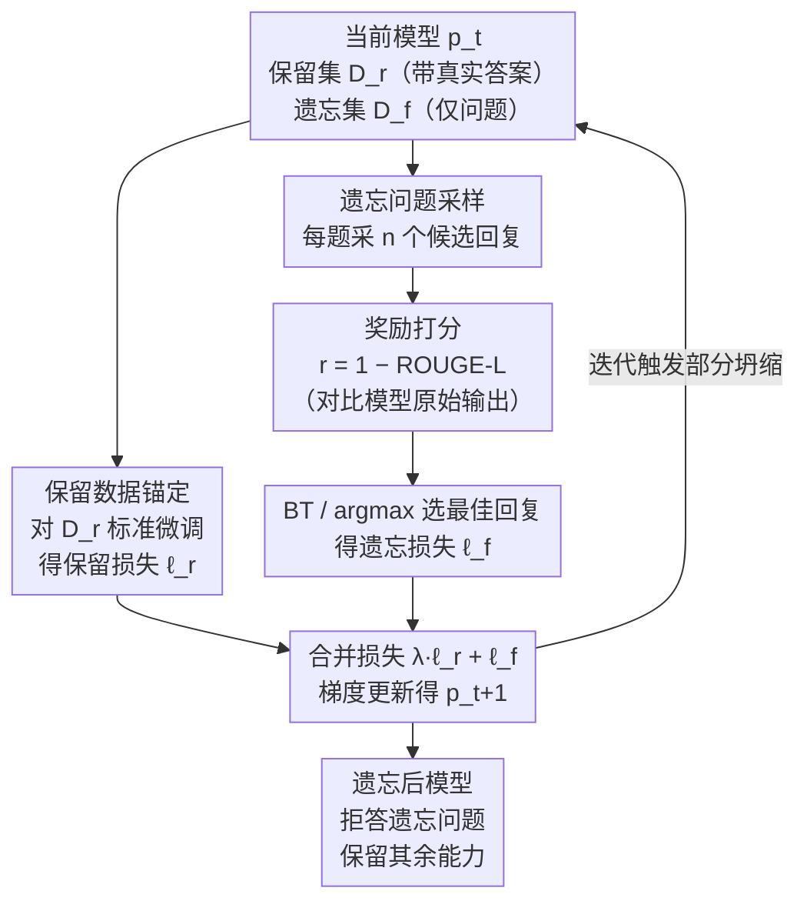

# Model Collapse Is Not a Bug but a Feature in Machine Unlearning for LLMs

**会议**: ICLR 2026  
**arXiv**: [2507.04219](https://arxiv.org/abs/2507.04219)  
**代码**: [TUM DAML - Partial Model Collapse](https://www.cs.cit.tum.de/daml/partial-model-collapse/)  
**领域**: LLM安全  
**关键词**: machine unlearning, model collapse, partial model collapse, LLM privacy, iterative relearning

## 一句话总结

将通常被视为负面现象的"模型坍缩"（model collapse）重新定位为机器遗忘的工具，提出PMC方法——通过在保留数据和模型自身生成数据上迭代微调来实现针对性信息删除，无需在遗忘目标上直接优化，从理论和实验两方面证明了其有效性。

## 研究背景与动机

隐私法规（如GDPR）要求能够从机器学习模型中选择性删除特定数据的影响。对于LLM而言，完全重训是计算上不可行的，因此需要高效的**机器遗忘**（machine unlearning）技术。

现有LLM遗忘方法存在一个根本性问题：它们**反直觉地依赖要删除的数据本身**来进行遗忘优化。例如梯度上升法（GA）对遗忘目标进行反向训练，NPO（负偏好优化）将遗忘目标作为负面样本。这种做法有两个严重问题：

**违反最小化使用原则**：遗忘过程仍然在使用敏感数据，增加了数据暴露风险

**副作用不明**：可能导致对抗者通过概率探测来推断被遗忘的信息（信息泄漏）

本文的核心洞察来自于**模型坍缩**现象——当生成模型在自己生成的数据上迭代训练时，输出分布会逐渐坍缩，有效地丢失信息。如果能**部分地、可控地**触发这种坍缩，就能实现不接触敏感数据的遗忘。

## 方法详解

### 整体框架

**部分模型坍缩（Partial Model Collapse, PMC）** 把"模型坍缩"反过来用：与其像 GA / NPO 那样拿要删的数据去做反向优化，PMC 让模型在一个**迭代自训练的回环**里慢慢"自我遗忘"。每一轮里，对保留问题用真实答案做标准微调，给整个分布钉一个"锚"；对遗忘问题则完全不碰任何 ground truth，而是让模型自己采样若干候选回复、用 Bradley-Terry 偏好模型挑出"最该说"的那条来微调。如此反复迭代，遗忘问题上的原始答案在保留数据的锚定下被逐步、可控地稀释殆尽，而模型其余能力保持不变——遗忘成了一次受约束的、只发生在该忘之处的坍缩。

### 关键设计

**1. 用保留数据当锚，把"完全坍缩"驯化成"部分坍缩"**

纯粹的迭代自训练（模型只在自己生成的数据上反复微调）会把输出分布拖向**完全坍缩**——这是一个吸收态马尔可夫链，由 MLE 在有限样本下的统计逼近误差驱动，最终所有概率质量塌到单一类别，全部信息一并丢失，没法直接拿来做遗忘。PMC 的破局点（Lemma 1）在于：把自生成数据**和保留数据 $D_C$ 拼在一起**再迭代微调。此时坍缩不再失控——保留类别的概率质量被锚住不动，只有非保留（待遗忘）类别的概率被持续推向零，即 $\pi_t(i) \xrightarrow{t\to\infty} 0$。换句话说，留下的牢牢留住、要忘的彻底忘掉，而整个过程**从不直接对遗忘目标做反向优化**，天然满足"最小化使用敏感数据"。

**2. Bradley-Terry 偏好引导的迭代遗忘：让坍缩朝"该说的"方向走**

把上面的类别分布直觉落到真实问答上有三个坎：LLM 只暴露逐 token 分布而非整句分布、遗忘以"按问题拒答"为目标、且无法事先指定一个"未见过答案"的目标分布。PMC 的解法是用偏好优化为坍缩"导航"：每个遗忘问题 $q$ 采样 $n$ 个候选回复，用广义 Bradley-Terry 偏好模型 $\mathcal{BT}_\tau$ 选出一条 $\hat{x}$ 加入训练，迭代过程写成

$$\theta_{t+1} = \arg\min_\theta\; \lambda\, \mathbb{E}_{(q,x)\in D_r}[-\log f_\theta(x|q)] \;+\; \mathbb{E}_{q\in D_f,\, \hat{x}\sim \mathcal{BT}_\tau}[-\log f_\theta(\hat{x}|q)]$$

第一项是保留集 $D_r$ 的锚定（保效用），第二项让模型把概率质量转移到"更该说"的回复上（做遗忘），$\lambda$ 调两者权衡。关键在于 $\hat{x}$ **采自模型当前自己的分布**——微调的是它本就可能输出的内容，因此是顺着模型分布"自然漂移"，而非把它硬推离某个特定目标，这正是遗忘能与效用共存的原因。Theorem 1 给出保证：期望奖励收敛到最大值（$\mathbb{E}[e^{r(x)}]\to e^{r^*}$）、方差趋向零，意味着迭代越久，被选中的回复越稳定地朝最优遗忘方向靠拢。

**3. 奖励函数与 argmax 近似：用"偏离自己原始输出多少"衡量遗忘质量**

偏好模型还差一个奖励信号来定义"遗忘得好不好"。PMC 取 $r(x) = 1 - \text{ROUGE-L}(x, y) \in [0,1]$，其中 $y$ 是**模型自己在遗忘前用 greedy 解码给出的原始回复**（注意：不是遗忘问题的真实答案）。一条采样回复越偏离模型自己的原始答案，奖励越高、越"忘得干净"。正因为奖励对比的是模型原始输出而非 ground truth，PMC 在打分阶段也从不接触真实答案，彻底贯彻了"不碰敏感数据"。实现上，完整的 BT 随机采样可用 **argmax 近似**替代——直接取奖励最高的回复；消融显示 BT 温度 $\tau\to 0$（即趋近 argmax）时遗忘质量最优，验证了这一近似的合理性。

## 实验关键数据

实验在 TOFU 数据集的"forget10"分割（400 个遗忘样本）上、用 Phi-1.5 和 Llama-3.2-3B-Instruct 两个模型进行，每种方法跑 100 种超参配置 × 5 个随机种子共 500 次。核心指标为 ROUGE-L recall：遗忘质量 UQ = 最大分数 − 实际分数（越大越好），效用 = 保留集 + 世界知识 + 真实作者问答三部分的 ROUGE-L 总分。

### 主实验：Pareto前沿

| 方法 | 遗忘质量(UQ) | 效用 | Pareto表现 |
|------|------------|------|-----------|
| GA/GD/NPO/SimNPO | 低-中 | 中-高 | NPO最佳baseline |
| IDK | 中 | 中 | 简单但有效 |
| **PMC (Ours)** | **最高** | **最高** | **显著扩展Pareto前沿** |

PMC在Phi-1.5上实现了同时超越所有baseline的效用-遗忘质量权衡；在Llama-3.2-3B-Instruct上，遗忘后模型能精准拒绝仅遗忘问题的回答，同时保持其他能力。

### 消融实验

| 配置 | 关键指标 | 说明 |
|------|---------|------|
| 迭代轮数(2→20) | UQ持续提升，效用几乎不变 | PMC优势在于更多轮次不牺牲效用 |
| 样本数(1→20) | 更多样本=更好UQ，前6轮效用无影响 | 但大样本量增加方差 |
| λ(0.5→1.5) | 大λ提升效用但降低UQ | 需仔细平衡 |
| 温度(1.0→1.5) | 高温提升UQ | >1.5开始损失效用 |
| BT温度τ | τ→0时UQ最优 | 验证了argmax近似的合理性 |

### 现有方法的副作用分析

| 副作用 | NPO | PMC |
|--------|-----|-----|
| 无关数据集token概率偏移 | 严重偏左(均值-0.12) | 零均值高斯(无偏) |
| 多选题最低概率选项准确率 | 低量化区间高准确率(泄漏) | 无规律(无泄漏) |
| 最小概率分布 | 聚集在零附近 | 正常分布 |

### 关键发现

- **PMC不直接优化遗忘目标**是其核心优势：模型在遗忘问题上生成"I don't know"或相关但无害的回答，而非简单压制正确答案概率
- **信息泄漏问题**：NPO等target-dependent方法创建了对抗者可利用的"信号"——通过选择概率最低的选项就能还原被遗忘的知识
- **生成连贯性**：NPO在wikitext等无关数据集上大幅降低遗忘token的生成概率，影响正常文本生成；PMC无此问题
- **Llama-3.2效果更好**：指令对齐模型能学会精准拒绝遗忘问题同时保持其他回答不变

## 亮点与洞察

- **范式创新**：将model collapse从"bug"重新定义为"feature"，开创了基于坍缩的遗忘新范式
- **不接触敏感数据**的遗忘方法在隐私约束更严格的场景（如GDPR）中具有独特优势
- **理论完整性**：从离散类别分布的部分坍缩（Lemma 1）到偏好引导迭代过程的奖励收敛保证（Theorem 1）逻辑清晰，把"为何不接触遗忘目标也能忘干净"讲透
- **揭示现有方法的隐藏风险**：概率探测攻击和跨上下文token概率偏移是重要但被忽视的评估维度

## 局限与展望

- **计算开销较大**：每个遗忘问题需要采样n个回复，对大模型的推理成本显著（Phi-1.5平均约5小时/配置）
- **奖励函数设计依赖场景**：当前使用ROUGE-L，实际应用中可能需要更精细的奖励设计
- **评估局限**：遗忘评估仍是开放问题，本文仅关注抑制特定输出+保持效用，未涉及对重学习（relearning）的鲁棒性
- **仍需接触遗忘问题的prompt**：虽然不使用答案，但仍需要知道哪些问题需要遗忘
- **GPT-4评估的可靠性**：部分评估依赖GPT-4打分，可能引入偏差

## 相关工作与启发

本文巧妙结合了两个看似无关的领域：**模型坍缩**研究（Shumailov et al. 2023; Bertrand et al. 2024）和**机器遗忘**研究（NPO, SimNPO等）。Ferbach et al. (2024)关于curated self-generated data导致坍缩的理论工作为PMC提供了关键理论基础。方法论上，将Bradley-Terry偏好模型作为"导航工具"引导坍缩方向，与DPO系列工作形成有趣的对比——DPO优化偏好以增强能力，PMC利用偏好实现遗忘。

## 评分

- 新颖性: ⭐⭐⭐⭐⭐ （将model collapse变为unlearning工具，范式突破）
- 实验充分度: ⭐⭐⭐⭐ （500次实验×2模型，但仅一个数据集TOFU）
- 写作质量: ⭐⭐⭐⭐⭐ （理论推导清晰，问题动机强，副作用分析亮眼）
- 价值: ⭐⭐⭐⭐ （隐私合规场景的实用价值高，但计算成本待解决）

<!-- RELATED:START -->

## 相关论文

- [\[ICLR 2026\] OFMU: Optimization-Driven Framework for Machine Unlearning](ofmu_optimization-driven_framework_for_machine_unlearning.md)
- [\[NeurIPS 2025\] Unlearned but Not Forgotten: Data Extraction after Exact Unlearning in LLM](../../NeurIPS2025/llm_safety/unlearned_but_not_forgotten_data_extraction_after_exact_unlearning_in_llm.md)
- [\[ICLR 2026\] Revisiting the Past: Data Unlearning with Model State History](revisiting_the_past_data_unlearning_with_model_state_history.md)
- [\[ICLR 2026\] Erase or Hide? Suppressing Spurious Unlearning Neurons for Robust Unlearning](erase_or_hide_suppressing_spurious_unlearning_neurons_for_robust_unlearning.md)
- [\[CVPR 2025\] ForensicZip: More Tokens are Better but Not Necessary in Forensic Vision-Language Models](../../CVPR2025/llm_safety/forensiczip_more_tokens_are_better_but_not_necessary_in_forensic_vision-language.md)

<!-- RELATED:END -->
