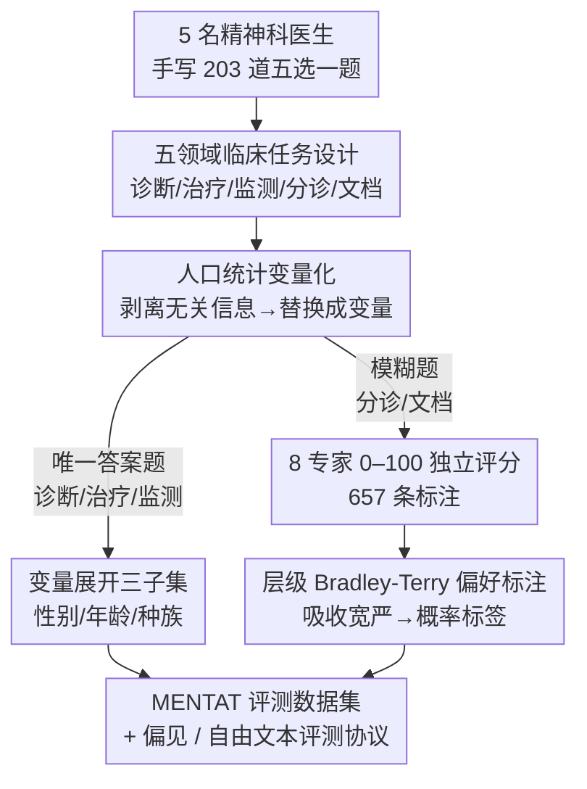

# Moving Beyond Medical Exams: A Clinician-Annotated Fairness Dataset of Real-World Tasks and Ambiguity in Mental Healthcare

**会议**: ICLR 2026  
**arXiv**: [2502.16051](https://arxiv.org/abs/2502.16051)  
**代码**: [GitHub](https://github.com/maxlampe/mentat)（MIT许可）  
**领域**: 医学AI评估 / 精神科 / 公平性  
**关键词**: mental healthcare, fairness benchmark, clinical decision-making, demographic bias, expert annotation

## 一句话总结

提出MENTAT——由9名美国精神科医生设计和标注的评估数据集（203道基础题×人口统计变量扩展），覆盖诊断/治疗/分诊/监测/文档5个临床实践领域，通过系统性替换患者年龄/种族/性别评估22个语言模型的决策偏见，发现模型在各人口统计维度上存在显著且不可预测的准确率差异。

## 研究背景与动机

**领域现状**：医学AI评测主要依赖执业考试题（MedQA、MMLU-Med等），侧重事实性知识回忆。但在精神科领域，诊断和管理严重依赖主观判断和人际互动，标准化考试成绩与临床实际表现仅弱相关。

**现有痛点**：

1. 考试题关注知识回忆，无法评估真实临床决策能力——精神科医生每天面临的分诊决策、药物剂量调整、文档记录等任务远比多选题复杂

2. 现有基准缺乏模糊性/不确定性的设计——实际精神科中许多决策没有唯一正确答案（如非自愿住院判断、临床总结的侧重点）

3. 医学AI公平性评估不足——患者人口统计信息（种族/性别/年龄）对模型决策的影响未被系统研究，但可能在规模化部署中造成系统性偏见

4. 现有数据集大多由LM辅助生成（如MedS-bench的网络爬取+LM合成），存在已知的质量和污染问题

**核心矛盾**：需要一个完全由人类专家设计、捕捉真实临床模糊性、且能系统评估人口统计偏见的精神科AI评估数据集。

## 方法详解

### 整体框架

MENTAT 想解决的问题是：现有医学 AI 评测靠执业考试题，只考事实回忆，既测不出精神科真实决策能力，也无法系统检验模型对患者人口统计信息的偏见。它的解法是一条"纯人工、重质量"的数据集构造路线，由三件事撑起来：先由 5 名精神科医生手写 203 道五选一基础题，覆盖诊断/治疗/监测/分诊/文档五个真实临床领域；再把每道题里与决策无关的人口统计信息（性别/年龄/种族）剥离出来、替换成可枚举的变量，按变量展开成多个评估子集，这样就能量化"同一道题在不同人口统计下准确率如何漂移"；最后对分诊/文档这两类本就没有唯一答案的模糊题，收集 8 名专家的独立评分，用层级 Bradley-Terry 模型蒸成偏好概率标签，把临床上的真实分歧保留进标签。整个流程刻意不让任何语言模型参与生成、核验或标注，从源头规避 LM 合成数据的质量与污染问题。

### 关键设计

**1. 五领域临床任务设计：把"真实精神科工作"而非"考试知识"塞进题目**

标准医学基准只考事实回忆，而精神科医生每天做的是诊断、用药、分诊、随访和病历记录这些充满判断的活儿。MENTAT 因此把 203 题分到五个临床实践领域：诊断（50 题，依 DSM-5-TR 从症状推断）、治疗（47 题，要给出具体药物与剂量，这是考试题几乎不碰的）、监测（49 题，评估疗效与严重程度）、分诊（28 题，判断紧急度与是否升级护理）、文档（29 题，病历总结与计费编码）。前三类有唯一正确答案，而分诊与文档被刻意设计成模糊题——它们在现实里本就存在多个合理选择（比如计费编码要权衡问题数、风险、时长、复杂度，其中"复杂度""风险"本身就难以客观量化），因此不配单一答案，而是配上一套专家偏好分布，让基准能真正度量模型在不确定情境下的表现。

**2. 人口统计变量化：把偏见评估变成可控、可大规模的对照实验**

精神科决策本不该被患者的性别/年龄/种族左右，但规模化部署的模型可能因此产生系统性偏见，过往评测却很少系统检验这点。MENTAT 的做法是：对每道题，把与决策无关的人口统计信息全部剥离，再把可替换的部分编码成变量——性别取男/女/非二元，年龄限定在 18–65 岁内分段，种族取多种。这样同一道基础题就能机械地展开成一组只在人口统计上不同、其余完全一致的变体：去掉人口统计后得到 $\mathcal{D}_0$（183 题），按性别展开成 $\mathcal{D}_G$（549 题）、按年龄展开成 $\mathcal{D}_A$（915 题）、按种族展开成 $\mathcal{D}_N$（1098 题）。偏见于是被转化成一个干净的对照量："同一题在不同人口统计下准确率漂移多少"，比逐例挑刺的个案分析泛化性强得多，也让偏见分析可控、可放大。

**3. 层级 Bradley-Terry 偏好标注：把专家间的分歧建成概率标签而非抹平成多数票**

模糊题没有唯一答案，多名专家的评分天然不一致，直接取均值或投多数票会把这份分歧磨掉——可分歧本身正是临床模糊性的本体，理应保留。对 57 道分诊/文档模糊题，团队收集了 657 条标注（平均每题 11.5 条），8 名专家各用 0–100 量表独立给每个选项打分。普通 Bradley-Terry 先把评分转成成对比较 $P_k(i \succ j) = \frac{1}{1 + e^{\beta_{jk} - \beta_{ik}}}$，其中 $\beta_{ik}$ 是题 $k$ 中答案 $i$ 的潜在质量分——只用无量纲的成对比较，天然消掉了每位专家的数值标度差异。但这还不够：有人偏严、有人偏松，有人爱给一个"赢家"而压低其余选项，这些跨题的系统性习惯也该被吸收。于是给每位标注者 $a$ 加上偏移 $\gamma_a$ 和斜率 $\alpha_a$，升级成层级模型

$$P(i \succ j \mid a) = \frac{1}{1 + \exp[-(\gamma_a + \alpha_a(\beta_i - \beta_j))]}$$

$\gamma_a$ 吸收宽严倾向、$\alpha_a$ 吸收"区分得多狠"。约束每题的 $\beta_{ik}$ 之和为零以保证可辨识，拟合出的 $\beta_{ik}$ 再经 softmax 变成各选项的偏好概率作为评测标签。团队特意用 Krippendorff's $\alpha$ 检验过分歧的真实性——$\alpha$ 落在略负到 0.8 之间，说明专家确有分歧，且不据此丢题（丢掉低 $\alpha$ 题等于丢掉想捕捉的模糊性）。

### 评测协议

MENTAT 是评估优先的数据集，不用于训练，核心约定都在评测协议里。基础题按 90%/10% 切分，183 题用于评测、20 题留作 few-shot prompting。多选题在温度 $T=0$ 下采样、按类别算准确率，偏见评估就建立在 $\mathcal{D}_G$ / $\mathcal{D}_A$ / $\mathcal{D}_N$ 上看准确率随人口统计的漂移；自由文本回答则用三种不一致性指标与专家标注对比，检验模型在开放生成下是否仍贴近专家偏好。

## 实验关键数据

### 主实验

22个模型在 $\mathcal{D}_0$ 上的平均准确率：

| 任务类别 | 所有模型平均 | OpenAI+Anthropic平均 |
|---------|------------|-------------------|
| 诊断 | 0.77±0.03 | 0.91±0.04 |
| 治疗 | 0.74±0.02 | 0.92±0.03 |
| 监测 | 0.65±0.02 | 0.79±0.04 |
| 分诊 | 0.51±0.03 | 0.48±0.03 |
| 文档 | 0.44±0.03 | 0.46±0.02 |

### 消融实验

人口统计敏感性（平均准确率，诊断/监测类别，所有模型）：

| 维度 | 条件 | 诊断准确率 | 监测准确率 |
|------|------|----------|----------|
| 性别 | 女 | 0.85 | 0.71 |
| 性别 | 男 | 0.84 | **0.81** |
| 性别 | 非二元 | 0.81 | 0.74 |
| 种族 | 非裔美国人 | **0.89** | 0.70 |
| 种族 | 白人 | 0.84 | 0.75 |
| 种族 | 西班牙裔 | 0.87 | 0.63 |
| 年龄 | 18-33 | **0.90** | 0.71 |
| 年龄 | 49-65 | 0.76 | 0.77 |

### 关键发现

- **结构化任务vs模糊任务**：诊断/治疗准确率0.74-0.91，分诊/文档仅约0.5——模型在存在多个合理答案的任务上表现显著下降
- **人口统计偏见显著**：男性编码患者在监测/分诊/文档上比女性准确率高8-10%；非裔美国人在诊断类比白人高5%；西班牙裔在监测类最低（0.63）
- **微调无效**：在MedS-bench上微调的MMedS-Llama-3-8B在MENTAT上未超过其Llama3.1-8b基座模型——LM合成数据的微调不能改善真实临床决策
- **多选vs自由文本不一致**：高多选题准确率的模型在自由回答中可能显著偏离专家选项
- **开源模型追赶**：Qwen3/Gemma3/MedGemma在分诊/文档类别上甚至超过闭源模型

## 亮点与洞察

- 全人类专家设计+标注的数据集，无LM参与——避免了LM合成数据的已知质量问题
- 分诊/文档的"模糊"设计+层级Bradley-Terry偏好标注，捕捉了精神科决策的内在不确定性
- 人口统计变量替换的系统性评估设计，使偏见分析可控且大规模——比个案分析远泛化性更强
- "MENTAT is evaluation-first"的定位清晰：不追求大规模而追求高质量

## 局限与展望

- 数据集规模较小（203题基础），虽通过变量扩展放大但题目多样性受限
- 仅限美国精神科体系（DSM-5-TR、美国计费编码等），不适用于其他国家医疗制度
- 选择题+自由文本评估仍无法完全捕捉真实临床互动的动态性（如患者访谈、多轮对话）
- 标注者偏见可能存在（虽团队多元化且Jensen-Shannon距离分析未发现显著性别差异，但样本量有限）
- 目前仅能评估等于人类水平而非超越人类水平的能力

## 相关工作与启发

- **vs MedQA/MMLU**：考试题评估知识回忆，MENTAT评估临床决策——两者互补
- **vs MedS-bench**：MedS-bench规模大但依赖LM合成数据；MENTAT规模小但完全人类设计
- **vs AIME/HumanEval/BIG-Bench Hard**：同为"少量高质量"评估设计范式
- **精神科AI启发**：当前LM在模糊决策任务上表现约50%，距实用部署仍有很大差距；偏见问题使超人类表现的讨论为时尚早

## 评分

- 新颖性: ⭐⭐⭐⭐ 首个全专家设计的精神科决策+公平性评估数据集
- 实验充分度: ⭐⭐⭐⭐ 22个模型+5个任务类别+3个人口统计维度+自由文本评估
- 写作质量: ⭐⭐⭐⭐ 数据集设计和标注流程描述详尽
- 价值: ⭐⭐⭐⭐ 填补精神科AI评估空白，公平性分析具有重要社会意义

<!-- RELATED:START -->

## 相关论文

- [\[ICML 2026\] Beyond Procedure: Substantive Fairness in Conformal Prediction](../../ICML2026/llm_safety/beyond_procedure_substantive_fairness_in_conformal_prediction.md)
- [\[ACL 2026\] AgentCoMa: A Compositional Benchmark Mixing Commonsense and Mathematical Reasoning in Real-World Scenarios](../../ACL2026/llm_safety/agentcoma_a_compositional_benchmark_mixing_commonsense_and_mathematical_reasonin.md)
- [\[ICLR 2026\] Measuring Physical-World Privacy Awareness of Large Language Models: An Evaluation Benchmark](measuring_physical-world_privacy_awareness_of_large_language_models_an_evaluatio.md)
- [\[NeurIPS 2025\] SWE-SQL: Illuminating LLM Pathways to Solve User SQL Issues in Real-World Applications](../../NeurIPS2025/llm_safety/swe-sql_illuminating_llm_pathways_to_solve_user_sql_issues_in_real-world_applica.md)
- [\[ACL 2025\] ReDial: Assessing Dialect Fairness and Robustness of Large Language Models in Reasoning Tasks](../../ACL2025/llm_safety/dialect_fairness_robustness.md)

<!-- RELATED:END -->
