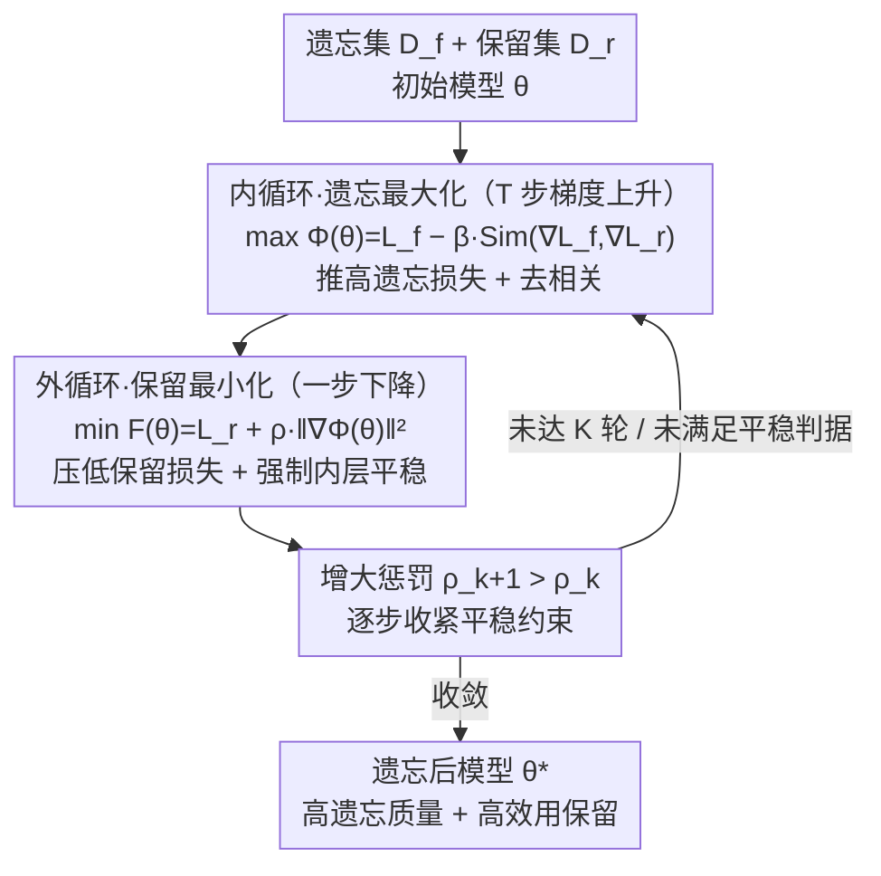

# OFMU: Optimization-Driven Framework for Machine Unlearning

**会议**: ICLR 2026  
**arXiv**: [2509.22483](https://arxiv.org/abs/2509.22483)  
**代码**: 无  
**领域**: AI安全 / 机器遗忘  
**关键词**: 机器遗忘, 双层优化, 梯度去相关, 遗忘-保留权衡, LLM隐私

## 一句话总结
将机器遗忘建模为双层优化问题：内层最大化遗忘损失+梯度去相关防止破坏保留集，外层最小化保留损失+惩罚项强制内层平稳点。在TOFU基准上同时实现高遗忘质量和高模型效用保留，平衡性超越现有GA/GradDiff/NPO/RMU方法。

## 研究背景与动机

**领域现状**：LLM需要按需遗忘特定知识（GDPR合规/版权/过时信息），但从头重训不切实际。现有方法分输入级（拒绝策略）、数据级（构造辅助数据）、模型级（修改参数）。

**现有痛点**：
   - 输入级方法脆弱，对抗prompt可绕过拒绝
   - 模型级方法用静态权重平衡遗忘/保留目标，无法动态适应
   - GradAscent/GradDiff在难遗忘样本上破坏性强——样本难度与效用损失强耦合

**核心矛盾**：遗忘梯度和保留梯度相关时，提升遗忘会破坏保留

**核心idea一句话**：双层优化 + 梯度去相关 = 遗忘时不伤及保留

## 方法详解

### 整体框架
OFMU 把"既要遗忘指定知识、又不能伤及其余能力"这对冲突显式拆成嵌套的双层优化：**内层**专做遗忘——一边用梯度上升推高遗忘损失，一边用一个相似度惩罚把遗忘梯度和保留梯度去相关，避免"抹掉知识"的更新顺手破坏保留集；**外层**专做保留——最小化保留损失，同时要求落脚的参数恰好是内层目标的平稳点。直接解这种双层结构代价极高（每步外层都要把内层解到收敛），OFMU 的关键一招是把"内层平稳"写成一个惩罚项塞进外层，将双层问题**重构成单层目标** $F(\theta)=\mathcal{L}_r(\theta)+\rho\|\nabla_\theta\Phi(\theta)\|^2$，再用一个**两循环算法**交替跑"内循环遗忘 + 外循环保留"来求解，并配上随迭代递增的惩罚系数和收敛性证明。

### 关键设计

**1. 双层建模 + 相似度去相关惩罚：把遗忘和保留各管一层、且不让二者梯度互相侵蚀**

现有模型级方法大多把遗忘和保留写成线性加权的单目标（用一个 $\lambda$ 标量化），权重一旦固定就无法随样本难度动态调整，难遗忘样本上的强遗忘信号会顺着两者梯度的耦合方向直接侵蚀保留集。OFMU 改为分层：内层只负责遗忘，目标为 $\Phi(\theta) = \mathcal{L}_f(\theta) - \beta \cdot \text{Sim}(\nabla\mathcal{L}_f, \nabla\mathcal{L}_r)$，第一项推高遗忘损失，第二项里 $\text{Sim}$ 是遗忘梯度与保留梯度的**余弦相似度**（只看方向、抹掉幅度差异），对其加惩罚就逼迫遗忘更新转向与保留梯度正交的方向，从几何上把"破坏保留"的分量挤掉；$\beta>0$ 控制去相关力度。外层则在内层之上只负责保留，最小化保留损失 $\mathcal{L}_r$，并约束最终参数 $\theta^*$ 是内层目标的平稳点（$\nabla_\theta\Phi(\theta^*)=0$）。遗忘与保留不再共用一组静态权重相互拉扯，而是各自在自己那层求最优。

**2. 惩罚式单层重构：把"内层要平稳"这个约束写成软惩罚，绕开嵌套求解**

双层问题若严格求解，每一步外层更新都要把内层最大化解到收敛，对大模型来说计算上不可行。OFMU 不直接解嵌套结构，而是把内层的平稳性条件 $\nabla_\theta\Phi(\theta)=0$ 当成**软约束**塞进外层目标，得到单层无约束目标

$$F(\theta) = \mathcal{L}_r(\theta) + \rho\,\|\nabla_\theta\Phi(\theta)\|^2$$

前一项压低保留损失，后一项 $\rho\|\nabla_\theta\Phi\|^2$ 惩罚内层梯度的残余范数：$\rho$ 越大，越逼着 $\theta$ 靠近内层目标的平稳点；当 $\rho\to\infty$ 时，$F$ 的任一极小点都满足原双层约束 $\nabla_\theta\Phi=0$。这一步把嵌套优化压成一个可直接优化的单层目标，却仍保住了"先遗忘、再保留"的层级结构——这正是论文摆在首位的核心创新，也是它能放到 LLM 规模上跑的前提。

**3. 两循环求解算法 + 收敛保证：交替跑遗忘与保留，并给出可证明的收敛速率**

单层目标 $F$ 的地形高度非凸，直接优化容易卡在坏点，OFMU 用嵌套的两循环来稳定求解。**内循环**固定外层参数、跑 $T$ 步梯度上升求内层近似解 $\theta'^{(t+1)} = \theta'^{(t)} + \eta_{\text{in}}\nabla\Phi(\theta'^{(t)})$，把遗忘和去相关都吃进去（相当于给外层一次"热启动"初始化）；**外循环**再据此做一步保留更新 $\theta^{(k+1)} = \theta^{(k)} - \eta_{\text{out}}(\nabla\mathcal{L}_r + 2\rho_k\nabla^2\Phi\cdot\nabla\Phi)$，其中 Hessian 项 $\nabla^2\Phi\cdot\nabla\Phi$ 通过 **Hessian-向量积**（自动微分实现）计算，避免显式构造 Hessian。内循环只需 $T=5\sim10$ 步、不必完全收敛，惩罚系数 $\rho_k$ 随外循环递增以逐步收紧平稳约束。作者给出收敛速率：凸场景下为 $O(1/K)+O(K/T^2)$，非凸场景下收敛到 $F$ 的平稳点（梯度上升使其偏向内层目标的局部极大、恰好契合遗忘目标），说明只要外循环步数 $K$ 与内循环步数 $T$ 配比合适，算法能稳定逼近双层最优，而不像单纯梯度上升那样发散。

## 实验关键数据

### 主实验：TOFU基准(LLaMA-2-7B)

| 方法 | FQ(forget01) | MU | FTR | 说明 |
|------|-------------|----|----|------|
| Retrain | 1.00 | 0.63 | 0.68 | 理想上界 |
| GradAscent | 1.88e-4 | 0.55 | 0.36 | 遗忘弱+保留差 |
| GradDiff | 3.02e-3 | 0.57 | 0.41 | 略好 |
| NPO | 0.40 | 0.58 | 0.65 | 中等 |
| RMU | 0.40 | 0.62 | 0.64 | 中等 |
| **OFMU** | **0.42** | **0.63** | **0.68** | **接近Retrain** |

### 消融实验

| 配置 | 关键发现 |
|------|--------|
| 去掉梯度去相关 | 遗忘效果提升但保留严重受损 |
| 去掉双层结构(用线性加权) | $\lambda$ 权衡不稳定，难细调 |
| Full OFMU | 最佳平衡 |

### 关键发现
- **OFMU接近Retrain上界**：MU=0.63等于Retrain，FTR=0.68等于Retrain
- **GA/GradDiff在forget05/10上崩溃**：FQ降到e-119~e-239，说明在大规模遗忘时完全失效
- **梯度去相关解耦难遗忘样本的耦合问题**

## 亮点与洞察
- **双层优化视角重新定义遗忘问题**：不是简单的多目标线性加权，而是将遗忘作为满足梯度平稳性约束的外层优化——这个建模更符合遗忘的本质
- **梯度去相关的精妙设计**：通过余弦相似度惩罚确保遗忘梯度和保留梯度正交，从几何层面消除冲突——与NSPO的零空间投影思路相似但应用于遗忘而非安全对齐

## 局限与展望
- Hessian-向量积计算开销较大
- 未测试>70B模型和多模态场景
- 未探索持续遗忘场景（多次遗忘请求）

## 相关工作与启发
- **vs GradAscent/GradDiff**：简单梯度上升在大规模遗忘时崩溃，OFMU通过双层结构保持稳定
- **vs NPO/RMU**：这些方法用启发式权重平衡，OFMU用严格的双层优化框架，理论保证更强
- **vs NSPO(同会议)**：两者都用梯度正交/去相关策略，但NSPO用于安全对齐，OFMU用于机器遗忘

## 评分
- 新颖性: ⭐⭐⭐⭐ 双层优化+梯度去相关的组合新颖
- 实验充分度: ⭐⭐⭐⭐ TOFU+CIFAR多场景，但缺少大规模LLM实验
- 写作质量: ⭐⭐⭐⭐ 理论推导严谨
- 价值: ⭐⭐⭐⭐ 为机器遗忘提供了理论严格的优化框架

<!-- RELATED:START -->

## 相关论文

- [\[ICLR 2026\] PURGE: Reinforcement Unlearning via Group Relative Policy Optimization](reinforcement_unlearning_via_group_relative_policy_optimization.md)
- [\[NeurIPS 2025\] A Reliable Cryptographic Framework for Empirical Machine Unlearning Evaluation](../../NeurIPS2025/llm_safety/a_reliable_cryptographic_framework_for_empirical_machine_unl.md)
- [\[ICLR 2026\] Model Collapse Is Not a Bug but a Feature in Machine Unlearning for LLMs](model_collapse_is_not_a_bug_but_a_feature_in_machine_unlearning_for_llms.md)
- [\[CVPR 2026\] SineProject: Machine Unlearning for Stable Vision–Language Alignment](../../CVPR2026/llm_safety/sineproject_machine_unlearning_for_stable_vision_language_alignment.md)
- [\[NeurIPS 2025\] SIMU: Selective Influence Machine Unlearning](../../NeurIPS2025/llm_safety/simu_selective_influence_machine_unlearning.md)

<!-- RELATED:END -->
