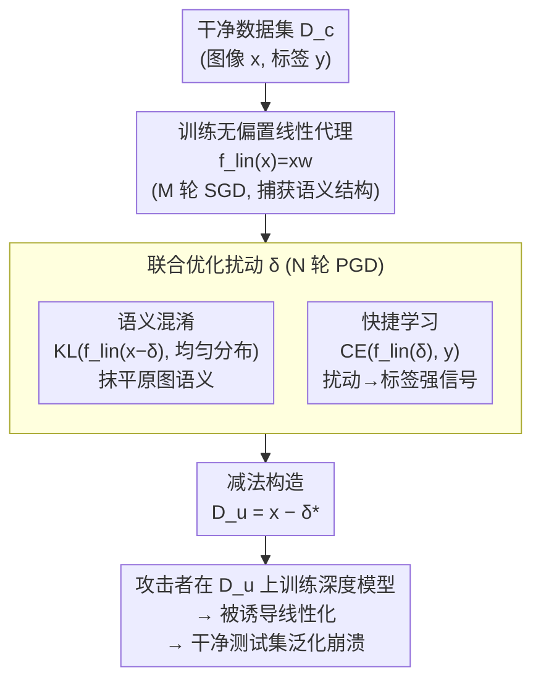

# Perturbation-Induced Linearization: Constructing Unlearnable Data with Solely Linear Classifiers

**会议**: ICLR 2026  
**arXiv**: [2601.19967](https://arxiv.org/abs/2601.19967)  
**代码**: [GitHub](https://github.com/jinlinll/pil)  
**领域**: LLM安全  
**关键词**: 不可学习样本, 数据保护, 线性化, 快捷学习, 对抗扰动

## 一句话总结

提出PIL方法，仅使用无偏置线性分类器作为代理模型生成不可学习扰动，通过诱导深度模型线性化来阻止其学习语义特征，比现有方法快100倍以上（CIFAR-10上不到1分钟GPU时间）。

## 研究背景与动机

**领域现状**：将网络数据用于训练深度学习模型的行为越来越普遍，但许多数据是在未经创作者同意的情况下被爬取的。**不可学习样本（Unlearnable Examples）**通过向数据添加不可察觉的扰动，使在扰动数据上训练的模型无法泛化到干净测试数据，从而保护数据不被未授权使用。

**现有痛点**：EM、REM 等主流方法通常用深度网络作为代理模型来生成扰动，计算代价极高——REM 在 CIFAR-10 上就要 15 小时以上的 GPU 时间。一个自然的问题是：是否可以用更简单的模型生成同样有效的扰动？

**核心 idea**：本文进一步追问不可学习样本的有效性机制到底是什么，发现答案是**线性化诱导**——扰动迫使深度模型表现得像线性模型，从而丧失学习复杂语义特征的能力。既然如此，干脆直接用线性模型作代理就够了。

## 方法详解

### 整体框架

PIL 要解决的问题是：现有不可学习样本方法都拿深度网络当代理来生成扰动，慢得离谱（REM 在 CIFAR-10 上要 15+ GPU 小时）。本文的洞察是，不可学习样本之所以有效，本质是把深度模型「诱导成线性模型」——既然终点是线性行为，那干脆从一开始就用线性模型当代理。

整条流程分三步：先在干净数据上训练一个**无偏置线性分类器** $f_{lin}(x)=xw$，让它捕获数据的语义结构；再以它为固定代理，对每个样本用 PGD 式更新优化一个扰动 $\delta$，这个扰动要同时满足两个目标——**语义混淆**（把原图的类别线索抹平）和**快捷学习**（把扰动本身变成强类别信号）；最后**从原图减去**优化好的扰动，构造不可学习数据集 $\mathcal{D}_u=\{(x_i-\delta_i^*,\,y_i)\}$。攻击者拿 $\mathcal{D}_u$ 训练任何深度模型，都会被这两个目标牵引去学「扰动→标签」的简单映射、忽略真实语义，于是在干净测试集上泛化崩溃。

### 关键设计

**1. 语义混淆：让原图本身不再携带类别线索**

数据保护的第一件事，是让深度模型从原图里再也学不到有用的类别信息。PIL 要求线性代理在「去掉扰动那一部分」$x-\delta$ 上输出接近均匀分布，即最小化 KL 散度 $L_{KL}\big(f_{lin}(x-\delta),\,\tfrac{1}{k}\mathbf{1}\big)$。这一步能成立的前提是线性代理**先在干净数据上预训练过**——只有代理本身懂了数据的语义结构，「把语义压平成噪声」才有意义；用随机初始化的代理则无从优化（论文消融证实预训练能显著增强保护）。一旦深度模型被诱导得像线性模型，$x-\delta$ 这部分就不再可分，原始语义被抹平。

**2. 快捷学习：把扰动本身做成一条更省力的捷径**

光抹掉语义还不够，否则模型可能去抠别的特征。还要主动塞给它一条「捷径」：PIL 要求线性代理能**直接从扰动 $\delta$ 预测标签**，即最小化交叉熵 $L_{CE}(f_{lin}(\delta),\,y)$。深度模型天生爱偷懒（shortcut learning），扰动里一旦藏着和标签强相关的简单线性特征，它就会优先学这条捷径而非真实语义——于是在扰动训练集上看似学得很好，到干净测试集就彻底失效。

**3. 联合优化与减法构造：一个扰动两目标，并让线性化时自然分解**

上面两个目标在实现上并不拆成两个扰动分开优化，而是合并到同一个 $\delta$ 的单一损失：

$$L_{total} = \lambda\, L_{CE}\big(f_{lin}(\delta),\,y\big) + (1-\lambda)\, L_{KL}\big(f_{lin}(x-\delta),\,\tfrac{1}{k}\mathbf{1}\big)$$

其中 $\lambda=0.9$ 明显偏向快捷学习一侧——先让扰动成为足够强的类别信号，再附带把残余语义压平（论文报告 $\lambda\in[0.3,0.9]$ 都好用）。优化用 PGD 式带符号更新、步长 $\alpha=8/2550$、按 $\|\delta\|_\infty\le 8/255$ 裁剪。关键的一笔在最后**用减法** $x-\delta^*$ 构造数据集：当攻击者模型被诱导得近似线性时，其输出可分解为 $f_{lin}(x-\delta_1^*)+f_{lin}(-\delta_2^*)$，前项趋于均匀分布（无信息）、后项与标签强相关，从而把模型牢牢锁在「学 $\delta$、忘 $x$」的状态上。

### 损失函数 / 训练策略

- 先在干净数据上用 SGD 训练 $M$ 轮无偏置线性模型，捕获数据语义结构（预训练是语义混淆有效的前提）
- 再用 $N$ 轮 PGD 式更新逐样本优化扰动，按 $\|\delta\|_\infty\le 8/255$ 裁剪
- 扰动从均匀分布 $\text{Uniform}(-\epsilon,\epsilon)$ 初始化

## 实验关键数据

### 主实验：不同数据集和模型上的测试精度（越低越好）

| 模型 | SVHN-干净 | SVHN-PIL | CIFAR10-干净 | CIFAR10-PIL | ImageNet100-干净 | ImageNet100-PIL |
|------|-----------|----------|-------------|-------------|-----------------|----------------|
| ResNet-18 | 95.64 | **15.94** | 92.11 | **12.77** | 66.00 | **2.26** |
| VGG-19 | 95.22 | **9.12** | 90.61 | **15.22** | 36.04 | **1.36** |
| MobileNet-V2 | 95.95 | **28.48** | 91.94 | **14.05** | 71.26 | **2.20** |

### 消融实验：数据增强下的鲁棒性（CIFAR-10测试精度↓）

| 方法 | 无增强 | Basic | Rotation | Cutout | CutMix |
|------|--------|-------|----------|--------|--------|
| PIL | **14.70** | **12.87** | **18.15** | 14.62 | **11.05** |
| SEP | 28.43 | 8.94 | 19.68 | 9.74 | 10.48 |
| TAP | 35.90 | 19.11 | 21.18 | 15.09 | 20.30 |

### 关键发现

- PIL在CIFAR-10上仅需不到1分钟GPU时间，而REM需要15+小时，加速超过100倍
- 线性模型生成的扰动能有效降低多种深度架构的泛化能力，证明了架构无关性
- 所有不可学习方法（包括非线性代理的EM、REM等）都会导致训练模型线性度增加，PIL只是把这个机制推到了极致
- 在高分辨率ImageNet-100上测试精度降至1-3%，效果甚至更好
- PIL在JPEG压缩防御下仍保持较强鲁棒性

## 亮点与洞察

- **核心洞察极其优美**：不可学习样本的本质机制是诱导线性化——既然如此，直接用线性模型做代理就够了
- 将复杂的不可学习样本问题简化为线性模型+PGD优化，大幅降低了实现和计算门槛
- 语义混淆+快捷学习的双目标分解直观且有效
- 还揭示了一个部分扰动的基本限制：不可学习样本在仅部分数据被扰动时无法显著降低测试精度

## 局限与展望

- 对抗性训练（adversarial training）作为防御仍可能削弱PIL的效果
- 部分扰动场景下（只有一部分数据被保护），保护效果急剧下降
- 未测试文本/音频等非图像模态
- 线性化机制的理论解释仍是经验性的

## 相关工作与启发

与EM、REM、TAP、NTGA等不可学习样本方法直接对比。与shortcut learning文献紧密关联——说明深度模型容易被简单特征误导。启发：有时候最简单的代理模型反而最有效。

## 评分
- 新颖性: ⭐⭐⭐⭐⭐ "用线性模型就够了"的发现出人意料且优美
- 实验充分度: ⭐⭐⭐⭐⭐ 多数据集、多架构、多防御手段全面对比
- 写作质量: ⭐⭐⭐⭐ 动机清晰，方法简洁
- 价值: ⭐⭐⭐⭐⭐ 既有实用价值（100x加速），也有理论洞察（线性化机制）

<!-- RELATED:START -->

## 相关论文

- [\[ICLR 2026\] When Priors Backfire: On the Vulnerability of Unlearnable Examples to Pretraining](when_priors_backfire_on_the_vulnerability_of_unlearnable_examples_to_pretraining.md)
- [\[ICCV 2025\] Temporal Unlearnable Examples: Preventing Personal Video Data from Unauthorized Exploitation](../../ICCV2025/llm_safety/temporal_unlearnable_examples_preventing_personal_video_data_from_unauthorized_e.md)
- [\[ICML 2026\] Dual-branch Robust Unlearnable Examples](../../ICML2026/llm_safety/dual-branch_robust_unlearnable_examples.md)
- [\[ICLR 2026\] Revisiting the Past: Data Unlearning with Model State History](revisiting_the_past_data_unlearning_with_model_state_history.md)
- [\[AAAI 2026\] From Single to Societal: Analyzing Persona-Induced Bias in Multi-Agent Interactions](../../AAAI2026/llm_safety/from_single_to_societal_analyzing_persona-induced_bias_in_multi-agent_interactio.md)

<!-- RELATED:END -->
