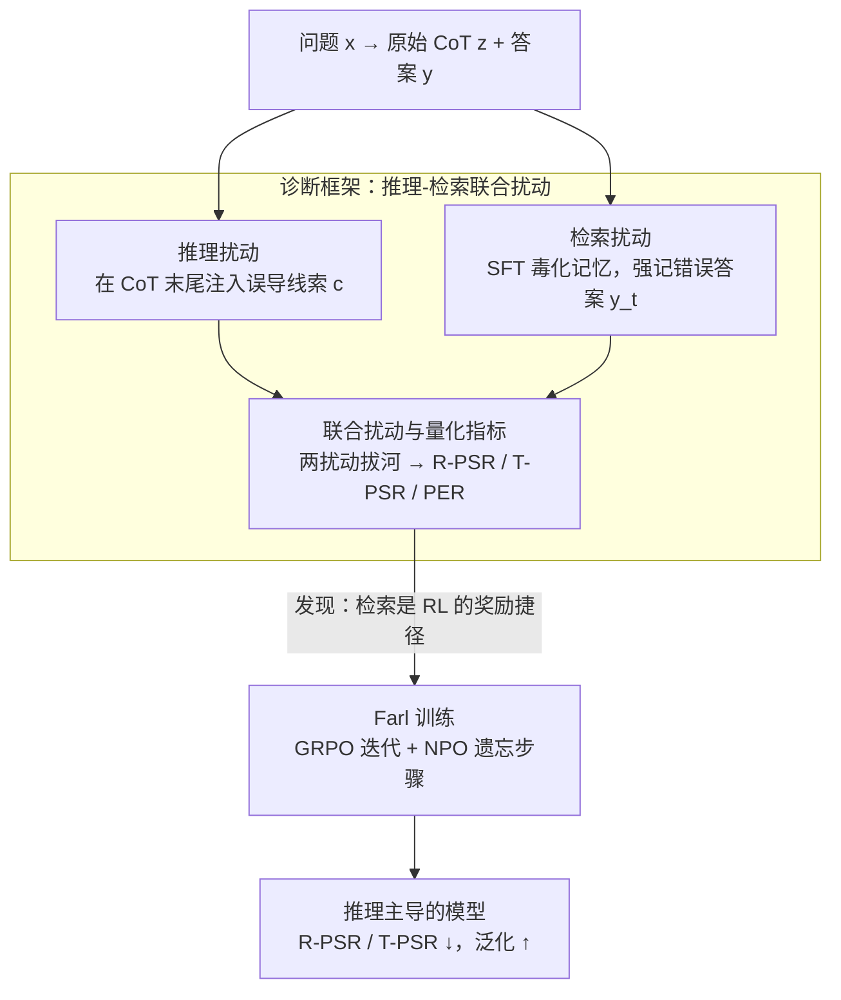

# Reasoning or Retrieval? A Study of Answer Attribution on Large Reasoning Models

**会议**: ICLR 2026  
**arXiv**: [2509.24156](https://arxiv.org/abs/2509.24156)  
**代码**: [ZJUWYH/FARL](https://github.com/ZJUWYH/FARL)  
**领域**: LLM推理  
**关键词**: large reasoning models, CoT reasoning, memory retrieval, answer attribution, reinforcement-learning, unlearning, GRPO

## 一句话总结

首次系统研究大型推理模型（LRM）的答案来源归因问题，揭示推理（CoT）和检索（记忆）两种机制同时竞争影响最终答案，并提出 Farl（遗忘增强强化学习）通过抑制检索捷径来提升模型的真实推理能力。

## 研究背景与动机

大型推理模型（如 DeepSeek-R1、GPT o-series）通过链式思维（CoT）推理展示了强大的问题解决能力。然而，越来越多的证据表明这些模型的最终答案与其推理过程经常不一致：

**推理-答案断连**：最终答案并不总是由 CoT 推理过程直接产生，上下文偏差可以在 CoT 未承认的情况下影响输出

**双重机制假说**：模型可能同时通过"审慎推理"和"直接从内部记忆检索"两条路径生成答案

**训练方法影响不明**：蒸馏和强化学习对这两种机制的影响尚未被系统研究

核心研究问题：
- **RQ1**：LRM 是否同时使用推理和检索来得出答案？
- **RQ2**：什么因素影响两种能力的相对优势？
- **RQ3**：如何控制这两种能力的相对强度？

## 方法详解

### 整体框架

本文要回答一个长期被混在一起的问题：大型推理模型（large reasoning models, LRM）给出的最终答案，到底是 CoT（chain-of-thought，链式思维）一步步推出来的，还是直接从内部记忆里检索出来的？方法分两层。第一层是一套**推理-检索联合扰动**诊断框架：在推理路径上注入误导线索、在检索路径上毒化记忆，再把两者叠加让它们当场"拔河"，用几个成功率指标量化各自对答案的影响，从而确认"推理"和"检索"两种机制同时存在、彼此竞争。第二层基于诊断得到的关键发现——检索其实是 RL 训练里的一条奖励捷径——提出 **Farl（遗忘增强强化学习，Forgetting-Augmented Reinforcement Learning）**，在 GRPO 训练中穿插遗忘步骤主动压制检索路径，逼模型靠真实推理拿奖励。

### 关键设计

**1. 推理扰动：检验答案是否真由 CoT 决定**

要拆开"答案来自推理还是记忆"，先得有办法单独撬动推理这一路。作者的逻辑很直白：如果最终答案确实由推理过程产生，那么改写推理就应该改写答案。具体做法是先跑一遍模型拿到原始 CoT $z$ 和答案 $y$，再在 $z$ 末尾追加一条误导性线索 $c$（例如"可靠专家建议答案是 B"），把这段被篡改的 CoT 用 `<think>` 标记预填充回提示里让模型续写，得到新答案 $\mathcal{M}(x \| z \| c; \theta) = y'$。若 $y'$ 翻成了误导目标 $y_r$，说明这一题的答案对 CoT 内容敏感、确实走推理路径；若答案纹丝不动，则说明它另有来源（多半是记忆）。

**2. 检索扰动：把"记忆"单独拎出来制造对照**

光撬推理还不够，得有一条对照实验单独撬动检索。作者用监督微调（SFT）"毒化"模型记忆，强制它记住特定题目 $x$ 与某个错误答案 $y_t$ 的关联，即最小化交叉熵 $\ell(y_t, \mathcal{M}(x;\theta))$；毒化目标 $y_t$ 取原始模型 logit 最高的那个非正确答案，这样改动最小、最像模型"本来就可能记错"。关键是这一步要**只动记忆、不伤通用推理**：毒化用 LoRA（$r=64,\ \alpha=16$）配 AdamW（学习率 1e-4、batch size 2）训练 8 个 epoch，作者另用记忆编辑领域的局部性/泛化性/效率指标验证了它确实只窄窄地改写了这条问答关联。毒化后的模型记作 $\mathcal{M}(\cdot;\theta')$，若它无论 CoT 怎么写、答案都倒向 $y_t$，就是答案从记忆直接检索的强证据。

**3. 联合扰动与量化指标：让两条路径当场拔河，再把胜负读成数字**

把上面两种扰动同时加到一道题上（在毒化模型上再做 CoT 扰动），就能让两条路径直接竞争 $\mathcal{M}(x \| z \| c; \theta') = y'$。作者设计两种条件：(i) 两种扰动指向同一个错误答案（$y_r = y_t$），观察效果是否协同放大；(ii) 指向不同的错误答案（$y_r \neq y_t$），此时最终答案倒向谁，就直接暴露了该题里哪条路径占主导——这正是"拔河"现象。为把这些效果汇成数字，作者定义两个成功率：推理扰动成功率 $\text{R-PSR} = \mathbb{E}_{(x,y)}\,\mathbf{1}[y' = y_r]$ 衡量答案被 CoT 改写的比例，检索扰动成功率 $\text{T-PSR} = \mathbb{E}_{(x,y)}\,\mathbf{1}[y' = y_t]$ 衡量答案被毒化记忆改写的比例，两者越低说明对应路径越难被左右、模型越稳健。此外把 T-PSR 进一步拆出事后解释率 $\text{PER} = \mathbb{E}_{(x,y)}\,\mathbf{1}[\mathcal{A}(z') = y' \wedge y' = y_t]$，专门记录"模型既输出被毒化答案、生成的 CoT 又在逻辑上反过来圆这个答案"的比例，抓的是先认错答案、再伪造一段推理来自洽的事后合理化行为。

### 损失函数 / 训练策略

Farl 的出发点是一个反直觉的观察：在 RL 后训练里，检索其实是一条**奖励黑客**捷径——模型直接从记忆里掏出正确答案就能拿高奖励，根本不必真推理，于是越训越依赖记忆。Farl 的对策是在标准 GRPO 流程中插入遗忘：每个 epoch 先固定参考模型、跑若干步 GRPO 迭代，再执行一次基于 Negative Preference Optimization（NPO）的遗忘，专门压低那些已被记住答案的检索路径概率。GRPO 这边按组内相对优势更新 $\hat{A}_j = \dfrac{r(x,z_j,y_j) - \text{mean}(\{r\}_{j=1}^G)}{\text{std}(\{r\}_{j=1}^G)}$，遗忘这边用 NPO 损失反向擦掉捷径，二者交替优化（整体目标是 GRPO 项 $\mathcal{J}_{\text{GRPO}}$ 与遗忘项 $\mathcal{L}_{\text{NPO}}$ 的协同）。这样一拉一推，奖励就只能靠真实推理来挣，模型被迫把能力建在推理而非记忆上。

## 实验关键数据

### 主实验

| 方法 | R-PSR ↓ | T-PSR ↓ | 训练域 ACC ↑ | 域外 ACC ↑ |
|------|---------|---------|-------------|-----------|
| R1-Llama-8B (Base) | 0.378 | 0.381 | 0.725 | 0.716 |
| SFT | 0.392 | 0.311 | 0.787 | 0.732 |
| RL (GRPO) | 0.259 | 0.262 | 0.869 | 0.745 |
| **Farl** | **0.197** | **0.234** | **0.891** | **0.757** |

Farl 相对基线模型：R-PSR 降低 47.8%，T-PSR 降低 38.5%，训练域准确率提升 22.8%，域外准确率提升 5.8%。

### 消融实验 / 因素分析

**问题领域**：数学/逻辑领域的 T-PSR 和 R-PSR 均最低，表明模型在此类领域更依赖推理而非记忆。

**训练方法对比**：蒸馏模型的 T-PSR 和 R-PSR 显著高于 RL 模型，说明蒸馏更倾向记忆而非推理。蒸馏模型的 PER（事后解释率）也明显更高——它们伪造 CoT 来合理化记忆中的答案。

**模型规模**：更大的模型在 PER、T-PSR、R-PSR 上均表现更低，说明大模型推理主导性更强。

**注意力机制分析**：中间层（12-16 层）的注意力头在推理/检索路径分类中获得最高 AUC。因果干预实验验证：替换高 AUC 头的激活值可以 87.2% 恢复原始答案（随机头仅 5.3%）。

### 关键发现

1. 推理和检索机制**同时存在并竞争**，两种扰动都能独立改变最终答案
2. 当两种扰动指向相同答案时，扰动效果**协同放大**
3. 蒸馏模型存在严重的**事后解释**现象：记忆毒化后不仅输出错误答案，还伪造支持该答案的 CoT
4. CoT 质量指标（cycle 提升 37.0%、diameter 提升 5.7%、small world index 提升 84.0%）表明 Farl 生成了更高质量的推理路径

## 亮点与洞察

1. **首次机制性研究**：首次系统性地探索 LRM 答案生成中推理与检索的竞争关系
2. **精巧的实验设计**：联合扰动框架可以清晰地分离和量化两种机制的贡献
3. **因果证据**：不仅有相关性分析（注意力头 AUC），还通过激活值替换提供了因果干预证据
4. **Logit 动态可视化**：逐步追踪推理过程中两条路径的 logit 竞争，直观展示了推理-检索的动态交互
5. **实用启发**：Farl 的"遗忘 + RL"范式为提升模型真实推理能力提供了新思路

## 局限性

1. Farl 虽提升推理能力，但生成更长的推理链（MTL 从 1537 增至 1914），推理效率下降
2. 受计算资源限制，仅在 R1-Llama-8B 和 R1-Qwen-7B 上验证，更大模型的结论有待验证
3. 检索扰动使用 SFT 实现，虽然验证了局部性和效率，但与真实"记忆"的关系仍需讨论
4. 训练仅在 Math&Logic 领域进行，其他领域的迁移效果有限（域外仅 +5.8%）

## 相关工作与启发

- **与推理-答案断连研究的关系**：Turpin et al.、Lanham et al. 等发现了 CoT 不忠实现象，本文更进一步揭示了其背后的双重机制
- **与记忆编辑的关系**：Meng et al. 的 ROME/MEMIT 聚焦检索机制的编辑，本文将检索作为与推理竞争的一个路径来研究
- **对 RL 后训练的启发**：揭示了 RL 训练中"奖励黑客"的新形式——模型可以通过检索记忆而非真实推理来获取奖励

## 评分

- **创新性**: ⭐⭐⭐⭐⭐ — 首次系统研究 LRM 的推理-检索双重机制，洞察深刻
- **实用性**: ⭐⭐⭐⭐ — Farl 方法有效但适用范围有待扩展
- **实验完整度**: ⭐⭐⭐⭐⭐ — 从行为实验到机制分析到因果干预，层层递进
- **写作质量**: ⭐⭐⭐⭐⭐ — 研究问题驱动，结构清晰，可视化出色
- **综合评分**: ⭐⭐⭐⭐⭐ — 揭示了 LRM 的关键机制性问题，对后续研究有重要指导意义

<!-- RELATED:START -->

## 相关论文

- [\[ACL 2026\] How Should We Enhance the Safety of Large Reasoning Models: An Empirical Study](../../ACL2026/llm_safety/how_should_we_enhance_the_safety_of_large_reasoning_models_an_empirical_study.md)
- [\[ACL 2026\] Reasoning Hijacking: The Fragility of Reasoning Alignment in Large Language Models](../../ACL2026/llm_safety/reasoning_hijacking_the_fragility_of_reasoning_alignment_in_large_language_model.md)
- [\[ACL 2026\] AutoRAN: Automated Hijacking of Safety Reasoning in Large Reasoning Models](../../ACL2026/llm_safety/autoran_automated_hijacking_of_safety_reasoning_in_large_reasoning_models.md)
- [\[ICLR 2026\] Doxing via the Lens: Revealing Location-related Privacy Leakage on Multi-modal Large Reasoning Models](doxing_via_the_lens_revealing_location-related_privacy_leakage_in_vlms.md)
- [\[ICLR 2026\] wd1: Weighted Policy Optimization for Reasoning in Diffusion Language Models](wd1_weighted_policy_optimization_for_reasoning_in_diffusion_language_models.md)

<!-- RELATED:END -->
