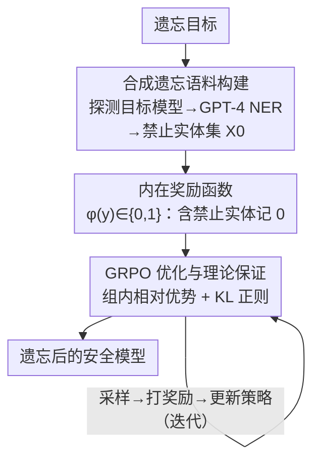

# PURGE: Reinforcement Unlearning via Group Relative Policy Optimization

**会议**: ICLR 2026  
**arXiv**: [2601.20568](https://arxiv.org/abs/2601.20568)  
**代码**: 无  
**领域**: LLM对齐  
**关键词**: 机器遗忘, GRPO, 可验证奖励, LLM合规, 隐私保护

## 一句话总结
PURGE 将 LLM 遗忘（unlearning）重新定义为可验证的 RL 任务，使用 GRPO 框架 + 内在奖励信号（惩罚提及禁止概念）来实现安全一致的知识删除，token 消耗比 SOTA 低 46 倍，同时提升流畅度 +5.48% 和对抗鲁棒性 +12.02%。

## 研究背景与动机

**领域现状**：GDPR "被遗忘权"和 EU AI Act 要求 AI 系统能按需删除特定数据。LLM 在预训练中无意记忆了敏感/版权数据，传统遗忘方法包括梯度上升、DPO/NPO 偏好优化、拒绝调优等。

**现有痛点**：
   - 梯度上升：过于激进会导致模型崩溃（流畅度/效用丧失）
   - 偏好优化（DPO/NPO）：依赖外部奖励模型，增加复杂度
   - 拒绝调优：创建快捷方式，潜在痕迹可能在特定条件下重新出现
   - 上下文方法：有数据泄露风险且消耗有限上下文窗口

**核心矛盾**：有效遗忘 vs 效用保持 vs 对抗鲁棒性三者难以兼得

**切入角度**：DeepSeek 的 RLVR（可验证奖励的 RL）在推理任务上成功→遗忘也是可验证任务（能客观测量数据是否被删除）→用 GRPO 来优化遗忘

**核心 idea**：LLM 遗忘天然是可验证任务——用 GRPO 的内在奖励函数惩罚提及禁止实体，像训练推理模型一样训练遗忘模型。

## 方法详解

### 整体框架
PURGE 把"删掉某个知识"重写成一个可验证的 RL 优化问题。它先围绕一个遗忘目标去探测目标模型当前"知道什么"，把这些知识落成一个该目标专属的禁止实体集；再定义一个只看输出里有没有出现这些实体的二元奖励；最后用 GRPO 反复采样、按奖励调整策略，把禁止实体的生成概率一步步压下去。整条链路不训练、也不调用任何外部奖励模型，奖励完全由规则给出，因此"是否遗忘成功"在训练中就是客观可测的，这也是它能套用为遗忘任务、并给出收敛与效用理论界的前提。

### 关键设计

**1. 合成遗忘语料构建：先搞清楚模型现在到底"知道什么"**

遗忘的前提是知道要删什么，但目标模型记住的内容并不写在标签里。PURGE 复用 RWKU 基准的查询集去探测目标模型，让它围绕每个遗忘目标自由作答，从而把"模型当前掌握的相关知识"以生成文本的形式暴露出来。随后用 GPT-4 做条件化 NER（命名实体识别），从这些回答中抽取出与该目标绑定的实体集合 $\mathcal{X}_0$，作为后续奖励判定的依据。这样禁止实体不是人工硬编码，而是从模型自身行为里反推出来的，覆盖的正是模型真实记住、需要被删除的那部分内容。

**2. 内在奖励函数：把"有没有泄露"变成一个规则可判的 0/1 信号**

PURGE 不训练偏好模型、也不引入人工标注，而是定义一个纯规则奖励 $\varphi(y)\in\{0,1\}$：输出 $y$ 中不出现任何禁止实体则奖励 1，否则奖励 0。这正是把遗忘当作"可验证任务"的关键——是否提及禁止概念可以被客观检测，无需任何主观打分。相比 DPO/NPO 依赖外部奖励模型，这个设计把奖励侧的工程开销几乎降到零，也让遗忘目标的定义粒度可以随实体集 $\mathcal{X}_0$ 任意调整。

**3. GRPO 优化与理论保证：用组内相对优势压低禁止 token 概率，并给出收敛与效用上界**

有了二元奖励后，PURGE 套用标准 GRPO（Group Relative Policy Optimization）：对同一查询采样一组回答，用组内相对奖励估计优势并更新策略，同时叠加 KL 正则项把策略约束在原模型附近以保留通用能力。这种持续的"奖励不泄露、惩罚泄露"会让禁止实体的生成概率单调下降。论文进一步把这个过程的两端都做了定量刻画：一端是收敛速度，禁止 token 在第 $t$ 步出现的概率几何衰减，

$$P(\text{forbidden token at step } t) \leq (1-\epsilon)^t$$

即遗忘以指数速度收敛，而不是靠激进的梯度上升一次性抹除；另一端是效用代价，借助 GRPO 中的 KL 约束给出效用保持的高概率界，优化后的策略与原策略在 KL 散度上受控，通用能力的退化被限制在可控范围。两条界配合在一起，正好解释了 PURGE 为何能一边以指数速度删掉目标知识、一边几乎不掉效用。

## 实验关键数据

### 主实验（RWKU 基准）

| 方法 | 遗忘有效率↑ | 效用保持↑ | 流畅度↑ | 对抗鲁棒性↑ | Token/目标↓ |
|------|-----------|---------|--------|-----------|-----------|
| Gradient Ascent | 高 | 60% | -15% | 低 | 高 |
| DPO | 中 | 85% | +2% | 中 | 中 |
| Rejection Tuning | 中 | 90% | 0% | 低 | 低 |
| **PURGE** | **11%** | **98%** | **+5.48%** | **+12.02%** | **×46更少** |

### 关键发现
- **Token 效率极高**：每个遗忘目标所需 token 数比 SOTA 少 46 倍
- **效用几乎无损**：98% 原始效用保持——远超梯度上升方法
- **流畅度反而提升**：+5.48%（可能因为 GRPO 的 KL 正则化起到了一定的对齐作用）
- **对抗鲁棒性显著提升**：+12.02%——遗忘后的模型不易被对抗攻击重新激活记忆
- **理论保证**：禁止 token 概率几何衰减 + KL 散度效用保持界

## 亮点与洞察
- **将遗忘重新框架为可验证 RL 任务**是核心创新——GRPO 原本用于推理，但"是否提及禁止概念"同样是可客观验证的，这个洞察打通了 RL 与隐私合规。
- **无需外部奖励模型**大幅降低了工程复杂度——内在规则奖励比训练一个偏好模型简单得多，且支持任意粒度的遗忘目标定义。
- **理论保证的实用性**：几何衰减界给出了遗忘收敛速度的定量预测，KL 界给出了效用损失的上界控制。

## 局限与展望
- 11% 的遗忘有效率绝对值偏低——虽然保持了高效用，但遗忘不够彻底
- 仅在 RWKU 单一基准上验证——需更多遗忘场景测试
- 合成语料依赖 GPT-4 进行 NER——引入了对外部大模型的依赖
- 二元奖励可能过于粗粒度——未区分部分泄露和完全泄露
- 未测试在 >7B 模型上的效果

## 相关工作与启发
- **vs Gradient Ascent**: GA 高遗忘率但崩溃风险大；PURGE 通过 GRPO+KL 约束避免崩溃
- **vs DPO/NPO**: 偏好优化需要外部奖励模型；PURGE 用内在可验证奖励，零额外开销
- **vs Rejection Tuning**: RT 创建快捷方式，痕迹可能重现；PURGE 直接优化概率分布图

## 评分
- 新颖性: ⭐⭐⭐⭐ 将 GRPO 用于遗忘是有趣的新方向，但技术贡献较直接
- 实验充分度: ⭐⭐⭐ 单一基准（RWKU），需要更多验证
- 写作质量: ⭐⭐⭐⭐ 理论部分严谨，方法描述清晰
- 价值: ⭐⭐⭐⭐ 遗忘即验证任务的范式有启发性，但 11% 遗忘率需提升

<!-- RELATED:START -->

## 相关论文

- [\[ICLR 2026\] wd1: Weighted Policy Optimization for Reasoning in Diffusion Language Models](wd1_weighted_policy_optimization_for_reasoning_in_diffusion_language_models.md)
- [\[ICLR 2026\] OFMU: Optimization-Driven Framework for Machine Unlearning](ofmu_optimization-driven_framework_for_machine_unlearning.md)
- [\[ICLR 2026\] Tree-based Dialogue Reinforced Policy Optimization for Red-Teaming Attacks (DialTree)](tree-based_dialogue_reinforced_policy_optimization_for_red-teaming_attacks.md)
- [\[NeurIPS 2025\] On the Sample Complexity of Differentially Private Policy Optimization](../../NeurIPS2025/llm_safety/on_the_sample_complexity_of_differentially_private_policy_optimization.md)
- [\[ICML 2026\] PRPO: Paragraph-level Policy Optimization for Vision-Language Deepfake Detection](../../ICML2026/llm_safety/prpo_paragraph-level_policy_optimization_for_vision-language_deepfake_detection.md)

<!-- RELATED:END -->
