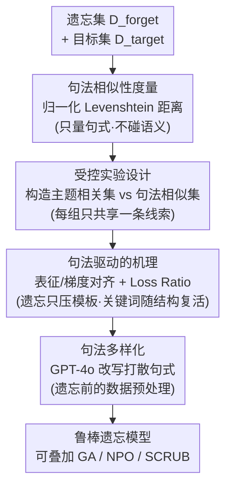

# Rethinking Benign Relearning: Syntax as the Hidden Driver of Unlearning Failures

**会议**: ICLR 2026  
**arXiv**: [2602.03379](https://arxiv.org/abs/2602.03379)  
**代码**: 未公开  
**领域**: LLM评测  
**关键词**: machine_unlearning, LLM_safety, syntactic_similarity, benign_relearning  

## 一句话总结

本文揭示了 LLM 机器遗忘中"良性重学习"（benign relearning）的真正驱动因素不是主题相关性而是**句法相似性**，并提出**句法多样化（syntactic diversification）**策略来提升遗忘的鲁棒性。

## 研究背景与动机

机器遗忘旨在从已训练的模型中移除特定内容，同时保持整体性能。然而，"良性重学习"现象表明，即使在看似无关的良性数据上微调，已遗忘的信息也会重新浮现。

**现有认知的局限**：
- BLUR 基准将良性重学习归因于**主题相关性**（topical relevance），即重学习数据与遗忘数据在实体/主题上的重叠
- 例如：遗忘哈利·波特的段落后，在关于同一角色的 GPT 生成的描述上微调就能恢复已遗忘内容
- 这种直觉性的解释被广泛接受，但作者发现它并不完整

**关键发现**：
- BLUR 实验存在两个混淆因素：(1) 不同相关度数据集的大小不一致，导致梯度更新次数不同；(2) 恢复程度并非单调递增，仅在 epoch 末尾评估可能错过峰值
- 在公平评估下（标准化步数预算 + 报告最大恢复值），主题相关性的优势大幅消失

## 方法详解

### 整体框架

本文是一篇"先诊断、后给药"的工作：它先在公平评估下推翻"主题相关性（topical relevance）驱动良性重学习"的旧结论，再用 TOFU 上的受控实验证明真正的驱动因素是**句法相似性（syntactic similarity）**，最后顺势提出**句法多样化（syntactic diversification）**预处理来打破遗忘留下的句法刚性。四步环环相扣：先造一把只量句式、不碰语义的"尺子"（句法相似度度量），用它把"句式像"和"主题像"两条线索拆开做受控实验，再从表征/梯度层面解释句式为何能把知识勾回来，最终把这条攻击通道堵死。整套防御只是数据侧的轻量预处理，能套在梯度上升（Gradient Ascent, GA）、负偏好优化（Negative Preference Optimization, NPO）、SCRUB 等任意遗忘方法之前。

### 关键设计

**1. 句法相似性度量：用纯表面结构的距离把"句式像不像"量化出来**

要论证句法而非主题在起作用，首先得有一把不掺语义的"尺子"。作者直接用归一化 Levenshtein 距离衡量两段文本的句式对齐程度：

$$\text{Sim}(s_1, s_2) = 1 - \frac{d_{\text{Lev}}(s_1, s_2)}{\max(|s_1|, |s_2|)}$$

其中 $d_{\text{Lev}}$ 是把 $s_1$ 编辑成 $s_2$ 所需的最少单字符增删改次数，相似度落在 $[0,1]$。这个度量只看表面字符的对齐、完全不碰语义，因此能把"句式相同"和"主题相同"两条线索干净地分开——这正是后面所有结论能站住脚的前提。

**2. 受控实验设计：构造只共享句式、不共享主题的重学集**

旧实验的混淆在于"主题相关"的数据往往也"句式相近"，两条线索纠缠在一起。作者在 TOFU 的 forget05 场景（遗忘 10 位虚构作者的知识）下做了精细切分：目标集 $D_{\text{target}}$ 是询问作者全名的 QA 对；主题相关重学集 $D_{\text{relearn}}^{\text{topic}}$ 问同一作者但换内容（出生地、职业），主题重叠而句式不同；句法相似重学集 $D_{\text{relearn}}^{\text{syntactic}}$ 则保持与目标集相同的问句模板、只把作者换成别人，句式重叠而主题无关。度量印证了这种分离：$D_{\text{relearn}}^{\text{syntactic}}$ 与 $D_{\text{target}}$ 的句法相似度高达 0.4513，而 $D_{\text{relearn}}^{\text{topic}}$ 仅 0.2349。这样一来，哪一组能把遗忘内容拉回来，就能直接归因到对应的那条线索。

**3. 句法驱动的机理：遗忘其实只压住了模板，关键词随结构一并复活**

为解释为什么句式重叠就能恢复知识，作者从表征和梯度两个层面分析：在遗忘后的模型里，句法相似集与目标集的隐藏表征余弦相似度、梯度余弦相似度都明显高于主题相关集，意味着相同句式会把模型的内部表征和优化方向同时拉回被遗忘内容的所在。更进一步，作者把目标回答的 token 分成**模板 token**（通用问答短语）和**关键词 token**（真正要遗忘的作者名等具体信息），并跟踪两者损失之比：

$$\text{Loss Ratio} = \frac{\mathcal{L}_{\text{template}}}{\mathcal{L}_{\text{keyword}}}$$

该比值在遗忘过程中持续上升，说明当前方法主要抑制的是模板而非关键词；于是只要用句法相似的数据轻微微调，被压住的模板结构迅速复原，并顺势把关键词一起带了回来。这就把"句法相似 → 模板恢复 → 关键词浮现"的因果链坐实了。

**4. 句法多样化：在遗忘前先打散句式，消掉这条攻击通道**

既然脆弱性来自遗忘集句式过于刚性，那就在遗忘前给它注入多样性。作者用 GPT-4o 对 $D_{\text{forget}}$ 中的目标查询生成多种句法变体，再过滤掉与原句相似度过高的改写、只保留低相似度版本，得到多样化后的 $D_{\text{forget}}'$ 替代原始数据去做遗忘。效果立竿见影：$D_{\text{relearn}}^{\text{syntactic}}$ 与遗忘集的平均句法相似度从 0.4513 降到 0.2241，攻击者再难用"换个作者的同款问句"把知识勾回来。它只是一个轻量预处理步骤，可叠加在任意遗忘方法之上。

### 损失函数 / 训练策略

句法多样化本身不替换遗忘目标，而是作为数据侧的预处理，与三种主流遗忘方法自由组合：Gradient Ascent（GA）在遗忘集上最大化损失，Negative Preference Optimization（NPO）通过偏好优化抑制遗忘内容，SCRUB 则联合遗忘集与保留集做优化。后续实验正是把句法多样化分别接在这三种方法前，验证其普适的增益。

## 实验关键数据

### 主实验：句法相似性 vs 主题相关性在 TOFU 上的重学习效果

| 遗忘方法 | 重学集类型 | 遗忘步50后重学效果 |
|---------|-----------|-----------------|
| GA | $D_{\text{relearn}}^{\text{topic}}$ | 无恢复 |
| GA | $D_{\text{relearn}}^{\text{syntactic}}$ | 少量更新即恢复关键词 |
| NPO | $D_{\text{relearn}}^{\text{topic}}$ | 微弱恢复 |
| NPO | $D_{\text{relearn}}^{\text{syntactic}}$ | 显著恢复 |
| SCRUB | $D_{\text{relearn}}^{\text{topic}}$ | 有限恢复 |
| SCRUB | $D_{\text{relearn}}^{\text{syntactic}}$ | 完全恢复遗忘内容 |

所有遗忘方法中，句法相似集的恢复效果都一致且显著优于主题相关集。SCRUB 虽然遗忘速度最快，但对重学习最脆弱。

### 消融实验：句法多样化的效果

**模型效用保持（GA 方法）**：

| 指标 | $D_{\text{forget}}$ | $D_{\text{forget}}'$ (Ours) |
|------|---------------------|---------------------------|
| Real Authors ROUGE↑ | 0.2608 | **0.4257** |
| Real Authors Prob↑ | 0.3665 | **0.4223** |
| Real Authors TR↑ | 0.5769 | **0.6075** |
| World Facts Avg↑ | 0.6056 | **0.6104** |
| Retain Set ROUGE↑ | 0.1036 | **0.4052** |
| Retain Set Avg↑ | 0.1607 | **0.3128** |

句法多样化不仅提升了遗忘鲁棒性，还显著改善了模型效用（特别是 Retain Set ROUGE 从 0.10 跃升至 0.41）。

### BLUR 基准重分析

| 基准 | $D_{\text{hi}}$ 句法相似度 | $D_{\text{mid}}$ | $D_{\text{low}}$ |
|------|--------------------------|-------------------|-------------------|
| WMDP | 0.2244 | 0.2059 | 0.1771 |
| WHP | 0.1894 | 0.1767 | 0.1818 |
| RWKU | 0.2250 | 0.2215 | 0.1883 |

WHP 中 $D_{\text{low}}$（Lorem Ipsum 填充文本）的句法相似度与 $D_{\text{hi}}$、$D_{\text{mid}}$ 接近，解释了其重学习效果为何也相当。

### 关键发现

1. **句法相似性 > 主题相关性**：在所有基准和遗忘方法中，句法相似性始终是良性重学习的主要驱动因素
2. **遗忘的偏斜性**：当前遗忘方法过度抑制模板 token 而非关键词 token，造成结构性脆弱
3. **句法多样化的三重收益**：(a) 抑制重学习，(b) 加速遗忘，(c) 缓解遗忘效果与模型效用的权衡
4. **安全训练 ≠ 遗忘**：DPO 等安全训练仅抑制输出而不移除知识，在句法重学习下更脆弱
5. **LoRA 的隐患**：LoRA 微调虽然参数少，但在重学习场景下恢复更快更有效

## 亮点与洞察

- **视角转换**：从语义层面（主题相关性）转向表面形式层面（句法相似性）来理解遗忘失败，是一个反直觉但实验充分的发现
- **实验设计精巧**：通过构造只共享句法模式但无主题重叠的数据集，干净地分离了两种因素
- **实用性强**：句法多样化策略简单易实现，只需一个 LLM 改写步骤，效果显著
- **安全意义重大**：揭示了实际部署中难以防御的攻击路径——句法相似但内容无关的微调数据即可恢复遗忘知识

## 局限性

1. 实验主要在 TOFU（合成数据集）上进行，真实场景中非结构化文本的句法多样性更高
2. 句法多样化依赖 GPT-4o 的改写质量，本身引入了额外成本
3. 仅评估了 Llama-2-7b-chat 和 Phi 两个模型家族，更大规模模型的行为待验证
4. 句法相似性的度量（Levenshtein 距离）较为简单，更复杂的语法结构对齐未被捕捉

## 相关工作与启发

- **BLUR (Hu et al., 2025b)**：提出了主题相关性三级划分，本文通过实验设计上的改进推翻了其核心结论
- **TOFU (Maini et al., 2024)**：标准的 LLM 遗忘基准，本文在此基础上设计了精细的受控实验
- **GA/NPO/SCRUB**：三种主流遗忘方法，本文揭示它们共享相同的句法脆弱性
- 对遗忘鲁棒性评估的启示：除了评估内容层面的恢复，还应关注结构层面的攻击面

## 评分

- **创新性**: ⭐⭐⭐⭐ — 识别句法相似性作为重学习驱动因素是新颖的洞察
- **实验设计**: ⭐⭐⭐⭐⭐ — 受控实验设计精巧，消融充分，分析深入
- **实用性**: ⭐⭐⭐⭐ — 句法多样化策略简单有效
- **写作质量**: ⭐⭐⭐⭐ — 逻辑清晰，图表直观
- **综合评分**: ⭐⭐⭐⭐ (4/5)

<!-- RELATED:START -->

## 相关论文

- [\[ACL 2026\] Before Forgetting, Learn to Remember: Revisiting Foundational Learning Failures in LVLM Unlearning Benchmarks](../../ACL2026/llm_safety/before_forgetting_learn_to_remember_revisiting_foundational_learning_failures_in.md)
- [\[ICLR 2026\] Inference-Time Backdoors via Hidden Instructions in LLM Chat Templates](inference-time_backdoors_via_hidden_instructions_in_llm_chat_templates.md)
- [\[ICLR 2026\] Exposing Hidden Biases in Text-to-Image Models via Automated Prompt Search](exposing_hidden_biases_in_text-to-image_models_via_automated_prompt_search.md)
- [\[NeurIPS 2025\] Simplicity Prevails: Rethinking Negative Preference Optimization for LLM Unlearning](../../NeurIPS2025/llm_safety/simplicity_prevails_rethinking_negative_preference_optimization_for_llm_unlearni.md)
- [\[AAAI 2026\] Uncovering Pretraining Code in LLMs: A Syntax-Aware Attribution Approach](../../AAAI2026/llm_safety/uncovering_pretraining_code_in_llms_a_syntax-aware_attribution_approach.md)

<!-- RELATED:END -->
