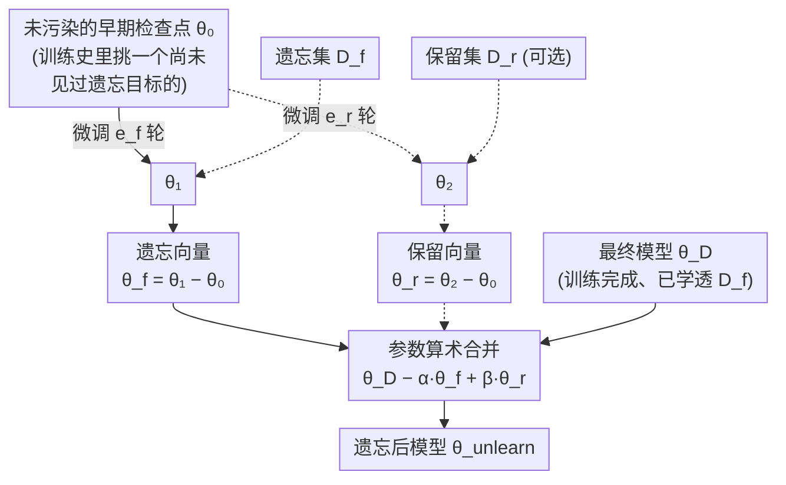

# Revisiting the Past: Data Unlearning with Model State History

**会议**: ICLR 2026  
**arXiv**: [2506.20941](https://arxiv.org/abs/2506.20941)  
**代码**: [https://github.com/mehrdadsaberi/MSA_unlearning](https://github.com/mehrdadsaberi/MSA_unlearning)  
**领域**: LLM评测  
**关键词**: 机器遗忘, 模型状态算术, 检查点, 遗忘向量, 大语言模型

## 一句话总结

提出 MSA（Model State Arithmetic）算法，利用训练中间检查点构造"遗忘向量"，通过参数空间算术运算移除特定数据对模型的影响，在 TOFU 和 RESTOR 基准上一致优于 NPO、RMU、GradDiff 等现有遗忘方法，且即使不用保留集也能保持模型效用。

## 研究背景与动机

### 问题背景
大语言模型在海量网络数据上训练，不可避免地接触到版权材料、隐私信息、事实错误数据等有害内容。通过完全重训练来消除这些数据的影响在计算上不可行。机器遗忘（Machine Unlearning）算法旨在以低成本消除特定数据点的影响，同时保持模型的整体能力。

### 现有方法的困境
- **梯度上升方法**（Yao et al., 2023）：在遗忘集上增大损失以忘记，但容易导致模型崩溃
- **NPO**（Zhang et al., 2024）：偏好优化方法，需要精心平衡遗忘与保留
- **RMU**（Li et al., 2024）：表征级操作，在某些场景下效果有限
- **Task Vectors**（Ilharco et al., 2022）：直接在最终模型上计算方向向量，但效果有限——从已充分学习目标数据的模型中提取的方向缺乏表达力

**核心观察**：现有方法都仅在最终模型上操作，而训练过程中的中间检查点——这些尚未接触遗忘目标数据的历史模型状态——是被浪费的有价值资源。

## 方法详解

### 整体框架

机器遗忘要解决的问题是：模型已经在最终权重 $\theta_\mathcal{D}$ 上把某批数据 $\mathcal{D}_f$（版权、隐私、错误事实）学进去了，现在要在不重训练、不损伤其他能力的前提下把这批数据的影响抹掉。已有方法都只盯着最终模型做文章——要么在遗忘集上做梯度上升（容易崩），要么直接在 $\theta_\mathcal{D}$ 上算 task vector（方向不准）。MSA（Model State Arithmetic，模型状态算术）换了个思路：训练过程中本来就会周期性保存检查点（原本用于容错），其中有些检查点 $\theta_0$ 还没见过遗忘目标——它们是被浪费的"干净参照系"。

整个流程只需三样输入：最终模型 $\theta_\mathcal{D}$、一个未污染的早期检查点（权重 $\theta_0$）、遗忘集 $\mathcal{D}_f$。先在这个干净检查点上单独微调遗忘集，得到的参数位移就是一个精准指向"数据影响方向"的遗忘向量；再把它从最终模型里按比例减掉，遗忘就完成了。若手头还有保留集，可同样构造一个保留向量加回去以保住效用。

### 关键设计

**1. 遗忘向量：从"新鲜"检查点提取数据影响方向**

直接在最终模型上算 task vector 之所以效果有限，是因为模型早已把遗忘数据学透、学饱和了，从饱和点挤出来的方向缺乏辨别力。MSA 改在尚未见过遗忘目标的检查点 $C$（权重 $\theta_0$）上，单独对遗忘集 $\mathcal{D}_f$ 微调 $e_f$ 个 epoch 得到 $\theta_1$，把这一段参数位移记作遗忘向量 $\vec{\theta}_f := \theta_1 - \theta_0$。关键直觉是：一个干净检查点第一次接触这批数据时，权重会沿着数据影响的本质方向移动得最干净，所以 $\vec{\theta}_f$ 比从饱和模型里挤出来的方向更能代表"这批数据究竟把模型改成了什么样"，这也是 MSA 区别于 task vector 的核心。

**2. 模型状态算术：在参数空间把影响减回去**

拿到遗忘向量后，遗忘就退化成一次简单的参数算术——只在权重上做加减，不再碰遗忘集做任何梯度上升。基础形式是 $\theta_{\text{unlearn}} = \theta_\mathcal{D} - \alpha \vec{\theta}_f$，其中 $\alpha$ 控制减去的幅度：太小忘不干净，太大会伤及模型效用。当手头有保留集 $\mathcal{D}_r$ 时，用同样方式在 $\theta_0$ 上微调出 $\theta_2$、构造保留向量 $\vec{\theta}_r = \theta_2 - \theta_0$ 加回去，完整形式为

$$\theta_{\text{unlearn}} = \theta_\mathcal{D} - \alpha \vec{\theta}_f + \beta \vec{\theta}_r$$

$\beta$ 控制保留强度，保留集采样量与遗忘集保持一致以维持计算开销。因为全程不在遗忘集上反复跑梯度上升，MSA 天然避开了梯度上升类方法常见的模型崩溃；而且实验显示即便完全不用保留集（forget-only 模式）也保持竞争力——这在真实场景很重要，因为干净的保留集往往不易构造。

**3. 检查点选择：用哪个检查点都稳**

MSA 整体参数化为 $\text{MSA}_{\text{ckpt}, \alpha, \beta, e_f, e_r}$，$\text{ckpt}$ 这一维让它可以从训练轨迹的不同位置取参照系：$\text{MSA}_{\text{instruct}}$（TOFU 训练前的指令微调模型）、$\text{MSA}_{\text{base}}$（预训练基础模型）、$\text{MSA}_{\text{ckpt-XB}}$（预训练到某 X B tokens 处的检查点），而退化到 $\text{MSA}_{\text{TOFU}}$（直接用最终模型）就等价于普通 task vector。直觉上越靠近遗忘数据引入时间点的检查点忘得越彻底，但实验（见下文消融）表明即便检查点距遗忘目标隔了上万亿 tokens，$\vec{\theta}_f$ 依然有效——说明它捕获的是数据影响的本质方向，而非某个局部的训练噪声，这也是该设计鲁棒的根据。

## 实验关键数据

> **评估指标说明**：针对 TOFU 原评估偏重 ROUGE 词汇重叠、容易把"高 ROUGE 却事实错误"判为成功的问题，作者改用三个由 GPT-4o 充当裁判、只看事实内容是否对得上的指标——$\text{Acc}_{\text{forget}}$（遗忘集里 ground truth 未被选为最相似答案的比率，越高=忘得越干净）、$\text{Acc}_{\text{recover}}$（理想模型输出被选为最相似的比率，越高=恢复得越好）、$\text{Acc}_{\text{retain}}$（保留集里 ground truth 或理想模型输出被选中的比率，越高=效用保持越好）。下面各表的 $\text{Acc}_*$ 列均按此定义。

### TOFU Forget01（遗忘1%作者）

| 方法 | $\text{Acc}_{\text{forget}}$ ↑ | $\text{Acc}_{\text{recover}}$ ↑ | $\text{Acc}_{\text{retain}}$ ↑ | Model Utility ↑ |
|------|-----|-----|-----|------|
| Final (训练后模型) | 0.15 | 0.13 | 0.89 | 0.48 |
| Ideal (理想模型) | 0.93 | 0.98 | 1.00 | 0.54 |
| **MSA_instruct** | **0.63** | **0.38** | 0.86 | 0.47 |
| MSA_base | 0.78 | 0.45 | 0.83 | 0.48 |
| NPO | 0.50 | 0.25 | 0.86 | 0.47 |
| RMU | 0.70 | 0.30 | 0.86 | 0.47 |
| GradDiff | 0.50 | 0.25 | 0.88 | 0.47 |

### TOFU Forget10（遗忘10%作者，更困难）

| 方法 | $\text{Acc}_{\text{forget}}$ ↑ | $\text{Acc}_{\text{recover}}$ ↑ | $\text{Acc}_{\text{retain}}$ ↑ | Model Utility ↑ |
|------|-----|-----|-----|------|
| **MSA_instruct** | **0.81** | **0.41** | 0.81 | 0.47 |
| MSA_base | 0.77 | 0.37 | 0.77 | 0.44 |
| NPO | 0.66 | 0.24 | 0.78 | 0.47 |
| RMU | 0.84 | 0.06 | 0.87 | 0.47 |
| GradDiff | 0.44 | 0.24 | 0.84 | 0.48 |

MSA 在更困难的 forget10 任务上优势更加明显。

### RESTOR 基准（恢复被错误信息覆盖的知识）

| 方法 | RESTOR 准确率 ↑ | TOFU Probability ↑ | Model Utility ↑ |
|------|---------------|-------------------|----------------|
| Ideal (TOFU only) | 46.18 | 0.87 | 0.60 |
| **MSA_instruct** | **46.08** | 0.77 | 0.56 |
| MSA_base | 43.61 | 0.62 | 0.54 |
| NPO | 38.65 | 0.46 | 0.49 |
| RMU | 31.68 | 0.38 | 0.45 |
| GradDiff | 24.07 | 0.30 | 0.45 |

MSA 几乎完全恢复了被错误信息覆盖前的准确率（46.08 vs 46.18）。

### 消融实验：检查点距离的影响（OLMo-2-1B）

| 检查点 | 距遗忘数据的tokens | $\text{Acc}_{\text{forget}}$ | $\text{Acc}_{\text{recover}}$ | $\text{Acc}_{\text{retain}}$ |
|--------|-----------------|-----|-----|-----|
| ckpt-3964B | ~21B tokens | 0.84 | 0.48 | 0.76 |
| ckpt-3146B | ~839B tokens | 0.81 | 0.45 | 0.77 |
| ckpt-2098B | ~1.9T tokens | 0.77 | 0.47 | 0.78 |
| ckpt-1049B | ~2.9T tokens | 0.73 | 0.44 | 0.77 |
| ckpt-210B | ~3.8T tokens | 0.39 | 0.24 | 0.85 |
| NPO | — | 0.84 | 0.39 | 0.64 |

**关键发现**：即使检查点距遗忘目标有 **2万亿 tokens** 的距离，MSA 仍然有效且优于 NPO。

### 关键发现
- 越接近遗忘数据引入时间点的检查点，遗忘效果越好
- MSA 即使不使用保留集（forget-only模式）也保持竞争力——这是重要的实用优势
- 从最终模型计算遗忘向量（类似 task vector）效果不佳，验证了使用早期检查点的必要性
- ROUGE 等基于词汇重叠的指标不适合评估遗忘效果（高 ROUGE 可能伴随错误事实）
- 方法在 8B 模型上同样有效（Llama-3.1-8B-Instruct 实验）

## 亮点与洞察

1. **极致简洁的算法**：核心就是"在检查点上微调 → 算差向量 → 从最终模型中减去"，计算开销极低，无需复杂训练
2. **检查点的新价值**：训练过程中常规保存的检查点（原本用于容错）被赋予了数据遗忘的新功能
3. **无需保留集也能工作**：实际场景中保留集不易构造，MSA 的这一特性提高了实用性
4. **评估贡献**：提出的三个 GPT-4o-judge 指标比 ROUGE 更精准地评估事实级别的遗忘/保留
5. **跨检查点距离的鲁棒性**：万亿 token 距离的检查点仍有效，说明遗忘向量捕获了数据影响的本质方向

## 局限与展望

- 需要获取中间训练检查点——对于闭源模型不可行
- 遗忘向量的质量依赖于微调超参数（$e_f$，学习率等）和 $\alpha$、$\beta$ 的选择
- 目前仅在 1B 和 8B 模型上验证，更大规模模型（70B+）的效果未知
- 对遗忘目标在训练数据中出现频次的影响未研究
- 仅评估了数据级遗忘，概念级遗忘（如"忘记哈利·波特"）未涉及
- 验证集用于调优 $\alpha$ 和 $\beta$ 的开销未详细讨论

## 相关工作与启发

- **Task Vectors** (Ilharco et al., 2022)：参数空间方向向量的先驱工作，但直接用于遗忘效果有限
- **NPO** (Zhang et al., 2024)：负偏好优化，目前最强基线
- **RMU** (Li et al., 2024)：表征级遗忘，在 WMDP 上有效但在 TOFU/RESTOR 上不佳
- **TOFU** (Maini et al., 2024)：虚构作者遗忘基准
- **RESTOR** (Rezaei et al., 2024)：知识恢复型遗忘基准
- 启发：模型训练的时序信息是宝贵资源；参数空间算术运算的思想可推广到其他模型编辑任务（知识编辑、能力禁用等）

## 评分
- 新颖性: ⭐⭐⭐⭐ — 利用检查点的思路简洁而有效，虽然参数算术非首创但应用场景新颖
- 实验充分度: ⭐⭐⭐⭐⭐ — 两个基准、多个检查点、多种配置、跨模型验证、新评估指标
- 写作质量: ⭐⭐⭐⭐⭐ — 思路和实验组织清晰，评估指标的动机讲解透彻
- 价值: ⭐⭐⭐⭐⭐ — 方法实用、简洁、有效，对机器遗忘领域有重要贡献

<!-- RELATED:START -->

## 相关论文

- [\[ICLR 2026\] Redirection for Erasing Memory (REM): Towards a Universal Unlearning Method for Corrupted Data](redirection_for_erasing_memory_rem_towards_a_universal_unlearning_method_for_cor.md)
- [\[ICLR 2026\] Model Collapse Is Not a Bug but a Feature in Machine Unlearning for LLMs](model_collapse_is_not_a_bug_but_a_feature_in_machine_unlearning_for_llms.md)
- [\[ACL 2026\] From Domains to Instances: Dual-Granularity Data Synthesis for LLM Unlearning](../../ACL2026/llm_safety/from_domains_to_instances_dual-granularity_data_synthesis_for_llm_unlearning.md)
- [\[ACL 2026\] Before Forgetting, Learn to Remember: Revisiting Foundational Learning Failures in LVLM Unlearning Benchmarks](../../ACL2026/llm_safety/before_forgetting_learn_to_remember_revisiting_foundational_learning_failures_in.md)
- [\[ICML 2026\] Differentially Private Preference Data Synthesis for Large Language Model Alignment](../../ICML2026/llm_safety/differentially_private_preference_data_synthesis_for_large_language_model_alignm.md)

<!-- RELATED:END -->
