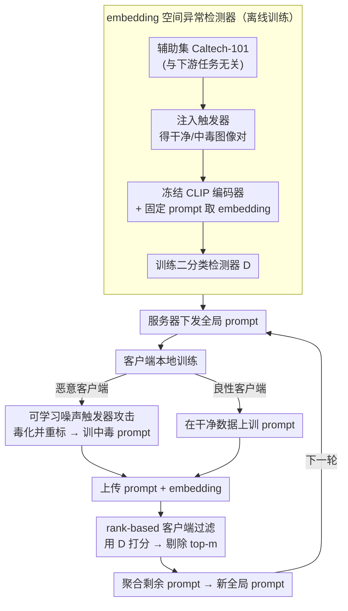

# SABRE-FL: Selective and Accurate Backdoor Rejection for Federated Prompt Learning

**会议**: ICLR2026  
**arXiv**: [2506.22506](https://arxiv.org/abs/2506.22506)  
**代码**: 待发布  
**领域**: AI安全  
**关键词**: federated learning, Prompt Learning, Backdoor Attack, CLIP, Anomaly Detection

## 一句话总结
首次研究联邦 Prompt Learning 场景下的后门攻击威胁，并提出 SABRE-FL——一种基于 embedding 空间异常检测的轻量级服务器端防御方法，无需访问客户端原始数据即可有效过滤中毒 prompt 更新。

## 背景与动机
- **联邦 Prompt Learning (FPL)** 是近年兴起的范式：客户端仅优化轻量的 prompt 向量（冻结 CLIP 骨干），再将 prompt 上传至服务器聚合，大幅降低通信和计算开销
- 联邦学习天然面临后门攻击风险——恶意客户端通过注入触发器（trigger）污染本地数据，使全局模型在推理时对含触发器的输入产生定向误分类
- 已有后门攻击研究集中在传统单模态 FL（全参数微调），FPL 场景下攻击面仅限 prompt 向量且图像编码器冻结，攻击可行性和防御策略均属空白
- 本文的动机是双重的：**(1)** 验证 FPL 是否真的脆弱；**(2)** 设计针对性防御

## 核心问题
1. **攻击层面**：在 FPL 中，恶意客户端能否通过可学习的 imperceptible noise trigger 成功植入后门，使全局 prompt learner 在推理时对触发样本误分类，同时不影响干净样本精度？
2. **防御层面**：如何在服务器端检测并过滤中毒 prompt 更新，且不依赖客户端原始数据、标签或下游任务信息？

## 方法详解

### 整体框架
本文是一篇"先攻后防"的论文：上半部分先在联邦 Prompt Learning（FPL，客户端冻结 CLIP、只训练 prompt 向量再上传聚合）上构造一个后门攻击，证明这种轻量范式同样脆弱；下半部分针对该攻击提出服务器端防御 SABRE-FL。攻击与防御互为镜像，串成一条主线：恶意客户端在本地用一个可学习的不可感知触发器把图像 embedding 推向目标类，从而毒化上传的 prompt；而要骗过分类器，触发器就必须在 CLIP embedding 空间留下一致偏移——SABRE-FL 正是抓住这个偏移，离线训一个二分类检测器，每轮聚合前给各客户端的 embedding 打异常分、剔除最可疑的若干个。触发器越能成功攻击，它在 embedding 空间越扎眼、越容易被检测器抓住。

下图把"离线训检测器"与"每轮联邦训练里攻击注入→检测过滤→聚合回环"串成一条完整数据流：

### 关键设计

**1. 可学习噪声触发器攻击：在冻结编码器下也能植入后门**

FPL 中图像编码器冻结、客户端只优化 prompt 向量，攻击面看似很窄——后门信号没法直接改模型权重，只能间接经 prompt 聚合传播，信号更弱、更怕噪声。攻击者的对策是联合优化 prompt 和一个视觉上不可感知的触发器 $t$。标准 FL 设置下 $N$ 个客户端默认有 25% 被控制，恶意客户端对本地数据做 dirty-label 处理：把含触发图像 $x^\star = x \oplus t$ 重标为目标类 $c_t$，并优化 $t$ 使其 CLIP 图像 embedding 在文本空间里更靠近目标类，即对任意非目标类 $y$ 满足

$$\cos(f_{\text{img}}(x^\star), f_{\text{text}}(c_t)) > \cos(f_{\text{img}}(x^\star), f_{\text{text}}(y))$$

这样训出的全局 prompt learner 对干净样本几乎无损（Aircraft 干净精度 32.3→32.8），却在触发样本上被定向误导，Aircraft 后门成功率高达 93.9%——说明 prompt-only 的攻击面足以撑起一次强后门，FPL 的脆弱性是真实存在的，这也正是防御部分要解决的痛点。

**2. embedding 空间异常检测器：把攻击的成功信号反用为检测信号**

攻击虽然在像素上隐形，却暴露了一个结构性破绽：触发器要骗过分类器，就必须在 CLIP embedding 空间产生一致偏移，于是中毒与干净 embedding 之间存在可分的间距 $\|z - z^\star\|_2 > \epsilon$。SABRE-FL 抓住这点，用与下游任务完全无关的辅助集 Caltech-101 离线构造训练对：把干净图和注入触发器的图都过同一个冻结编码器 $f_{\text{img}}(\cdot)$ 和固定 prompt 取 embedding，分别标为干净（$y_i=0$）与中毒（$y_i=1$），训练一个二分类器 $D: \mathbb{R}^d \to \{0,1\}$ 通过最小化标准交叉熵来判定单个 embedding 是否中毒。关键在于这个偏移是攻击的结构性副产品、而非某个数据集的特性，所以检测器在 OOD 数据上训好后无需见过下游任务，就能跨 Flowers、Pets、DTD、Aircraft、Food101 五个不同域泛化——这是它"零数据依赖"却仍有效的根本原因。

**3. rank-based 客户端过滤与隐私保护聚合：无需原始数据即可剔除中毒方**

有了检测器，还需要把它接进每轮联邦聚合。SABRE-FL 不用固定阈值 $\tau$（阈值难标定且跨域不稳），改用 rank-based 启发式：每轮服务器对客户端 $C_k$ 回传的 embedding 集合 $\{z_j^k\}$ 求平均检测分 $S_k = \frac{1}{n_k}\sum_j D(z_j^k)$，再按分数排序、剔除最高的 $m$ 个客户端，只聚合其余 prompt（$m$ 取恶意客户端数量上界）。整条防御链路只在 embedding 空间运作：客户端上传的是冻结编码器产出的压缩、任务无关向量，不暴露原始图像、标签或梯度，因此防御几乎不增加隐私面。完整一轮是：离线训好 $D$ → 服务器下发全局 prompt → 客户端本地训练并回传 prompt 与 embedding → 服务器用 $D$ 打分、过滤 top-$m$ → 聚合剩余 prompt 进入下一轮。

## 实验关键数据

### 攻击效果（无防御 / FedAvg）

| 数据集 | 无攻击 CA | 攻击下 CA | 后门 BA |
|---------|----------|----------|---------|
| Flowers | 80.9 | 77.9 | 41.7 |
| Pets | 94.5 | 94.2 | 16.3 |
| DTD | 65.2 | 65.6 | 34.8 |
| Aircraft | 32.3 | 32.8 | **93.9** |
| Food101 | 90.7 | 90.0 | 20.6 |

攻击在保持干净精度的同时成功注入后门，Aircraft 上 BA 高达 93.9%。

### 防御对比（五个数据集上 BA，越低越好）

| 防御方法 | Flowers | Pets | DTD | Aircraft | Food101 |
|----------|---------|------|-----|----------|---------|
| No Defense | 41.7 | 16.3 | 34.8 | 93.9 | 20.6 |
| Trimmed Mean | 12.3 | 5.6 | 31.0 | 83.1 | 6.4 |
| Median | 10.4 | 5.3 | 28.1 | 79.4 | 5.5 |
| Norm Bounding | 22.0 | 22.5 | 37.5 | 86.2 | 17.2 |
| FLAME | 3.8 | 7.8 | 8.7 | 16.4 | 3.2 |
| **SABRE-FL** | **1.1** | **4.4** | **6.8** | **7.6** | **1.9** |

SABRE-FL 在全部五个数据集上 BA 最低，且干净精度与无防御基线持平甚至更优。

### 消融实验
- **Prompt shot 数量**：随 shot 增加（2→16），无防御时 BA 显著上升（Aircraft 和 Food101 超过 85%）；启用 SABRE-FL 后 BA 始终低于 5%
- **恶意客户端比例**：25% 恶意时 Aircraft BA 达 93.9%；50%+ 时多数数据集 BA 超过 80%；干净精度全程几乎不受影响

## 亮点
- **首次研究 FPL 后门安全**：填补了多模态联邦 prompt 学习安全性的研究空白，既建立了攻击基线也提出了防御
- **防御设计优雅**：利用"攻击的成功信号即是防御的检测信号"这一双面性——trigger 能欺骗分类器恰好说明 embedding 偏移可被检测
- **零数据依赖**：检测器在 OOD 辅助集上离线训练，无需客户端数据/标签/任务信息，部署代价极低
- **跨域泛化强**：Caltech-101 上训练的检测器在 Flowers、DTD、Aircraft、Food101、Pets 五个不同域上均有效

## 局限与展望
- **需要知道恶意客户端上界**：rank-based 过滤假设已知恶意客户端数量上界 $m$，实际部署中此信息往往不可得
- **仅测试了 noise trigger**：攻击类型单一（可学习噪声触发器），未验证对 patch-based trigger、语义 trigger 等其他后门攻击的防御效果
- **客户端需额外上传 embedding**：相比纯 prompt 聚合的 FPL，SABRE-FL 要求客户端额外传输图像 embedding，增加了通信和隐私暴露面
- **数据集规模偏小**：五个 fine-grained 数据集均为小规模，未在 ImageNet 等大规模数据上验证
- **自适应攻击缺失**：未考虑攻击者已知防御机制时的自适应攻击场景

## 与相关工作的对比

| 维度 | BadCLIP (CVPR'24) | A3FL / IBA (传统 FL 后门) | SABRE-FL |
|------|-------------------|--------------------------|----------|
| 场景 | 集中式 prompt learning | 单模态 FL（全参数） | 联邦 prompt learning |
| 攻击面 | 全部训练数据 | 模型参数 + 数据 | 仅 prompt 向量 |
| 防御方式 | 无专门防御 | 鲁棒聚合（Trimmed Mean 等） | embedding 空间异常检测 |
| 数据依赖 | — | 需要验证集 | OOD 辅助集，无需客户端数据 |

## 启发与关联
- 核心思路"在 representation space 而非 pixel/parameter space 检测后门"具有通用性，可推广到其他 foundation model 微调场景（如 LoRA adapter 的联邦学习）
- 冻结编码器 + 可学习 prompt 的架构使得 embedding 偏移成为后门的必要条件，这一结构性约束是设计高效防御的关键
- 联邦 prompt learning 的安全性研究仍处早期，自适应攻击、多目标攻击、clean-label attack 等方向值得继续探索
- 检测器使用 OOD 数据训练即可泛化的特性说明后门 embedding 偏移是一种攻击的结构性副产品，这为其他模态（NLP、audio）的后门防御提供了新思路
- 恶意客户端比例超过 50% 时 BA 接近 100%，凸显了 FPL 中 Sybil attack 的潜在威胁

## 评分
- 新颖性: ⭐⭐⭐⭐ (首次系统研究 FPL 后门攻防，切入点好)
- 实验充分度: ⭐⭐⭐⭐ (五数据集+四基线+消融，但缺大规模验证和自适应攻击)
- 写作质量: ⭐⭐⭐⭐ (结构清晰，理论与实验结合紧密)
- 价值: ⭐⭐⭐⭐ (填补了重要研究空白，防御方法实用)

<!-- RELATED:START -->

## 相关论文

- [\[ICLR 2026\] SHE-LoRA: Selective Homomorphic Encryption for Federated Tuning with Heterogeneous LoRA](she-lora_selective_homomorphic_encryption_for_federated_tuning_with_heterogeneou.md)
- [\[ICML 2026\] HEDP: A Hybrid Energy-Distance Prompt-based Framework for Domain Incremental Learning](../../ICML2026/llm_safety/hedp_a_hybrid_energy-distance_prompt-based_framework_for_domain_incremental_lear.md)
- [\[ICLR 2026\] Watermark Robustness and Radioactivity May Be at Odds in Federated Learning](watermark_robustness_and_radioactivity_may_be_at_odds_in_federated_learning.md)
- [\[ICML 2026\] Decoupled Training with Local Reinforcement Fine-Tuning in Federated Learning](../../ICML2026/llm_safety/decoupled_training_with_local_reinforcement_fine-tuning_in_federated_learning.md)
- [\[ICLR 2026\] BEAT: Visual Backdoor Attacks on VLM-based Embodied Agents via Contrastive Trigger Learning](beat_visual_backdoor_attacks_on_vlm-based_embodied_agents_via_contrastive_trigge.md)

<!-- RELATED:END -->
